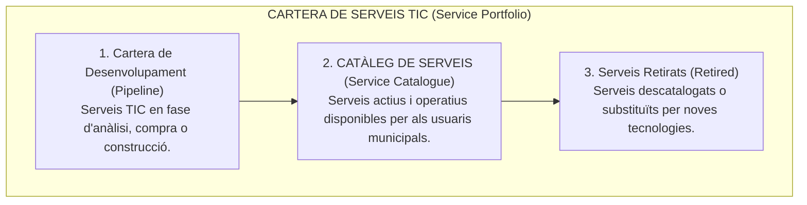
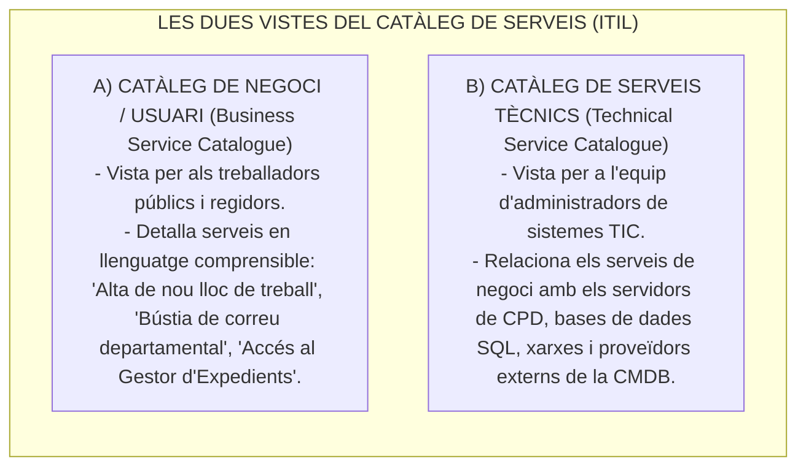
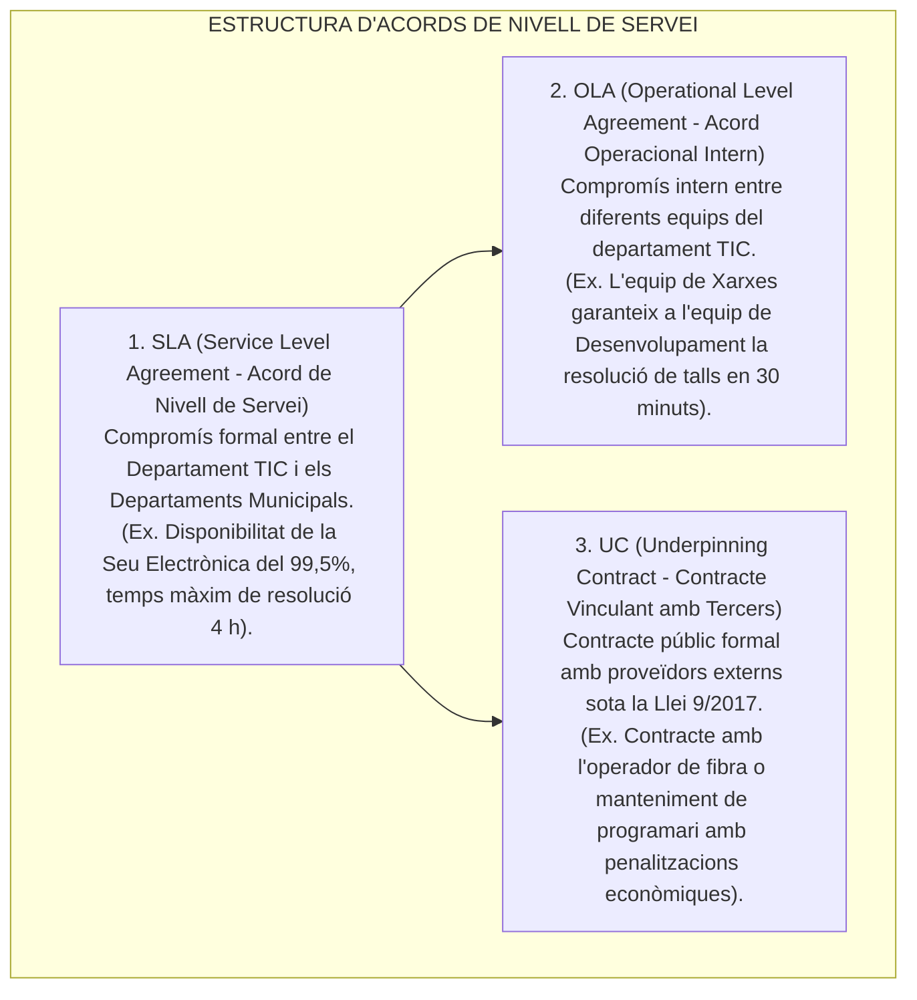
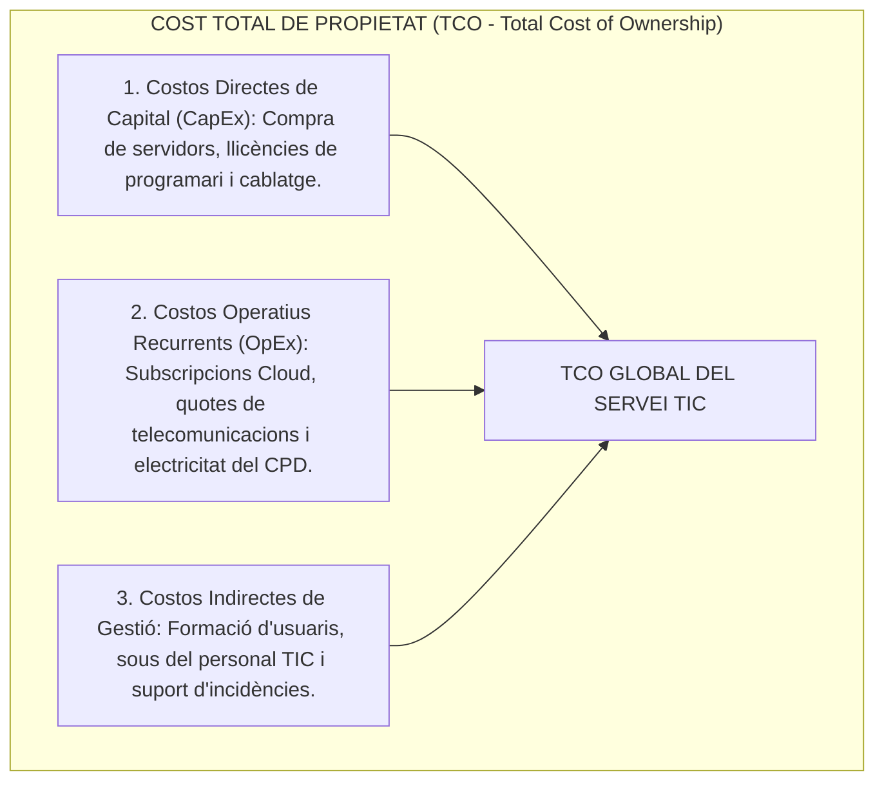

# Tema 70. Planificació estratègica dels serveis TIC: Pla de Serveis, Catàleg de Serveis, Acords de Nivell de Servei (SLA/OLA/UC) i imputació de costos (TCO, ABC)

> **Fonts i marcs de referència:** Esquema Nacional de Seguretat ([`CORPUS/ENS_2022.pdf`](file:///home/oriol/Projectes/OPOS/CORPUS/ENS_2022.pdf) - Art. 12 i Mesura `[op.serv]` Gestió de serveis), Llei 9/2017 de Contractes del Sector Públic ([`CORPUS/Contractes_2017.pdf`](file:///home/oriol/Projectes/OPOS/CORPUS/Contractes_2017.pdf) - Contractes vinculants UC), estàndard **ISO/IEC 20000-1** (Gestió de Serveis TIC) i marc de governança **ITIL v4**.

---

## 1. Concepte de Servei TIC i Cartera de Serveis (*Service Portfolio*)

Segons el marc **ITIL v4**, un **Servei TIC** és un mitjà per generar i lliurar valor als departaments municipals i a la ciutadania, facilitant els resultats que volen assolir sense que hagin d'assumir directament la propietat dels costos i riscos tecnològics específics:

---

## 2. El Catàleg de Serveis TIC (*Service Catalogue*)

El **Catàleg de Serveis** és l'única part de la Cartera de Serveis visible per als usuaris de l'Ajuntament. Conté informació precisa sobre els serveis en producció, preus, terminis de lliurament i com sol·licitar-los:

---

## 3. Acords de Nivell de Servei: SLA, OLA i UC

La qualitat dels serveis TIC municipals es garanteix mitjançant una **jerarquia d'acords i compromisos formals**:

### 3.1. Principals Mètriques de Rendiment dels SLAs:
- **Disponibilitat (%):** Percentatge de temps que el servei està operatiu (un SLA del **99,9%** permet com a màxim **8 hores i 45 minuts de caiguda no programada a l'any**).
- **MTBF (*Mean Time Between Failures*):** Temps mitjà entre avaries consecutives (mesura la fiabilitat del sistema).
- **MTTR (*Mean Time To Repair / Restore*):** Temps mitjà per reparar i restablir el servei després d'una incidència.

---

## 4. Models Econòmics i Imputació de Costos dels Serveis TIC

Per gestionar el pressupost municipal amb eficiència, la gestió financera de les TIC utilitza el **Cost Total de Propietat (TCO)**:

### 4.1. Mètodes d'Imputació de Costos a Departaments Municipals:
1. **Costos Basats en l'Activitat (*Activity-Based Costing - ABC*):** Assignació dels costos als departaments en funció dels recursos que realment consumeixen (ex. hores de dedicació de desenvolupament o volum de gigabytes a la cabina SAN).
2. **Repartiment per Inductors (*Cost Drivers*):** Distribució dels costos generals (com el correu M365 o el servei d'antivirus) en funció del nombre d'empleats públics de cada regidoria.
3. **Mecanisme de Visibilitat de Costos (*Showback*):** Enviament d'informes periòdics als caps de departament informant del cost real dels serveis TIC que utilitzen, fomentant l'ús responsable sense facturació real.

---

## 5. Quadre Resum i Preguntes Típiques d'Examen Tipus Test

| Pregunta / Concepte Clau | Resposta Correcta / Trampa Freqüent |
| :--- | :--- |
| **Quina és la diferència entre un SLA i un OLA?** | L'**SLA és un acord entre el departament TIC i els departaments usuaris**; l'**OLA és un acord intern entre equips tècnics TIC**. |
| **Què és un Underpinning Contract (UC)?** | Un **contracte mercantil/públic vinculant amb un proveïdor extern** per donar suport als SLAs. |
| **Quina part de la Cartera de Serveis és visible per als usuaris municipals?** | Únicament el **Catàleg de Serveis (*Service Catalogue*)**. |
| **Què mesura el Cost Total de Propietat (TCO)?** | **Tots els costos directes i indirectes** d'un actiu TIC al llarg de tota la seva vida útil. |
| **Què mesura la mètrica MTTR (*Mean Time To Repair*)?** | El **temps mitjà necessari per reparar i restablir un servei** caigut. |
| **Què és el mètode d'imputació ABC (*Activity-Based Costing*)?** | Un mètode que **assigna costos als departaments en funció del consum real d'activitats i recursos**. |
