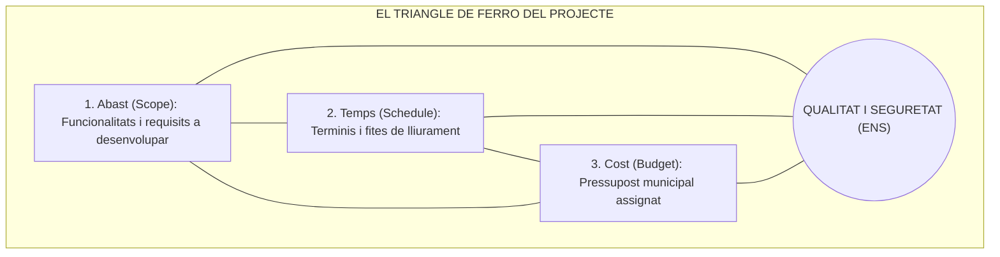
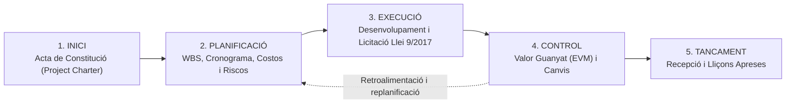
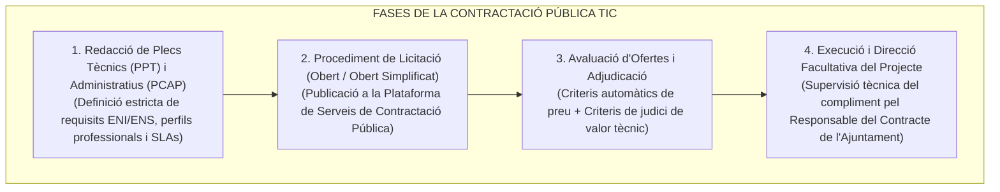

# Tema 71. Gestió de projectes de sistemes d'informació: cicle de vida, planificació (WBS/Gantt/PERT), execució, control (EVM), contractació pública (Llei 9/2017) i tancament

> **Fonts i marcs de referència:** Llei 9/2017 de Contractes del Sector Públic ([`CORPUS/Contractes_2017.pdf`](file:///home/oriol/Projectes/OPOS/CORPUS/Contractes_2017.pdf) - Procediments de licitació i plecs PPT/PCAP), Esquema Nacional de Seguretat ([`CORPUS/ENS_2022.pdf`](file:///home/oriol/Projectes/OPOS/CORPUS/ENS_2022.pdf) - Mesura `[op.pl]` Gestió de projectes), Guia dels Fonaments per a la Direcció de Projectes (**PMBOK 7a Edició - PMI**) i metodologia **PRINCE2**.

---

## 1. Concepte de Projecte TIC i la Triple Restricció

Un **projecte de sistemes d'informació** és un esforç temporal emprès per crear un servei, aplicació o infraestructura tecnològica única per a l'Ajuntament (com la implantació d'un nou Gestor d'Expedients Electrònics o la renovació del CPD municipal):

---

## 2. El Cicle de Vida del Projecte de Sistemes (PMBOK / PRINCE2)

El cicle de vida d'un projecte tecnològic municipal s'estructura en cinc grups de processos seqüencials i interactius:

---

## 3. Planificació i Estimació de Projectes TIC

### 3.1. Estructura de Desglossament del Treball (WBS / EDT)
La **WBS (*Work Breakdown Structure*)** descompon jeràrquicament l'abast total del projecte en components més petits anomenats **Paquets de Treball (*Work Packages*)**, que faciliten l'assignació de responsabilitats i la valoració econòmica.

---

### 3.2. Tècniques d'Estimació d'Esforç i Temps
1. **Estimació per Tres Punts (Fórmula PERT):**  
   Calcula la durada esperada ($T_e$) combinant l'estimació Optimista ($O$), Pessimista ($P$) i Més Probable ($M$):
   $$T_e = \frac{O + 4M + P}{6}$$
2. **Mètode del Camí Crític (CPM - *Critical Path Method*):**  
   Seqüència d'activitats encadenades que determina la **durada mínima total del projecte**. Qualsevol retard en una activitat del camí crític (amb folgança zero, $\text{Float} = 0$) endarrereix automàticament la data final del projecte.
3. **Diagrama de Gantt:** Representació gràfica en barres temporals que mostra les fites (*milestones*) i les dependències entre tasques.

---

## 4. Execució i Aprovisionament de Recursos Externs (Llei 9/2017)

En la majoria de projectes TIC municipals, el desenvolupament o subministrament es contracta a empreses externes d'acord amb la **Llei 9/2017 de Contractes del Sector Públic** ([`CORPUS/Contractes_2017.pdf`](file:///home/oriol/Projectes/OPOS/CORPUS/Contractes_2017.pdf)):

---

## 5. Seguiment i Control mitjançant Gestió del Valor Guanyat (EVM)

La **Gestió del Valor Guanyat (*Earned Value Management - EVM*)** és la tècnica estàndard per mesurar de forma integrada l'abast, el temps i el cost del projecte:

| Paràmetre / Indicador EVM | Fórmula Matemàtica | Interpretació Pràctica en el Projecte Municipal |
| :--- | :---: | :--- |
| **PV (*Planned Value*)** | $\text{Pressupost planificat}$ | Valor del treball que hauria d'estar fet a la data actual segons el pla. |
| **EV (*Earned Value*)** | $\text{Valor del treball realitzat}$ | Valor pressupostat del treball que realment s'ha completat. |
| **AC (*Actual Cost*)** | $\text{Cost real incorregut}$ | Despesa real facturada i pagada fins a la data. |
| **Variació de Cost (CV)** | $\mathbf{CV = EV - AC}$ | - Si $\mathbf{CV > 0}$: Estalvi de diners (per sota del pressupost). - Si $\mathbf{CV < 0}$: **Sobrecost / Desviació pressupostària negativa**. |
| **Variació de Cronograma (SV)** | $\mathbf{SV = EV - PV}$ | - Si $\mathbf{SV > 0}$: Avançat respecte al calendari. - Si $\mathbf{SV < 0}$: **Retard en el calendari**. |
| **Índex de Rendiment del Cost (CPI)** | $\mathbf{CPI = \frac{EV}{AC}}$ | $\mathbf{CPI \ge 1,0}$ indica excel·lent eficiència de despesa. |
| **Índex de Rendiment de Cronograma (SPI)** | $\mathbf{SPI = \frac{EV}{PV}}$ | $\mathbf{SPI \ge 1,0}$ indica que el projecte avança al ritme previst. |

---

## 6. Procés de Tancament i Avaluació

1. **Acta de Recepció i Conformitat:** Validació formal que tots els lliurables de programari i documentació tècnica compleixen els plecs PPT ([`CORPUS/Contractes_2017.pdf`](file:///home/oriol/Projectes/OPOS/CORPUS/Contractes_2017.pdf)).
2. **Transició a Operació:** Transferència de la solució a l'equip d'explotació i suport TIC de l'Ajuntament.
3. **Informe de Lliçons Apreses (*Lessons Learned*):** Documentació d'errors i encerts per alimentar la base de coneixement de futurs projectes municipals.

---

## 7. Quadre Resum i Preguntes Típiques d'Examen Tipus Test

| Pregunta / Concepte Clau | Resposta Correcta / Trampa Freqüent |
| :--- | :--- |
| **Quina és la fórmula de durada esperada segons el mètode PERT?** | **$T_e = \frac{O + 4M + P}{6}$** (Optimista + 4 vegades Més Probable + Pessimista dividit per 6). |
| **Què és el Camí Crític (CPM) d'un projecte?** | La **seqüència de tasques amb folgança zero que determina la durada mínima total** del projecte. |
| **Què indica un Índex de Rendiment del Cost (CPI) menor que 1 (CPI < 1)?** | Que el projecte **està gastant més diners del previst per al treball realitzat (sobrecost)**. |
| **Què és l'Estructura de Desglossament del Treball (WBS / EDT)?** | La **descomposició jeràrquica de tot l'abast del projecte en paquets de treball lliurables**. |
| **Quin document aprova formalment l'inici d'un projecte segons el PMBOK?** | L'**Acta de Constitució del Projecte (*Project Charter*)**. |
| **Qui supervisa l'execució d'un contracte TIC segons la Llei 9/2017?** | El **Responsable del Contracte** designat per l'òrgan de contractació municipal. |
