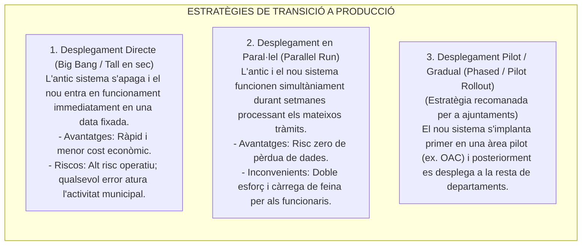
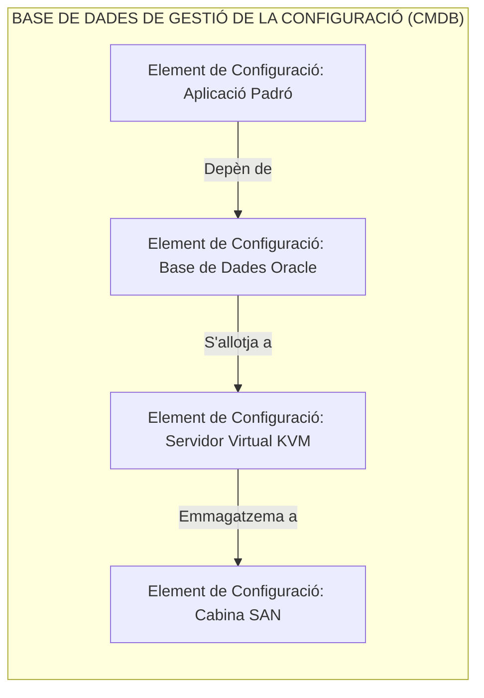

# Tema 72. Implantació del sistema d'informació: estratègies de desplegament, gestió de la configuració (CMDB/ITIL), estàndards de documentació i pla de formació

> **Fonts i marcs de referència:** Esquema Nacional de Seguretat ([`CORPUS/ENS_2022.pdf`](file:///home/oriol/Projectes/OPOS/CORPUS/ENS_2022.pdf) - Mesures `[op.exp.2]` Gestió de la configuració, `[op.exp.3]` Gestió de canvis i `[op.pl.4]` Acceptació i posada en servei), Esquema Nacional d'Interoperabilitat ([`CORPUS/ENI.pdf`](file:///home/oriol/Projectes/OPOS/CORPUS/ENI.pdf)) i marcs de gestió **ITIL v4** i **ISO/IEC 20000-1**.

---

## 1. Estratègies de Posada en Producció de Sistemes d'Informació

La **implantació** és la fase culminant on un nou sistema d'informació (com un Gestor d'Expedients o un Portal Tributari) es desplega per a l'ús real del personal municipal i de la ciutadania:

---

## 2. Gestió de la Configuració i dels Canvis (CMDB / ITIL)

Per complir amb les mesures `[op.exp.2]` i `[op.exp.3]` de l'**Esquema Nacional de Seguretat (ENS)**, tot canvi en la infraestructura municipal ha d'estar documentat i controlat:

### 2.1. Conceptes Fonamentals de Configuració:
- **Element de Configuració (CI - *Configuration Item*):** Qualsevol component tecnològic necessari per lliurar un servei TIC (servidors, routers, bases de dades, llicències, manuals).
- **CMDB (*Configuration Management Database*):** Base de dades centralitzada que emmagatzema tots els CIs i **les seves relacions de dependència mútues**, permetent avaluar l'impacte abans d'aplicar un canvi.
- **Comitè d'Avaluació de Canvis (CAB - *Change Advisory Board*):** Òrgan tècnic i de gestió que analitza, autoritza i programa els canvis a producció per evitar caigudes imprevistes.
- **Biblioteca de Suport Definitiva (DML - *Definitive Media Library*):** Dipòsit segur on s'emmagatzemen les versions definitives, autoritzades i verificades de tot el programari abans de ser instal·lat.

---

## 3. Estàndards de Documentació: Manuals Tècnics i d'Usuari

Tot projecte de sistemes ha de lliurar dos tipus de documentació normalitzada d'acord amb l'**ENI**:

| Tipus de Document | Destinataris | Contingut Mínim Obligatori |
| :--- | :--- | :--- |
| **Manual Tècnic i d'Administració** | Administradors de Sistemes i Tècnics TIC | - Arquitectura lògica i física del sistema. - Diagrames de xarxa, ports TCP/UDP i regles de tallafocs. - Procediment d'instal·lació, parametrització i actualització. - Pla de Còpies de Seguretat i procediment de recuperació (*Disaster Recovery*). |
| **Manual d'Usuari i Guies Ràpides** | Treballadors Públics i Ciutadania | - Guia pas a pas per a la tramitació amb captures de pantalla reals. - Gestió d'errors comuns i preguntes freqüents (PMF). - Llenguatge planer, clar i accessible sense tecnicismes. |

---

## 4. Pla de Formació i Gestió del Canvi Organitzatiu

La tecnologia només té èxit si les persones que l'utilitzen l'adopten correctament:
1. **Detecció de Necessitats Formatives:** Segmentació per perfils (tramitadors administratius, tècnics d'inspecció, càrrecs electes per a signatures de decrets).
2. **Entorn de Preproducció / Proves (*Staging*):** Entorn idèntic al de producció amb dades fictícies (anonimitzades segons el RGPD) on els empleats poden practicar sense risc d'alterar expedients reals.
3. **Període de Suport Intensiu (*Hypercare*):** Durant les primeres 2 a 4 setmanes de posada en servei, l'equip del projecte ofereix atenció prioritària presencial i resolució immediata de dubtes a les oficines municipals.

---

## 5. Quadre Resum i Preguntes Típiques d'Examen Tipus Test

| Pregunta / Concepte Clau | Resposta Correcta / Trampa Freqüent |
| :--- | :--- |
| **Quina estratègia de desplegament minimitza el risc d'interrupció a l'Ajuntament?** | La **implantació pilot o gradual (*Phased Deployment*)**. |
| **Què és un Element de Configuració (CI) a ITIL?** | **Qualsevol actiu o component tecnològic** sota control necessari per lliurar un servei TIC. |
| **Quina és la funció de la CMDB (Configuration Management Database)?** | Emmagatzemar tots els elements de configuració i **les seves relacions de dependència**. |
| **Què és el CAB (Change Advisory Board)?** | L'òrgan col·legiat responsable d'**avaluar, prioritzar i aprovar els canvis a producció**. |
| **Què és la DML (Definitive Media Library)?** | El **magatzem segur de versions de programari autoritzades i verificades**. |
| **Quin entorn s'utilitza per a la formació dels funcionaris sense alterar dades reals?** | L'entorn de **Preproducció / Proves (*Staging*)** amb dades anonimitzades. |
