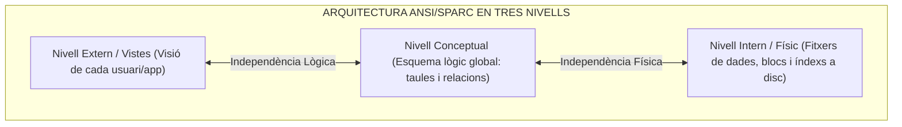
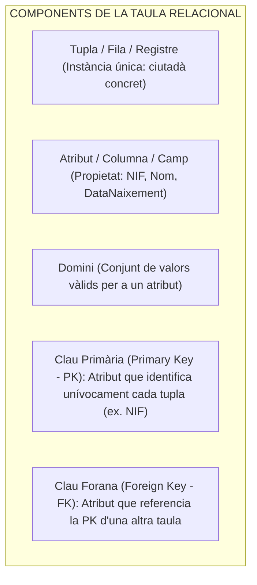
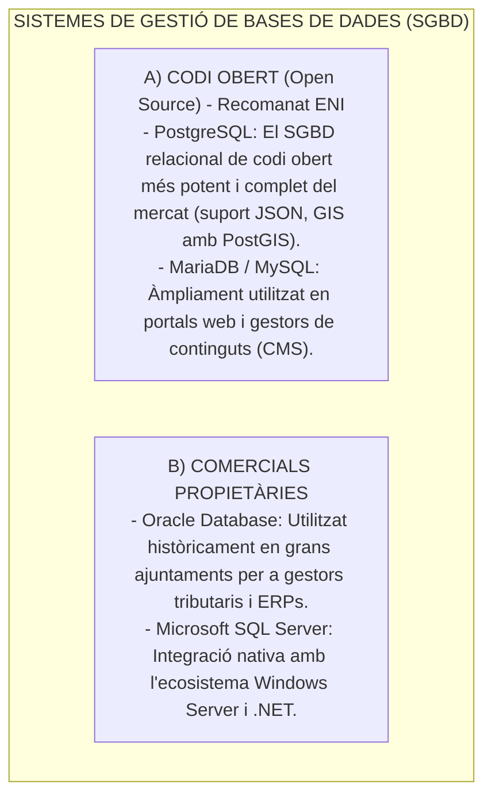

# Tema 73. Sistemes de gestió de bases de dades (SGBD): models de dades, el model relacional (estructura lògica/física), àlgebra relacional i solucions de mercat

> **Fonts i marcs de referència:** Esquema Nacional d'Interoperabilitat ([`CORPUS/ENI.pdf`](file:///home/oriol/Projectes/OPOS/CORPUS/ENI.pdf) - NTI de Catàleg d'estàndards per a bases de dades obertes), Esquema Nacional de Seguretat ([`CORPUS/ENS_2022.pdf`](file:///home/oriol/Projectes/OPOS/CORPUS/ENS_2022.pdf) - Mesures `[mp.if]` Protecció de dades), estàndard **ISO/IEC 9075 (Llenguatge SQL)** i fonaments teòrics d'Edgar F. Codd.

---

## 1. Concepte de Sistema de Gestió de Bases de Dades (SGBD / DBMS)

Un **Sistema de Gestió de Bases de Dades (SGBD)** és el programari que actua com a intermediari entre les aplicacions municipals (padró, hisenda, urbanisme) i les dades físiques emmagatzemades en disc, garantint **accés eficient, concurrència, integritat i independència de les dades**:

---

## 2. El Model Relacional d'Edgar F. Codd

El **model relacional** organitza la informació en estructures bidimensionals anomenades **relacions o taules**:

### 2.1. Regles d'Integritat Fonamentals de Codd:
1. **Integritat d'Entitat:** Cap atribut que formi part de la **Clau Primària (PK)** pot prendre un valor nul (**`NOT NULL`**).
2. **Integritat Referencial:** Si una taula té una **Clau Forana (FK)**, el seu valor ha de coincidir amb un valor existent de la Clau Primària de la taula referenciada o bé ser nul.

---

## 3. Operacions de l'Àlgebra Relacional

L'àlgebra relacional és el llenguatge formal teòric de base sobre el qual es construeix el llenguatge **SQL**:

| Operació de l'Àlgebra | Símbol Matemàtic | Descripció | Equivalent en SQL |
| :--- | :---: | :--- | :--- |
| **Selecció** | $\sigma_{\text{condició}}(R)$ | Filtra les **files** (tuples) que compleixen una condició booleana. | Clàusula `WHERE` |
| **Projecció** | $\pi_{\text{atributs}}(R)$ | Selecciona només determinades **columnes** d'una taula, eliminant duplicats. | Clàusula `SELECT camp1, camp2` |
| **Unió** | $R \cup S$ | Retorna totes les tuples presents a $R$, a $S$ o a ambdues (compatibles en unió). | Clàusula `UNION` |
| **Intersecció** | $R \cap S$ | Retorna només les tuples que apareixen simultàniament a $R$ i a $S$. | Clàusula `INTERSECT` |
| **Diferència** | $R - S$ | Retorna les tuples que estan a $R$ però no a $S$. | Clàusula `EXCEPT` / `MINUS` |
| **Producte Cartesià** | $R \times S$ | Combina cada fila de $R$ amb totes les files de $S$. | Clàusula `CROSS JOIN` |
| **Unió Natural / Juntura (*Join*)** | $R \bowtie S$ | Combina tuples de dues taules segons la coincidència de valors comuns (FK = PK). | Clàusula `INNER JOIN` / `NATURAL JOIN` |

---

## 4. Solucions de Mercat: Codi Obert vs. Comercials

A l'Administració Local, les solucions de bases de dades relacionals es divideixen en dues grans famílies:

---

## 5. Quadre Resum i Preguntes Típiques d'Examen Tipus Test

| Pregunta / Concepte Clau | Resposta Correcta / Trampa Freqüent |
| :--- | :--- |
| **Què estableix la regla d'Integritat d'Entitat al model relacional?** | Que la **Clau Primària (PK) no pot contenir valors nuls (`NOT NULL`)**. |
| **Quina operació de l'àlgebra relacional filtra columnes (vertical)?** | La **Projecció ($\pi$)**, equivalent al `SELECT` en SQL. |
| **Quina operació de l'àlgebra relacional filtra files (horitzontal)?** | La **Selecció ($\sigma$)**, equivalent al `WHERE` en SQL. |
| **Quin SGBD de codi obert destaca pel tractament de dades geoespacials?** | **PostgreSQL** mitjançant la seva extensió **PostGIS**. |
| **Quins són els 3 nivells de l'arquitectura ANSI/SPARC?** | Nivell **Extern (Vistes)**, Nivell **Conceptual (Taules)** i Nivell **Intern (Físic/Disc)**. |
