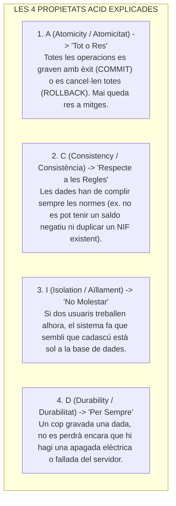
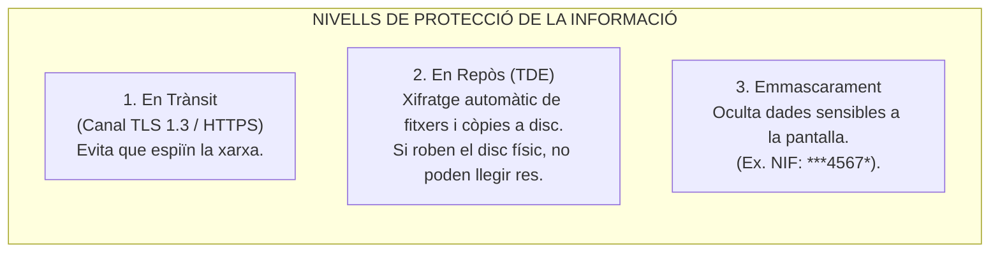
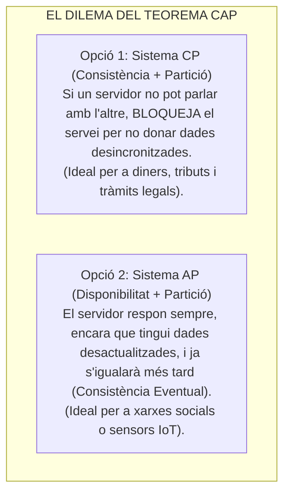
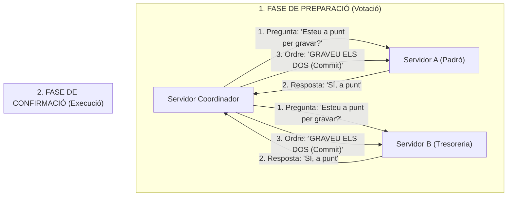

# Tema 74B. Sistemes de bases de dades: integritat (ACID), confidencialitat, xifratge (TDE) i bases de dades distribuïdes (Versió Didàctica)

> **Fonts i marcs de referència:** Esquema Nacional de Seguretat ([`CORPUS/ENS_2022.pdf`](file:///home/oriol/Projectes/OPOS/CORPUS/ENS_2022.pdf) - Mesures `[mp.if.3]` Xifratge i `[mp.sw.2]` Validació d'entrades), Reglament General de Protecció de Dades ([`CORPUS/LOPD.pdf`](file:///home/oriol/Projectes/OPOS/CORPUS/LOPD.pdf)), estàndard **SQL-92** i **Teorema CAP d'Eric Brewer**.

---

## 1. Què és una Transacció i les Propietats ACID?

Una **transacció** és un conjunt d'operacions que s'han d'executar com un **paquet indivisible**. Per exemple, pagar una taxa municipal implica dues accions: *restar diners del compte del ciutadà* i *sumar diners al compte de l'Ajuntament*. Si el sistema cau entremig, no podem deixar els diners perduts.

Per evitar inconsistències, tot motor de base de dades relacional compleix les **quatre regles ACID**:

---

## 2. El Repte de l'Aïllament: 3 Errors de Concurrència i 4 Nivells SQL

Quan centenars de funcionaris i ciutadans accedeixen alhora a la base de dades, poden aparèixer **tres anomalies de dades**:

1. **Lectura Bruta (*Dirty Read*):** Llegir una dada que un altre usuari està modificant però que **encara no ha gravat definitivament**. Si aquest usuari cancel·la l'operació (*Rollback*), haurem llegit una dada falsa.
2. **Lectura No Repetible (*Non-Repeatable Read*):** Si llegeixes el mateix registre dues vegades dins del mateix tràmit, obtens valors diferents perquè algú l'ha modificat (*Update*) entremig.
3. **Lectura Fantasma (*Phantom Read*):** Si fas una consulta per rang (ex. *"quants expedients hi ha pendents"*), en repetir-la apareixen **noves files que abans no hi eren** perquè algú n'ha afegit de noves (*Insert*).

### Els 4 Nivells d'Aïllament SQL-92: Seguretat vs. Velocitat

Per controlar aquests errors, SQL permet triar entre **4 nivells d'aïllament**. Com més alt és el nivell, més neta és la dada, però més lent va el sistema:

| Nivell d'Aïllament | Com funciona? | Dirty Read | Non-Repeatable | Phantom Read | Ús habitual |
| :--- | :--- | :---: | :---: | :---: | :--- |
| **1. Read Uncommitted** | Permet llegir qualsevol cosa sense bloquejos. | ❌ Permesa | ❌ Permesa | ❌ Permesa | Només per a estadístiques aproximades. |
| **2. Read Committed** | Només pots llegir dades **confirmades amb Commit**. | ✅ **Evitada** | ❌ Permesa | ❌ Permesa | **Per defecte a PostgreSQL, Oracle i SQL Server**. |
| **3. Repeatable Read** | Ningú pot modificar les files que estàs consultant. | ✅ **Evitada** | ✅ **Evitada** | ❌ Permesa | **Per defecte a MySQL (motor InnoDB)**. |
| **4. Serializable** | Les transaccions s'executen en estricta fila índia. | ✅ **Evitada** | ✅ **Evitada** | ✅ **Evitada** | Màxima seguretat (sense cap error), però menor velocitat. |

---

## 3. Confidencialitat, Xifratge i Seguretat (ENS / RGPD)

Per protegir la informació ciutadana segons l'Esquema Nacional de Seguretat:

- **Com s'evita la Injecció SQL (SQLi)?**  
  L'error clàssic de seguretat és ajuntar el text de l'usuari amb la sentència SQL. La solució obligatòria són les **consultes preparades (*Prepared Statements / Parameterized Queries*)**, que tracten l'entrada de l'usuari estrictament com a dada i mai com a codi executable.

---

## 4. Problemàtica de les Bases de Dades Distribuïdes

Una base de dades distribuïda és aquella que està repartida entre diversos servidors (per exemple, un servidor a l'Ajuntament i un altre de rèplica a un altre edifici per seguretat).

### 4.1. El Teorema CAP d'Eric Brewer
Demostra que, si es trenca la comunicació de xarxa entre servidors (**P - Partició**), només podem triar **UNA** d'aquestes dues opcions:

---

### 4.2. Com es posen d'acord dos servidors? El Two-Phase Commit (2PC)

Quan una operació ha de gravar a dos servidors alhora (ex. Servidor Padró i Servidor Tresoreria), s'utilitza el protocol **Two-Phase Commit**:

- Si qualsevol dels dos servidors respon que NO o falla la connexió, el coordinador ordena **CANCEL·LAR (Rollback)** a tothom per mantenir la coherència.

---

## 5. Resum Clau per a Examen

- **ACID:** **A**tomicitat (tot o res), **C**onsistència (regles), **A**ïllament / *Isolation* (no interferència), **D**urabilitat (permanent).
- **Lectura Bruta:** Llegir dades sense *Commit*.
- **Read Committed:** Nivell estàndard que evita la lectura bruta (PostgreSQL / Oracle).
- **Serializable:** El nivell més aïllat i lent (evita totes les anomalies).
- **TDE (*Transparent Data Encryption*):** Xifra la base de dades a disc (*en repòs*).
- **Teorema CAP:** Davant una fallada de xarxa ($P$), has de triar entre **Consistència ($C$)** o **Disponibilitat ($A$)**.
- **Two-Phase Commit (2PC):** Protocol en dues fases (**Preparació** i **Commit**) per sincronitzar servidors distribuïts.
