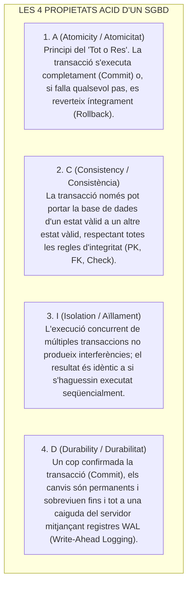
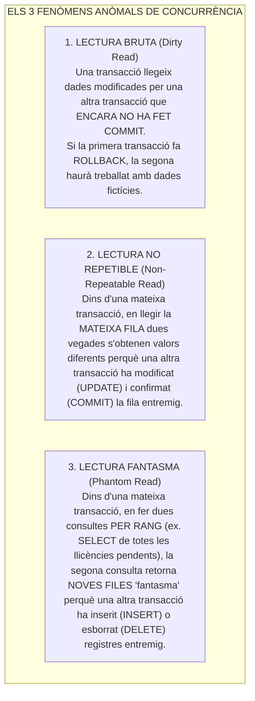
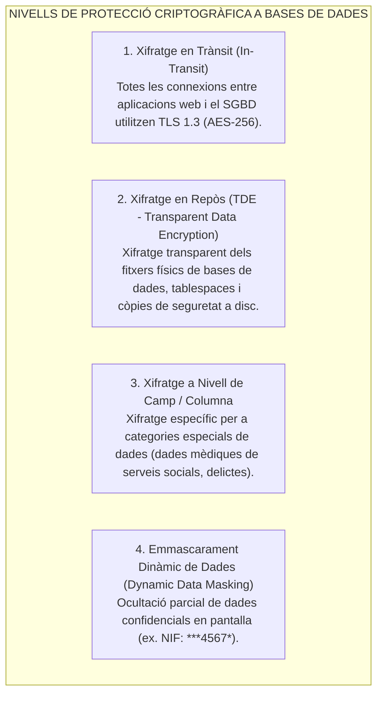
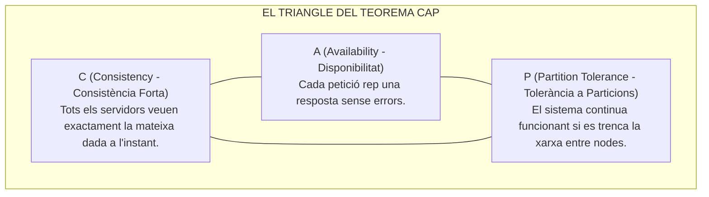
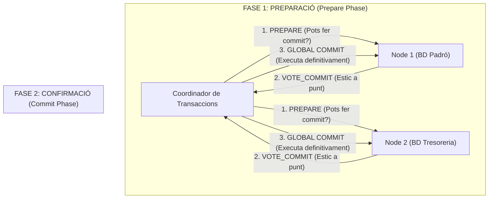

# Tema 74. Sistemes de bases de dades: integritat (ACID), confidencialitat, xifratge (TDE), seguretat ENS i problemàtica de bases de dades distribuïdes (Teorema CAP, 2PC)

> **Fonts i marcs de referència:** Esquema Nacional de Seguretat ([`CORPUS/ENS_2022.pdf`](file:///home/oriol/Projectes/OPOS/CORPUS/ENS_2022.pdf) - Mesures `[mp.if.3]` Xifratge, `[mp.sw.2]` Validació d'entrades contra SQLi i `[op.exp]`), Reglament General de Protecció de Dades ([`CORPUS/LOPD.pdf`](file:///home/oriol/Projectes/OPOS/CORPUS/LOPD.pdf)), estàndard **SQL-92 (Nivells d'aïllament)** i **Teorema CAP d'Eric Brewer**.

---

## 1. Integritat Transaccional: Les Propietats ACID

Una **transacció** és una unitat lògica de treball indivisible. Per garantir la integritat absoluta de les dades municipals (com el cobrament d'un impost o el canvi de domicili al padró), els SGBD han de complir les **quatre propietats ACID**:

### 1.1. Nivells d'Aïllament SQL i Fenòmens Anòmals (SQL-92)

L'aïllament (*Isolation*) a les bases de dades regula **què pot veure una transacció mentre altres usuaris o processos estan modificant dades simultàniament**. 

Si dues transaccions s'executen alhora sense control, poden produir-se **tres anomalies o errors greus de concurrència**:

#### 📖 Exemples Pràctics a l'Administració Local:
1. **Exemple de Lectura Bruta (*Dirty Read*):**
   - El sistema de recaptació (Transacció A) inicia la cancel·lació d'un deute de 500 € d'un ciutadà, deixant-lo a 0 €, però encara no ha confirmat l'operació (*sense COMMIT*).
   - L'OAC (Transacció B) consulta el saldo del ciutadà i li emet un certificat d'estar al corrent de pagament perquè llegeix 0 €.
   - De sobte, la Transacció A falla per un error de xarxa i fa *ROLLBACK* (el deute torna a ser de 500 €). S'ha emès un certificat oficial erroni per culpa d'una lectura bruta!
2. **Exemple de Lectura No Repetible (*Non-Repeatable Read*):**
   - Un administratiu (Transacció A) obre un expedient i llegeix el domicili d'un ciutadà: *"Carrer Major, 1"*.
   - El ciutadà (Transacció B), des de la Seu Electrònica, canvia el seu domicili a *"Avinguda Diagonal, 5"* i fa *COMMIT*.
   - Si la Transacció A torna a consultar la mateixa fila abans de tancar l'expedient, troba un domicili diferent al que havia llegit uns segons abans dins del mateix procés.
3. **Exemple de Lectura Fantasma (*Phantom Read*):**
   - El Cap d'Urbanisme (Transacció A) compta quantes llicències d'obres pendents hi ha: `SELECT COUNT(*) FROM llicencies WHERE estat = 'Pendent'` $\rightarrow$ **10 llicències**.
   - Un ciutadà (Transacció B) registra una nova sol·licitud a la Seu Electrònica (`INSERT`) i fa *COMMIT*.
   - Quan la Transacció A torna a fer la mateixa consulta per generar l'informe final, obté **11 llicències** (ha aparegut una fila fantasma en el conjunt).

---

#### ⚖️ Els 4 Nivells d'Aïllament i el seu Compromís (Consistència vs. Rendiment)

L'estàndard **SQL-92** defineix 4 nivells d'aïllament. Com més alt és el nivell, **més garanties d'integritat hi ha, però menor és la concurrència i la velocitat** del sistema (a causa dels bloquejos de registres):

| Nivell d'Aïllament (SQL-92) | Lectura Bruta (*Dirty Read*) | Lectura No Repetible | Lectura Fantasma (*Phantom Read*) | Ús i Configuració per Defecte |
| :--- | :---: | :---: | :---: | :--- |
| **1. Read Uncommitted** *(Mínim aïllament)* | ❌ Permesa | ❌ Permesa | ❌ Permesa | Risc màxim. Només per a consultes estadístiques massives on la precisió exacta no importa. |
| **2. Read Committed** | ✅ **Evitada** | ❌ Permesa | ❌ Permesa | **Nivell per defecte a PostgreSQL, Oracle i SQL Server**. Només es llegeixen dades confirmades amb `COMMIT`. |
| **3. Repeatable Read** | ✅ **Evitada** | ✅ **Evitada** | ❌ Permesa | **Nivell per defecte a MySQL (motor InnoDB)** mitjançant control de concurrència multiversió (MVCC). |
| **4. Serializable** *(Màxim aïllament)* | ✅ **Evitada** | ✅ **Evitada** | ✅ **Evitada** | Simula una execució 100% seqüencial. Evita totes les anomalies, però pot provocar bloquejos (*deadlocks*) i avortaments de transaccions. |

---

## 2. Confidencialitat i Xifratge de Dades (ENS i RGPD)

Segons les exigències de l'**Esquema Nacional de Seguretat** ([`CORPUS/ENS_2022.pdf`](file:///home/oriol/Projectes/OPOS/CORPUS/ENS_2022.pdf)):

- **Prevenció de la Injecció SQL (SQL Injection - OWASP Top 1):**  
  Totes les consultes han d'utilitzar **consultes preparades (*Prepared Statements / Parameterized Queries*)** per separar estrictament el codi SQL de les dades introduïdes per l'usuari, impedint la manipulació de la base de dades.

---

## 3. Problemàtica de les Bases de Dades Distribuïdes: El Teorema CAP

En una arquitectura distribuïda on les dades estan replicades entre diferents servidors o CPDs, el **Teorema CAP (d'Eric Brewer)** demostra que **és impossible garantir simultàniament les 3 propietats davant una fallada de comunicació de xarxa**:

> 📌 **Implicació Pràctica:** Com que a les xarxes reals les particions de xarxa ($P$) són inevitables, un sistema distribuït ha de triar entre:
> - **Sistemes CP (Consistència + Tolerància a Particions):** Bloquegen operacions si no poden garantir la consistència (ex. bases de dades relacionals bancàries o tributàries).
> - **Sistemes AP (Disponibilitat + Tolerància a Particions):** Responen sempre, acceptant **Consistència Eventual (*Eventual Consistency*)** a canvi d'estar sempre operatius (ex. sistemes NoSQL com Cassandra o DynamoDB).

---

## 4. Protocols de Coordinació Distribuïda: Two-Phase Commit (2PC)

Per garantir que una transacció distribuïda que afecta múltiples bases de dades municipals sigui atòmica, s'utilitza el protocol **2PC (*Two-Phase Commit*)**:

---

## 5. Quadre Resum i Preguntes Típiques d'Examen Tipus Test

| Pregunta / Concepte Clau | Resposta Correcta / Trampa Freqüent |
| :--- | :--- |
| **Què signifiquen les sigles ACID en bases de dades?** | **Atomicitat (Atomicity), Consistència (Consistency), Aïllament (Isolation) i Durabilitat (Durability)**. |
| **Quin és el nivell d'aïllament que evita la Lectura Fantasma?** | El nivell **Serializable** (màxim nivell de concurrència estricta). |
| **Què és el TDE (Transparent Data Encryption)?** | El **xifratge transparent dels fitxers i còpies de la base de dades en repòs (*at-rest*)**. |
| **Com es prevé de forma definitiva l'atac d'Injecció SQL (SQLi)?** | Mitjançant l'ús obligatori de **consultes preparades / parametritzades (*Prepared Statements*)**. |
| **Què postula el Teorema CAP d'Eric Brewer?** | Que un sistema distribuït **només pot garantir 2 de les 3 propietats simultàniament (C, A o P)**. |
| **Com funciona el protocol Two-Phase Commit (2PC)?** | Divideix la transacció en **Fase de Preparació (votació)** i **Fase de Confirmació (*Global Commit*)**. |
