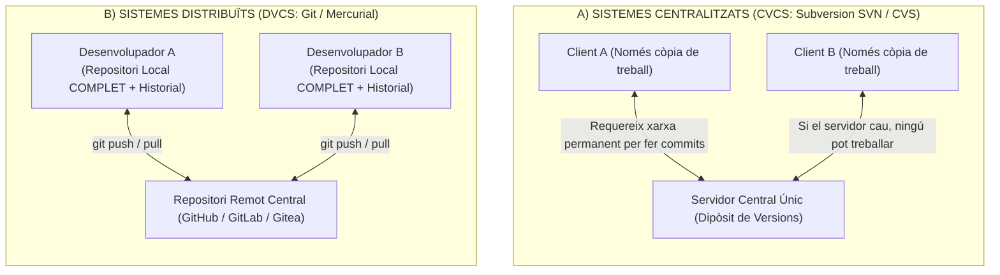
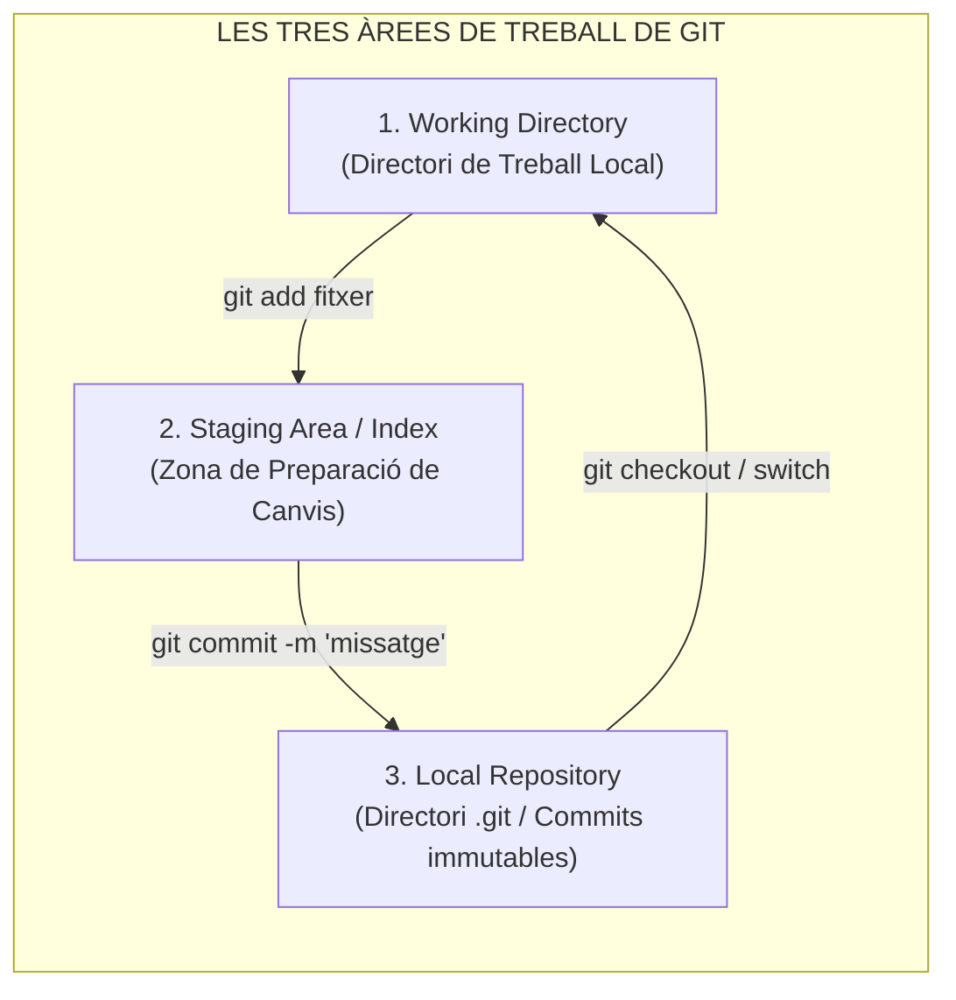
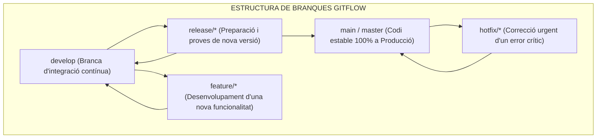

# Tema 75. Sistemes de control de versions distribuït (DVCS): arquitectura interna de Git, comparativa CVCS vs. DVCS, models de treball amb branques (Gitflow, GitHub Flow) i seguretat de codi

> **Fonts i marcs de referència:** Esquema Nacional d'Interoperabilitat ([`CORPUS/ENI.pdf`](file:///home/oriol/Projectes/OPOS/CORPUS/ENI.pdf) - NTI de Reutilització d'actius i repositoris de programari lliure), Esquema Nacional de Seguretat ([`CORPUS/ENS_2022.pdf`](file:///home/oriol/Projectes/OPOS/CORPUS/ENS_2022.pdf) - Mesura `[op.pl.5]` Traçabilitat del codi font), documentació oficial de **Git SCM** i metodologia **Gitflow**.

---

## 1. Evolució dels Sistemes de Control de Versions: CVCS vs. DVCS

Un **Sistema de Control de Versions (VCS - *Version Control System*)** permet registrar els canvis efectuats sobre el codi font de les aplicacions municipals, facilitant la col·laboració en equip, la traçabilitat històrica i la recuperació d'estats anteriors:

| Criteri de Comparació | Centralitzat (CVCS - SVN / CVS) | Distribuït (DVCS - Git) |
| :--- | :--- | :--- |
| **Arquitectura** | Un sol repositori central amb tot l'historial. | **Cada desenvolupador té una còpia 100% completa del repositori**. |
| **Treball Fora de Línia (*Offline*)** | No permès (cal connexió per confirmar canvis). | **Totalment funcional sense Internet** (commits, branques i historial locals). |
| **Velocitat d'Operació** | Lenta (depèn de la latència de la xarxa). | **Instantània** (totes les operacions es fan en local). |
| **Punt Únic de Fallada (SPOF)** | Sí (si cau el servidor, s'atura el treball). | No (qualsevol equip actua com a còpia de seguretat íntegra). |

---

## 2. Arquitectura Interna i les Tres Àrees de Git

Git organitza el cicle de vida dels fitxers a través de tres zones de treball principals:

- **Estructura Criptogràfica:** Git utilitza un **Graf Acíclic Dirigit (DAG)** basat en objectes immutables identificats per un resum criptogràfic **SHA-1 / SHA-256** (*Blobs* per a contingut de fitxers, *Trees* per a directoris, *Commits* per a l'estat global i *Tags*).

---

## 3. Models de Treball amb Branques (*Branching Models*)

### 3.1. Model Gitflow (Vincent Driessen)
Model recomanat per a projectes amb cicles formals de llançament de versions:

- **Branques Principals (Permanents):**
  - `main`: Només conté codi provat i desplegat a producció.
  - `develop`: Centralitza les noves funcionalitats acabades de provar.
- **Branques Auxiliars (Temporals):**
  - `feature/nom-tasca`: Creades des de `develop` per treballar aïlladament.
  - `release/vX.Y`: Creades per congelar codi i corregir petits errors abans de passar a `main`.
  - `hotfix/nom-bug`: Creades directament des de `main` per resoldre una incidència urgent en producció.

---

### 3.2. Model GitHub Flow (Model Àgil de Desplegament Continu)
Per a entorns d'alta agilitat (com microserveis o portals ciutadans moderns):
1. Es crea una branca descriptiva directament des de `main` (`feature-tramit-padro`).
2. Es fan commits locals i es puja al repositori remot.
3. S'obre una **Sol·licitud de Fusió (*Pull Request / Merge Request*)** per a revisió de codi per part d'altres desenvolupadors.
4. S'executen proves automàtiques de CI/CD.
5. Es fusiona (*Merge*) a `main` i es desplega automàticament a producció.

---

## 4. Bones Pràctiques i Seguretat de Codi (ENS)

1. **Regles de Protecció de Branques (*Branch Protection*):** Prohibir el `git push --force` sobre `main`, exigir com a mínim l'aprovació d'un altre tècnic en Pull Requests i validar que els tests automàtics han passat amb èxit.
2. **Fitxer `.gitignore`:** Exclusió obligatòria de fitxers locals amb claus privades, contrasenyes de bases de dades o binaris compilats.
3. **Signatura de Commits amb GPG:** Ús de claus criptogràfiques GPG per signar els commits, verificant que el codi prové indubtablement del funcionari o desenvolupador autoritzat.

---

## 5. Quadre Resum i Preguntes Típiques d'Examen Tipus Test

| Pregunta / Concepte Clau | Resposta Correcta / Trampa Freqüent |
| :--- | :--- |
| **Quina és la diferència clau entre Git (DVCS) i Subversion (CVCS)?** | A Git **cada desenvolupador té una còpia completa de tot l'historial** i pot treballar sense connexió. |
| **Quines són les 3 àrees de treball de Git?** | **Working Directory** (treball), **Staging Area / Index** (preparació) i **Repository** (dipòsit .git). |
| **Quina branca de Gitflow conté exclusivament el codi en producció?** | La branca **`main`** (o `master`). |
| **Des d'on es bifurca una branca de tipus `hotfix` a Gitflow?** | Directament des de la branca **`main`**, fusionant-se tant a `main` com a `develop`. |
| **Quina estructura criptogràfica utilitza Git per indexar l'historial?** | Un **Graf Acíclic Dirigit (DAG)** basat en funcions hash SHA. |
| **Què és una Pull Request (PR) o Merge Request (MR)?** | Un mecanisme formal de petició per **revisar, auditar i fusionar canvis d'una branca abans d'integrar-los**. |
