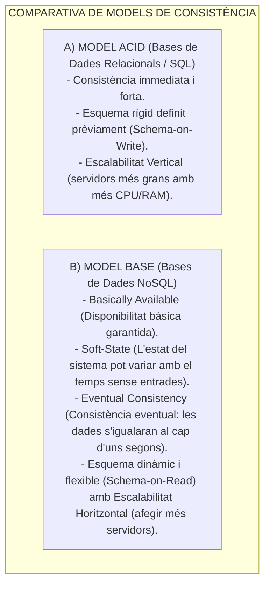
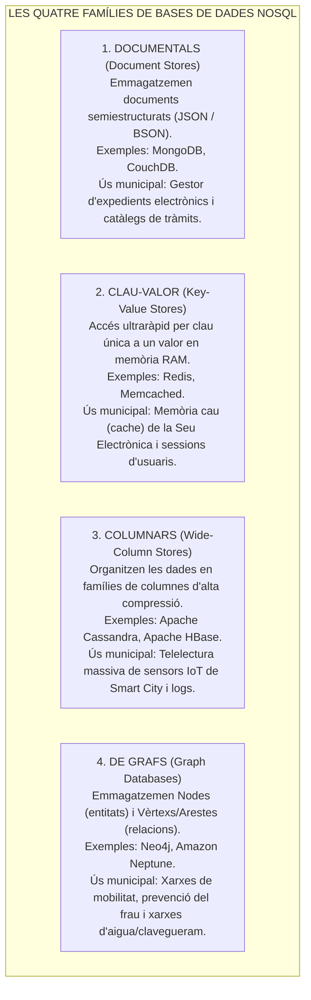
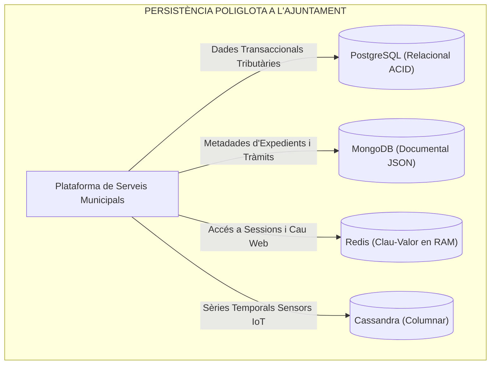

# Tema 76. Bases de dades NoSQL: models de dades (Documentals, Clau-Valor, Columnars, Grafs), model BASE vs. ACID, escalabilitat horitzontal i persistència poliglota

> **Fonts i marcs de referència:** Esquema Nacional d'Interoperabilitat ([`CORPUS/ENI.pdf`](file:///home/oriol/Projectes/OPOS/CORPUS/ENI.pdf) - NTI de Catàleg d'estàndards per a formats JSON/XML), Esquema Nacional de Seguretat ([`CORPUS/ENS_2022.pdf`](file:///home/oriol/Projectes/OPOS/CORPUS/ENS_2022.pdf) - Protecció de bases de dades) i teoria de sistemes distribuïts NoSQL (**Model BASE**).

---

## 1. Concepte i Origen del Moviment NoSQL (*Not Only SQL*)

Les bases de dades **NoSQL** van sorgir per superar les limitacions dels sistemes relacionals tradicionals davant el volum massiu de dades (*Big Data*), les dades no estructurades procedents de sensors d'Internet de les Coses (IoT) i la necessitat d'**escalabilitat horitzontal massiva (*Scale-Out*)**:

---

## 2. Tipologia de Bases de Dades NoSQL

Les tecnologies NoSQL es classifiquen en quatre grans famílies segons la seva estructura interna d'emmagatzematge:

---

## 3. Taula Comparativa: SQL vs. Tipologies NoSQL

| Família / Model | Model de Dades | Consistència | Escalabilitat Típica | Productes de Mercat Líders | Aplicació Típica Municipal |
| :--- | :--- | :---: | :---: | :--- | :--- |
| **Relacional (SQL)** | Taules amb files i columnes (Esquema rígid) | **ACID (Forta)** | **Vertical** (*Scale-Up*) | **PostgreSQL, MariaDB, Oracle, SQL Server** | **Comptabilitat, Padró d'Habitants, Gestió Tributària.** |
| **Documental** | Documents jeràrquics **JSON / BSON** | Flexible / Configurable | **Horitzontal** (*Sharding*) | **MongoDB, CouchDB** | **Expedients electrònics i formularis web dinàmics.** |
| **Clau-Valor** | Parells Clau $\rightarrow$ Valor (*Hash Map*) | Eventual / En memòria | **Horitzontal** | **Redis, Memcached** | **Sessions d'usuaris i memòria cau d'alt rendiment.** |
| **Columnar** | Famílies de columnes (*Column-Family*) | **BASE (Eventual)** | **Horitzontal Massiva** | **Apache Cassandra, ScyllaDB** | **Sensors IoT municipals i sèries temporals.** |
| **De Grafs** | Nodes, Arestes (*Edges*) i Propietats | ACID / Configurable | Centrada en Consultes | **Neo4j, ArangoDB** | **Anàlisi de xarxes de sanejament i detecció de frau.** |

---

## 4. El Concepte de Persistència Poliglota (*Polyglot Persistence*)

A l'Ajuntament modern no s'utilitza una única base de dades per a tot, sinó l'estratègia de **Persistència Poliglota**: utilitzar el tipus de base de dades més adequat per a cada problema específic:

---

## 5. Quadre Resum i Preguntes Típiques d'Examen Tipus Test

| Pregunta / Concepte Clau | Resposta Correcta / Trampa Freqüent |
| :--- | :--- |
| **Què signifiquen les sigles del model BASE a NoSQL?** | **Basically Available, Soft-state, Eventual consistency** (oposat al model ACID). |
| **Quin tipus de base de dades NoSQL és MongoDB?** | Una base de dades **Documental (basada en documents JSON/BSON)**. |
| **Quin tipus de base de dades és Redis?** | Una base de dades **Clau-Valor (*Key-Value*) en memòria RAM**. |
| **Quin model NoSQL és el més eficient per analitzar relacions complexes?** | Les bases de dades **de Grafs (com Neo4j)**, basades en nodes i arestes. |
| **Quina família NoSQL és òptima per a dades massives de sensors IoT?** | Les bases de dades **Columnars (com Apache Cassandra)**. |
| **Què és la Persistència Poliglota?** | L'ús combinat de **diferents motors de bases de dades (SQL i NoSQL)** segons la necessitat de cada servei. |
