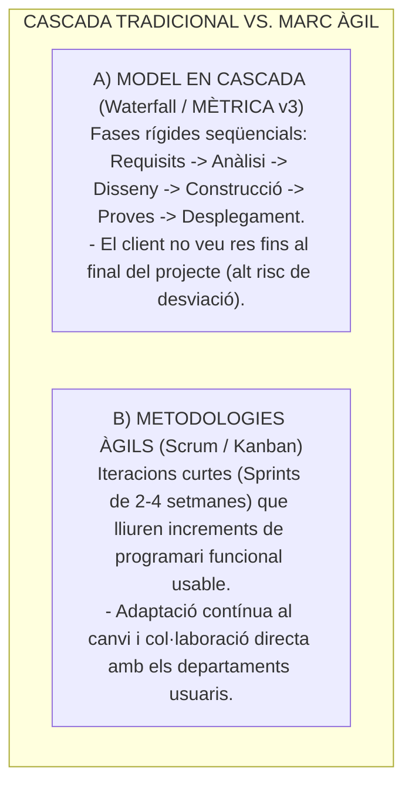
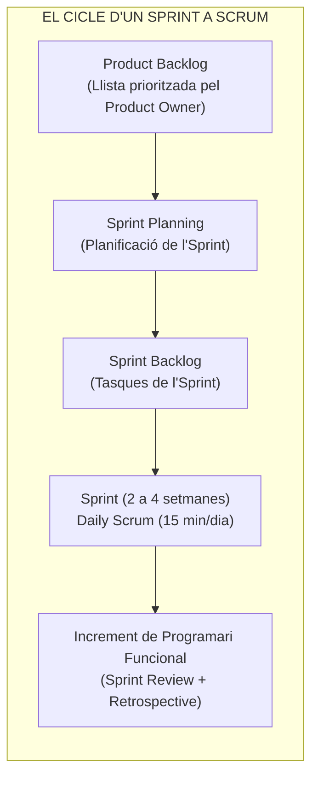
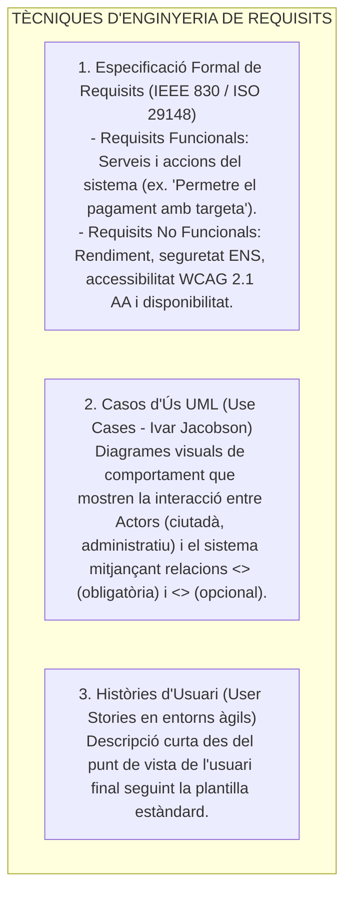

# Tema 77. Metodologies àgils (Scrum, Kanban, XP) vs. tradicionals i tècniques de definició de requisits (IEEE 830, Casos d'Ús UML, Històries d'Usuari INVEST)

> **Fonts i marcs de referència:** Esquema Nacional d'Interoperabilitat ([`CORPUS/ENI.pdf`](file:///home/oriol/Projectes/OPOS/CORPUS/ENI.pdf)), Esquema Nacional de Seguretat ([`CORPUS/ENS_2022.pdf`](file:///home/oriol/Projectes/OPOS/CORPUS/ENS_2022.pdf) - Desenvolupament de sistemes), Guia oficial de **Scrum (Ken Schwaber & Jeff Sutherland)**, estàndard **ISO/IEC/IEEE 29148 (Enginyeria de Requisits)** i especificació **UML 2.5 (OMG)**.

---

## 1. Metodologies Tradicionals (En Cascada) vs. Metodologies Àgils (*Agile*)

El desenvolupament de programari municipal ha evolucionat del model tradicional lineal i rígid en cascada (*Waterfall*) cap als marcs de treball àgils basats en el **Manifest Àgil (2001)**:

---

## 2. Principals Metodologies Àgils: Scrum, Kanban i XP

### 2.1. El Marc de Treball Scrum
És el marc àgil més utilitzat a l'Administració Local per a la creació de noves aplicacions municipals:

- **Els 3 Rols de Scrum:**
  1. **Product Owner (PO):** Representa els interessos dels departaments de l'Ajuntament i de la ciutadania; és l'únic responsable de prioritzar el *Product Backlog*.
  2. **Scrum Master:** Líder al servei de l'equip que facilita els esdeveniments, elimina impediments externs i assegura l'aplicació correcta de Scrum.
  3. **Developers (Equip de Desenvolupament):** Equip multidisciplinari i autoorganitzat que construeix l'increment funcional.
- **Definició de Fet (*Definition of Done - DoD*):** Criteris objectius i de qualitat que ha de complir una tasca per considerar-se acabada (codi provat, documentat i sense vulnerabilitats ENS).

---

### 2.2. Mètode Kanban
- Basat en la filosofia *Lean*: se centra a **visualitzar el flux de treball en un tauler** (*To Do $\rightarrow$ In Progress $\rightarrow$ Done*) i **limitar el treball en curs (WIP - *Work In Progress*)** a cada columna per evitar colls d'ampolla.
- És ideal per a equips d'explotació i manteniment TIC (*Helpdesk* / suport d'incidències).

### 2.3. Extreme Programming (XP - Kent Beck)
- Centrat en l'excel·lència tècnica mitjançant pràctiques com el **Desenvolupament Guiat per Proves (TDD - *Test-Driven Development*)**, la **Programació en Parella (*Pair Programming*)** i la integració contínua.

---

## 3. Tècniques per a la Definició de Requisits del Sistema

### 3.1. Estructura de les Històries d'Usuari i el Model INVEST
- **Format Canònic:**
  $$\text{Com a } [\text{Rol d'usuari}], \text{ vull } [\text{Acció / Funcionalitat}] \text{ per tal de } [\text{Benefici / Objectiu}].$$
- **El Model INVEST (Criteris de Qualitat d'una Història d'Usuari):**
  - **I**ndependent: No depèn d'altres històries.
  - **N**egociable: Detalls oberts a discussió entre l'equip i el Product Owner.
  - **V**aluable: Aporta valor clar i mesurable al ciutadà o a l'Ajuntament.
  - **E**stimable: L'equip en pot estimar l'esforç en punts d'història (*Story Points*).
  - **S**mall (Petita): Cap dins d'un sol Sprint.
  - **T**estable: Disposa de **Criteris d'Acceptació clars** per validar que funciona (*Given-When-Then*).

---

## 4. Quadre Resum i Preguntes Típiques d'Examen Tipus Test

| Pregunta / Concepte Clau | Resposta Correcta / Trampa Freqüent |
| :--- | :--- |
| **Qui és l'únic responsable de prioritzar el Product Backlog a Scrum?** | El **Product Owner (PO)**. |
| **Quina és la durada habitual d'un Sprint a Scrum?** | Entre **1 i 4 setmanes** (amb lliurament d'un increment de programari funcional). |
| **Quina és la regla fonamental del mètode Kanban?** | **Limitar el treball en curs (WIP - Work In Progress)** per evitar colls d'ampolla. |
| **Quina diferència hi ha entre una relació `<<include>>` i `<<extend>>` a Casos d'Ús UML?** | **`<<include>>` és una inclusió obligatòria** del cas d'ús; **`<<extend>>` és una extensió condicional o opcional**. |
| **Què signifiquen les sigles del model INVEST per a Històries d'Usuari?** | **Independent, Negociable, Valuable, Estimable, Small (Petita) i Testable (Verificable)**. |
| **Què és el TDD (Test-Driven Development) a Extreme Programming?** | Escriure **primer les proves automàtiques abans d'escriure el codi funcional**. |
