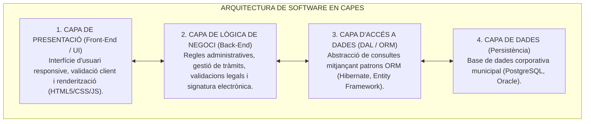
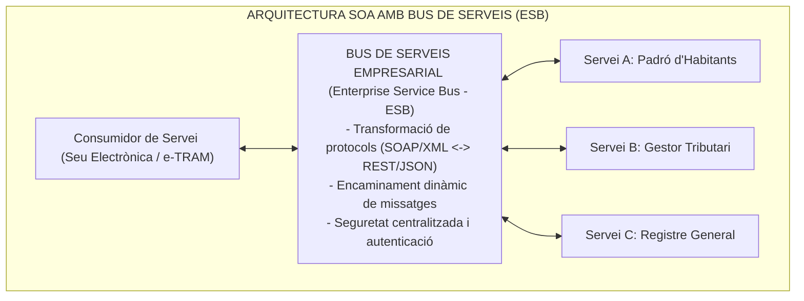
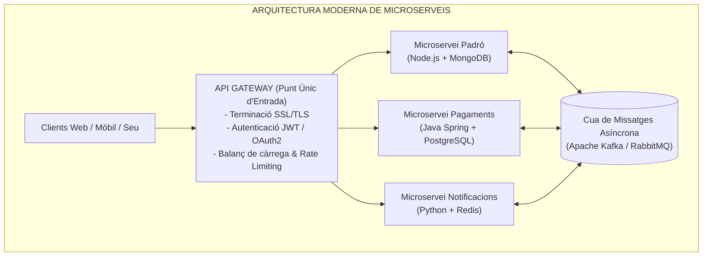

# Tema 78. Arquitectura d'una solució web: model de capes (N-Tier), singularització funcional, Arquitectura Orientada a Serveis (SOA) i Microserveis (API Gateway)

> **Fonts i marcs de referència:** Esquema Nacional d'Interoperabilitat ([`CORPUS/ENI.pdf`](file:///home/oriol/Projectes/OPOS/CORPUS/ENI.pdf) - Protocols i serveis web interoperables), Esquema Nacional de Seguretat ([`CORPUS/ENS_2022.pdf`](file:///home/oriol/Projectes/OPOS/CORPUS/ENS_2022.pdf) - Arquitectura segura) i patrons de disseny d'arquitectura de programari (**SOA, Microserveis, W3C**).

---

## 1. El Model d'Arquitectura en Capes (*N-Tier Architecture*)

En el desenvolupament de portals públics i seus electròniques municipals, el **model de capes** divideix el programari en nivells lògics amb responsabilitats independents (**singularització funcional**), garantint un **baix acoblament (*loose coupling*) i una alta cohesió**:

- **Principi de Singularització Funcional:** Cada capa només coneix la interfície de la capa immediatament inferior. Si es canvia el motor de base de dades (de MySQL a PostgreSQL), només s'ha de modificar la capa d'accés a dades (DAL), sense que la capa de presentació ni la lògica de negoci es vegin afectades.

---

## 2. Arquitectura Orientada a Serveis (SOA - *Service-Oriented Architecture*)

**SOA** és el paradigma d'integració corporativa on les funcions de gestió municipal (consultar el padró, verificar el pagament de tributs, consultar el cadastre) s'exposen com a **serveis independents, interoperables i reutilitzables**:

---

## 3. Evolució cap a l'Arquitectura de Microserveis

Mentre que SOA utilitzava un bus central pesat (ESB), l'arquitectura moderna de **Microserveis** divideix l'aplicació municipal en serveis autònoms i independents de mida reduïda, cadascun amb la seva pròpia base de dades:

### 3.1. Taula Comparativa: Monòlit vs. SOA vs. Microserveis

| Característica | Arquitectura Monolítica | SOA Clàssica | Arquitectura de Microserveis |
| :--- | :--- | :--- | :--- |
| **Estructura** | Un únic bloc de codi compilable i desplegable. | Serveis grans connectats per un bus central (**ESB**). | **Desenes de serveis petits, autònoms i aïllats**. |
| **Base de Dades** | Una única base de dades gegant compartida. | Sovint comparteixen base de dades corporativa. | **Base de dades pròpia per a cada microservei** (*Polyglot*). |
| **Desplegament** | Cal desplegar tota l'aplicació de cop (alt risc). | Desplegament de serveis a través de l'ESB. | **Desplegament independent en contenidors (Docker/K8s)**. |
| **Resiliència** | Si falla un mòdul, pot caure tot el portal municipal. | L'ESB pot ser un coll d'ampolla centralitzat. | **Alta tolerància a fallades (*Circuit Breaker*)**. |

---

## 4. Quadre Resum i Preguntes Típiques d'Examen Tipus Test

| Pregunta / Concepte Clau | Resposta Correcta / Trampa Freqüent |
| :--- | :--- |
| **Què és la singularització funcional en una arquitectura en capes?** | La divisió del programari en **capes independents amb responsabilitats úniques i baix acoblament**. |
| **Quin és el component central d'una arquitectura SOA clàssica?** | L'**Enterprise Service Bus (ESB)**, que transforma protocols i encamina missatges. |
| **Quina és la funció d'un API Gateway en microserveis?** | Actuar com a **punt únic d'entrada segur per als clients (autenticació, routing, xifratge)**. |
| **Com es comuniquen de forma asíncrona els microserveis?** | Mitjançant **cues de missatges basades en esdeveniments (com Apache Kafka o RabbitMQ)**. |
| **Quina capa del model de 3 capes gestiona la lògica administrativa?** | La **Capa de Lògica de Negoci / Aplicació (*Back-End*)**. |
