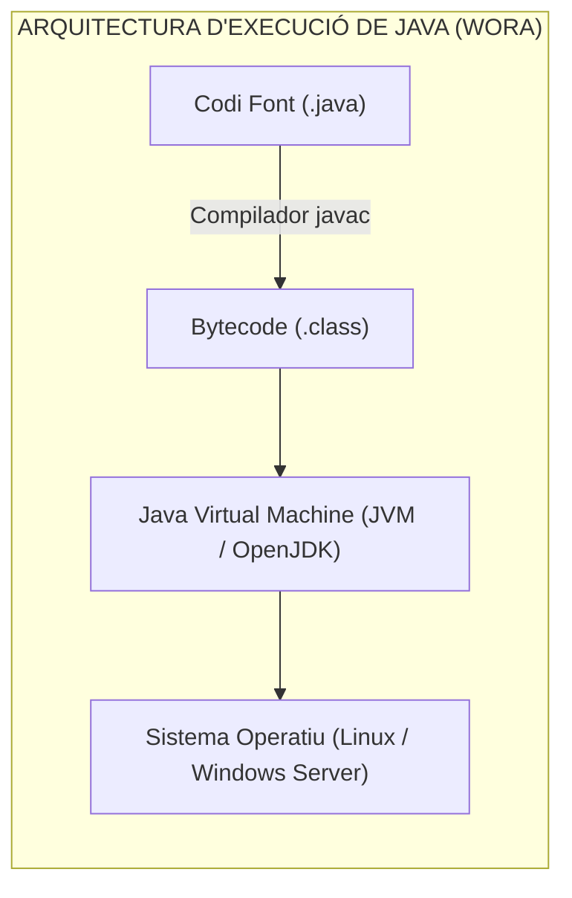

# Tema 79. Llenguatges de programació de client i de servidor: HTML5, CSS3, JavaScript, Model DOM, JSON, Java (JVM) i gestió de repositoris

> **Fonts i marcs de referència:** Esquema Nacional d'Interoperabilitat ([`CORPUS/ENI.pdf`](file:///home/oriol/Projectes/OPOS/CORPUS/ENI.pdf) - NTI de Catàleg d'estàndards web), Esquema Nacional de Seguretat ([`CORPUS/ENS_2022.pdf`](file:///home/oriol/Projectes/OPOS/CORPUS/ENS_2022.pdf) - Desenvolupament segur), recomanacions del **W3C (HTML5, CSS3, DOM)** i especificacions **ECMA-262 (JavaScript)** i **RFC 8259 (JSON)**.

---

## 1. Llenguatges de Client (*Front-End*)

Els llenguatges de client s'executen directament en el navegador web del ciutadà:

```mermaid
flowchart TD
    subgraph STACK_FRONTEND["LA TRÍADA DEL DESENVOLUPAMENT WEB (W3C)"]
        HTML["1. HTML5 (Estructura Semàntica)<br/>Defineix el contingut i significat dels elements:<br/>`<header>`, `<nav>`, `<main>`, `<article>`, `<section>`, `<footer>`, `<form>`."]
        CSS["2. CSS3 (Presentació i Disseny Visual)<br/>Estils, maquetació responsiva (Flexbox, CSS Grid) i Media Queries (@media)."]
        JS["3. JavaScript / ES6+ (Comportament i Dinamisme)<br/>Lògica interactiva, manipulació del DOM i comunicació asíncrona (Fetch API / AJAX)."]

        HTML --- CSS --- JS
    end
```

---

## 2. El Model d'Objectes del Document (DOM - *Document Object Model*)

El **DOM** és una interfície de programació d'aplicacions (API) estandarditzada pel **W3C** que representa un document HTML com un **arbre jeràrquic d'objectes i nodes**:

```mermaid
flowchart TD
    subgraph ARBRE_DOM["ESTRUCTURA DE L'ARBRE DOM"]
        Doc["Document"] --> Root["Element Arrel: `<html>`"]
        Root --> Head["Element: `<head>`"]
        Root --> Body["Element: `<body>`"]
        Head --> Title["Element: `<title>` -> Text: 'Seu Electrònica'"]
        Body --> H1["Element: `<h1>` -> Text: 'Tràmits Municipals'"]
        Body --> Form["Element: `<form id='tramitForm'>`"]
        Form --> Input["Element: `<input type='text' id='nif'>`"]
        Form --> Button["Element: `<button id='btnEnviar'>`"]
    end
```

- **Manipulació del DOM amb JavaScript:**
  - **Selecció de nodes:** `document.getElementById('btnEnviar')` o `document.querySelector('.classe-tramit')`.
  - **Gestió d'esdeveniments (*Event Listeners*):** `element.addEventListener('click', funcioCallback)`.
  - **Modificació de contingut:** `element.textContent = 'Nou valor'` o canvi d'atributs amb `element.setAttribute()`.

---

## 3. Formats d'Intercanvi i Llibreries: JSON i jQuery

### 3.1. JSON (*JavaScript Object Notation* - RFC 8259)
És l'estàndard d'intercanvi de dades per excel·lència a les seus electròniques i APIs REST per la seva lleugeresa i facilitat de lectura tant per a persones com per a màquines:
- **Estructures bàsiques:** Col·leccions de parells clau/valor (`{ "clau": "valor" }`) i llistes ordenades de valors (`[ 1, 2, 3 ]`).
- **Mètodes natius a JavaScript:** `JSON.stringify(objecte)` (serialitza a text) i `JSON.parse(text)` (converteix text a objecte).

### 3.2. jQuery
Llibreria clàssica de JavaScript que va estandarditzar la selecció d'elements DOM (`$('#element')`) i la realització de peticions asíncrones **AJAX** abans de l'arribada d'ECMAScript 6 i de l'API estàndard `fetch()`.

---

## 4. Llenguatges de Servidor (*Back-End*): La Plataforma Java

A l'Administració Pública catalana, **Java** és el llenguatge hegemònic per als sistemes corporatius i de gestió d'expedients:

- **Característiques Clau de Java:**
  - **Portabilitat absoluta:** Principi *Write Once, Run Anywhere (WORA)* gràcies a la Màquina Virtual de Java (**JVM**).
  - **Orientació a Objectes Pura:** Encapsulament, herència, polimorfisme i tipat fort i estàtic.
  - **Gestió Automàtica de Memòria:** Alliberament automàtic d'objectes no referenciats mitjançant el **Recol·lector de Brossa (*Garbage Collector*)**.
  - **Frameworks Corporatius:** **Spring Boot** (el framework líder per a microserveis), Quarkus i Jakarta EE.

---

## 5. Quadre Resum i Preguntes Típiques d'Examen Tipus Test

| Pregunta / Concepte Clau | Resposta Correcta / Trampa Freqüent |
| :--- | :--- |
| **Què és el DOM (Document Object Model)?** | L'**arbre jeràrquic d'objectes** que representa el document HTML a la memòria del navegador. |
| **Quin mètode de JavaScript converteix un text JSON a un objecte?** | **`JSON.parse()`** (mentre que `JSON.stringify()` converteix un objecte a text). |
| **Quin element d'HTML5 s'utilitza per a la navegació principal?** | L'etiqueta semàntica **`<nav>`**. |
| **Per què és portable el llenguatge Java entre diferents SOs?** | Perquè es compila a un codi intermedi (**Bytecode**) que s'executa sobre la **Java Virtual Machine (JVM)**. |
| **Quina tecnologia CSS permet crear dissenys que s'adapten al mòbil?** | Les **Media Queries (`@media`)**, Flexbox i CSS Grid. |
