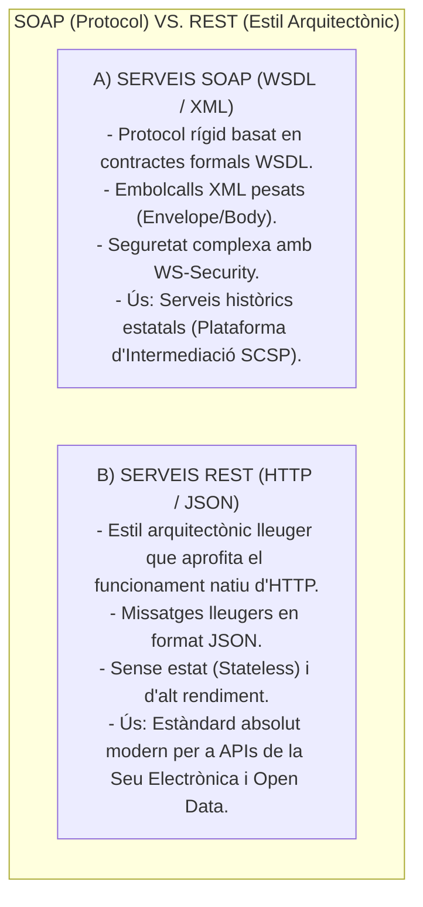
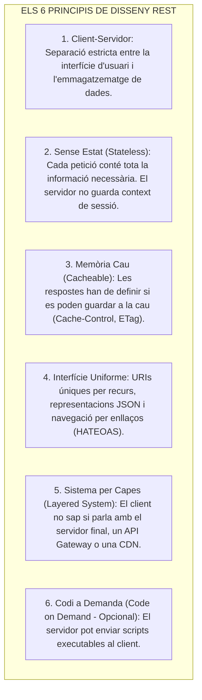

# Tema 80. Serveis web: arquitectura, protocols, estàndards REST (Roy Fielding), disseny d'APIs RESTful, OpenAPI/Swagger i seguretat (OAuth 2.0, JWT)

> **Fonts i marcs de referència:** Esquema Nacional d'Interoperabilitat ([`CORPUS/ENI.pdf`](file:///home/oriol/Projectes/OPOS/CORPUS/ENI.pdf) - NTI de Protocols i serveis web interoperables), Esquema Nacional de Seguretat ([`CORPUS/ENS_2022.pdf`](file:///home/oriol/Projectes/OPOS/CORPUS/ENS_2022.pdf) - Protecció d'APIs), dissertació de **Roy Fielding (REST, 2000)**, especificació **OpenAPI 3.0 (Linux Foundation)** i estàndards **RFC 7519 (JWT)** i **RFC 6749 (OAuth 2.0)**.

---

## 1. Evolució dels Serveis Web: SOAP vs. REST

Els **serveis web** són interfícies de programari que permeten l'intercanvi automatitzat de dades entre diferents administracions públiques (per exemple, la connexió de l'Ajuntament amb el Consorci AOC, l'Agència Tributària o la DGT):

---

## 2. Els Sis Principis Arquitectònics de REST (Roy Fielding)

Perquè una API es consideri autènticament **RESTful**, ha de complir aquests sis principis de disseny:

---

## 3. Disseny Semàntic d'una API RESTful Municipal

### 3.1. Verbs HTTP i Idempotència
Els recursos es modelen amb noms en plural (ex. `/api/v1/expedients`) i les accions s'executen mitjançant els **verbs HTTP estàndards**:

| Mètode HTTP | Acció CRUD | Descripció del Comportament | Segur (*Safe*)? | Idempotent? |
| :--- | :--- | :--- | :---: | :---: |
| **GET** | *Read* (Lectura) | Consulta un recurs o col·lecció (ex. `/api/v1/expedients/2026-001`). | ✅ **SÍ** | ✅ **SÍ** |
| **POST** | *Create* (Creació) | Crea un nou recurs subordinat (ex. registrar una nova sol·licitud). | ❌ NO | ❌ NO |
| **PUT** | *Update* (Reemplaçament) | **Substitueix completament** el recurs existent pel nou cos enviat. | ❌ NO | ✅ **SÍ** |
| **PATCH** | *Update* (Modificació parcial) | Modifica només determinats camps d'un recurs existent. | ❌ NO | ❌ NO |
| **DELETE** | *Delete* (Eliminació) | Elimina el recurs identificat per la URI. | ❌ NO | ✅ **SÍ** |

> 📌 **Concepte clau d'examen (Idempotència):** Un mètode és **idempotent** si executar-lo múltiples vegades de forma consecutiva amb els mateixos paràmetres produeix exactament el mateix efecte a la base de dades que executar-lo una sola vegada (ex. `GET`, `PUT`, `DELETE`).

---

### 3.2. Codis d'Estat de Resposta HTTP
- **2xx (Èxit):** `200 OK` (èxit genèric), `201 Created` (recurs creat amb èxit després de POST), `204 No Content` (èxit sense cos, típic en DELETE).
- **4xx (Errors de Client):** `400 Bad Request` (paràmetres invàlids), `401 Unauthorized` (manca autenticació), `403 Forbidden` (sense permisos suficients), `404 Not Found` (recurs inexistent).
- **5xx (Errors de Servidor):** `500 Internal Server Error` (error no controlat al codi), `503 Service Unavailable` (servidor sobrecarregat).

---

## 4. Documentació Normalitzada (OpenAPI / Swagger) i Seguretat d'APIs

### 4.1. L'Estàndard OpenAPI 3.0
L'especificació **OpenAPI** (anteriorment coneguda com *Swagger*) és l'estàndard obert per definir de forma llegible per persones i màquines tots els endpoints, paràmetres, tipus de dades i respostes d'una API REST mitjançant fitxers **YAML o JSON**, complint els requisits d'interoperabilitat de l'ENI.

### 4.2. Seguretat d'APIs REST (ENS / OWASP API Security):
1. **Autenticació mitjançant OAuth 2.0 i JWT (*JSON Web Tokens* - RFC 7519):**  
   Els clients s'autentiquen a un servidor d'autorització i reben un **token JWT** signat criptogràficament que s'envia a cada petició a la capçalera `Authorization: Bearer <token>`.
2. **Limitació de Taxa (*Rate Limiting / Throttling*):**  
   Control del nombre màxim de peticions per minut des d'una mateixa IP o client per evitar atacs de denegació de servei (DoS) i sobrecàrrega dels servidors municipals.

---

## 5. Quadre Resum i Preguntes Típiques d'Examen Tipus Test

| Pregunta / Concepte Clau | Resposta Correcta / Trampa Freqüent |
| :--- | :--- |
| **Què és la propietat d'idempotència en un mètode HTTP?** | Que executar la petició múltiples vegades **produeix el mateix resultat d'estat que executar-la un sol cop**. |
| **Quins mètodes HTTP són idempotents segons l'estàndard?** | **GET, PUT i DELETE** (mentre que **POST no ho és**). |
| **Quin codi d'estat HTTP indica la creació satisfactòria d'un recurs?** | El codi **`201 Created`**. |
| **Què signifiquen les sigles HATEOAS a REST?** | **Hypermedia As The Engine Of Application State** (inclusió d'enllaços de navegació a la resposta). |
| **Quin estàndard defineix la documentació formal d'APIs REST?** | L'especificació **OpenAPI 3.0** (Swagger). |
| **Quin format de token s'utilitza habitualment per a autorització REST?** | El token **JWT (JSON Web Token - RFC 7519)** amb signatura digital. |
