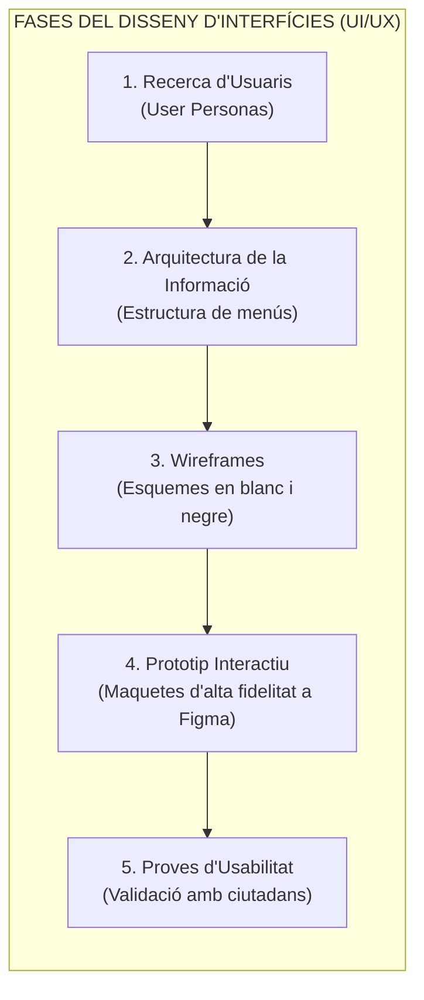
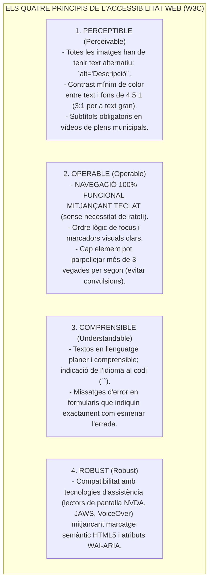
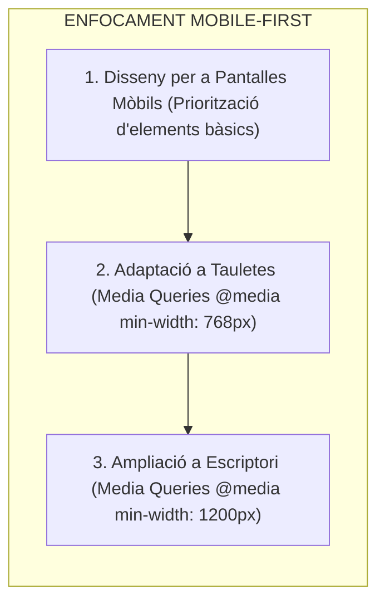
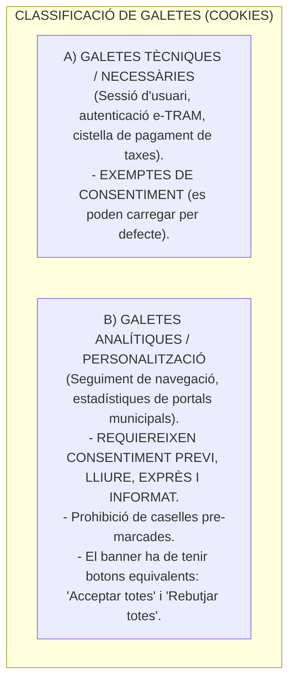

# Tema 81. Disseny d'interfícies d'usuari (UI/UX), accessibilitat web (RD 1112/2018, WCAG 2.1 AA), disseny responsiu (Mobile-First), règim de galetes (LSSI/RGPD) i sistemes de disseny

> **Fonts i marcs de referència:** Reial Decret 1112/2018 sobre accessibilitat dels llocs web del sector públic ([`CORPUS/ENI.pdf`](file:///home/oriol/Projectes/OPOS/CORPUS/ENI.pdf)), Reglament General de Protecció de Dades ([`CORPUS/LOPD.pdf`](file:///home/oriol/Projectes/OPOS/CORPUS/LOPD.pdf) - Consentiment de cookies), Llei 34/2002 (LSSI-CE - Art. 22.2), pautes **WCAG 2.1 Nivell AA (W3C/WAI)** i estàndard **ISO 9241-11 (Usabilitat)**.

---

## 1. El Flux de Disseny d'Interfícies Web Centrat en la Ciutadania

El disseny de serveis públics digitals segueix una metodologia iterativa centrada en l'usuari per garantir que qualsevol ciutadà, independentment de la seva edat o competència digital, pugui tramitar fàcilment a la Seu Electrònica:

---

## 2. Accessibilitat Web Obligatòria al Sector Públic (RD 1112/2018 i WCAG 2.1 AA)

A l'Estat espanyol i a Catalunya, el **Reial Decret 1112/2018** (que transposa la Directiva Europea 2016/2102) estableix que **tots els llocs web, seus electròniques i aplicacions mòbils de l'Administració Pública han de complir OBLIGATÒRIAMENT el nivell de conformitat WCAG 2.1 Nivell AA**:

- **Obligacions Institucionals:** Tot web municipal ha d'incloure al peu de pàgina una **Declaració d'Accessibilitat** actualitzada anualment i un **Mecanisme de Comunicació** perquè els ciutadans puguin denunciar barreres d'accés.

---

## 3. Disseny Adaptatiu i Responsiu (*Responsive Web Design* - RWD)

El disseny responsiu garanteix que els portals municipals es visualitzin correctament en qualsevol pantalla (mòbils, tauletes i monitors):

- **Tècniques Clau:** Ús de sistemes de graella flexible (**Flexbox** i **CSS Grid**) i unitats de mesura relatives (`rem`, `em`, `%`, `vw`) en lloc de píxels fixos (`px`).

---

## 4. Règim Jurídic de les Galetes (*Cookies* - LSSI i RGPD)

L'article 22.2 de la Llei 34/2002 (**LSSI-CE**) i el **RGPD** ([`CORPUS/LOPD.pdf`](file:///home/oriol/Projectes/OPOS/CORPUS/LOPD.pdf)) regulen l'ús de dispositius d'emmagatzematge i recuperació de dades a l'ordinador del ciutadà:

---

## 5. Sistemes de Disseny (*Design Systems*) i Frameworks CSS

- **Sistema de Disseny Municipal (*Design System*):** Conjunt normalitzat de regles visuals (paleta de colors institucionals, tipografies corporatives, espaiats) i biblioteca de components reutilitzables que garanteixen que tots els webs de l'Ajuntament tinguin la mateixa identitat visual.
- **Frameworks CSS Líders:** **Bootstrap** (framework clàssic basat en components), **Tailwind CSS** (framework modern basat en classes d'utilitat) i **Material UI**.

---

## 6. Quadre Resum i Preguntes Típiques d'Examen Tipus Test

| Pregunta / Concepte Clau | Resposta Correcta / Trampa Freqüent |
| :--- | :--- |
| **Quin nivell d'accessibilitat és obligatori a l'administració pública segons el RD 1112/2018?** | El nivell **WCAG 2.1 Nivell AA**. |
| **Quins són els 4 principis de l'accessibilitat web segons el W3C?** | **Perceptible, Operable, Comprensible i Robust (POUR)**. |
| **Quin és el contrast mínim de color exigit per a text normal segons WCAG AA?** | Un ràtio de contrast mínim de **4.5:1**. |
| **Què és l'enfocament de disseny Mobile-First?** | Dissenyar el web **primer per a la pantalla del telèfon mòbil** i afegir complexitat per a pantalles grans. |
| **Quines galetes estan exemptes del deure de consentiment segons la LSSI?** | Les **galetes estrictament tècniques i de sessió** necessàries per al servei sol·licitat pel ciutadà. |
| **Quina tecnologia permet etiquetar elements per a lectors de pantalla de persones cegues?** | L'estàndard **WAI-ARIA (Accessible Rich Internet Applications)**. |
