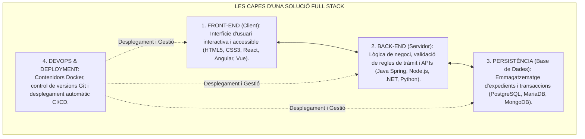
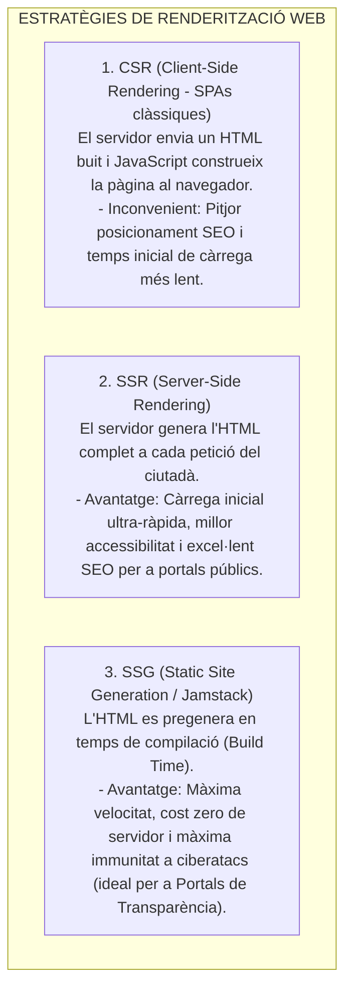

# Tema 82. Entorns de desenvolupament web "Full Stack": definició, piles tecnològiques (MEAN/MERN, Spring, .NET), models de renderització (SSR, CSR, SSG) i solucions de mercat

> **Fonts i marcs de referència:** Esquema Nacional d'Interoperabilitat ([`CORPUS/ENI.pdf`](file:///home/oriol/Projectes/OPOS/CORPUS/ENI.pdf) - NTI de Catàleg d'estàndards per a desenvolupament web), Esquema Nacional de Seguretat ([`CORPUS/ENS_2022.pdf`](file:///home/oriol/Projectes/OPOS/CORPUS/ENS_2022.pdf) - Cicle de vida de sistemes) i patrons de desenvolupament web moderns (**Jamstack, Next.js, Spring Boot, Node.js**).

---

## 1. Concepte de Desenvolupador i Entorn "Full Stack"

Un entorn de desenvolupament **Full Stack** comprèn el conjunt integral d'eines, llenguatges, llibreries i bases de dades que permeten construir una solució web municipal completa de principi a fi:

---

## 2. Piles Tecnològiques (*Technology Stacks*) de Mercat

| Pila Tecnològica (*Stack*) | Components | Característiques i Ús Principal a l'Ajuntament |
| :--- | :--- | :--- |
| **Java Spring + Angular / React** | Java (Spring Boot) + PostgreSQL / Oracle + Angular / React | **L'estàndard corporatiu per a aplicacions de gestió municipal complexes** (gestors d'expedients, tributs, padró). |
| **MERN / MEAN Stack** | MongoDB + Express.js + React (o Angular) + Node.js | **Pila 100% JavaScript/TypeScript** d'alta agilitat per a nous portals ciutadans i serveis de consulta ràpida. |
| **Microsoft .NET Stack** | C# (ASP.NET Core) + SQL Server + Razor / Blazor / React | Integració nativa amb l'entorn Windows Server, Microsoft Entra ID i eines corporatives municipals. |
| **LAMP Stack (Clàssic)** | Linux + Apache + MySQL/MariaDB + PHP | Base de portals institucionals i gestors de continguts web (**Drupal, WordPress**). |

---

## 3. Models de Renderització Web: CSR vs. SSR vs. SSG

Els frameworks Full Stack moderns permeten triar com i on es genera el codi HTML dels serveis municipals:

- **Frameworks Híbrids de Nova Generació:** **Next.js (basat en React)**, **Nuxt (basat en Vue)** i **Astro**, que permeten combinar SSR i SSG dins d'un mateix portal web municipal.

---

## 4. Eines de l'Entorn de Desenvolupament (Tooling)

1. **Entorns Integrats de Desenvolupament (IDEs):**
   - **Visual Studio Code (VS Code):** Editor lleuger i extensible líder per a desenvolupament web i cloud.
   - **IntelliJ IDEA / Eclipse:** IDEs de referència per a projectes empresarials Java / Spring Boot.
2. **Empaquetadors i Motors de Construcció (*Build Tools*):**
   - **Vite:** Eina de nova generació per a Front-End basada en mòduls ES nadius que ofereix recàrrega en calent instantània (*Hot Module Replacement - HMR*).
   - **Maven / Gradle:** Eines estàndard de gestió del cicle de vida i dependències a Java.
3. **Entorns de Contenidors Locals (Docker Compose):** Permeten aixecar a l'ordinador del desenvolupador la base de dades, el servidor web i el backend en segons amb la mateixa configuració que el servidor de producció.

---

## 5. Quadre Resum i Preguntes Típiques d'Examen Tipus Test

| Pregunta / Concepte Clau | Resposta Correcta / Trampa Freqüent |
| :--- | :--- |
| **Què signifiquen les sigles de la pila MERN?** | **MongoDB, Express.js, React i Node.js**. |
| **Quina diferència hi ha entre SSR i CSR?** | A **SSR l'HTML es genera al servidor**; a **CSR l'HTML es construeix al navegador del client mitjançant JavaScript**. |
| **Què és el model SSG (Static Site Generation)?** | La generació de pàgines **HTML estàtiques durant el temps de compilació (*build time*)**, oferint màxima velocitat i seguretat. |
| **Quin framework és líder en renderització híbrida (SSR/SSG) sobre React?** | **Next.js**. |
| **Quina eina permet executar en local una pila completa de serveis en contenidors?** | **Docker Compose**. |
