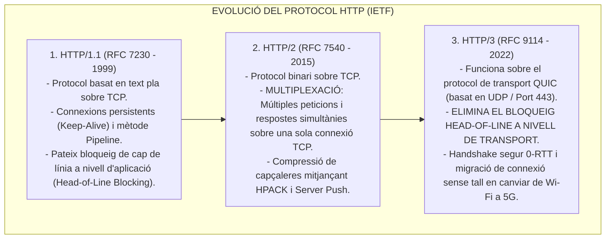
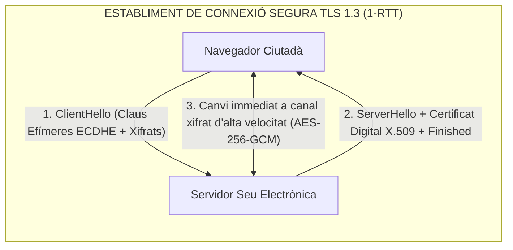
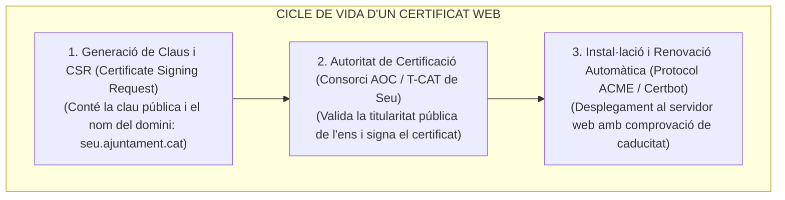
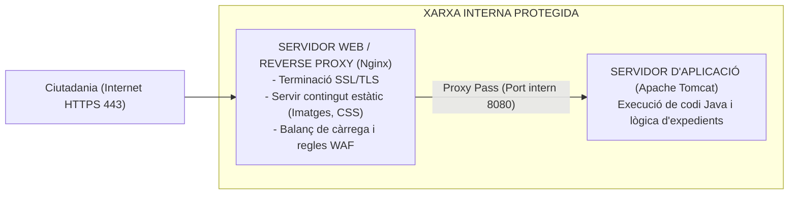

# Tema 83. Protocol HTTP/HTTPS: evolució (HTTP/1.1, HTTP/2, HTTP/3 QUIC), seguretat TLS 1.3, gestió de certificats (X.509, ACME, T-CAT) i servidors web (Nginx, Apache, Tomcat)

> **Fonts i marcs de referència:** Esquema Nacional de Seguretat ([`CORPUS/ENS_2022.pdf`](file:///home/oriol/Projectes/OPOS/CORPUS/ENS_2022.pdf) - Mesura `[mp.com.4]` Trànsit xifrat i Guia CCN-STIC 807), Esquema Nacional d'Interoperabilitat ([`CORPUS/ENI.pdf`](file:///home/oriol/Projectes/OPOS/CORPUS/ENI.pdf)) i especificacions IETF (**RFC 7540 HTTP/2, RFC 9114 HTTP/3, RFC 8446 TLS 1.3, RFC 8555 ACME**).

---

## 1. Evolució del Protocol HTTP: De HTTP/1.1 a HTTP/3

El protocol de transferència d'hipertext és la base de la comunicació a la World Wide Web:

---

## 2. El Protocol HTTPS i Xifratge TLS 1.3 (RFC 8446)

El protocol **HTTPS (*HTTP Secure*)** utilitza **TLS (*Transport Layer Security*)** sobre el port **TCP 443** per garantir la confidencialitat, la integritat i l'autenticitat dels tràmits ciutadans:

- **Secret Directe Perfecte (*Perfect Forward Secrecy - PFS*):** Exigit per l'ENS; garanteix que, encara que una clau privada del servidor fos robada en el futur, ningú podrà desxifrar el trànsit capturat en el passat.

### 2.1. Capçaleres de Seguretat Web Obligatòries a l'ENS:
- **HSTS (*HTTP Strict Transport Security*):** Força el navegador a connectar-se sempre per HTTPS, evitant atacs de degradació (*SSL Strip*):  
  `Strict-Transport-Security: max-age=31536000; includeSubDomains; preload`
- **CSP (*Content Security Policy*):** Immunitza la pàgina contra atacs de Cross-Site Scripting (XSS).
- **X-Frame-Options: DENY:** Impedeix atacs de segrest de clics (*Clickjacking*).

---

## 3. Gestió de Certificats Digitals de Servidor (X.509 v3)

- **Certificats del Consorci AOC:** A Catalunya, les seus electròniques municipals utilitzen certificats de **Seu Electrònica i Segell Electrònic (T-CAT)** emesos per l'AOC d'acord amb el Reglament eIDAS i l'ENI.

---

## 4. Servidors Web HTTP vs. Servidors d'Aplicació Web

En un entorn corporatiu municipal s'utilitza una combinació desacoblada de servidors:

---

## 5. Quadre Resum i Preguntes Típiques d'Examen Tipus Test

| Pregunta / Concepte Clau | Resposta Correcta / Trampa Freqüent |
| :--- | :--- |
| **Quin protocol de transport utilitza HTTP/3 en lloc de TCP?** | El protocol **QUIC (basat en UDP / Port 443)**. |
| **Quina millora clau introdueix HTTP/2 davant HTTP/1.1?** | La **Multiplexació de fluxos binaris** sobre una única connexió TCP. |
| **Quina capçalera de seguretat obliga el navegador a utilitzar exclusivament HTTPS?** | La capçalera **HSTS (*HTTP Strict Transport Security*)**. |
| **Quin protocol permet la renovació automàtica de certificats web?** | El protocol **ACME (RFC 8555)** utilitzat per eines com Certbot. |
| **Quina és la funció de Nginx situat al davant d'Apache Tomcat?** | Actuar com a **Reverse Proxy, terminador SSL/TLS i servidor de contingut estàtic**. |
| **Què és el Secret Directe Perfecte (PFS) a TLS 1.3?** | Una propietat que **evita desxifrar comunicacions passades si es compromet la clau privada en el futur**. |
