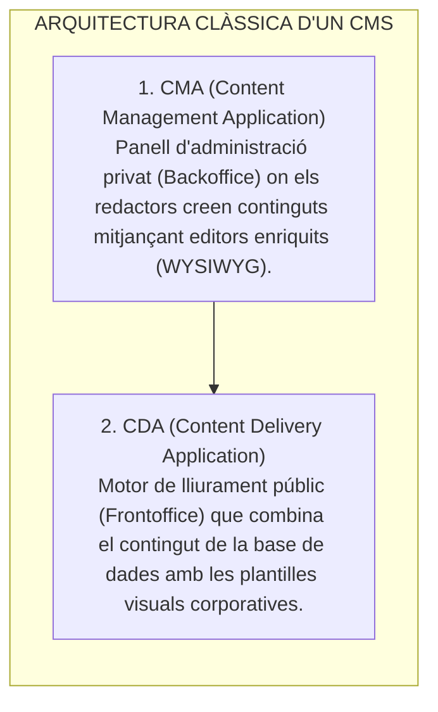
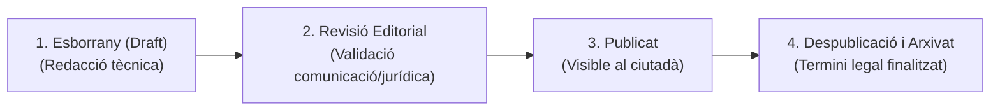
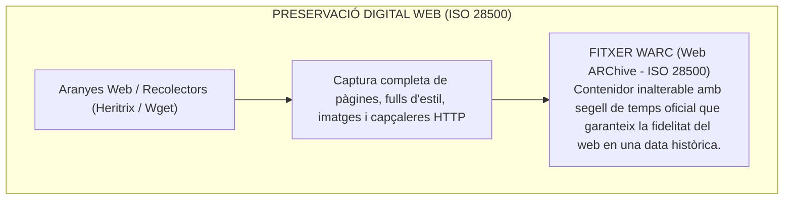
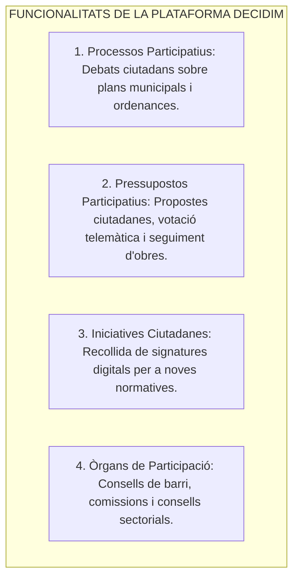

# Tema 84. Sistemes de gestió de continguts web (WCMS): arquitectura (Headless vs. Tradicional), cicle de publicació, arxivat web (format WARC / PADICAT) i plataformes de participació ciutadana (Decidim)

> **Fonts i marcs de referència:** Esquema Nacional d'Interoperabilitat ([`CORPUS/ENI.pdf`](file:///home/oriol/Projectes/OPOS/CORPUS/ENI.pdf) - NTI de Document i Expedient Electrònic), Llei 19/2014 de Transparència ([`CORPUS/Transparencia.pdf`](file:///home/oriol/Projectes/OPOS/CORPUS/Transparencia.pdf) - Publicitat activa), Reglament General de Protecció de Dades ([`CORPUS/LOPD.pdf`](file:///home/oriol/Projectes/OPOS/CORPUS/LOPD.pdf)) i estàndard internacional **ISO 28500 (Format WARC per a arxivat web)**.

---

## 1. Concepte i Arquitectura d'un Gestor de Continguts Web (WCMS)

Un **Sistema de Gestió de Continguts Web (WCMS / CMS - *Web Content Management System*)** és una plataforma de programari que permet als tècnics i comunicadors municipals crear, editar, organitzar i publicar informació al portal de l'Ajuntament sense necessitat de programar codi:

### 1.1. CMS Tradicional (Acoblat) vs. Headless CMS (Desacoblat)

| Criteri de Comparació | CMS Tradicional Acoblat (WordPress / Drupal) | Headless CMS Desacoblat (Strapi / Ghost) |
| :--- | :--- | :--- |
| **Arquitectura** | Front-End i Back-End units en un sol sistema monolític. | El CMS només gestiona continguts i els exposa mitjançant una **API REST / GraphQL**. |
| **Lliurament de Continguts** | Genera pàgines HTML directament des de PHP. | Un Front-End independent (ex. **Next.js / Astro**) consumeix l'API per pintar la web. |
| **Seguretat (ENS)** | Major superfície d'atac (la base de dades està lligada a la web pública). | **Màxima seguretat**: La base de dades i el panell d'edició estan completament aïllats d'Internet. |
| **Rendiment** | Requereix memòria cau dinàmica complexa. | **Ultra-ràpid**: Permet generar contingut estàtic (SSG / Jamstack). |

---

## 2. El Cicle de Vida de Publicació i Retirada de Continguts

Tota informació publicada al web municipal (notícies, anuncis del Tauler d'Edictes, actes municipals) segueix un flux de treball editorial regulat:

- **Tauler d'Edictes Electrònic (Art. 45 Llei 39/2015):** Els anuncis i notificacions edictals s'han de publicar durant el termini legal exacte (habitualment 15 o 20 dies hàbils). El CMS ha de disposar de **temporitzadors automàtics de retirada** i generar un certificat amb signatura i segell de temps que acrediti el període exacte d'exposició pública.

---

## 3. Arxivat i Preservació de Continguts Web (Format WARC - ISO 28500)

D'acord amb la Llei 39/2015 i l'ENI, l'activitat administrativa digital publicada a la web s'ha de preservar amb valor probatori històric i jurídic:

- **PADICAT (Patrimoni Digital de Catalunya):** Repositori oficial de la Biblioteca de Catalunya que preserva de forma sistemàtica els llocs web institucionals de tots els ajuntaments i administracions catalanes.

---

## 4. Web 2.0 i Plataformes de Participació Ciutadana: Decidim

En compliment de la Llei 19/2014 de Transparència i Participació ([`CORPUS/Transparencia.pdf`](file:///home/oriol/Projectes/OPOS/CORPUS/Transparencia.pdf)), els ajuntaments despleguen plataformes de democràcia participativa:

- **Decidim:** Plataforma lliure de codi obert (llicència AGPLv3) desenvolupada en Ruby on Rails / React, que garanteix la transparència, la traçabilitat de vots i la privacitat d'acord amb el RGPD.

---

## 5. Quadre Resum i Preguntes Típiques d'Examen Tipus Test

| Pregunta / Concepte Clau | Resposta Correcta / Trampa Freqüent |
| :--- | :--- |
| **Què és un Headless CMS?** | Un gestor de continguts que **només gestiona el Back-End i exposa les dades mitjançant APIs REST/GraphQL**, desacoblant el Front-End. |
| **Quins dos components formen l'arquitectura d'un CMS clàssic?** | La **CMA (*Content Management Application*)** i la **CDA (*Content Delivery Application*)**. |
| **Quin estàndard internacional ISO s'utilitza per a l'arxivat web?** | La norma **ISO 28500 (Format WARC - Web ARChive)**. |
| **Què és el projecte PADICAT a Catalunya?** | El **Patrimoni Digital de Catalunya**, que preserva la memòria digital dels llocs web catalans. |
| **Quina plataforma de codi obert és líder per a processos participatius municipals?** | La plataforma **Decidim** (sota llicència lliure AGPLv3). |
| **Com es garanteix la validesa d'un edicte retirat del tauler web?** | Mitjançant un **certificat electrònic amb segell de temps** que acredita les dates d'inici i final de publicació. |
