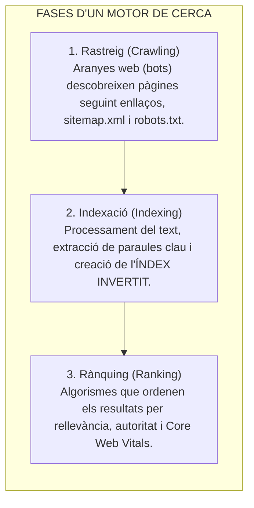
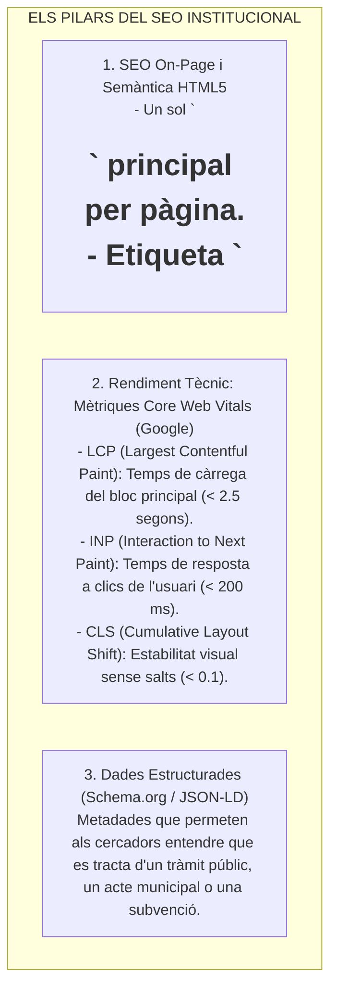
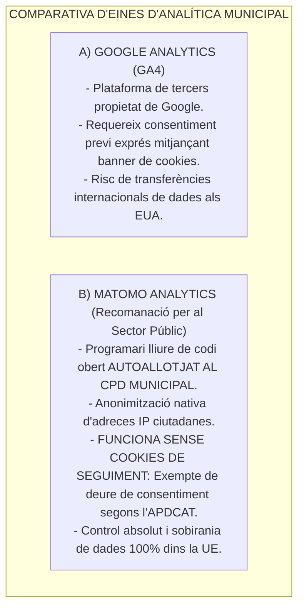

# Tema 85. Motors de cerca, indexació (índex invertit), posicionament SEO (Core Web Vitals, Schema.org) i analítica web municipal respectuosa amb el RGPD (Matomo)

> **Fonts i marcs de referència:** Esquema Nacional d'Interoperabilitat ([`CORPUS/ENI.pdf`](file:///home/oriol/Projectes/OPOS/CORPUS/ENI.pdf) - NTI de Catàleg d'estàndards per a metadades i Open Data), Llei 19/2014 de Transparència ([`CORPUS/Transparencia.pdf`](file:///home/oriol/Projectes/OPOS/CORPUS/Transparencia.pdf)), Reglament General de Protecció de Dades ([`CORPUS/LOPD.pdf`](file:///home/oriol/Projectes/OPOS/CORPUS/LOPD.pdf) - Analítica i transferències internacionals) i directrius del **W3C (Schema.org)** i **Google Search Central**.

---

## 1. Com Funcionen els Motors de Cerca: Rastreig, Indexació i Rànquing

Un motor de cerca (com Google, Bing o el motor de cerca intern del portal municipal) processa la informació en tres fases essencials:

- **L'Índex Invertit (*Inverted Index*):** Estructura de dades fonamental que mapeja cada paraula existent amb la llista de documents i pàgines on apareix (utilitzat per motors de cerca avançats com **Elasticsearch** o **Apache Solr** per indexar normatives i actes municipals).
- **Arxius de Control de Rastreig:**
  - `robots.txt`: Directrius que indiquen als bots quines rutes no han de rastrejar (ex. `Disallow: /admin/`).
  - `sitemap.xml`: Fitxer XML que conté la llista completa i jeràrquica de totes les URLs del portal municipal i la seva freqüència d'actualització.

---

## 2. Posicionament en Cercadors (SEO - *Search Engine Optimization*)

El SEO en l'Administració Pública té per objectiu que la ciutadania trobi ràpidament els tràmits i serveis municipals a Internet:

---

## 3. Analítica Web Municipal i Mesura del Trànsit

L'analítica web permet avaluar com interactua la ciutadania amb la Seu Electrònica (quines són les pàgines més visitades, quants tràmits s'inicien i quants s'abandonen):

### 3.1. Principals Mètriques d'Analítica:
- **Usuaris Únics i Sessions:** Nombre de ciutadans diferents i visites realitzades.
- **Taxa de Rebot (*Bounce Rate*):** Percentatge de visites on l'usuari abandona el web sense interactuar.
- **Embut de Conversió (*Conversion Funnel*):** Percentatge de ciutadans que completen amb èxit un procediment electrònic des de la pàgina informativa fins al rebut de registre.

---

## 4. Privacitat en l'Analítica Web: Google Analytics vs. Matomo (RGPD / APDCAT)

L'ús d'eines d'analítica està fortament condicionat pel **RGPD** ([`CORPUS/LOPD.pdf`](file:///home/oriol/Projectes/OPOS/CORPUS/LOPD.pdf)) i les resolucions de les autoritats de protecció de dades (APDCAT i AEPD):

---

## 5. Quadre Resum i Preguntes Típiques d'Examen Tipus Test

| Pregunta / Concepte Clau | Resposta Correcta / Trampa Freqüent |
| :--- | :--- |
| **Quina és l'estructura de dades que permet cerques instantànies de text?** | L'**Índex Invertit (*Inverted Index*)**, utilitzat per motors com Elasticsearch. |
| **Què indica el fitxer `sitemap.xml` d'un portal municipal?** | El **mapa estructurat de totes les URLs del web** per facilitar el rastreig dels cercadors. |
| **Quines són les 3 mètriques clau de Core Web Vitals?** | **LCP** (temps de càrrega principal), **INP** (interactivitat) i **CLS** (estabilitat visual). |
| **Quin valor màxim de LCP es considera bo per a Google?** | Un temps de càrrega **inferior a 2,5 segons ($< 2,5\text{ s}$)**. |
| **Quina eina d'analítica web de codi obert és recomanada per complir el RGPD sense cookies?** | **Matomo Analytics** (autoallotjada al servidor propi). |
| **Quina etiqueta evita problemes de contingut duplicat en SEO?** | L'etiqueta **`<link rel="canonical">`**. |
