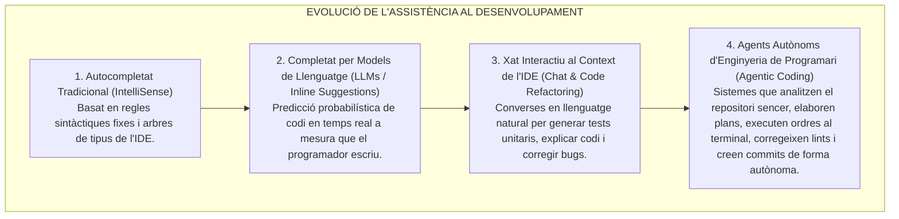
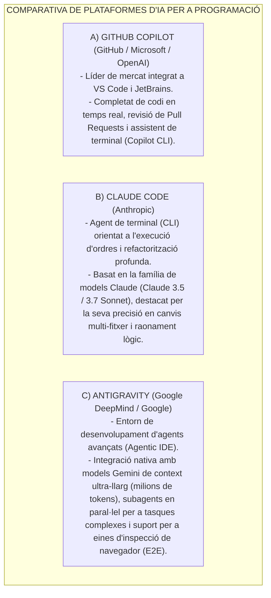
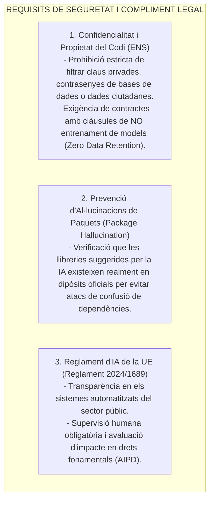

# Tema 86. Programació conjunta amb agents d'Intel·ligència Artificial: paradigmes (Pair Programming, Agentic Coding), estudi de mercat (GitHub Copilot, Claude Code, Antigravity), seguretat ENS i compliment legal (RGPD / EU AI Act)

> **Fonts i marcs de referència:** Reglament (UE) 2024/1689 d'Intel·ligència Artificial ([`CORPUS/AI_Act_2024.pdf`](file:///home/oriol/Projectes/OPOS/CORPUS/AI_Act_2024.pdf)), Esquema Nacional de Seguretat ([`CORPUS/ENS_2022.pdf`](file:///home/oriol/Projectes/OPOS/CORPUS/ENS_2022.pdf) - Mesures `[op.pl.5]` Adquisició i desenvolupament segur), Reglament General de Protecció de Dades ([`CORPUS/LOPD.pdf`](file:///home/oriol/Projectes/OPOS/CORPUS/LOPD.pdf) - Confidencialitat) i bones pràctiques d'enginyeria de programari assistida per IA.

---

## 1. La Revolució de la Programació Assistida per IA (*AI Pair Programming*)

La programació assistida per Intel·ligència Artificial ha evolucionat des de l'autocompletat tradicional fins a la creació d'**agents autònoms de desenvolupament de programari (*Agentic Coding*)**:

---

## 2. Estudi de Mercat: Eines Líders de Desenvolupament amb IA

---

## 3. Principals Casos d'Ús a l'Administració Pública

1. **Modernització d'Aplicacions Llegades (*Legacy Modernization*):** Traducció i refactorització d'aplicacions antigues monolítiques municipals cap a arquitectures de microserveis modernes (Spring Boot / Node.js).
2. **Generació Automàtica de Proves Unitàries i d'Integració (TDD):** Creació exhaustiva de tests (JUnit, Jest, PyTest) cobrint casos límit de validació administrativa.
3. **Documentació de Codi i Generació d'Esquemes OpenAPI:** Generació automàtica de documentació de codi i fitxers OpenAPI / Swagger per complir l'ENI ([`CORPUS/ENI.pdf`](file:///home/oriol/Projectes/OPOS/CORPUS/ENI.pdf)).
4. **Detecció Precoç de Vulnerabilitats:** Identificació proactiva de fallades de seguretat OWASP (injeccions SQL, XSS, fuites de memòria) abans de fer el desplegament a producció.

---

## 4. Bones Pràctiques i Enginyeria de Context (*Context Engineering*)

Per obtenir el màxim rendiment dels agents d'IA a la feina diària:
- **Descomposició de Tasques:** Dividir problemes grans en subtasques atòmiques i verificables pas a pas.
- **Fitxers de Regles de Projecte:** Inclusió d'instruccions i directrius d'estil al repositori (com fitxers de regles o memòries tècniques) per guiar el comportament de l'agent.
- **Supervisió Humana Efectiva (*Human-in-the-Loop*):** El desenvolupador públic ha d'exercir sempre de revisor crític, verificant la correcció lògica, el compliment normatiu i l'eficiència del codi proposat per la IA.

---

## 5. Seguretat, Confidencialitat i Marc Legal (ENS, RGPD i EU AI Act)

L'ús d'IA en entorns municipals exigeix garanties de compliment legal i de seguretat de la informació:

---

## 6. Quadre Resum i Preguntes Típiques d'Examen Tipus Test

| Pregunta / Concepte Clau | Resposta Correcta / Trampa Freqüent |
| :--- | :--- |
| **Què diferencia l'Agentic Coding de l'autocompletat d'IA tradicional?** | L'Agentic Coding **planifica, executa ordres de terminal, gestiona fitxers múltiples i corregeix errors de forma autònoma**. |
| **Quina mesura de seguretat s'ha d'exigir als proveïdors d'eines d'IA segons l'ENS?** | Clàusules empresarials de **no entrenament amb el codi del client (*Zero Data Retention*)**. |
| **Què és l'atac per al·lucinació de paquets (*Package Hallucination*)?** | La creació per part d'atacants de **llibreries malicioses amb noms que les IAs solen inventar erròniament**. |
| **Quin paper és obligatori per al desenvolupador segons el Reglament d'IA de la UE?** | El paper de **supervisió humana efectiva (*Human-in-the-Loop*)**. |
| **Quin entorn d'IA destaca pel desenvolupament mitjançant agents basat en la plataforma Gemini?** | **Antigravity** (Google DeepMind / Google). |
| **Quin agent de terminal (CLI) ha estat desenvolupat per Anthropic?** | **Claude Code**. |
