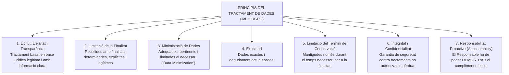
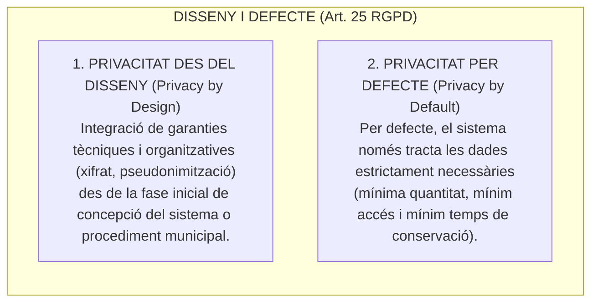
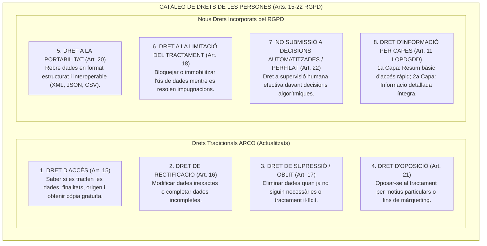
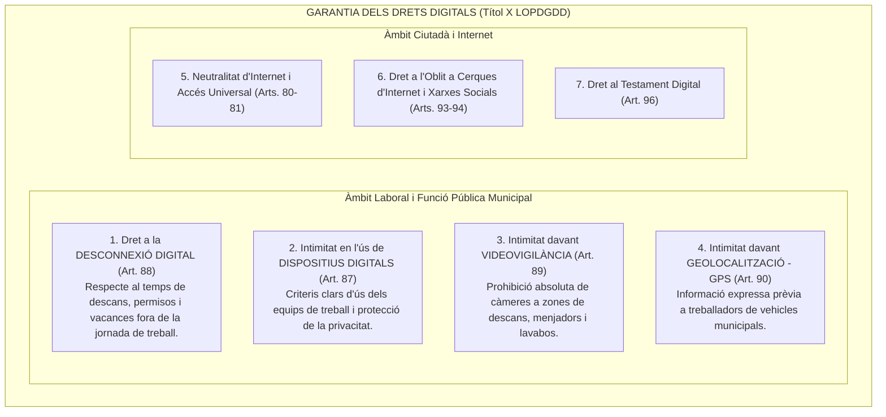
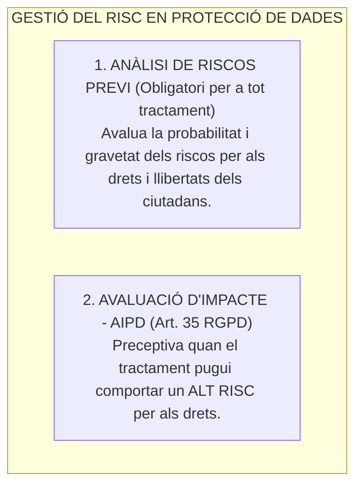
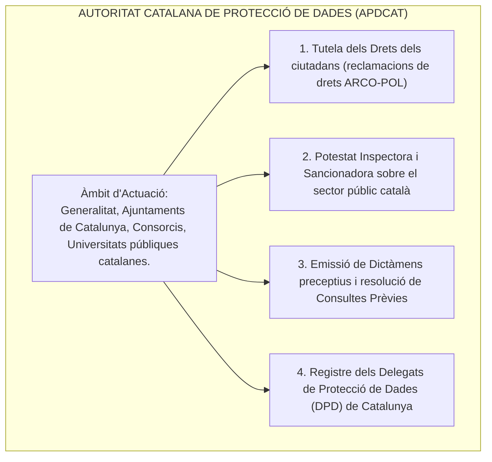

# Tema 87. Protecció de dades de caràcter personal. Privacitat des del disseny i per defecte. Registre d'activitats de tractament. Anàlisi de riscs i avaluació d'impacte en protecció de dades. Drets de les persones i Garantia dels Drets Digitals. L'Autoritat Catalana de Protecció de Dades

> **Fonts normatives de referència:** [`CORPUS/LOPD.pdf`](file:///home/oriol/Projectes/OPOS/CORPUS/LOPD.pdf) (Llei Orgànica 3/2018, de 5 de desembre, de protecció de dades personals i garantia dels drets digitals - LOPDGDD), Reglament (UE) 2016/679 General de Protecció de Dades (RGPD) i Llei 32/2010 de l'Autoritat Catalana de Protecció de Dades (APDCAT).

---

## 1. Marc Normatiu i Principis Relatius al Tractament (Art. 5 RGPD)

La protecció de dades personals és un dret fonamental (**Art. 18.4 CE**) que a la Unió Europea es regeix pel **Reglament (UE) 2016/679 (RGPD)** i a l'Estat espanyol per la **Llei Orgànica 3/2018 (LOPDGDD)**.

---

## 2. Privacitat des del Disseny i per Defecte (Art. 25 RGPD)

---

## 3. Drets dels Interessats: El Catàleg ARCO i els Nous Drets del RGPD (Drets ARCO-POL)

El RGPD i la LOPDGDD (Arts. 12 a 18 LOPDGDD i Capítol III RGPD) amplien notablement els tradicionals drets ARCO cap al conjunt de drets coneguts com **ARCO-POL**:

### 3.1. Detall dels Drets dels Ciutadans davant l'Administració Pública

| Dret de l'Interessat | Abast i Contingut Jurídic | Particularitats a l'Administració Local |
| :--- | :--- | :--- |
| **Accés (Art. 15 RGPD)** | Dret a conèixer si l'Ajuntament tracta dades de l'afectat, finalitats, categories de dades, destinataris i termini de conservació. Dret a obtenir **una còpia gratuïta**. | Es pot lliurar per via telemàtica a través de la Seu Electrònica (carpeta ciutadana). |
| **Rectificació (Art. 16 RGPD)** | Dret a rectificar dades personals que siguin inexactes i a completar les que siguin incompletes. | L'afectat ha d'indicar quines dades són errònies i aportar la documentació justificativa. |
| **Supressió / «Dret a l'Oblit» (Art. 17 RGPD)** | Dret a la supressió de dades quan ja no siguin necessàries, s'hagi retirat el consentiment o el tractament sigui il·lícit. | **Límit a l'Administració:** No procedeix la supressió quan el tractament és necessari per al compliment d'una **obligació legal, missió d'interès públic o exercici de poders públics**, o per a fins d'arxiu d'interès públic. |
| **Oposició (Art. 21 RGPD)** | Dret a oposar-se al tractament basat en missió pública per motius personals concrets. | L'Ajuntament ha de cessar el tractament llevat que acrediti **motius legítims imperiosos** que prevalguin sobre els drets de l'afectat. |
| **Limitació del Tractament (Art. 18 RGPD)** | Les dades queden **bloquejades** en el sistema municipal; només es conserven i no es poden utilitzar llevat per a la defensa de reclamacions. | S'aplica mentre es verifica l'exactitud d'una dada impugnada o la licitud del tractament. |
| **Portabilitat (Art. 20 RGPD)** | Dret a rebre les dades en format estructurat, d'ús comú i lectura mecànica (CSV, XML, JSON) i transmetre-les a un altre responsable. | **Excepció expressa:** **NO és aplicable** als tractaments que facin les administracions en compliment d'una missió d'interès públic o exercici de poders públics (Art. 20.3 RGPD). |
| **Decisions Automatitzades i Perfilat (Art. 22 RGPD)** | Dret a no ser objecte d'una decisió basada exclusivament en processos automatitzats que produeixi efectes jurídics. | El ciutadà té dret a **intervenció humana (*human-in-the-loop*)**, a expressar el seu punt de vista i a impugnar la decisió automatitzada. |

---

### 3.2. Procediment i Terminis d'Atenció dels Drets (Art. 12 RGPD)
- **Termini de resolució:** L'Ajuntament ha de respondre i executar el dret en el **termini màxim d'1 MES** des de la recepció de la sol·licitud. Aquest termini es pot prorrogar fins a **2 mesos més** en casos de complexitat especial o volum de sol·licituds, informant obligatòriament a l'afectat durant el primer mes.
- **Gratuïtat:** L'exercici dels drets és **sempre gratuït**. Només si les sol·licituds són manifestament infundades o repetitives es podrà cobrar un cànon raonable o denegar-les motivadament.
- **Dret de reclamació davant l'APDCAT:** Si l'Ajuntament desestima la petició o no respon en el termini d'un mes, l'interessat pot interposar una **reclamació de tutela de drets davant l'Autoritat Catalana de Protecció de Dades (APDCAT)**.

---

## 4. Garantia dels Drets Digitals (Títol X LOPDGDD - Arts. 79 a 97)

La LOPDGDD de 2018 va incorporar un Títol X pioner que reconeix una carta de drets digitals ciutadans i laborals a l'era tecnològica:

---

## 5. El Registre d'Activitats de Tractament (RAT - Art. 30 RGPD / Art. 31 LOPDGDD)

Tots els ajuntaments i organismes públics estan obligats a portar i mantenir actualitzat un **Registre d'Activitats de Tractament (RAT)** i a fer-lo **públic per mitjans electrònics** (al Portal de Transparència i a la Seu Electrònica):

| Contingut Obligatori del RAT (Art. 30.1 RGPD) | Descripció Operativa en l'Àmbit Municipal |
| :--- | :--- |
| **Identificació del Responsable** | Nom de l'Ajuntament i dades de contacte del **Delegat de Protecció de Dades (DPD)**. |
| **Finalitats del tractament** | Gestió del padró, tramitació de llicències d'obres, gestió tributària, serveis socials, policia local, gestió de nòmines. |
| **Base jurídica de legitimació** | Missió en interès públic / exercici de poders públics (**Art. 6.1.e RGPD**), obligació legal (**Art. 6.1.c**) o consentiment. |
| **Categories d'interessats i de dades** | Veïns del municipi, contribuents, empleats públics, dades identificatives, econòmiques o de salut. |
| **Destinataris i cessions previstes** | Altres administracions públiques (Agència Tributària, Seguretat Social, Generalitat) o jutjats. |
| **Transferències internacionals** | Si es transfereixen dades fora de l'Espai Econòmic Europeu (i garanties aplicades). |
| **Terminis previstos de supressió** | Criteris de conservació segons taules d'avaluació documental i arxiu. |
| **Mesures de seguretat tècniques** | Descripció general de les mesures aplicades d'acord amb l'Esquema Nacional de Seguretat (ENS). |

---

## 6. Anàlisi de Riscos i Avaluació d'Impacte (AIPD / DPIA - Art. 35 RGPD)

El RGPD substitueix l'antic model burocràtic per un **enfocament basat en el risc**:

### 6.1. Quan és preceptiva una AIPD a l'Ajuntament?
L'Avaluació d'Impacte relativa a la Protecció de Dades és **obligatòria en tot cas** quan:
1. Es realitzi una **avaluació sistemàtica i exhaustiva d'aspectes personals basada en tractament automatitzat / perfilat**.
2. Es tractin a gran escala **categories especials de dades** (dades de salut a serveis socials, ideologia, dades biomètriques per a control d'accessos, dades penals/policials).
3. Es dugui a terme una **observació o vigilància sistemàtica a gran escala d'una zona d'accés públic** (sistemes de videovigilància municipal, lectors de matrícules en Zones de Baixes Emissions).

- **Consulta Prèvia (Art. 36 RGPD):** Si l'AIPD indica que el tractament comporta un alt risc que l'Ajuntament no pot mitigar amb mesures tècniques, ha de consultar preceptivament l'**Autoritat Catalana de Protecció de Dades (APDCAT)** abans d'iniciar el tractament.

---

## 7. El Delegat de Protecció de Dades (DPD / DPO) i Violacions de Seguretat

### 7.1. El Delegat de Protecció de Dades (Arts. 37 a 39 RGPD / Arts. 34 a 37 LOPDGDD)
- **Obligatorietat absoluta:** Totes les administracions públiques (incloent tots els ajuntaments) han de designar obligatòriament un **DPD**.
- **Perfil i posició:** Nomenat sobre la base de les seves qualitats professionals i coneixements jurídics i tècnics. Actua amb **plena independència funcional** (no pot rebre instruccions sobre l'exercici de les seves funcions ni ser sancionat per acomplir-les) i reporta directament al màxim nivell de govern municipal (Alcaldia).
- **Funcions:** Informar i assessorar el consistori, supervisar el compliment del RGPD, actuar com a punt de contacte per als ciutadans i cooperar amb l'autoritat de control (APDCAT).

---

### 7.2. Gestió de Violacions de Seguretat de Dades (*Data Breaches* - Arts. 33 i 34 RGPD)
Quan es produeixi un incident de seguretat que afecti la confidencialitat o integritat de dades personals:
1. **Notificació a l'Autoritat de Control (APDCAT):** S'ha de notificar sense dilació indeguda i, com a màxim, en el termini de **72 hores** des que se'n tingui constància (llevat que sigui improbable que comporti un risc).
2. **Comunicació als Afectats:** Si la violació comporta un **alt risc per als drets i llibertats** de les persones, s'ha de comunicar directament als ciutadans afectats en un llenguatge clar i senzill.

---

## 8. L'Autoritat Catalana de Protecció de Dades (APDCAT - Llei 32/2010)

L'**APDCAT** és l'organisme independent de dret públic amb personalitat jurídica pròpia que vetlla pel compliment de la normativa de protecció de dades a les institucions públiques de Catalunya:

- **Règim sancionador aplicable a les Administracions Públiques (Art. 77 LOPDGDD):** Quan la infracció la comet un ajuntament o autoritat pública, la sanció de l'APDCAT **no té caràcter pecuniari (no s'imposen multes econòmiques a l'erari públic)**, sinó que es dicta un **requeriment d'adopció de mesures correctores**, es formula una **amonestació pública** i es pot instar la incoació d'expedient disciplinari contra els responsables.

---

## 9. Quadre Resum i Preguntes Típiques d'Examen Tipus Test

| Pregunta / Concepte Clau | Resposta Correcta / Trampa Freqüent |
| :--- | :--- |
| **Quins són els drets ARCO-POL que reconeix el RGPD?** | **Accés, Rectificació, Cancel·lació/Supressió (Oblit), Oposició, Portabilitat i Limitació del tractament**. |
| **Quin termini té l'Ajuntament per respondre a l'exercici d'un dret?** | **1 MES** des de la recepció (prorrogable 2 mesos més per motius justificats). |
| **És aplicable el dret a la portabilitat a les dades municipals per obligació legal?** | **No**, el dret a la portabilitat **no s'aplica** a tractaments en compliment de missions d'interès públic o poders públics (Art. 20.3 RGPD). |
| **En quins espais laborals està totalment prohibida la videovigilància?** | En **zones de descans, vestidors, menjadors i lavabos** (Art. 89 LOPDGDD). |
| **Què és el dret a la desconnexió digital?** | El dret dels empleats públics a no respondre comunicacions fora de la seva jornada laboral (Art. 88 LOPDGDD). |
| **Què exigeix el principi de Responsabilitat Proactiva (*Accountability*)?** | El Responsable ha d'aplicar mesures tècniques i **estar en condicions de DEMOSTRAR el compliment del RGPD**. |
| **És obligatori el Delegat de Protecció de Dades (DPD) a un Ajuntament?** | **Sí, és obligatori per a totes les administracions públiques** (Art. 37.1.a RGPD). |
| **Quin termini màxim hi ha per notificar una violació de seguretat a l'APDCAT?** | Com a màxim **72 hores** des que se'n té constància (Art. 33.1 RGPD). |
| **Quan és obligatòria una Avaluació d'Impacte (AIPD)?** | Quan el tractament comporti un **alt risc** (dades especials a gran escala, perfilat, videovigilància pública massiva). |
| **On s'ha de publicar el Registre d'Activitats de Tractament (RAT)?** | S'ha de fer **públic per mitjans electrònics** (Seu Electrònica / Portal de Transparència) (Art. 31.2 LOPDGDD). |
| **Es poden imposar multes econòmiques a un ajuntament segons la LOPDGDD?** | **No com a regla general**; se'ls imposa una **amonestació i requeriment de mesures correctores** (Art. 77 LOPDGDD). |
