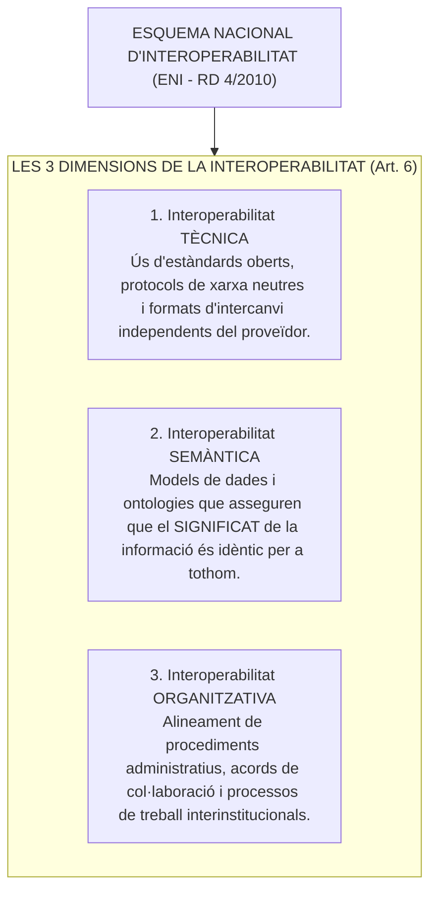
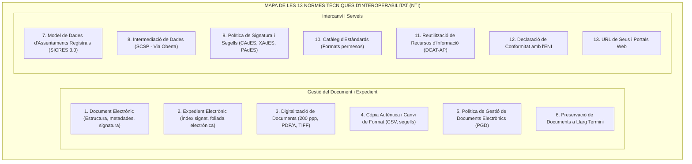

# Tema 88. Interoperabilitat de sistemes. L'Esquema Nacional d'Interoperabilitat. Normes tècniques d'interoperabilitat

> **Font normativa de referència:** [`CORPUS/ENI.pdf`](file:///home/oriol/Projectes/OPOS/CORPUS/ENI.pdf)  
> **Text:** Reial Decret 4/2010, de 8 de gener, pel qual es regula l'Esquema Nacional d'Interoperabilitat en l'àmbit de l'Administració Electrònica (ENI) i les Normes Tècniques d'Interoperabilitat (NTI). Text consolidat.

---

## 1. Concepte i Principis de l'Esquema Nacional d'Interoperabilitat (ENI)

L'**Esquema Nacional d'Interoperabilitat (ENI - RD 4/2010)** té per objecte establir les condicions que garanteixin la interoperabilitat entre totes les administracions públiques espanyoles, per tal de fer efectiu el dret de la ciutadania a relacionar-se electrònicament amb el sector públic i possibilitar l'intercanvi fluid i segur de dades i documents.

---

## 2. Principis Específics de l'ENI (Art. 4)

Tots els sistemes d'informació municipals han de dissenyar-se atenent als següents principis rectors:
1. **L'interoperabilitat com a qualitat integral:** No és un afegit posterior, sinó que ha de contemplar-se des de la fase inicial de disseny dels sistemes i procediments.
2. **Caràcter multidimensional:** Abasta de forma conjunta les dimensions tècnica, semàntica i organitzativa.
3. **Enfocament de solucions multilaterals:** Prioritzar solucions comunes compartides i reutilitzables per a totes les administracions (evitant desenvolupaments bilaterals aïllats).
4. **Preferència pels estàndards oberts:** Utilització d'estàndards públics i d'ús lliure per garantir la independència tecnològica.

---

## 3. Anàlisi Sistemàtica de les 13 Normes Tècniques d'Interoperabilitat (NTI)

Les **Normes Tècniques d'Interoperabilitat (NTI)** són resolucions tècniques d'obligat compliment per a tots els ajuntaments que desenvolupen els aspectes concrets de l'ENI:

---

### 3.1. Detall de les NTI Fonamentals per a Oposicions

| Norma Tècnica (NTI) | Requisits Tècnics i Contingut Clau | Impacte Municipal Directe |
| :--- | :--- | :--- |
| **NTI de Document Electrònic** | Integrat per tres components indissociables: 1. **Contingut** (fitxer en format estàndard). 2. **Signatura electrònica** o segell d'òrgan. 3. **Metadades mínimes obligatòries** (identificador únic, òrgan emissor, data de captura, origen ciutadà/administració, estat d'elaboració i tipus documental segons e-EMGDE). | Estructuració de decrets d'alcaldia, informes tècnics, actes i sol·licituds. |
| **NTI d'Expedient Electrònic** | Estructurat mitjançant: 1. Conjunt de documents electrònics que l'integren. 2. **Índex Electrònic Signat** (segellat amb certificat de l'Ajuntament que immobilitza la llista de documents). 3. Metadades de l'expedient. *La foliada és digital i es realitza a través de l'índex*. | Tramitació d'expedients d'obres, llicències, contractació i sancions. |
| **NTI de Digitalització de Documents** | Procés de conversió de paper a document electrònic autèntic: - Resolució geomètrica mínima de **200 ppp**. - Escala de grisos o color segons el document original. - Formats permesos: **PDF/A, TIFF, PNG, JPEG2000**. - Signatura del procés de digitalització. | Digitalització presencial de documents a l'OAC i destrucció segura del paper. |
| **NTI de Còpia Autèntica** | Expedició de còpies autèntiques a partir de documents de paper o electrònics mitjançant **Codi Segur de Verificació (CSV)** o signatura de segell electrònic de l'Ajuntament. | Lliurament de còpies compulsades digitals a ciutadans i jutjats. |
| **NTI SICRES 3.0 (Assentaments Registrals)** | Especificació de missatgeria estàndard per a la interconnexió de registres a través del **Sistema d'Interconnexió de Registres (SIR)** i el MUX de l'AOC. | Enviament electrònic instantani d'instàncies d'un ajuntament a qualsevol altre organisme. |
| **NTI SCSP (Intermediació de Dades)** | Protocol de serveis web segurs per consultar dades ciutadanes (Padró, Hisenda, Seguretat Social) per aplicar el principi *Once-Only*. | Integració dels serveis de *Via Oberta* de l'AOC als tràmits municipals. |
| **NTI Catàleg d'Estàndards** | Fixa els formats recomanats d'ús obert i no propietari: text (**ODF, PDF/A, TXT**), estructurats (**XML, JSON, CSV**), gràfics (**PNG, SVG, JPEG**). | Garantir que la documentació municipal sigui accessible de forma independent del programari. |

---

## 4. Reutilització Tecnològica i el Centre de Transferència (CTT)

L'article 157 de la Llei 40/2015 i el RD 4/2010 obliguen a compartir les solucions de programari entre administracions:
- **Directori d'Aplicacions Reutilitzables:** Les administracions estan obligades a consultar el directori del **Centre de Transferència Tecnològica (CTT)** de l'Estat abans d'iniciar el desenvolupament d'un nou programari, per comprovar si ja existeix una solució reutilitzable gratuïta desenvolupada per una altra administració.
- **Xarxa SARA (Sistemes d'Aplicacions i Xarxes per a les Administracions):** Xarxa privada de comunicacions d'alta seguretat que interconnecta tots els ministeris, comunitats autònomes i entitats locals.

---

## 5. Quadre Resum i Preguntes Típiques d'Examen Tipus Test

| Pregunta / Concepte Clau | Resposta Correcta / Trampa Freqüent |
| :--- | :--- |
| **Quina norma aprova l'Esquema Nacional d'Interoperabilitat?** | El **Reial Decret 4/2010 (RD 4/2010, ENI)**. |
| **Quines són les 3 dimensions bàsiques de la interoperabilitat?** | **Tècnica, Semàntica i Organitzativa** (Art. 6 RD 4/2010). |
| **Quins són els 3 components del document electrònic segons la NTI?** | **Contingut, Signatura electrònica i Metadades mínimes obligatòries**. |
| **Com es garanteix la integritat de l'expedient electrònic?** | Mitjançant l'**Índex Electrònic Signat** que actua com a foliada digital. |
| **Quina resolució mínima exigeix la NTI per digitalitzar documents?** | Resolució geomètrica mínima de **200 ppp** (en PDF/A, TIFF, PNG). |
| **Quin model de dades s'utilitza per a l'intercanvi registral (SIR)?** | El model **SICRES 3.0** (Norma Tècnica d'Assentaments Registrals). |
| **On es publiquen les aplicacions per a reutilització tecnològica?** | Al **Centre de Transferència Tecnològica (CTT)** de l'Administració. |
| **Què és la Xarxa SARA?** | La **xarxa privada segura d'interconnexió de totes les administracions públiques espanyoles**. |
