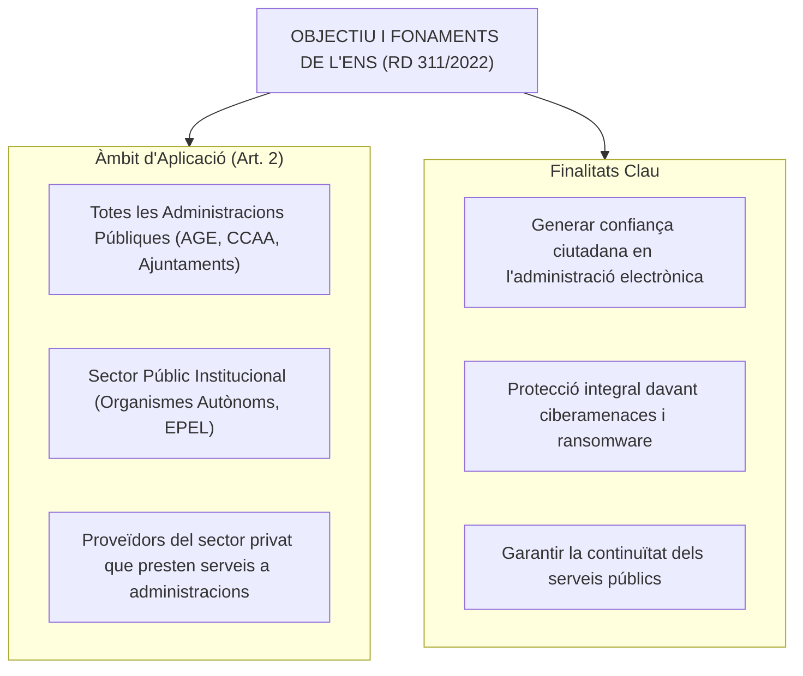
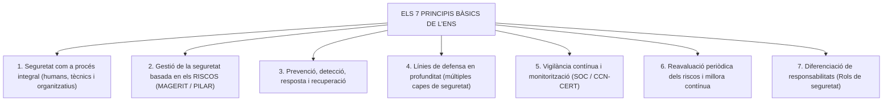
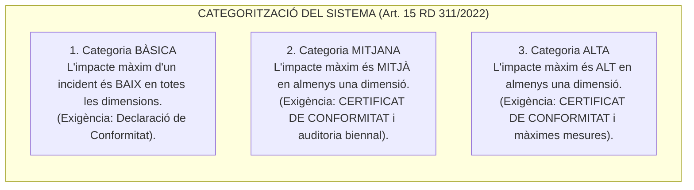
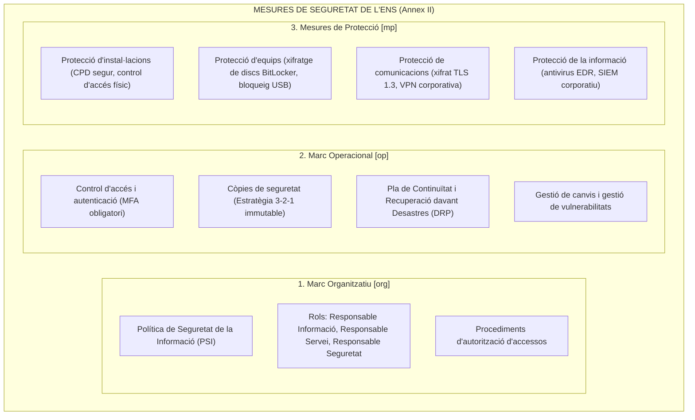
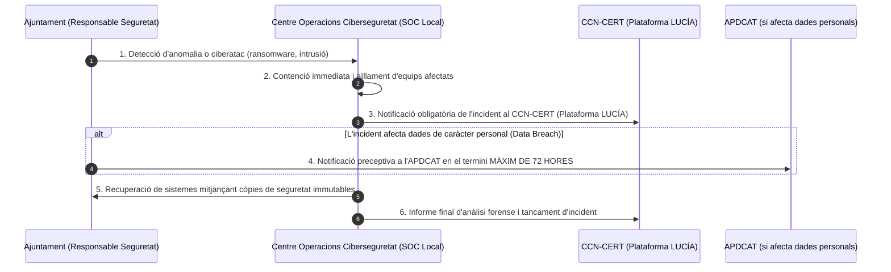

# Tema 89. Esquema nacional de seguretat: mesures per garantir la seguretat de la informació i els serveis electrònics, auditoria de seguretat, resposta davant incidents de seguretat i certificació de la seguretat

> **Font normativa de referència:** [`CORPUS/ENS_2022.pdf`](file:///home/oriol/Projectes/OPOS/CORPUS/ENS_2022.pdf)  
> **Text:** Reial Decret 311/2022, de 3 de maig, pel qual es regula l'Esquema Nacional de Seguretat (ENS). Text consolidat.

---

## 1. Objecte, Finalitat i Àmbit de l'ENS (RD 311/2022)

L'**Esquema Nacional de Seguretat (ENS - RD 311/2022)** estableix els principis bàsics, requisits mínims i mesures de protecció que han d'aplicar totes les administracions públiques (incloent tots els ajuntaments) i els seus proveïdors tecnològics per garantir la **seguretat de la informació tractada i dels serveis prestats per mitjans electrònics**.

---

## 2. Els Set Principis Bàsics de l'ENS (Arts. 5 a 11)

---

## 3. Dimensions de Seguretat i Categorització de Sistemes (Arts. 13 a 15)

### 3.1. Les Cinc Dimensions de la Seguretat (DAICT)
1. **Disponibilitat (D):** Garantia que els usuaris autoritzats tenen accés a la informació i serveis quan ho requereixen.
2. **Autenticitat (A):** Garantia que la informació o comunicació prové de la font o identitat autèntica que declara ser.
3. **Integritat (I):** Garantia que la informació no ha estat alterada, modificada o esborrada de forma no autoritzada.
4. **Confidencialitat (C):** Garantia que la informació només és accessible a persones, processos o sistemes autoritzats.
5. **Traçabilitat (T):** Garantia que les accions sobre el sistema es poden rastrejar de forma unívoca fins a l'usuari que les ha executat (*registre de logs*).

---

### 3.2. Categories de Seguretat del Sistema d'Informació (Art. 15)
El sistema d'informació de l'Ajuntament es classifica en una de les **tres categories de seguretat**, determinades pel nivell d'impacte més alt (**Baix, Mitjà o Alt**) que tindria un incident en qualsevol de les 5 dimensions:

---

## 4. Marc Operacional i Mesures de Seguretat (Annex II RD 311/2022)

Les mesures de seguretat s'agrupen en tres grans marcs:

### 4.1. Els Rols de Seguretat a l'ENS (Principi de Diferenciació de Responsabilitats - Art. 11 i Mesura [org.2])

L'ENS estableix una estricta separació de funcions per evitar conflictes d'interès i garantir una governança eficaç:

| Rol de Seguretat | Funció Principal i Competències Clau | Exemple d'Assignació a l'Ajuntament |
| :--- | :--- | :--- |
| **Responsable de la Informació (RI)** | • Determina els **requisits de seguretat de la informació** tractada. • Valora l'impacte i assigna el nivell de seguretat en les 5 dimensions (**DAICT**: Confidencialitat, Integritat, etc.). | Cap de l'àrea funcional propietària de les dades (p. ex., **Tresoreria / Gestió Tributària**, **Cap de Recursos Humans**, **Responsable de Padró**). |
| **Responsable del Servei (RS)** | • Determina els **requisits de seguretat del servei prestat**. • Fixa els llindars de continuïtat i el temps màxim d'interrupció tolerable (**Disponibilitat**). | Responsable del tràmit o procediment administratiu (p. ex., **Cap de l'OAC / Seu Electrònica**, **Cap d'Urbanisme** per a llicències). |
| **Responsable de la Seguretat (RSeg / CISO)** | • Determina les **decisions i mesures per satisfer els requisits** fixats pels Responsables d'Informació i de Servei. • Supervisa l'aplicació efectiva de la Política de Seguretat (PSI) i gestiona els riscos. • **Principi d'independència:** Ha d'actuar amb plena autonomia respecte del Responsable del Sistema. | **Cap de Seguretat de la Informació (CISO municipal)** o tècnic superior de seguretat designat. |
| **Responsable del Sistema (RSis)** | • S'encarrega d'**implementar, configurar, operar i mantenir** la infraestructura tecnològica i les mesures tècniques al llarg del cicle de vida. • Pot acordar la **suspensió temporal d'un servei** si detecta una deficiència greu de seguretat, informant el RSeg. | **Cap del Departament de Sistemes / TIC / Informàtica**. |
| **Delegat de Protecció de Dades (DPD)** | • Coordina i vetlla pel compliment del RGPD/LOPDGDD quan els tractaments de l'ENS inclouen dades personals. | **DPD municipal** (propi o mancomunat/Diputació). |
| **Comitè de Seguretat de la Informació** | • Òrgan col·legiat de governança que alinea estratègicament tots els rols i eleva les polítiques a l'Alcaldia / Ple. | Comitè integrat per Secretaria, Intervenció, RSeg, RSis, DPD i Caps de Servei. |

---

### 4.2. Contingut Mínim Obligatori de la Política de Seguretat de la Informació (PSI - Art. 12 i Mesura [org.1])

La **Política de Seguretat de la Informació (PSI)** és el document marc de màxim nivell aprovat per l'òrgan de govern municipal (Alcaldia o Ple) que formalitza el compromís corporatiu amb la seguretat:

1. **Objectius estratègics i missió:** Visió institucional i compromís ferm amb la prestació de serveis digitals segurs i la protecció del ciutadà.
2. **Marc legal i normatiu:** Identificació taxativa de les normes aplicables (ENS - RD 311/2022, RGPD, LOPDGDD, Llei 39/2015, Llei 40/2015).
3. **Àmbit d'aplicació:** S'aplica a tots els sistemes d'informació, xarxes corporatives, empleats públics, càrrecs electes i terceres empreses proveïdores.
4. **Estructura organitzativa i rols:** Designació formal del Responsable de la Informació, Responsable del Servei, Responsable de Seguretat, Responsable del Sistema i DPD.
5. **Estructura de la documentació de seguretat (Jerarquia documental):**
   - **Nivell 1 (Estratègic):** *Política de Seguretat de la Informació (PSI)* (aprovada pel Ple / Alcaldia).
   - **Nivell 2 (Tàctic):** *Normes i Directrius de Seguretat* (contrasenyes, teletreball, ús de dispositius).
   - **Nivell 3 (Operatiu):** *Procediments Operatius de Seguretat - POS* (còpies de seguretat, gestió d'incidents).
   - **Nivell 4 (Tècnic):** *Guies tècniques, registres i logs*.
6. **Gestió del risc:** Obligació de realitzar i actualitzar l'avaluació contínua de riscos com a base de qualsevol decisió tecnològica.
7. **Formació i conscienciació:** Deure d'impartir formació periòdica en ciberseguretat a tots els treballadors públics.
8. **Obligacions i règim disciplinari:** Deure de compliment estricte i advertiment de les conseqüències administratives/disciplinàries en cas d'infracció.
9. **Mecanisme de revisió i aprovació periòdica:** Procediment de revisió anual o extraordinària davant canvis substancials o incidents greus.

---

## 5. Auditoria de Seguretat de l'ENS (Art. 34 RD 311/2022)

- **Obligatorietat:** Els sistemes d'informació de categoria **MITJANA o ALTA** han de sotmetre's preceptivament a una **auditoria formal de seguretat ordinària com a mínim cada 2 ANYS**.
- **Auditoria extraordinària:** S'ha d'efectuar obligatòriament abans dels 2 anys si es produeixen modificacions substancials en els sistemes o infraestructures tecnològiques que puguin repercutir en les mesures de seguretat.
- **Sistemes de Categoria Bàsica:** No exigeixen auditoria formal externa biennal, però han de sotmetre's a una **autoavaluació documentada anual** que verifiqui el compliment de les mesures.

---

## 6. Resposta davant Incidents de Seguretat i Notificació (Arts. 36 a 38)

Tots els ajuntaments han de disposar d'un procediment de gestió i resposta davant ciberatacs i incidents de seguretat:

- **Plataforma d'intercanvi:** Les notificacions d'incidents al **CCN-CERT** es realitzen a través de les eines oficials **LUCÍA** i **INES**.

---

## 7. Certificació de Conformitat amb l'ENS (Art. 41)

| Categoria del Sistema | Instrument de Conformitat Exigit | Entitat que l'Emet / Termini |
| :--- | :--- | :--- |
| **Categoria BÀSICA** | **Declaració de Conformitat amb l'ENS** | Formulada pel mateix Ajuntament mitjançant autoavaluació interna (amb suport de la Guia CCN-STIC 803 / e-ENS). |
| **Categories MITJANA i ALTA** | **Certificat de Conformitat amb l'ENS** | Emès exclusivament per una **Entitat d'Auditoria i Certificació acreditada per ENAC** (Entitat Nacional d'Acreditació). Té una **vigència màxima de 2 ANYS** (amb auditoria de seguiment intermèdia a l'any). |

- **Distintiu de Seguretat:** Els ajuntaments certificats adquireixen el dret a exhibir el **Segell oficial de Conformitat amb l'ENS** a la seva Seu Electrònica i portals web.

---

## 8. Quadre Resum i Preguntes Típiques d'Examen Tipus Test

| Pregunta / Concepte Clau | Resposta Correcta / Trampa Freqüent |
| :--- | :--- |
| **Quina norma regula l'Esquema Nacional de Seguretat actual?** | El **Reial Decret 311/2022 (RD 311/2022, ENS)**. |
| **Quines són les 5 dimensions de la seguretat a l'ENS?** | **Disponibilitat, Autenticitat, Integritat, Confidencialitat i Traçabilitat (DAICT)**. |
| **Quines categories de seguretat preveu l'ENS?** | **BÀSICA, MITJANA i ALTA** (determinades pel màxim impacte). |
| **Qui aprova formalment la Política de Seguretat de la Informació (PSI)?** | L'**Alcaldia** (mitjançant Decret) o el **Ple municipal** (òrgan superior de govern). |
| **Quins són els 4 rols bàsics exigits pel principi de diferenciació de l'ENS?** | **Responsable de la Informació, del Servei, de la Seguretat (CISO) i del Sistema**. |
| **Qui té la potestat de valorar les dimensions de seguretat de les dades?** | El **Responsable de la Informació (RI)**. |
| **Amb quina freqüència s'ha de fer l'auditoria ordinària a sistemes Mitjans/Alts?** | Com a mínim **cada 2 ANYS** (Art. 34 RD 311/2022). |
| **A quin organisme s'han de notificar obligatòriament els ciberincidents?** | Al **CCN-CERT** (a través de la plataforma *LUCÍA*) i a l'Agència de Ciberseguretat de Catalunya. |
| **Qui pot emetre el Certificat de Conformitat amb l'ENS per a nivell Mitjà/Alt?** | Una **Entitat de Certificació acreditada per ENAC** (Art. 41 RD 311/2022). |
| **Quina vigència té el Certificat de Conformitat amb l'ENS?** | Una vigència de **2 ANYS**, amb auditories de seguiment anuals. |
