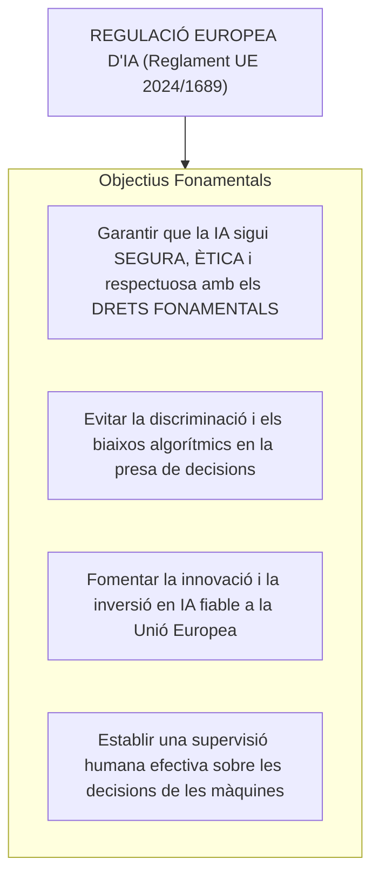
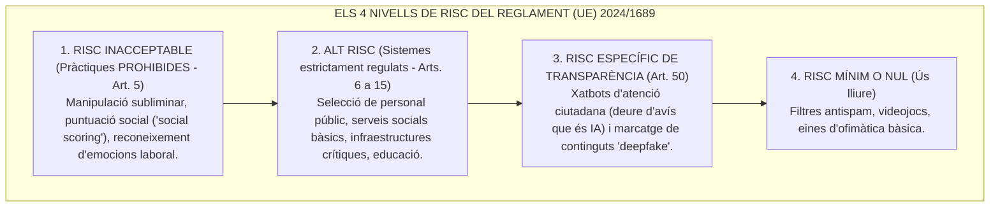
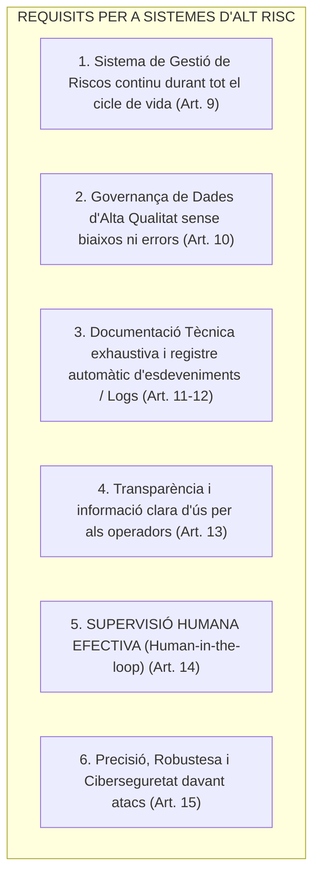

# Tema 90. El Reglament (UE) 2024/1689, conegut com a Llei d'IA de la UE

> **Font normativa de referència:** [`CORPUS/Reglament_IA.pdf`](file:///home/oriol/Projectes/OPOS/CORPUS/Reglament_IA.pdf)  
> **Text:** Reglament (UE) 2024/1689 del Parlament Europeu i del Consell, de 13 de juny de 2024, pel qual s'estableixen normes harmonitzades en matèria d'intel·ligència artificial (Llei d'Intel·ligència Artificial de la Unió Europea).

---

## 1. Objecte, Finalitat i Àmbit de la Llei d'IA de la UE

El **Reglament (UE) 2024/1689** és el primer marc jurídic exhaustiu i harmonitzat a nivell mundial que regula el desenvolupament, comercialització, posada en servei i utilització dels sistemes d'**Intel·ligència Artificial (IA)** a la Unió Europea.

---

## 2. La Piràmide de Classificació del Risc en la Llei d'IA

La Llei d'IA de la UE es basa en un **enfocament proporcional basat en el risc**, establint quatre nivells clarament diferenciats:

---

## 3. Pràctiques d'Intel·ligència Artificial Prohibides (Art. 5)

Estan **taxativament prohibides** a tota la Unió Europea les següents pràctiques d'IA per atemptar greument contra la dignitat humana i els drets fonamentals:

1. **Manipulació subliminar o enganyosa:** Sistemes d'IA que utilitzin tècniques subliminars o enganyoses per distorsionar el comportament d'una persona provocant-li un dany físic o psicològic.
2. **Explotació de vulnerabilitats:** Sistemes que s'aprofitin de l'edat (nens/gent gran), discapacitat o situació socioeconòmica per alterar el comportament de la persona de forma lesiva.
3. **Puntuació social pública (*Social Scoring*):** Avaluació o classificació de persones per part d'administracions públiques basada en el seu comportament social o característiques personals que condueixi a un tracte desfavorable o discriminatori en contextos no relacionats.
4. **Predicció policial de delictes basada en perfilats:** Sistemes d'IA utilitzats per predir si una persona cometrà un delicte basant-se exclusivament en trets de personalitat o perfilats sense fets provats.
5. **Reconeixement d'emocions en l'àmbit laboral o educatiu:** Ús d'IA per deduir emocions de treballadors públics en el seu lloc de treball o d'alumnes en centres escolars.
6. **Extracció no dirigida d'imatges facials (*Scraping*):** Creació o ampliació de bases de dades de reconeixement facial mitjançant la recopilació indiscriminada d'imatges d'Internet o càmeres de videovigilància.
7. **Categorització biomètrica sobre dades sensibles:** Classificació de persones físiques per deduir raça, opinions polítiques, afiliació sindical, conviccions religioses o orientació sexual.
8. **Identificació biomètrica remota «en temps real» en espais públics:** Prohibida com a regla general per a les forces de seguretat, llevat d'excepcions molt estrictes (segrest de víctimes, prevenció d'atemptats terroristes imminents o localització d'autors de delictes greus taxats) que requereixen **autorització judicial prèvia**.

---

## 4. Sistemes d'Intel·ligència Artificial d'Alt Risc (Arts. 6 a 15)

### 4.1. Àmbits d'Alt Risc en el Sector Públic Municipal (Annex III)
Són sistemes d'alt risc aquells utilitzats en àmbits amb un impacte potencial crític sobre els drets ciutadans:
- **Ocupació i gestió de recursos humans:** Eines d'IA per a la selecció, reclutament i cribratge de candidats en oposicions públiques, o per avaluar el rendiment laboral i promoció d'empleats.
- **Accés a serveis públics essencials i prestacions socials:** Sistemes d'IA utilitzats per l'Ajuntament per **avaluar la idoneïtat de les persones per accedir a prestacions de serveis socials bàsics**, ajuts econòmics o serveis d'urgència (bombers, policia local, emergències).
- **Gestió d'infraestructures crítiques:** Trànsit urbà, xarxa de proveïment d'aigua, gas o electricitat.
- **Educació:** Admissió d'alumnes a escoles bressol o centres educatius municipals.

---

### 4.2. Requisits Obligatoris per als Sistemes d'Alt Risc (Arts. 9 a 15)

> 🛡️ **El Principi de Supervisió Humana (*Human Oversight* - Art. 14):**  
> Els sistemes d'IA d'alt risc han d'estar dissenyats de manera que **puguin ser supervisats eficaçment per persones físiques** durant el seu ús. Els funcionaris responsables han de tenir la capacitat de comprendre les sortides de la IA, **ignorar-les, corregir-les o aturar el sistema en qualsevol moment**.

---

## 5. Deures de Transparència per a la Interacció Ciutadana (Art. 50)

1. **Xatbots i Assistents Virtuals d'Atenció Ciutadana:** L'Ajuntament ha de dissenyar els xatbots municipals de manera que s'informi expressament a la persona usuària que **està interactuant directament amb un sistema d'Intel·ligència Artificial** (llevat que sigui obvi pel context).
2. **Continguts Sintètics i *Deepfakes*:** Si es publiquen imatges, vídeos o àudios generats o manipulats per IA, han d'estar visiblement etiquetats com a contingut artificial i comptar amb un marcatge digital detectable per màquines.

---

## 6. Governança i Règim Sancionador

- **Òrgans de Governança:**
  - A nivell de la UE: L'**Oficina Europea d'IA (*AI Office*)** i el Comitè Europeu d'Intel·ligència Artificial.
  - A nivell estatal: L'**Agència Espanyola de Supervisió d'Intel·ligència Artificial (AESIA)**.
- **Règim Sancionador (Art. 99):** Preveu multes administratives dissuasives que poden assolir fins a **35 milions d'euros o el 7% del volum de negoci mundial** per a la utilització de pràctiques d'IA prohibides. En el cas d'administracions públiques, cada Estat membre estableix el règim sancionador disciplinari i administratiu adaptat.

---

## 7. Quadre Resum i Preguntes Típiques d'Examen Tipus Test

| Pregunta / Concepte Clau | Resposta Correcta / Trampa Freqüent |
| :--- | :--- |
| **Quina norma aprova la Llei d'Intel·ligència Artificial de la UE?** | El **Reglament (UE) 2024/1689** del Parlament Europeu i del Consell. |
| **Quina estructura de risc estableix el Reglament d'IA?** | **Risc Inacceptable (Prohibit), Alt Risc, Risc Específic de Transparència i Risc Mínim**. |
| **És legal el 'Social Scoring' (puntuació social pública)?** | **No, és una pràctica expressament PROHIBIDA** per l'article 5 del Reglament. |
| **Com es qualifica la IA utilitzada en selecció de personal públic?** | Com a sistema d'**ALT RISC** (Annex III). |
| **Com es qualifica la IA per valorar ajuts i serveis socials bàsics?** | Com a sistema d'**ALT RISC** (Annex III). |
| **Què exigeix el principi de supervisió humana (*human-in-the-loop*)?** | Que una persona humana pugui **comprendre, corregir, desestimar o aturar les decisions de la IA**. |
| **Quina obligació té l'Ajuntament quan utilitza un xatbot d'atenció ciutadana?** | **Informar a la ciutadania que està interactuant amb un sistema d'IA** (Art. 50). |
| **Quin organisme supervisa la IA a Espanya?** | L'**Agència Espanyola de Supervisió d'Intel·ligència Artificial (AESIA)**. |
