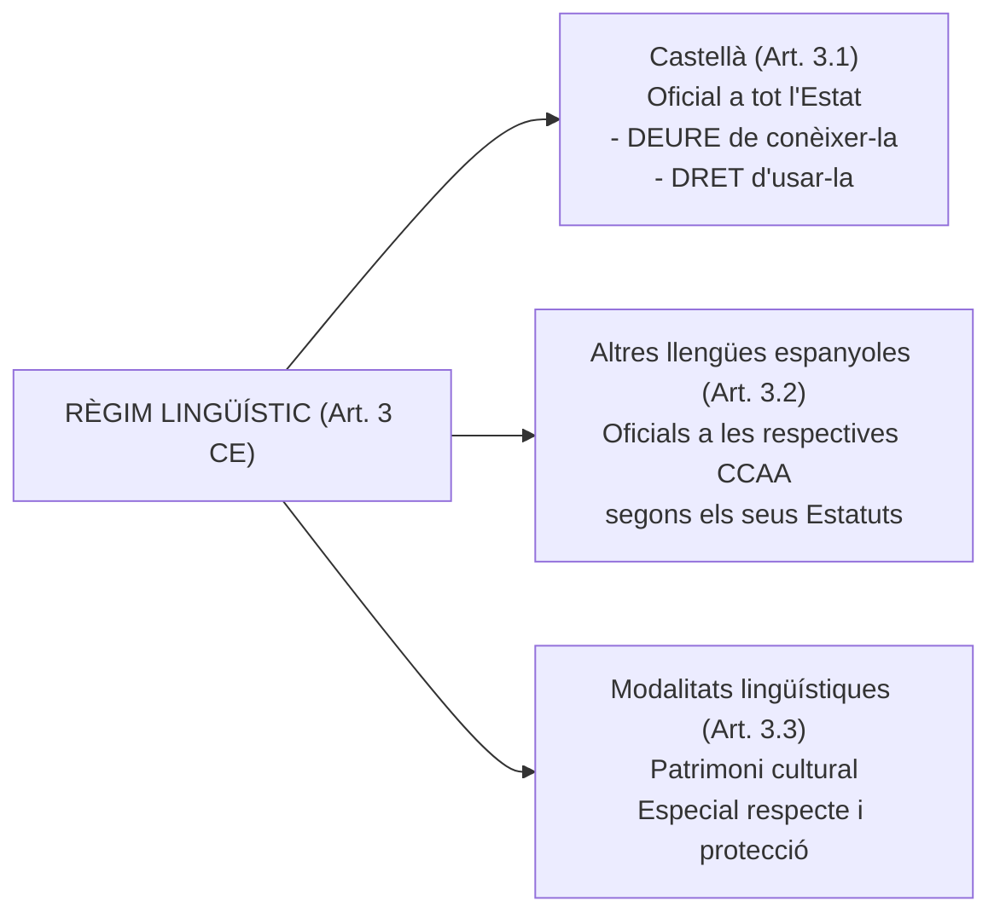

# Tema 1. La Constitució Espanyola de 1978: Estructura i principis fonamentals

> **Font normativa de referència:** [`CORPUS/consitucio_1978.pdf`](file:///home/oriol/Projectes/OPOS/CORPUS/consitucio_1978.pdf)  
> **Text:** Constitució Espanyola de 27 de desembre de 1978 (BOE núm. 311, de 29/12/1978). Text consolidat.

---

## 1. Context, gènesi i característiques de la Constitució Espanyola de 1978

### 1.1. Cronologia i dates clau d'aprovació
El procés constituent espanyol es va desenvolupar durant la Transició democràtica, a partir de la **Llei 1/1977, de 4 de gener, per a la Reforma Política**. Les Corts sorgides de les eleccions generals del 15 de juny de 1977 van assumir la tasca d'elaborar una nova carta magna a través d'una Ponència Constitucional formada per 7 membres (*els «pares de la Constitució»*).

| Data | Esdeveniment Constitucional | Òrgan / Subjecte |
| :--- | :--- | :--- |
| **31 d'octubre de 1978** | **Aprovació** del text constitucional en sessions plenàries separades. | Congrés dels Diputats i Senat (Corts Generals). |
| **6 de desembre de 1978** | **Ratificació** en referèndum nacional pel poble espanyol. | Cos electoral / Ciutadania espanyola. |
| **27 de desembre de 1978** | **Sanció i promulgació** de la Constitució. | El Rei Joan Carles I (davant les Corts Generals). |
| **29 de desembre de 1978** | **Publicació oficial** al BOE (núm. 311) i **entrada en vigor**. | Butlletí Oficial de l'Estat (i en les altres llengües d'Espanya). |

> ⚠️ **Atenció a preguntes de test:**
> - La Constitució **no** va entrar en vigor l'endemà de la seva publicació ni als 20 dies (*vacatio legis* ordinària), sinó **el mateix dia de la publicació al BOE (29/12/1978)** segons estableix la seva **Disposició Final**.

---

### 1.2. Característiques de la Constitució de 1978
1. **Escrita i codificada:** En un únic text articulat i sistemàtic.
2. **Extensa:** Amb 169 articles, és la segona constitució més llarga de la història d'Espanya (després de la Constitució de Cadis de 1812, que en tenia 384).
3. **Rígida:** Té procediments de reforma especialment reforçats (ordinari de l'art. 167 i agreujat de l'art. 168) per garantir la seva estabilitat i supremacia.
4. **Consensuada:** Fruit de l'acord entre les diverses forces polítiques i sensibilitats territorials.
5. **D'origen popular / democràtica:** Aprovada per Corts elegides per sufragi universal i ratificada pel poble en referèndum.
6. **Inacabada o oberta:** En matèria d'organització territorial (Títol VIII), va dissenyar un model descentralitzat obert (Estat de les Autonomies) el desenvolupament del qual es va remetre als Estatuts d'Autonomia.
7. **D'aplicabilitat directa i valor normatiu suprem:** És la norma fonamental de l'ordenament jurídic (art. 9.1 CE); vincula tots els poders públics i ciutadans, i no és una simple declaració d'intencions polítiques.

---

## 2. Estructura de la Constitució Espanyola de 1978

La Constitució Espanyola s'estructura formalment en:
- **1 Preàmbul** (sense força jurídica vinculant directa, però amb gran valor interpretatiu).
- **169 Articles**, distribuïts en un **Títol Preliminar** i **10 Títols numerats** (del I al X).
- **4 Disposicions Addicionals**.
- **9 Disposicions Transitòries**.
- **1 Disposició Derogatòria** (composta per 3 apartats).
- **1 Disposició Final**.

```mermaid
graph TD
    CE["CONSTITUCIÓ ESPANYOLA DE 1978 (169 Articles)"]
    
    subgraph ESTRUCTURA_FORMAL["Estructura Formal"]
        P["Preàmbul"]
        TP["Títol Preliminar (Arts. 1 - 9)"]
        TI["Títol I: Drets i deures fonamentals (Arts. 10 - 55)"]
        TII["Títol II: De la Corona (Arts. 56 - 65)"]
        TIII["Títol III: De les Corts Generals (Arts. 66 - 96)"]
        TIV["Títol IV: Del Govern i de l'Administració (Arts. 97 - 107)"]
        TV["Títol V: Relacions Govern - Corts Generals (Arts. 108 - 116)"]
        TVI["Títol VI: Del Poder Judicial (Arts. 117 - 127)"]
        TVII["Títol VII: Economia i Hisenda (Arts. 128 - 136)"]
        TVIII["Títol VIII: De l'Organització Territorial (Arts. 137 - 158)"]
        TIX["Títol IX: Del Tribunal Constitucional (Arts. 159 - 165)"]
        TX["Títol X: De la Reforma Constitucional (Arts. 166 - 169)"]
    end
    
    subgraph DISPOSICIONS["Disposicions"]
        DA["4 Disposicions Addicionals"]
        DT["9 Disposicions Transitòries"]
        DD["1 Disposició Derogatòria (3 apartats)"]
        DF["1 Disposició Final"]
    end

    CE --> P
    CE --> TP
    CE --> TI
    CE --> TII
    CE --> TIII
    CE --> TIV
    CE --> TV
    CE --> TVI
    CE --> TVII
    CE --> TVIII
    CE --> TIX
    CE --> TX
    CE --> DA
    CE --> DT
    CE --> DD
    CE --> DF
```

---

### 2.1. Divisió material: Part Dogmàtica vs. Part Orgànica

Tradicionalment, el contingut de la Constitució es divideix en dues grans parts:

1. **Part Dogmàtica:**
   - **Contingut:** Defineix els grans principis filosòfics, polítics i estructurals de l'Estat, els valors superiors de l'ordenament i la declaració de drets, llibertats i deures dels ciutadans.
   - **Abast:** Integrada pel **Preàmbul**, el **Títol Preliminar** (arts. 1 a 9) i el **Títol I** (arts. 10 a 55).

2. **Part Orgànica:**
   - **Contingut:** Regula l'estructura, composició, funcionament, atribucions i relacions entre els diferents òrgans i poders de l'Estat, l'organització territorial, l'ordre econòmic i financer, el Tribunal Constitucional i la reforma del propi text.
   - **Abast:** Integrada pels **Títols II al X** (arts. 56 a 169).

---

### 2.2. Taula sistemàtica dels Títols de la Constitució

| Títol | Denominació oficial | Articles | Contingut bàsic |
| :---: | :--- | :---: | :--- |
| **—** | **Preàmbul** | — | Proclama la voluntat de la Nació de garantir la convivència, consolidar l'Estat de Dret, protegir cultures i pobles, i promoure el progrés. |
| **Preliminar** | *Sense epígraf específic* | **1 – 9** | Definició de l'Estat, sobirania, valors superiors, monarquia parlamentària, unitat i autonomia, llengües, bandera, partits, sindicats, forces armades i principis de l'art. 9. |
| **Títol I** | **Dels drets i dels deures fonamentals** | **10 – 55** | Dignitat de la persona, drets fonamentals, llibertats públiques, deures ciutadans, principis rectors de la política social i econòmica, garanties i suspensió de drets. |
| **Títol II** | **De la Corona** | **56 – 65** | La figura del Rei (Cap de l'Estat), funcions, successió, regència, tutela i el referendament dels actes reials. |
| **Títol III** | **De les Corts Generals** | **66 – 96** | Poder legislatiu (bicameralisme: Congrés dels Diputats i Senat), elaboració de les lleis i tractats internacionals. |
| **Títol IV** | **Del Govern i de l'Administració** | **97 – 107** | Poder executiu i funció de govern, Administració Pública i Consell d'Estat. |
| **Títol V** | **De les relacions entre el Govern i les Corts Generals** | **108 – 116** | Responsabilitat política, moció de censura, qüestió de confiança, dissolució de les Corts i estats d'alarma, excepció i setge. |
| **Títol VI** | **Del Poder Judicial** | **117 – 127** | Exercici de la potestat jurisdiccional, jutges i magistrats, Consell General del Poder Judicial (CGPJ) i Ministeri Fiscal. |
| **Títol VII** | **Economia i Hisenda** | **128 – 136** | Subordinació de la riquesa a l'interès general, iniciativa pública, hisenda pública, pressupostos generals de l'Estat, estabilitat pressupostària (art. 135) i Tribunal de Comptes. |
| **Títol VIII** | **De l'organització territorial de l'Estat** | **137 – 158** | Principis generals, Administració local (municipis i províncies) i Comunitats Autònomes. |
| **Títol IX** | **Del Tribunal Constitucional** | **159 – 165** | Composició, competències (recurs d'inconstitucionalitat, qüestió d'inconstitucionalitat, recurs d'empara, conflictes de competència) i sentències. |
| **Títol X** | **De la reforma constitucional** | **166 – 169** | Iniciativa de reforma i procediments: ordinari (art. 167) i agreujat (art. 168). |

---

### 2.3. Estructura de les Disposicions

1. **4 Disposicions Addicionals:**
   - **1a:** Empara i respecta els drets històrics dels territoris forals.
   - **2a:** Declaració sobre la majoria d'edat foral (no aplicable a modificacions de règims forals).
   - **3a:** Modificació del règim econòmic i fiscal de les Illes Canàries.
   - **4a:** Audiències Territorials en l'àmbit de diverses CCAA.
2. **9 Disposicions Transitòries:**
   - Regulen el règim provisional de traspàs de poders, els règims preautonòmics existents, la iniciativa autonòmica diferida fins a les primeres eleccions locals, el cas especial de Navarra (DT 4a), Ceuta i Melilla (DT 5a), la durada de les Corts constituents (DT 8a) i la renovació per terços del Tribunal Constitucional (DT 9a).
3. **1 Disposició Derogatòria (3 apartats):**
   - **Apartat 1:** Deroga expressament la **Llei 1/1977, de Reforma Política**, i les Lleis Fonamentals del règim anterior (Fuero del Trabajo, Fuero de los Españoles, Ley Constitutiva de las Cortes, Ley de Sucesión, Ley de Principios del Movimiento Nacional, Ley Orgánica del Estado i Ley del Referéndum Nacional).
   - **Apartat 2:** Deroga les Lleis de 25 d'octubre de 1839 i de 21 de juliol de 1876 respecte a Àlaba, Guipúscoa i Biscaia.
   - **Apartat 3 (Clàusula derogatòria general o indeterminada):** Queden derogades totes les disposicions que s'oposin a allò que estableix la Constitució.
4. **1 Disposició Final:**
   - Estableix l'**entrada en vigor immediata el mateix dia de la seva publicació oficial al BOE** i la seva publicació en les altres llengües d'Espanya.

---

## 3. El Títol Preliminar: Principis Fonamentals (Articles 1 a 9)

El Títol Preliminar conté les decisions polítiques bàsiques, la definició del règim jurídic i institucional, i els principis estructurals de l'Estat.

---

### Article 1: Model d'Estat, Valors Superiors, Sobirania i Forma Política

> **Article 1.1:** *«Espanya es constitueix en un Estat social i democràtic de Dret, que propugna com a valors superiors del seu ordenament jurídic la llibertat, la justícia, la igualtat i el pluralisme polític.»*
> 
> **Article 1.2:** *«La sobirania nacional resideix en el poble espanyol, del qual emanen els poders de l'Estat.»*
> 
> **Article 1.3:** *«La forma política de l'Estat espanyol és la Monarquia parlamentària.»*

#### Anàlisi dels elements de l'Article 1:

1. **La triple dimensió de l'Estat:**
   - **Estat de Dret:** Submissió de tots els ciutadans i dels poders públics a l'imperi de la llei (principi de legalitat, separació de poders, reconeixement de drets fonamentals).
   - **Estat Democràtic:** Reconeixement de la sobirania popular, sufragi universal, pluralisme polític i participació ciutadana.
   - **Estat Social:** El poder públic intervé activament en la societat i l'economia per garantir la justícia social, el benestar i una redistribució equitativa (connectat amb l'art. 9.2 i el Capítol III del Títol I).

2. **Els 4 Valors Superiors de l'ordenament jurídic:**
   - 🌟 **Llibertat:** Autonomia individual, llibertats públiques i facultat d'actuació sense coaccions il·legítimes.
   - ⚖️ **Justícia:** Criteri orientador de les lleis i l'actuació judicial; donar a cadascú el que li correspon.
   - 🤝 **Igualtat:** Tant formal (art. 14 CE) com material i efectiva (art. 9.2 CE).
   - 🗳️ **Pluralisme Polític:** Reconeixement de la diversitat d'ideologies, opcions polítiques i associatives en la societat.
   *(Regla mnemotècnica:* **LJIP** -> **L**libertat, **J**ustícia, **I**gualtat, **P**luralisme polític*)*.

3. **Sobirania Nacional:**
   - Resideix de manera unitària en el **poble espanyol**. No hi ha sobiranies fragmentades o parcials. D'ell emanen tots els poders de l'Estat (legislatiu, executiu i judicial).

4. **Forma política:**
   - **Monarquia parlamentària:** El Rei és el Cap de l'Estat, però no té poder executiu ni legislatiu (*«el Rei regna, però no governa»*); els seus actes són degudament referendats i el Govern respon políticament davant les Corts Generals.

---

### Article 2: Unitat, Autonomia i Solidaritat

> **Article 2:** *«La Constitució es fonamenta en la indissoluble unitat de la Nació espanyola, pàtria comuna i indivisible de tots els espanyols, i reconeix i garanteix el dret a l'autonomia de les nacionalitats i de les regions que la integren i la solidaritat entre totes elles.»*

Aquest article combina tres principis fonamentals i indissociables:
1. **Principi d'unitat:** La Nació espanyola és pàtria comuna i indivisible.
2. **Principi d'autonomia:** Reconeixement del dret a l'autonomia tant de les *nacionalitats* com de les *regions* (autonomia política per a les Comunitats Autònomes, i autonomia administrativa per als ens locals).
3. **Principi de solidaritat:** Obligació de cooperació i equilibri econòmic i territorial interterritorial (desplegat als arts. 138 i 158 CE).

---

### Article 3: Règim Lingüístic

> **Article 3.1:** *«El castellà és la llengua espanyola oficial de l'Estat. Tots els espanyols tenen el deure de conèixer-la i el dret d'usar-la.»*
> 
> **Article 3.2:** *«Les altres llengües espanyoles seran també oficials en les respectives Comunitats Autònomes d'acord amb els seus Estatuts.»*
> 
> **Article 3.3:** *«La riquesa de les diferents modalitats lingüístiques d'Espanya és un patrimoni cultural que serà objecte d'especial respecte i protecció.»*

> ⚠️ **Pregunta clau de test:**
> - El **deure de coneixement** només està establert constitucionalment per al **castellà** (art. 3.1). Respecte a les llengües cooficials, el deure de coneixement requereix expressa regulació estatutària i circumscrita al seu territori.

---

### Article 4: La Bandera i els Símbols

> **Article 4.1:** *«La bandera d'Espanya és formada per tres franges horitzontals, vermella, groga i vermella; la groga és de doble amplada que la de cadascuna de les vermelles.»*
> 
> **Article 4.2:** *«Els Estatuts podran reconèixer banderes i ensenyes pròpies de les Comunitats Autònomes. Aquestes s'utilitzaran juntament amb la bandera d'Espanya en els seus edificis públics i en els seus actes oficials.»*

- Proporció de les franges: La franja central groga és de **doble amplada** que cadascuna de les dues franges vermelles.
- Ús simultani: Si una CA té bandera pròpia reconeguda estatutàriament, ha d'onejar **juntament amb la bandera d'Espanya** en edificis públics i actes oficials.

---

### Article 5: La Capital de l'Estat

> **Article 5:** *«La capital de l'Estat és la vila de Madrid.»*

- Fixa la capitalitat amb rang constitucional en la **vila** (i no ciutat) de Madrid.

---

### Article 6: Els Partits Polítics

> **Article 6:** *«Els partits polítics expressen el pluralisme polític, concorren a la formació i a la manifestació de la voluntat popular i són instrument fonamental per a la participació política. Podran ser creats i exerciran la seva activitat lliurement dins el respecte a la Constitució i a la llei. L'estructura interna i el funcionament hauran de ser democràtics.»*

- **Funcions constitucionals:**
  1. Expressar el pluralisme polític.
  2. Concorre a la formació i manifestació de la voluntat popular.
  3. Ser instrument fonamental per a la participació política.
- **Límits i requisits:**
  - Creació i activitat **lliures**, amb el límit del **respecte a la Constitució i a la llei**.
  - Exigència imperativa: **Estructura interna i funcionament democràtics**.

---

### Article 7: Sindicats i Associacions Empresarials

> **Article 7:** *«Els sindicats de treballadors i les associacions empresarials contribueixen a la defensa i a la promoció dels interessos econòmics i socials que els són propis. Podran ser creats i exerciran la seva activitat lliurement dins el respecte a la Constitució i a la llei. L'estructura interna i el funcionament hauran de ser democràtics.»*

- **Funció:** Defensa i promoció dels interessos econòmics i socials que els són propis.
- **Exigències idèntiques als partits:** Creació i activitat lliures (respecte a la CE i la llei) i **estructura interna i funcionament democràtics**.

---

### Article 8: Les Forces Armades

> **Article 8.1:** *«Les Forces Armades, constituïdes per l'Exèrcit de Terra, l'Armada i l'Exèrcit de l'Aire, tenen com a missió garantir la sobirania i la independència d'Espanya, defensar-ne la integritat territorial i l'ordenament constitucional.»*
> 
> **Article 8.2:** *«Una llei orgànica regularà les bases de l'organització militar de conformitat amb els principis de la present Constitució.»*

#### Composició i Missions:
- **Composició:**
  1. Exèrcit de Terra.
  2. Armada.
  3. Exèrcit de l'Aire.
- **Triple missió constitucional:**
  1. Garantir la **sobirania i independència** d'Espanya.
  2. Defensar la seva **integritat territorial**.
  3. Defensar l'**ordenament constitucional**.
- **Reserva legal:** Les bases de l'organització militar s'han de regular necessàriament mitjançant **Llei Orgànica**.

---

### Article 9: Principi de Legalitat, Igualtat Material i Garanties Jurídiques

L'article 9 és un dels articles més rellevants i preguntats de tot el text constitucional, dividit en 3 apartats fonamentals:

#### 1. Principi de subjecció a l'ordenament (Art. 9.1)
> *«Els ciutadans i els poders públics resten subjectes a la Constitució i a la resta de l'ordenament jurídic.»*
- Consagra el **principi de jerarquia suprema de la Constitució**: no només vincula els ciutadans, sinó especialment tots els poders públics (legislatiu, executiu i judicial).

#### 2. Principi d'igualtat material o clàusula d'acció transformadora (Art. 9.2)
> *«Correspon als poders públics de promoure les condicions per tal que la llibertat i la igualtat de l'individu i dels grups en els quals s'integra siguin reals i efectives; remoure els obstacles que n'impedeixin o en dificultin la plenitud i facilitar la participació de tots els ciutadans en la vida política, econòmica, cultural i social.»*
- Defineix l'essència de l'**Estat Social**: supera la mera igualtat formal davant la llei (art. 14 CE) per exigir als poders públics una actuació positiva (*acció positiva / discriminació inversa*) per remoure obstacles i fer reals la llibertat i la igualtat.

#### 3. Els 7 Principis de Garantia de l'Ordenament Jurídic (Art. 9.3)
> *«La Constitució garanteix el principi de legalitat, la jerarquia normativa, la publicitat de les normes, la irretroactivitat de les disposicions sancionadores no favorables o restrictives de drets individuals, la seguretat jurídica, la responsabilitat i la interdicció de l'arbitrarietat dels poders públics.»*

| Principi Constitucional | Significat i abast jurídic |
| :--- | :--- |
| **1. Principi de legalitat** | Tots els poders públics han d'actuar sotmesos a la llei i al Dret. L'Administració no pot actuar sense apoderament legal previ. |
| **2. Jerarquia normativa** | Les normes de rang inferior no poden contradir les de rang superior (Constitució > Llei > Reglament). |
| **3. Publicitat de les normes** | Tota norma ha de ser publicada oficialment (BOE, DOGC, BOP) perquè pugui entrar en vigor i ser coneguda pels ciutadans. |
| **4. Irretroactivitat de disposicions sancionadores no favorables o restrictives de drets individuals** | Les lleis que imposen sancions o limiten drets només s'apliquen cap al futur, mai cap al passat (a sensu contrario, es permet la retroactivitat de la norma penal o sancionadora més favorable). |
| **5. Seguretat jurídica** | Claredat, certesa i predictibilitat de l'ordenament jurídic perquè els ciutadans sàpiguen en tot moment a què atenir-se. |
| **6. Responsabilitat dels poders públics** | Els poders públics responen dels danys causats per les seves actuacions i del funcionament dels serveis públics (art. 106.2 CE). |
| **7. Interdicció de l'arbitrarietat** | Prohibició expressa que els poders públics actuïn per pur caprici o sense fonament objectiu i motivació jurídica. |

---

## 4. Visió panoràmica de la resta de Títols de la Constitució (Títols I a X)

### Títol I: Dels drets i dels deures fonamentals (Arts. 10 a 55)
- **Art. 10:** Dignitat de la persona com a fonament de l'ordre polític i pau social; interpretació segons la Declaració Universal de Drets Humans i tractats internacionals.
- **Capítol I (Arts. 11-13):** Dels espanyols i dels estrangers (majoria d'edat als 18 anys a l'art. 12; sufragi d'estrangers a l'art. 13.2).
- **Capítol II (Arts. 14-38):** Drets i llibertats.
  - **Art. 14:** Principi d'igualtat davant la llei.
  - **Secció 1a (Arts. 15-29):** Drets fonamentals i llibertats públiques (màxim nivell de protecció: recurs d'empara davant el TC, procediment judicial preferent i sumari, reserva de Llei Orgànica i reforma agreujada per l'art. 168).
  - **Secció 2a (Arts. 30-38):** Dels drets i deures dels ciutadans (reserva de llei ordinària i recurs d'inconstitucionalitat).
- **Capítol III (Arts. 39-52):** Principis rectors de la política social i econòmica (protecció de la família, salut, medi ambient, habitatge, pensions, discapacitat - art. 49, etc.). Només poden ser al·legats davant la jurisdicció ordinària d'acord amb el que disposin les lleis que els desenvolupin.
- **Capítol IV (Arts. 53-54):** De les garanties de les llibertats i drets fonamentals. L'article 54 crea la figura del **Defensor del Poble** com a alt comissionat de les Corts Generals.
- **Capítol V (Art. 55):** De la suspensió dels drets i llibertats (general en estats d'excepció i setge, o individual per a investigacions de terrorisme).

---

### Títol II: De la Corona (Arts. 56 a 65)
- **Art. 56:** El Rei és el Cap de l'Estat, símbol de la seva unitat i permanència; arbitra i modera el funcionament regular de les institucions. La seva persona és **inviolable i no està subjecta a responsabilitat**.
- **Art. 64:** **El referendament:** Els actes del Rei han de ser sempre referendats pel **President del Govern**, pels **Ministres competents** o pel **President del Congrés dels Diputats** (en la proposta i nomenament del President del Govern i en la dissolució de les Corts de l'art. 99). De l'acte del Rei en respon la persona que el referenda.

---

### Títol III: De les Corts Generals (Arts. 66 a 96)
- **Capítol I (Arts. 66-80):** De les Cambres (Congrés: entre 300 i 400 diputats, actualment 350 per la LOREG; Senat: cambra de representació territorial; elecció per 4 anys).
- **Capítol II (Arts. 81-92):** De l'elaboració de les lleis (Lleis Orgàniques - art. 81: desenvolupament de drets fonamentals i llibertats públiques, aprovació dels Estatuts d'Autonomia i règim electoral general, aprovades per majoria absoluta del Congrés; Decrets Legislatius - arts. 82-85; Decrets llei - art. 86; Referèndum consultiu - art. 92).
- **Capítol III (Arts. 93-96):** Dels Tractats Internacionals (Art. 93: autorització mitjançant Llei Orgànica per a cessió de competències derivades de la Constitució a organitzacions internacionals com la UE).

---

### Títol IV: Del Govern i de l'Administració (Arts. 97 a 107)
- **Art. 97:** El Govern dirigeix la política interior i exterior, l'Administració civil i militar i la defensa de l'Estat. Exercita la funció executiva i la potestat reglamentària.
- **Art. 103:** Principis de l'Administració Pública: serveix amb objectivitat els interessos generals i actua d'acord amb els principis d'**eficàcia, jerarquia, descentralització, desconcentració i coordinació**, amb submissió plena a la llei i al Dret.
- **Art. 107:** El **Consell d'Estat** és el suprem òrgan consultiu del Govern.

---

### Títol V: De les relacions entre el Govern i les Corts Generals (Arts. 108 a 116)
- **Art. 112:** Qüestió de confiança (la presenta el President del Govern prèvia deliberació del Consell de Ministres; requereix **majoria simple** del Congrés).
- **Art. 113:** Moció de censura (ha de ser proposada per almenys 1/10 part dels Diputats, ha d'incloure un candidat a la presidència [constructiva] i requereix **majoria absoluta** del Congrés).
- **Art. 116:** Regulació dels estats d'alarma, excepció i setge:
  - *Alarma:* Declarat pel Govern per Decret del Consell de Ministres (màxim 15 dies, pròrroga autoritzada pel Congrés).
  - *Excepció:* Declarat pel Govern prèvia autorització del Congrés (màxim 30 dies, prorrogable per altres 30).
  - *Setge:* Declarat per la **majoria absoluta del Congrés**, a proposta exclusiva del Govern.

---

### Títol VI: Del Poder Judicial (Arts. 117 a 127)
- **Art. 117:** La justícia emana del poble i s'administra en nom del Rei per Jutges i Magistrats integrants del poder judicial, que són **independents, inamovibles, responsables i sotmesos únicament a l'imperi de la llei**.
- **Art. 122:** El **Consell General del Poder Judicial (CGPJ)** és el seu òrgan de govern (format pel President del Tribunal Suprem i 20 vocals elegits per 5 anys).
- **Art. 124:** El **Ministeri Fiscal** té per missió promoure l'acció de la justícia en defensa de la legalitat, dels drets dels ciutadans i de l'interès públic; actua conforme als principis d'**unitat d'actuació i dependència jeràrquica**, amb subjecció a la legalitat i imparcialitat. El Fiscal General de l'Estat és nomenat pel Rei a proposta del Govern, sentit el CGPJ.

---

### Títol VII: Economia i Hisenda (Arts. 128 a 136)
- **Art. 128:** Tota la riquesa del país en les seves diferents formes està subordinada a l'interès general.
- **Art. 135:** Principi d'**estabilitat pressupostària** (totes les administracions públiques han d'adequar les seves actuacions al principi d'estabilitat pressupostària i no poden incórrer en un dèficit estructural que superi els límits establerts per la UE).
- **Art. 136:** El **Tribunal de Comptes** és el suprem òrgan fiscalitzador dels comptes i de la gestió econòmica de l'Estat i del sector públic.

---

### Títol VIII: De l'organització territorial de l'Estat (Arts. 137 a 158)
- **Art. 137:** L'Estat s'organitza territorialment en **municipis, províncies i Comunitats Autònomes** que es constitueixin. Totes aquestes entitats gaudeixen d'autonomia per a la gestió dels seus interessos respectius.
- **Capítol I (Arts. 137-139):** Principis generals (autonomia, solidaritat, igualtat de drets dels ciutadans a qualsevol part del territori nacional).
- **Capítol II (Arts. 140-142):** De l'Administració Local (garantia de l'autonomia municipal, govern i administració per l'Ajuntament format per Alcalde i Regidors, hisendes locals suficients).
- **Capítol III (Arts. 143-158):** De les Comunitats Autònomes (vies d'accés a l'autonomia, competències estatals exclusives de l'art. 149.1, competències assumibles de l'art. 148, control estatal i mecanisme de coerció de l'art. 155).

---

### Títol IX: Del Tribunal Constitucional (Arts. 159 a 165)
- **Art. 159:** Composició de **12 membres** nomenats pel Rei:
  - 4 a proposta del Congrés (majoria de 3/5).
  - 4 a proposta del Senat (majoria de 3/5).
  - 2 a proposta del Govern.
  - 2 a proposta del Consell General del Poder Judicial.
  - Mandat de **9 anys**, renovats per terceres parts (4 membres) cada 3 anys.
- **Art. 161:** Competències:
  - Recurs d'inconstitucionalitat contra lleis i disposicions normatives amb força de llei.
  - Recurs d'empara per violació dels drets i llibertats referits a l'art. 53.2 (arts. 14 a 29 i 30.2 CE).
  - Conflictes de competència entre l'Estat i les CCAA o d'aquestes entre si.

---

### Títol X: De la reforma constitucional (Arts. 166 a 169)
- **Art. 166:** La iniciativa de reforma constitucional correspon al Govern, al Congrés, al Senat i a les Assemblees de les CCAA (en els termes dels arts. 87.1 i 87.2 CE; queda exclosa la iniciativa legislativa popular de l'art. 87.3).
- **Art. 167: Procediment Ordinari:**
  - Per a reformes que no afectin les matèries reservades al procediment agreujat.
  - Aprovació per **3/5 de cadascuna de les Cambres** (Congrés i Senat).
  - Si no hi ha acord, es crea una Comissió mixta paritària de Diputats i Senadors.
  - Si no s'obté l'acord, el Congrés pot aprovar-la per **majoria de 2/3** sempre que el Senat hagi obtingut almenys la **majoria absoluta**.
  - **Referèndum potestatiu:** Se sotmetrà a referèndum si ho sol·licita **1/10 part dels membres de qualsevol de les Cambres** dins els 15 dies següents a l'aprovació definitiva.
- **Art. 168: Procediment Agreujat:**
  - S'aplica quan es proposa la **revisió total** de la Constitució o una **revisió parcial que afecti el Títol Preliminar, la Secció 1a del Capítol II del Títol I (Arts. 15 a 29) o el Títol II (De la Corona)**.
  - Fases:
    1. Aprovació del principi de reforma per **majoria de 2/3 de cadascuna de les Cambres**.
    2. **Dissolució immediata de les Corts Generals**.
    3. Les noves Cambres elegides han de **ratificar la decisió** (per majoria simple al Congrés i absoluta al Senat segons reglaments de les Cambres) i procedir a l'estudi del nou text.
    4. Aprovació del nou text constitucional per **majoria de 2/3 de cadascuna de les noves Cambres**.
    5. **Referèndum preceptiu i vinculant:** Un cop aprovada per les Corts, la reforma serà sotmesa inexcusablement a referèndum per a la seva ratificació.
- **Art. 169:** Límit temporal: **No es pot iniciar cap reforma constitucional en temps de guerra o de vigència d'algun dels estats de l'art. 116** (alarma, excepció o setge).

---

## 5. Les Reformes Constitucionals realitzades

Des de la seva promulgació el 1978, la Constitució Espanyola ha estat reformada en 4 ocasions (totes elles pel procediment ordinari de l'art. 167):

1. **Reforma de l'article 13.2 (1992):**
   - **Objectiu:** Adaptació al Tractat de Maastricht de la Unió Europea.
   - **Contingut:** S'afegeix l'expressió **«i passiu»**, permetent als ciutadans comunitaris residents a Espanya ser electors (sufragi actiu) i elegibles (sufragi passiu) en les eleccions municipals.
2. **Reforma de l'article 135 (2011):**
   - **Objectiu:** Garantir la disciplina fiscal i estabilitat financera davant la crisi del deute sobirà a la zona euro.
   - **Contingut:** Consagració del **principi d'estabilitat pressupostària** i prioritat absoluta del pagament del deute públic i els seus interessos.
3. **Reforma de l'article 49 (2024):**
   - **Objectiu:** Dignificació i actualització del tractament constitucional de les persones amb discapacitat.
   - **Contingut:** Eliminació del terme anacrònic «disminuïts físics, sensorials i psíquics», substituint-lo per **«persones amb discapacitat»**, i adaptant la protecció dels seus drets als estàndards internacionals de la Convenció de l'ONU.
4. **Reforma de l'article 69.3 (2026):**
   - **Objectiu:** Actualització de la representació al Senat de les circumscripcions insulars.

---

## 6. Quadre Resum i Preguntes Típiques d'Examen Tipus Test

| Concepte / Pregunta | Resposta Correcta / Clau de Test |
| :--- | :--- |
| **Quins són els 4 valors superiors de l'ordenament jurídic?** | **Llibertat, Justícia, Igualtat i Pluralisme polític** (Art. 1.1 CE). *(No confondre amb principis de l'art. 9.3)*. |
| **On resideix la sobirania nacional?** | En el **poble espanyol**, del qual emanen els poders de l'Estat (Art. 1.2 CE). |
| **Quina és la forma política de l'Estat espanyol?** | **Monarquia parlamentària** (Art. 1.3 CE). |
| **En què es fonamenta la Constitució?** | En la **indissoluble unitat de la Nació espanyola**, pàtria comuna i indivisible de tots els espanyols (Art. 2 CE). |
| **Quin deure lingüístic estableix la Constitució?** | El deure de conèixer el **castellà** (Art. 3.1 CE). Per a les altres llengües no hi ha deure constitucional directe sinó remissió als Estatuts. |
| **Com és la franja groga de la bandera d'Espanya?** | De **doble amplada** que cadascuna de les dues franges vermelles (Art. 4.1 CE). |
| **Quina és la capital de l'Estat?** | La **vila** de Madrid (Art. 5 CE). |
| **Què exigeix la CE a partits, sindicats i patronals?** | Que la seva **estructura interna i funcionament siguin democràtics** (Arts. 6 i 7 CE). |
| **Quines són les missions de les Forces Armades?** | Garantir la **sobirania i independència**, defensar la **integritat territorial** i l'**ordenament constitucional** (Art. 8.1 CE). |
| **Quins principis garanteix l'Article 9.3 CE?** | 1. Legalitat, 2. Jerarquia normativa, 3. Publicitat de les normes, 4. Irretroactivitat de disposicions sancionadores no favorables o restrictives de drets, 5. Seguretat jurídica, 6. Responsabilitat, 7. Interdicció de l'arbitrarietat. |
| **Quantes disposicions té la CE en total?** | **15 disposicions**: 4 Addicionals + 9 Transitòries + 1 Derogatòria + 1 Final. |
| **Quan va entrar en vigor la Constitució?** | El **29 de desembre de 1978**, el mateix dia de la seva publicació oficial al BOE. |
| **Quines matèries exigeixen el procediment agreujat (Art. 168)?** | Revisió total, o revisió parcial de: **Títol Preliminar**, **Secció 1a del Capítol II del Títol I (Arts. 15-29)** o **Títol II (De la Corona)**. |
