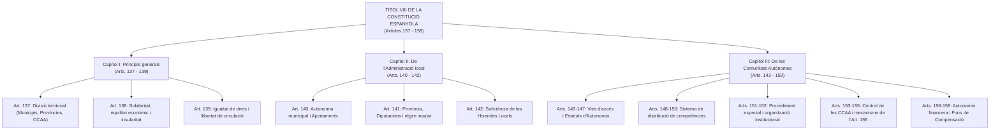
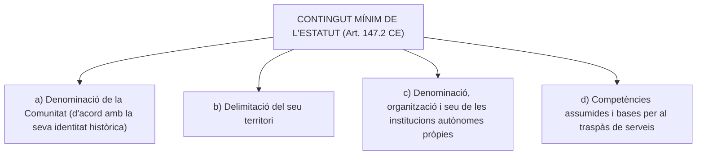
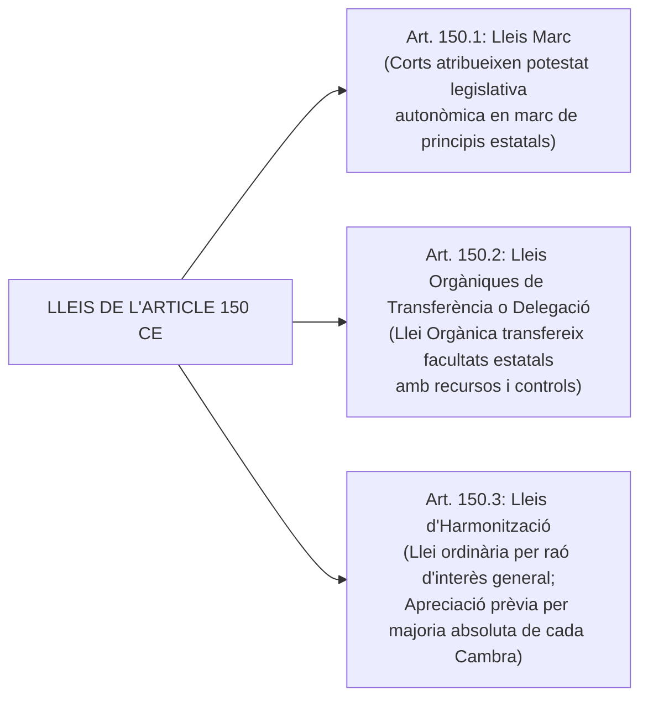
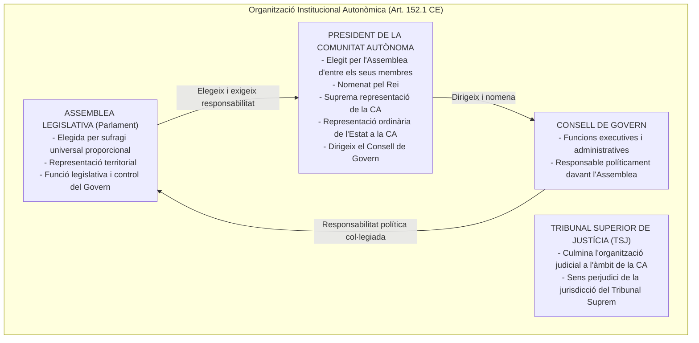
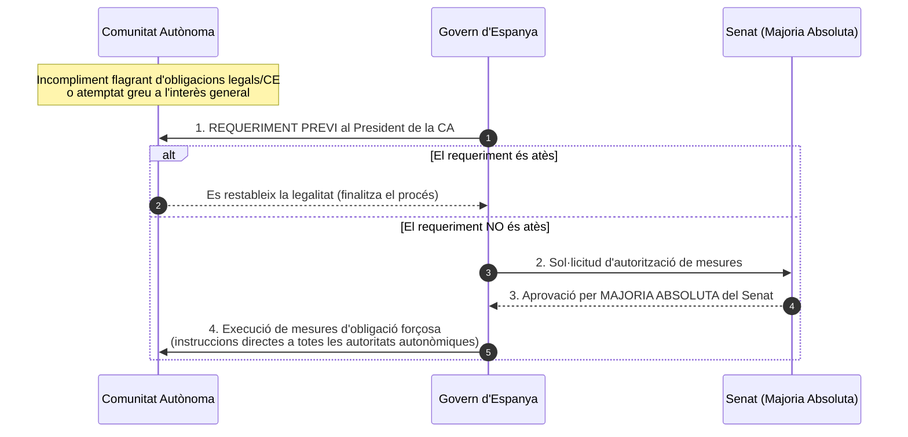

# Tema 2. Títol VIII de la Constitució Espanyola de 1978: L'organització territorial de l'Estat

> **Font normativa de referència:** [`CORPUS/consitucio_1978.pdf`](file:///home/oriol/Projectes/OPOS/CORPUS/consitucio_1978.pdf)  
> **Text:** Constitució Espanyola de 1978, Títol VIII (*Articles 137 a 158*). Text consolidat.

---

## 1. Principis Generals de l'Organització Territorial de l'Estat (Arts. 137 a 139 CE)

El Títol VIII de la Constitució Espanyola (CE) defineix el model d'organització territorial d'Espanya, conegut doctrinalment com l'**Estat de les Autonomies**. Aquest model és un sistema descentralitzat intermedi entre l'estat unitari centralitzat i l'estat federal, caracteritzat per la seva flexibilitat i naturalesa oberta.

---

### 1.1. L'estructura territorial i el principi d'autonomia (Art. 137 CE)
> **Article 137:** *«L'Estat s'organitza territorialment en municipis, en províncies i en les Comunitats Autònomes que es constitueixin. Totes aquestes entitats gaudeixen d'autonomia per a la gestió dels interessos respectius.»*

- **Triple nivell territorial:** Municipis, Províncies i Comunitats Autònomes.
- **Principi d'autonomia:** Es reconeix a tots tres nivells per a la gestió dels seus interessos propis:
  - **Autonomia local (Municipis i Províncies):** Autonomia de caràcter *administratiu* i de gestió (no disposen de potestat legislativa pròpia, sinó reglamentària).
  - **Autonomia de les Comunitats Autònomes:** Autonomia de caràcter *polític i institucional* (disposen de potestat legislativa a través dels seus Parlaments, a més d'executiva i reglamentària).

---

### 1.2. El principi de solidaritat, l'equilibri econòmic i el fet insular (Art. 138 CE)
> **Article 138.1:** *«L'Estat garanteix la realització efectiva del principi de solidaritat consagrat en l'article 2 de la Constitució, vetllant per l'establiment d'un equilibri econòmic adequat i just entre les diverses parts del territori espanyol, i atenent assenyaladament les circumstàncies del fet insular.»*
> 
> **Article 138.2:** *«Les diferències entre els Estatuts de les diverses Comunitats Autònomes no podran implicar en cap cas privilegis econòmics o socials.»*

- **Garantia estatal:** Correspon a l'Estat vetllar per l'equilibri interterritorial just.
- **Fet insular:** La CE obliga a una atenció expressa a les circumstàncies pròpies de les illes (Balears i Canàries).
- **Prohibició de privilegis:** La diversitat estatutària i competencial és legítima, però **mai no pot traduir-se en privilegis econòmics o socials**.

---

### 1.3. Igualtat de drets i unitat de mercat (Art. 139 CE)
> **Article 139.1:** *«Tots els espanyols tenen els mateixos drets i les mateixes obligacions en qualsevol part del territori de l'Estat.»*
> 
> **Article 139.2:** *«Cap autoritat podrà adoptar mesures que directament o indirectament obstaculitzin la llibertat de circulació i d'establiment de les persones i la lliure circulació de béns per tot el territori espanyol.»*

- **Igualtat bàsica:** Garanteix que la descentralització autonòmica no provoqui discriminacions en l'estatut bàsic de la ciutadania.
- **Unitat de mercat:** Prohibició absoluta d'imposar barreres fiscals, duaneres o administratives interiors que fragmentin el mercat o limitin la lliure circulació de persones i mercaderies.

---

## 2. L'Administració Local (Arts. 140 a 142 CE)

El Capítol II del Títol VIII estableix la garantia institucional de l'autonomia local, centrada en el municipi i la província.

---

### 2.1. El Municipi i el govern municipal (Art. 140 CE)
> **Article 140:** *«La Constitució garanteix l'autonomia dels municipis, els quals gaudiran de personalitat jurídica plena. El govern i l'administració municipal corresponen als respectius ajuntaments, integrats pels batlles i els regidors. Els regidors seran elegits pels veïns del municipi mitjançant sufragi universal igual, lliure, directe i secret, en la forma establerta per la llei. Els batlles seran elegits pels regidors o pels veïns. La llei regularà les condicions en què sigui procedent el règim de consell obert.»*

#### Elements clau del règim municipal:
1. **Personalitat jurídica:** Els municipis gaudeixen de **personalitat jurídica plena**.
2. **Òrgan de govern ordinari:** L'**Ajuntament**, format pel **Batlle/Alcalde** i els **Regidors**.
3. **Elecció dels Regidors:** Directament pels veïns mitjançant sufragi universal, igual, lliure, directe i secret.
4. **Elecció de l'Alcalde:** La CE preveu dues fórmules que la llei electoral (LOREG) concreta:
   - Elegit pels **regidors** (sistema ordinari a Espanya).
   - Elegit directament pels **veïns** (ex. municipis de menys de 250 habitants o consell obert).
5. **Règim de Consell Obert:** Règim especial de democràcia directa municipal (municipis de molt petita població o amb tradició singular) on el govern i l'administració corresponen a un Alcalde i una assemblea veïnal de tots els electors.

---

### 2.2. La Província, les illes i altres entitats locals (Art. 141 CE)
> **Article 141.1:** *«La província és una entitat local amb personalitat jurídica pròpia, determinada per l'agrupació de municipis i la divisió territorial per al compliment de les activitats de l'Estat. Qualsevol alteració dels límits provincials haurà de ser aprovada per les Corts Generals per mitjà d'una llei orgànica.»*
> 
> **Article 141.2:** *«El govern i l'administració autònoma de les províncies seran encomanats a Diputacions o altres Corporacions de caràcter representatiu.»*
> 
> **Article 141.3:** *«Es podran crear agrupacions de municipis diferents de la província.»*
> 
> **Article 141.4:** *«En els arxipèlags, les illes tindran, a més, administració pròpia en forma de Cabildos o Consells.»*

#### Anàlisi de la Província i altres ens:
- **Doble naturalesa jurídica de la província:**
  1. És una **entitat local** amb personalitat jurídica pròpia (agrupació de municipis).
  2. És una **divisió territorial** per al compliment de les activitats i serveis de l'Estat.
- **Alteració de límits provincials:** Requereix de forma preceptiva una **Llei Orgànica aprovada per les Corts Generals**.
- **Govern i administració:** Encomanat a les **Diputacions Provincials** (a les comunitats autònomes uniprovincials com Madrid, Astúries, Múrcia, Cantàbria, La Rioja i Navarra, les institucions autonòmiques assumeixen les funcions de la Diputació).
- **Altres ens locals (Art. 141.3):** Permet la creació de comarques, mancomunitats i àrees metropolitanes.
- **Règim insular (Art. 141.4):**
  - Illes Canàries: **Cabildos Insulars**.
  - Illes Balears: **Consells Insulars**.

---

### 2.3. Les Hisendes Locals i el principi de suficiència (Art. 142 CE)
> **Article 142:** *«Les Hisendes locals hauran de disposar dels mitjans suficients per a l'exercici de les funcions que la llei atribueix a les Corporacions respectives, i es nodriran fonamentalment de tributs propis i de la participació en els de l'Estat i en els de les Comunitats Autònomes.»*

- **Principi de suficiència financera:** Mandat constitucional als poders públics per dotar els municipis i províncies de recursos econòmics proporcionats a les competències encomanades.
- **Fonts fonamentals de finançament:**
  1. **Tributs propis:** Impostos, taxes i contribucions especials de caràcter local (desenvolupats pel TRLRHL).
  2. **Participació en tributs de l'Estat:** Participació en els tributs generals (PIE).
  3. **Participació en tributs de les Comunitats Autònomes.**

---

## 3. Les Comunitats Autònomes: Vies d'Accés i Estatuts (Arts. 143 a 147 CE)

### 3.1. Els subjectes legitimats per a l'autonomia (Art. 143.1 CE)
Tenen dret a constituir-se en Comunitat Autònoma:
1. Les **províncies limítrofes** amb característiques històriques, culturals i econòmiques comunes.
2. Els **territoris insulars**.
3. Les **províncies d'entitat regional històrica**.

---

### 3.2. Comparativa de les Vies d'Accés a l'Autonomia

| Característica | Via Ordinària o Lenta (Art. 143 CE) | Via Especial o Ràpida (Art. 151 CE) |
| :--- | :--- | :--- |
| **Iniciativa autonòmica** | - Totes les **Diputacions** provincials interessades (o òrgan interinsular). - **2/3 dels municipis** la població dels quals representi la majoria del cens electoral de cada província o illa. | - Totes les **Diputacions** (o òrgan interinsular). - **3/4 dels municipis** que representin la majoria del cens electoral. - **Referèndum d'iniciativa** aprovat per majoria absoluta del cens de cada província. |
| **Termini d'iniciativa** | **6 mesos** des del primer acord d'una corporació local. | **6 mesos** des del primer acord. |
| **Si la iniciativa fracassa** | S'ha d'esperar un termini de **5 anys** per repetir-la (Art. 143.3 CE). | S'ha d'esperar **5 anys** (o tramitar per via ordinària). |
| **Elaboració de l'Estatut** | **Assemblea de Parlamentaris i Diputats Provincials** (Art. 146 CE): membres de les Diputacions + Diputats i Senadors elegits en aquestes circumscripcions. S'eleva a les Corts i es tramita com a llei. | **Assemblea de Parlamentaris** (Diputats i Senadors de l'àmbit territorial) aprovat per majoria absoluta (Art. 151.2 CE). |
| **Aprovació definitiva** | Tramitació de llei orgànica a les Corts Generals (sense referèndum ciutadà d'aprovació). | 1. Examen conjunt amb la Comissió Constitucional del Congrés (2 mesos). 2. **Referèndum del cos electoral** aprovat per majoria de vots vàlids. 3. **Ratificació per les Corts Generals**. 4. Sanció i promulgació pel Rei. |
| **Nivell competencial inicial** | **Limitat:** Només les competències de l'art. 148 CE. Cal esperar **5 anys** i reformar l'Estatut per assumir les competències de l'art. 149 CE (Art. 148.2 CE). | **Màxim:** Podien assumir des del primer moment el màxim nivell competencial (art. 148 i matèries no exclusives de l'art. 149.1 CE) sense esperar els 5 anys. |
| **Comunitats que la van seguir** | La majoria de CCAA (ex. Aragó, Castella i Lleó, Castella-la Manxa, Extremadura, etc.). | **Andalusia** (única per referèndum de l'art. 151) i Catalunya, País Basc i Galícia per la **DT 2a CE**. |

> 📌 **La Disposició Transitòria Segona (DT 2a CE):**  
> Els territoris que en el passat haguessin plebiscitat afirmativament projectes d'Estatut d'Autonomia durant la II República i tinguessin règim provisional d'autonomia (**Catalunya, País Basc i Galícia**) no van haver de complir els requisits d'iniciativa de l'art. 151.1; en van tenir prou amb l'acord per majoria absoluta dels seus òrgans preautonòmics col·legiats i van tramitar l'Estatut directament pel procediment de l'art. 151.2 CE.

---

### 3.3. Supòsits especials d'actuació de les Corts Generals (Art. 144 CE)
Per motius d'**interès nacional**, les Corts Generals, mitjançant **Llei Orgànica**, poden:
1. **Autoritzar la constitució d'una CA uniprovincial** que no reuneixi les condicions de l'art. 143.1 (ex. cas de la *Comunitat de Madrid*).
2. **Autoritzar o acordar un Estatut d'Autonomia** per a territoris que no estiguin integrats en l'organització provincial (ex. *Ceuta i Melilla* - regulades també per la DT 5a CE).
3. **Substituir la iniciativa de les Corporacions locals** de l'art. 143.2 (cas d'*Almeria* per desbloquejar la constitució d'Andalusia).

---

### 3.4. Relacions entre Comunitats Autònomes (Art. 145 CE)
- **Prohibició de federació (Art. 145.1):** *«En cap cas s'admetrà la federació de Comunitats Autònomes.»*
- **Convenis i Acords de cooperació (Art. 145.2):**
  - **Convenis de gestió i prestació de serveis propis:** Previstos als Estatuts; només requereixen **comunicació a les Corts Generals**.
  - **Acords de cooperació:** Requereixen la **previa autorització de les Corts Generals**.

---

### 3.5. Contingut i reforma dels Estatuts d'Autonomia (Art. 147 CE)
Els Estatuts d'Autonomia són la **norma institucional bàsica** de cada Comunitat Autònoma i l'Estat els reconeix i empara com a part integrant del seu ordenament jurídic.

#### Contingut mínim obligatori (Art. 147.2 CE):

#### Reforma dels Estatuts (Art. 147.3 i 152.2 CE):
- S'ajustarà als procediments que els mateixos Estatuts estableixin.
- Requereix inexcusablement l'**aprovació de les Corts Generals mitjançant Llei Orgànica**.
- En els Estatuts de la via especial (Art. 152.2 / DT 2a), és **obligatori a més el referèndum** dels electors inscrits al cens de la Comunitat.

---

## 4. El Sistema de Distribució de Competències (Arts. 148 a 150 CE)

El repartiment competencial es construeix sobre el principi de disposició i el sistema de doble llista (arts. 148 i 149 CE).

### 4.1. Tipologia de competències
1. **Competències exclusives:** Un únic subjecte (l'Estat o la CA) ostenta la potestat legislativa, la reglamentària i la funció executiva sobre tota la matèria.
2. **Competències compartides:**
   - **L'Estat:** Dicta la **legislació bàsica** (o bases) per garantir un tractament comú o homogeni a tot el territori.
   - **La Comunitat Autònoma:** Dicta la **legislació de desenvolupament** i la normativa reglamentària, i assumeix la **gestió executiva**.
3. **Competències d'execució:** L'Estat té tota la potestat legislativa (bàsica i de desenvolupament) i reglamentària, i la Comunitat Autònoma només assumeix l'execució administrativa i gestió dels serveis.

---

### 4.2. Competències assumibles per les CCAA (Art. 148 CE)
L'article 148.1 enumera **22 matèries** que les Comunitats Autònomes podien assumir inicialment (ex. organització de les seves institucions, ordenació del territori, urbanisme i habitatge, obres públiques d'interès de la CA, carreteres de l'àmbit autonòmic, agricultura i ramaderia, fires interiors, patrimoni monumental d'interès autonòmic, cultura, turisme, esports, assistència social, sanitat i higiene, etc.).
- **La clàusula dels 5 anys (Art. 148.2 CE):** Transcorreguts cinc anys, i mitjançant la reforma dels seus Estatuts, les Comunitats de la via ordinària podien anar ampliant successivament les seves competències en les matèries no reservades en exclusiva a l'Estat a l'art. 149.1 CE.

---

### 4.3. Competències exclusives de l'Estat (Art. 149.1 CE)
L'article 149.1 estableix **32 matèries reservades a l'Estat**, entre les quals destaquen per a l'àmbit administratiu i d'oposicions:

| Número | Matèria reservada a l'Estat (Art. 149.1 CE) |
| :---: | :--- |
| **1a** | Regulació de les condicions bàsiques que garanteixin la **igualtat de tots els espanyols** en l'exercici dels drets i en el compliment dels deures constitucionals. |
| **2a** | Nacionalitat, immigració, emigració, estrangeria i dret d'asil. |
| **3a** | Relacions internacionals. |
| **4a** | Defensa i Forces Armades. |
| **5a** | Administració de Justícia. |
| **6a** | Legislació mercantil, penal i penitenciària; legislació processal (sens perjudici de les necessàries especialitats del dret substantiu autonòmic). |
| **7a** | Legislació laboral (sens perjudici de la seva execució pels òrgans de les CCAA). |
| **8a** | Legislació civil (sens perjudici de la conservació, modificació i desenvolupament del dret civil foral o especial on existeixi). |
| **14a** | Hisenda general i Deute de l'Estat. |
| **17a** | **Legislació bàsica i règim econòmic de la Seguretat Social** (sens perjudici de l'execució de serveis per les CCAA). |
| **18a** | **Les bases del règim jurídic de les Administracions Públiques** i del **règim estatutari dels seus funcionaris**; el **procediment administratiu comú**; legislació sobre **expropiació forçosa**; legislació bàsica sobre **contractes i concessions administratives** i el sistema de **responsabilitat de totes les administracions públiques**. |
| **23a** | Legislació bàsica sobre **protecció del medi ambient**, monts, aprofitaments forestals i vies ramaderes. |
| **29a** | **Seguretat pública** (sens perjudici de la creació de policies per les CCAA segons els seus Estatuts en el marc d'una LO). |
| **30a** | Regulació de condicions d'obtenció, expedició i homologació de **títols acadèmics i professionals** i normes bàsiques d'educació (art. 27 CE). |
| **32a** | Autorització per a la convocatòria de **consultes populars per via de referèndum**. |

---

### 4.4. Les Clàusules de Tancament del Sistema Competencial (Art. 149.3 CE)
Per evitar llacunes en el repartiment competencial, l'art. 149.3 CE conté tres regles essencials:

1. **Clàusula Residual:**
   - Les matèries no atribuïdes expressament a l'Estat poden correspondre a les CCAA en virtut dels seus Estatuts.
   - Les matèries no assumides pels Estatuts d'Autonomia **corresponen a l'Estat**.
2. **Clàusula de Prevalença:**
   - Les normes de l'Estat prevalen, en cas de conflicte, sobre les de les CCAA en tot allò que **no estigui atribuït a la competència exclusiva d'aquestes darreres**.
3. **Clàusula de Supletorietat:**
   - **El Dret estatal és, en qualsevol cas, supletori del Dret de les Comunitats Autònomes**.

---

### 4.5. Les Lleis de l'Article 150 CE: Ampliació, Delegació i Harmonització

1. **Lleis Marc (Art. 150.1 CE):**
   - Les Corts Generals, en matèries estatals, poden facultar a totes o algunes CCAA per dictar normes legislatives seguint els principis, bases i directrius d'una llei estatal. La llei estableix el control parlamentari de les Corts.
2. **Lleis Orgàniques de Transferència o Delegació (Art. 150.2 CE):**
   - L'Estat pot transferir o delegar a les CCAA, mitjançant **Llei Orgànica**, facultats sobre matèries estatals susceptibles de transferència.
   - Aquesta llei ha de preveure la **transferència dels mitjans financers** corresponents i les formes de control que l'Estat es reserva.
3. **Lleis d'Harmonització (Art. 150.3 CE):**
   - L'Estat pot dictar lleis per harmonitzar disposicions normatives de les CCAA (fins i tot sobre competències exclusives autonòmiques) quan ho exigeixi l'**interès general**.
   - **Requisit procedimental:** La necessitat d'harmonitzar ha de ser apreciada per la **majoria absoluta de cadascuna de les Cambres (Congrés i Senat)**.

---

## 5. L'Organització Institucional de les Comunitats Autònomes (Art. 152 CE)

L'article 152.1 CE estableix el patró organitzatiu institucional (obligatori per a les CCAA de la via especial, però adoptat per totes les CCAA als seus respectius Estatuts):

- **El President de la Comunitat Autònoma:**
  - Ha de ser obligatòriament **diputat de l'Assemblea Legislativa**.
  - És elegit per l'Assemblea i **nomenat formalment pel Rei**.
  - Ostenta una **doble condició representativa**:
    1. La **suprema representació** de la Comunitat Autònoma.
    2. La **representació ordinària de l'Estat** dins d'aquesta.
  - Dirigeix el Consell de Govern i respon políticament davant l'Assemblea.
- **El Tribunal Superior de Justícia (TSJ):**
  - Culmina l'organització judicial en el territori de la Comunitat Autònoma.
  - El Poder Judicial a Espanya és **únic** (no existeix un poder judicial autonòmic separat; els jutges pertanyen a un cos únic estatal). Les instàncies processals s'esgoten davant els òrgans radicats a la CA, sens perjudici de la jurisdicció del Tribunal Suprem (art. 123 CE).

---

## 6. Control de l'Activitat de les Comunitats Autònomes (Arts. 153 a 155 CE)

### 6.1. Controls ordinaris (Art. 153 CE)
El control sobre els òrgans de les CCAA és exercit per òrgans específics segons la naturalesa de l'acte:

| Òrgan de Control | Àmbit / Matèria objecte de control |
| :--- | :--- |
| **Tribunal Constitucional** | Constitucionalitat de les seves **disposicions normatives amb força de llei** (lleis autonòmiques i decrets legislatius). |
| **Govern de l'Estat** (previ dictamen del Consell d'Estat) | Exercici de **funcions delegades** per la via de l'art. 150.2 CE. |
| **Jurisdicció Contenciosa Administrativa** | Actuació de l'**administració autonòmica** i les seves **normes reglamentàries** (decrets i ordres). |
| **Tribunal de Comptes** | Aspectes **econòmics i pressupostaris** de la Comunitat Autònoma. |

---

### 6.2. La figura del Delegat del Govern (Art. 154 CE)
> **Article 154:** *«Un Delegat nomenat pel Govern dirigirà l'Administració de l'Estat en el territori de la Comunitat Autònoma i la coordinarà, si és procedent, amb l'Administració pròpia de la Comunitat.»*

- Nomenat i separat lliurement pel **Govern d'Espanya** (Consell de Ministres per Reial Decret).
- Té rang de Sotssecretari i seu a la localitat on tingui la seu el Consell de Govern de la CA (o on fixi l'Estatut).

---

### 6.3. El mecanisme de coacció estatal o control extraordinari (Art. 155 CE)
> **Article 155.1:** *«Si una Comunitat Autònoma no complia les obligacions que la Constitució o altres lleis li imposin, o actuava de forma que atemptés greument contra l'interès general d'Espanya, el Govern, previ requeriment fet al President de la Comunitat Autònoma i en el cas de no ser atès, amb l'aprovació per majoria absoluta del Senat, podrà adoptar les mesures necessàries per tal d'obligar-la al compliment forçós de les dites obligacions o per tal de protegir l'interès general esmentat.»*
> 
> **Article 155.2:** *«Per a l'execució de les mesures previstes a l'apartat anterior, el Govern podrà donar instruccions a totes les autoritats de les Comunitats Autònomes.»*

#### Requisits i característiques de l'Art. 155 CE:
1. **Pressupòsits de fet:**
   - Incompliment de les obligacions imposades per la Constitució o les lleis.
   - Actuació que atempti greument contra l'interès general d'Espanya.
2. **Procediment obligatori:**
   - **Requeriment previ** adreçat al President de la Comunitat Autònoma.
   - Només si el requeriment és desatès, el Govern acudeix al Senat.
   - Requereix l'**aprovació per majoria absoluta del Senat** (no intervé el Congrés).
3. **Efectes:** El Govern pot adoptar directament les mesures necessàries i donar instruccions d'obligat compliment a totes les autoritats de la CA afectada.

---

## 7. Règim Financer de les Comunitats Autònomes (Arts. 156 a 158 CE)

### 7.1. Principis generals (Art. 156 CE)
- **Autonomia financera:** Per al desenvolupament i exercici de les seves competències.
- **Principis rectors:** Coordinació amb la Hisenda estatal i solidaritat entre tots els espanyols.
- **Funció col·laboradora:** Les CCAA poden actuar com a delegades o col·laboradores de l'Estat en la recaptació, gestió i liquidació de tributs estatals.

---

### 7.2. Els recursos financers autonòmics (Art. 157 CE)
Els recursos de les CCAA estan formats per:
1. **Impostos cedits** totalment o parcialment per l'Estat; recàrrecs sobre impostos estatals i altres participacions en els ingressos estatals.
2. **Tributs propis:** impostos, taxes i contribucions especials propis de la CA.
3. **Transferències** del Fons de Compensació Interterritorial i altres assignacions dels PGE.
4. **Rendiments del patrimoni** i ingressos de dret privat.
5. **Producte d'operacions de crèdit**.

> ⚠️ **Límits tributaris de les CCAA (Art. 157.2 CE):**
> Les CCAA **no poden en cap cas** adoptar mesures tributàries sobre **béns situats fora del seu territori** o que constitueixin un **obstacle a la lliure circulació de mercaderies o serveis**.

- **Reserva de Llei Orgànica (Art. 157.3 CE):** L'exercici de les competències financeres, la resolució de conflictes i les formes de col·laboració es regulen per Llei Orgànica (la *LOFCA - Llei Orgànica 8/1980, de Finançament de les Comunitats Autònomes*).

---

### 7.3. Assignacions d'anivellament i Fons de Compensació (Art. 158 CE)
1. **Garantia de serveis fonamentals (Art. 158.1 CE):** En els Pressupostos Generals de l'Estat es pot establir una assignació a les CCAA en funció dels serveis assumits per garantir un **nivell mínim en la prestació dels serveis públics fonamentals** (educació, sanitat, etc.) a tot el territori.
2. **Fons de Compensació Interterritorial (Art. 158.2 CE):**
   - **Objectiu:** Corregir desequilibris econòmics interterritorials i fer efectiu el principi de solidaritat.
   - **Destinació exclusiva:** **Despeses d'inversió**.
   - **Distribució:** Els seus recursos són distribuïts per les **Corts Generals** entre les Comunitats Autònomes i les províncies.

---

## 8. Quadre Resum i Preguntes Típiques d'Examen Tipus Test

| Pregunta / Concepte de Test | Resposta Correcta / Trampa Freqüent |
| :--- | :--- |
| **Quines entitats integren l'organització territorial?** | **Municipis, províncies i Comunitats Autònomes** que es constitueixin (Art. 137 CE). *(No cita les comarques directament a l'art. 137)*. |
| **Quina majoria cal per alterar els límits provincials?** | **Llei Orgànica aprovada per les Corts Generals** (Art. 141.1 CE). |
| **Qui elegeix els regidors i qui elegeix el batlle?** | Els regidors són elegits pels **veïns**; el batlle és elegit pels **regidors o pels veïns** (Art. 140 CE). |
| **Com s'administren les illes?** | Per **Cabildos** (Canàries) o **Consells** (Balears) (Art. 141.4 CE). |
| **S'admet la federació de Comunitats Autònomes?** | **En cap cas** s'admet la federació de CCAA (Art. 145.1 CE). |
| **Quin termini té la Comissió Constitucional per examinar l'Estatut de l'art. 151?** | **Dos mesos** (Art. 151.2.2n CE). |
| **Quina condició ostenta el President de la Comunitat Autònoma?** | **Suprema representació de la CA i representació ordinària de l'Estat** a la CA (Art. 152.1 CE). |
| **Qui controla la constitucionalitat de les lleis autonòmiques?** | Exclusivament el **Tribunal Constitucional** (Art. 153.a CE). |
| **Qui controla els reglaments autonòmics?** | La **jurisdicció contenciosa administrativa** (Art. 153.c CE). |
| **Qui aprova l'aplicació de l'article 155 CE i per quina majoria?** | El **Senat per majoria absoluta**, a proposta del Govern i previ requeriment al President de la CA (Art. 155.1 CE). *(El Congrés NO hi intervé)*. |
| **A què es destina el Fons de Compensació Interterritorial?** | Exclusivament a **despeses d'inversió** (Art. 158.2 CE). |
| **Qui distribueix els recursos del Fons de Compensació?** | Les **Corts Generals** (Art. 158.2 CE). |
| **A qui correspon el procediment administratiu comú segons l'art. 149.1?** | Competència exclusiva de l'**Estat** (Art. 149.1.18a CE). |
