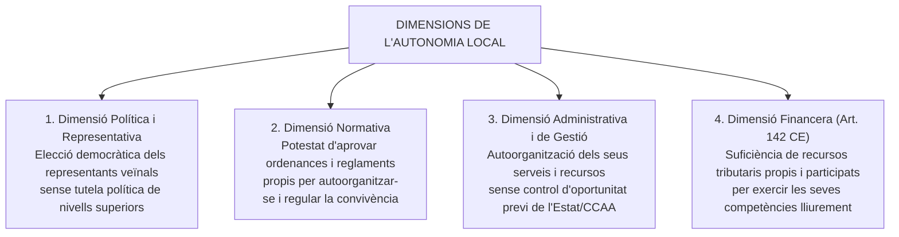
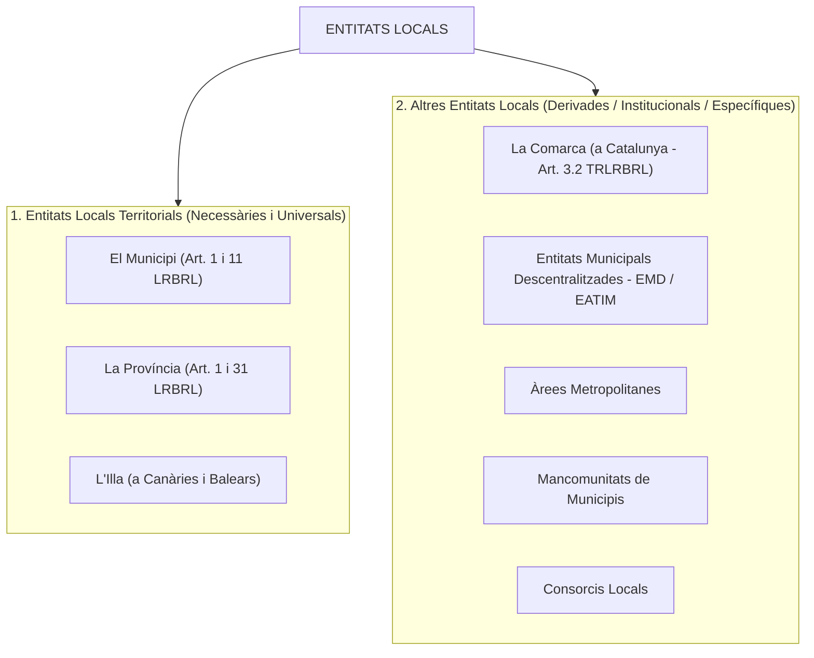
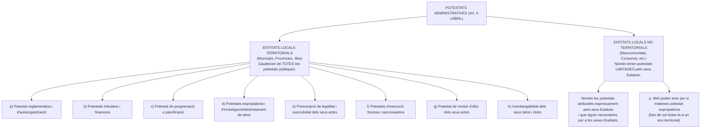

# Tema 3. Administració local i autonomia local

> **Fonts normatives de referència:** [`CORPUS/LRBRL.pdf`](file:///home/oriol/Projectes/OPOS/CORPUS/LRBRL.pdf) (Llei 7/1985, reguladora de les bases del règim local) i [`CORPUS/TRLRBRL.pdf`](file:///home/oriol/Projectes/OPOS/CORPUS/TRLRBRL.pdf) (Decret Legislatiu 2/2003, Text refós de la Llei municipal i de règim local de Catalunya).

---

## 1. Concepte i Naturalesa de l'Administració Local

L'**Administració Local** és el conjunt d'ens públics territorials i institucionals més propers a la ciutadania, dotats de personalitat jurídica pròpia i de plena capacitat per gestionar els interessos col·lectius de les respectives comunitats veïnals.

A diferència de l'Administració General de l'Estat i de l'Administració de la Generalitat de Catalunya, l'Administració Local es caracteritza per:
1. **Descentralització territorial:** Representa l'esglaó bàsic i fonamental de l'organització territorial (art. 137 CE).
2. **Autonomia de gestió:** Gaudeix d'autogovern administratiu i potestat reglamentària pròpia, sense submissió jeràrquica respecte a l'Estat o la Comunitat Autònoma.
3. **Legitimitat democràtica directa:** Els seus òrgans de govern primaris (regidors i consellers comarcals/insulats) són elegits directament o indirecta mitjançant sufragi universal pels mateixos veïns.

---

## 2. El Principi d'Autonomia Local

### 2.1. Concepte i dimensions de l'Autonomia Local
L'autonomia local és el dret i la capacitat efectiva de les entitats locals d'ordenar i gestionar una part important dels afers públics en el marc de la llei, sota la seva pròpia responsabilitat i en benefici dels seus habitants.

---

### 2.2. La Carta Europea de l'Autonomia Local (CEAL)
Aprovada pel Consell d'Europa a Estrasburg el **15 d'octubre de 1985** i ratificada per Espanya el **1988** (BOE núm. 47, de 24/02/1989), és el gran tractat internacional de referència en matèria de govern local.

#### Principis rectors de la CEAL:
1. **Concepte d'autonomia local (Art. 3 CEAL):** El dret i la capacitat efectiva de les col·lectivitats locals d'ordenar i gestionar una part important dels afers públics sota la seva pròpia responsabilitat.
2. **Principi de subsidiarietat (Art. 4.3 CEAL):** L'exercici de les responsabilitats públiques ha de recaure, de manera preferent, en les autoritats més properes als ciutadans. L'atribució d'una responsabilitat a una altra autoritat ha de tenir en compte l'amplitud i la naturalesa de la tasca i les exigències d'eficàcia i economia.
3. **Plenitud i exclusivitat competencial (Art. 4.4 CEAL):** Les competències atribuïdes a les col·lectivitats locals han de ser, normalment, plenes i senceres. No poden ser posades en dubte ni limitades per una altra autoritat estatal o regional, llevat del que preveu la llei.
4. **Control administratiu limitat (Art. 8 CEAL):** Qualsevol control administratiu sobre les entitats locals només pot ser un **control de legalitat** (mai d'oportunitat política), exercit a posteriori i de forma proporcional a la importància dels interessos protegits.
5. **Suficiència de recursos financers (Art. 9 CEAL):** Les col·lectivitats locals tenen dret a recursos propis suficients, de caràcter diversificat i evolutiu per adaptar-se al cost real dels serveis.
6. **Protecció jurisdiccional (Art. 11 CEAL):** Les entitats locals han de disposar d'un recurs jurisdiccional efectiu per defensar la seva autonomia.

---

### 2.3. La Garantia Institucional de l'Autonomia Local (Doctrina del TC)
El Tribunal Constitucional ha establert una sòlida doctrina jurisprudencial (des de la històrica **STC 32/1981**, i continuada per les **STC 214/1989**, **STC 159/2001** i **STC 41/2016**):

- **La garantia institucional:** L'autonomia local és una «garantia institucional» constitucionalment protegida (Arts. 137, 140 i 141 CE) que el legislador estatal i autonòmic estan obligats a preservar.
- **El nucli indisponible:** El legislador ordinari no pot buidar de contingut l'autonomia local ni reduir les corporacions a simples administracions subordinades o delegades. Cal garantir-los un «nucli recognoscible d'autogovern i participació efectiva en els assumptes que afecten directament la seva comunitat».
- **Absència de tutela política:** Ni l'Estat ni les Comunitats Autònomes poden exercir mecanismes de tutela o aprovació prèvia d'oportunitat sobre els acords municipals. Els controls només poden ser estrictament de **legalitat** i fiscalitzats en última instància pels Tribunals de Justícia (jurisdicció contenciosa administrativa).

---

### 2.4. La Defensa Jurisdiccional de l'Autonomia Local
D'acord amb la Llei Orgànica 7/1999, que va incorporar els articles 75 bis a 75 quinquies a la Llei Orgànica del Tribunal Constitucional (LOTC), existeix un procediment específic:

- **El Conflicte en defensa de l'autonomia local:**
  - **Objecte:** Permet impugnar davant el Tribunal Constitucional les **lleis o normes amb rang de llei** de l'Estat o de les CCAA que lesionin l'autonomia local constitucionalment garantida.
  - **Legitimació activa (Art. 75 ter LOTC):**
    1. El municipi o província que sigui destinatari únic de la llei.
    2. Un nombre de municipis que representin almenys **1/7 part dels municipis** de l'àmbit territorial d'aplicació de la llei i que sumin com a mínim **1/6 part de la població oficial**.
    3. Un nombre de províncies que representin almenys la **meitat de les províncies** de l'àmbit d'aplicació de la llei i almenys la **meitat de la seva població**.
  - **Requisit previ preceptiu:** Dictamen preceptiu (no vinculant) del Consell d'Estat o de l'òrgan consultiu superior de la Comunitat Autònoma (Consell de Garanties Estatutàries a Catalunya).

---

## 3. Tipologia i Classificació de les Entitats Locals

La normativa bàsica estatal (**Art. 3 LRBRL**) i la normativa catalana (**Art. 3 TRLRBRL - DL 2/2003**) classifiquen les entitats que integren l'administració local en dues grans categories:

---

### 3.1. Entitats Locals de Caràcter Territorial (Bàsiques)

Són les peces mestres del règim local constitucional. Es caracteritzen per la seva **universalitat** (cobreixen la totalitat de la població i territori de l'Estat), la seva **necessitat constitucional** (no poden ser suprimides pel legislador ordinari) i la titularitat de la **plenitud de potestats administratives** (art. 4.1 LRBRL).

1. **El Municipi (Art. 1 i 11 LRBRL / Art. 4 TRLRBRL):**
   - És l'entitat local bàsica de l'organització territorial de l'Estat i el canal immediat de participació ciutadana en els afers públics.
   - Elements constitutius: **Territori** (terme municipal), **Població** (habitants empadronats) i **Organització** (Ajuntament).
2. **La Província (Art. 31 LRBRL / Art. 83 TRLRBRL):**
   - Entitat local amb personalitat jurídica pròpia determinada per l'agrupació de municipis i divisió territorial per al compliment de les activitats estatals.
   - Finalitats pròpies: Garantir els principis de solidaritat i equilibri intermunicipal, assegurar la prestació integral dels serveis de competència municipal i prestar assistència i cooperació jurídica, econòmica i tècnica als municipis (especialment als de menor capacitat de gestió).
3. **L'Illa (Art. 41 LRBRL):**
   - Entitat local territorial als arxipèlags canari (Cabildos) i balear (Consells Insulars), amb competències equivalents a les diputacions provincials i les pròpies del seu règim autonòmic.

---

### 3.2. Altres Entitats Locals (Supra, infra o intermunicipals)

Són entitats de caràcter potestatiu, funcional o instrumental, creades per atendre necessitats de gestió, associació veïnal o prestació conjunta de serveis:

| Entitat Local | Regulació / Concepte | Òrgans de govern / Notes característiques |
| :--- | :--- | :--- |
| **La Comarca** | **Art. 5 TRLRBRL / Art. 3.2 LRBRL**. A Catalunya té la consideració d'**entitat local d'abast supramunicipal**, amb personalitat jurídica pròpia i plena capacitat per al compliment dels seus fins. | Òrgans: **Consell Comarcal**, **President** de la comarca i **Consell d'Alcaldes**. Coordina serveis municipals i gestiona competències delegades per la Generalitat. |
| **Entitats Municipals Descentralitzades (EMD)** | **Arts. 78 a 82 TRLRBRL** (i EATIM segons art. 45 LRBRL). Entitats creades per a l'administració descentralitzada de nuclis de població separats dins un mateix municipi. | Òrgans: **Junta Veïnal** (òrgan col·legiat) i **President de l'EMD** (elegit directament pels veïns del nucli). |
| **Àrees Metropolitanes** | **Art. 43 LRBRL / Art. 106 TRLRBRL**. Entitats locals integrades pels municipis de grans aglomeracions urbanes amb vincles econòmics i socials continus que exigeixen una planificació conjunta. | Gestionen serveis conjunts com transport públic, urbanisme metropolità, abastament d'aigua i sanejament (ex. Àrea Metropolitana de Barcelona - AMB). |
| **Mancomunitats de Municipis** | **Art. 44 LRBRL / Arts. 113-120 TRLRBRL**. Associacions voluntàries de municipis limítrofs o no per a l'execució en comú d'obres i la prestació de serveis determinats de la seva competència. | Tenen personalitat jurídica pròpia, **Estatuts propis** i òrgan de govern representatiu (Assemblea de regidors mancomunats). No poden assumir la totalitat de competències dels municipis. |
| **Consorcis Locals** | **Art. 87 LRBRL / Arts. 121-125 TRLRBRL / Arts. 118-127 Llei 40/2015**. Entitats de dret públic creades per una o diverses entitats locals amb altres administracions públiques (Estat, Generalitat) o entitats privades sense ànim de lucre per a finalitats d'interès comú. | Personalitat jurídica pròpia, regulats pels seus Estatuts i adscrits a l'administració pública que en tingui el control majoritari. |

---

## 4. Potestats de les Entitats Locals: Territorials vs. No Territorials

L'article 4 de la LRBRL estableix una diferenciació fonamental pel que fa a l'atribució de potestats públiques:

---

## 5. Quadre Resum i Preguntes Típiques d'Examen Tipus Test

| Pregunta / Concepte Clau | Resposta Correcta / Trampa Freqüent |
| :--- | :--- |
| **On es defineix per primer cop el principi de subsidiarietat en l'àmbit local?** | A la **Carta Europea de l'Autonomia Local de 1985** (Art. 4.3 CEAL). |
| **Quines són les entitats locals de caràcter territorial segons la LRBRL?** | Exclusivament el **Municipi, la Província i l'Illa** (Art. 1.1 i 3.1 LRBRL). |
| **La comarca és una entitat local territorial a la legislació bàsica estatal?** | No, a la LRBRL (art. 3.2) és una entitat supramunicipal; a Catalunya (art. 3.2 TRLRBRL) és reconeguda com a entitat local d'abast supramunicipal. |
| **Poden l'Estat o la Generalitat exercir controls d'oportunitat sobre els ajuntaments?** | **No**. Els controls sobre els ens locals han de ser exclusivament de **legalitat** i fiscalitzats pels tribunals (STC 32/1981 i Art. 8 CEAL). |
| **Quina entitat local NO pot ostentar mai potestat expropiatòria directa?** | Les **mancomunitats de municipis** i els consorcis (art. 4.2 LRBRL). L'expropiació l'ha de realitzar un ens territorial en benefici seu. |
| **Qui està legitimat per interposar el conflicte en defensa de l'autonomia local al TC?** | Un municipi destinatari únic, o un grup de municipis que sumin **1/7 dels municipis** i **1/6 de la població** de l'àmbit afectat (Art. 75 ter LOTC). |
| **Quin tràmit previ és preceptiu per acudir al conflicte davant el TC?** | El dictamen del **Consell d'Estat** o de l'òrgan consultiu autonòmic equivalent (Consell de Garanties Estatutàries a Catalunya). |
| **Quines són les finalitats pròpies de la Província?** | Garantir la **solidaritat i equilibri intermunicipals** i prestar **assistència i cooperació jurídica, econòmica i tècnica** als municipis (Art. 31 LRBRL). |
