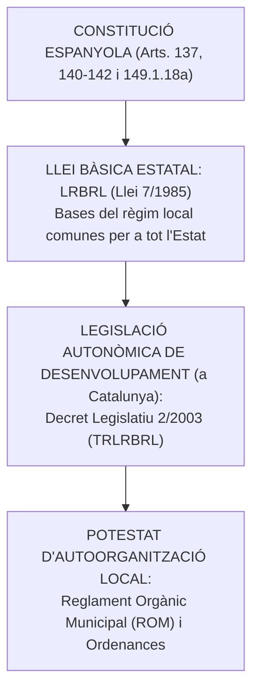
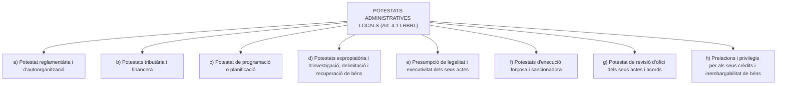
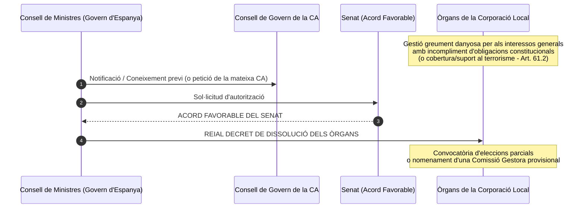
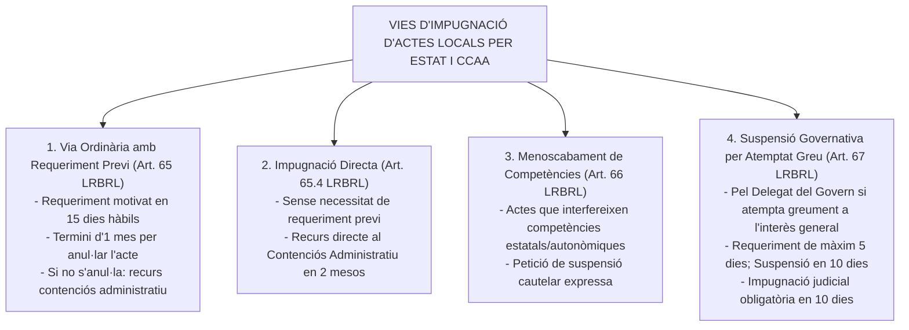

# Tema 4. Principis de la Llei 7/1985, de 2 d’abril, reguladora de les bases del règim Local

> **Font normativa de referència:** [`CORPUS/LRBRL.pdf`](file:///home/oriol/Projectes/OPOS/CORPUS/LRBRL.pdf)  
> **Text:** Llei 7/1985, de 2 d'abril, reguladora de les bases del règim local (LRBRL). Text consolidat.

---

## 1. Naturalesa, Caràcter Bàsic i Estructura de la Llei 7/1985 (LRBRL)

La **Llei 7/1985, de 2 d'abril, reguladora de les bases del règim local (LRBRL)** és la norma capçalera del Dret local espanyol. Dictada a l'empara de la competència exclusiva estatal sobre les *bases del règim jurídic de les administracions públiques i del règim estatutari dels seus funcionaris* (**Art. 149.1.18a CE**), estableix el marc comú i homogeni d'autogovern per a totes les entitats locals de l'Estat.

---

### 1.1. Estructura general de la LRBRL
La LRBRL s'estructura en **11 Títols**, Disposicions Addicionals, Transitòries, Derogatòries i Finals:

| Títol | Denominació oficial | Articles | Matèria clau |
| :---: | :--- | :---: | :--- |
| **Títol I** | **Disposicions generals** | **1 – 10** | Personalitat jurídica, entitats territorials, potestats de l'art. 4 i principis de relació. |
| **Títol II** | **El municipi** | **11 – 30** | Territori, terme municipal, padró d'habitants, organització, competències i consell obert. |
| **Títol III** | **La província** | **31 – 41** | Organització provincial, competències de la Diputació i règim dels arxipèlags. |
| **Títol IV** | **Altres entitats locals** | **42 – 45** | Comarques, àrees metropolitanes, mancomunitats i entitats inframunicipals. |
| **Títol V** | **Disposicions comunes a les entitats locals** | **46 – 78** | Règim de funcionament (sessions), relacions interadministratives, impugnació d'actes, informació ciutadana i estatut dels electes. |
| **Títol VI** | **Béns, activitats i serveis, i contractació** | **79 – 88** | Règim de béns locals, activitats econòmiques i serveis públics. |
| **Títol VII** | **Personal al servei de les entitats locals** | **89 – 104 bis** | Funcionaris amb habilitació nacional, funcionaris propis, laborals i personal eventual. |
| **Títol VIII** | **Hisendes locals** | **105 – 116** | Recursos, pressupostos i coordinació financera (remissió al TRLRHL). |
| **Títol IX** | **Organitzacions per a la cooperació entre administracions** | **117 – 120** | Comissió Nacional d'Administració Local (CNAL) i comissions territorials. |
| **Títol X** | **Règim dels municipis de gran població** | **121 – 138** | Règim especial organitzatiu per a grans ciutats (>250.000 hab. o capitals de província >175.000 hab.). |
| **Títol XI** | **Tipificació de les infraccions i sancions per les entitats locals** | **139 – 141** | Quadre de potestat sancionadora en ordenances municipals. |

---

## 2. Principis Generals d'Actuació de l'Administració Local

Segons els articles 2, 3 i 6 de la LRBRL, les entitats locals actuen d'acord amb els principis de:
1. **Eficàcia i Eficiència:** Racionalitat i optimització en la gestió dels recursos públics i compliment dels objectius fixats.
2. **Descentralització i Desconcentració:** Atribució i traspàs de funcions cap als nivells i òrgans més pròxims a l'administrat.
3. **Coordinació i Cooperació:** Deure d'actuar coordinadament amb l'Estat i les Comunitats Autònomes respectant l'autonomia mútua.
4. **Proximitat i Participació:** Facilitar la informació més àmplia sobre la seva activitat i la participació efectiva dels veïns en la vida local.
5. **Transparència i Publicitat:** Accés ciutadà a la informació pública i als acords dels òrgans municipals.
6. **Estabilitat pressupostària i sostenibilitat financera:** Disciplina pressupostària i suficiència financera estricta.

---

## 3. La Població Municipal i el Padró d'Habitants (Arts. 15 a 18 LRBRL)

### 3.1. Concepte de veí i obligació d'empadronament (Art. 15 LRBRL)
- Tota persona que visqui a Espanya està **obligada a inscriure's en el Padró del municipi en el qual resideixi habitualment**.
- Qui visqui en diversos municipis ha d'inscriure's únicament en aquell en què passi **més temps a l'any**.
- Els inscrits en el Padró municipal són els **veïns** del municipi. La condició de veí s'adquireix en el mateix moment de la inscripció en el Padró.

---

### 3.2. El Padró Municipal com a document públic (Arts. 16 i 17 LRBRL)
- El **Padró municipal** és el registre administratiu on consten els veïns d'un municipi. Les seves dades constitueixen **prova de la residència en el municipi i del domicili habitual** en aquest.
- **Dades obligatòries per a la inscripció:**
  1. Nom i cognoms.
  2. Sexe.
  3. Domicili habitual.
  4. Nacionalitat.
  5. Lloc i data de naixement.
  6. Número de DNI o document que el substitueixi (NIE/Passaport per a estrangers).
  7. Certificat o títol escolar o acadèmic que es posseeixi.
- **Custòdia i gestió:** La formació, manteniment, revisió i custòdia del Padró correspon a l'**Ajuntament**, sota la coordinació de l'**Institut Nacional d'Estadística (INE)**.

---

### 3.3. Drets i Deures dels Veïns (Art. 18 LRBRL)
Són drets i deures dels veïns:
- **a)** Ser elector i elegible en els termes establerts en la legislació electoral (LOREG).
- **b)** Participar en la gestió municipal d'acord amb el que disposin les lleis i els reglaments orgànics.
- **c)** Utilitzar, d'acord amb la seva naturalesa, els serveis públics municipals i accedir als aprofitaments comunals.
- **d)** Contribuir mitjançant les prestacions tributàries i personals legalment establertes a les càrregues municipals.
- **e)** Ser informat, prèvia petició raonada, i dirigir sol·licituds a l'Administració municipal en relació amb els expedients i la documentació municipal.
- **f)** Demanar la consulta popular en els termes de l'art. 71 LRBRL.
- **g)** Exigir la prestació i, si escau, l'establiment del servei públic corresponent en cas de constituir una competència municipal pròpia de caràcter obligatori (serveis mínims de l'art. 26).
- **h)** Exercir la **iniciativa popular** per presentar propostes d'acords o projectes de reglaments (requereix la signatura d'un percentatge de veïns: 20% en municipis fins a 5.000 hab., 15% entre 5.001 i 20.000 hab., i 10% a partir de 20.001 hab.).

---

## 4. Les Potestats Administratives de les Entitats Locals (Art. 4 LRBRL)

L'article 4.1 de la LRBRL atorga a les **entitats locals territorials** (municipis, províncies i illes) la plenitud de potestats administratives:

> ⚠️ **Atenció a preguntes de test:**
> - Les entitats locals territorials tenen **potestat reglamentària** (subordinada a la llei), però **NO tenen potestat legislativa** (no dicten lleis).
> - Les mancomunitats i consorcis (entitats no territorials) només tenen les potestats atribuïdes expressament pels seus Estatuts i **mai tenen potestat expropiatòria directa** (art. 4.2 LRBRL).

---

## 5. Relacions Interadministratives (Arts. 55 a 62 LRBRL)

L'Administració local, l'Administració General de l'Estat i l'Administració autonòmica ajusten les seves relacions recíproques als deures d'informació mútua, col·laboració, coordinació i respecte als àmbits competencials respectius.

### 5.1. Deure d'informació i tramesa d'acords (Art. 56 LRBRL)
- Les entitats locals tenen l'obligació de remetre a l'Administració de l'Estat (Delegació/Subdelegació del Govern) i a l'Administració de la Comunitat Autònoma una **còpia o extracte dels seus actes i acords**.
- **Termini de tramesa:** Dins els **6 dies hàbils següents a l'adopció de l'acte o acord**.
- Els Presidents de les Corporacions locals han de facultar els representants estatals i autonòmics per examinar expedients i antecedents quan ho sol·licitin motivadament.

---

### 5.2. Execució forçosa per substitució (Art. 60 LRBRL)
Si una entitat local incompleix una obligació imposada directament per la llei que afecti competències de l'Estat o de la Comunitat Autònoma (i amb cobertura econòmica garantida):
1. L'Administració afectada li formularà un **requeriment de compliment** concedint un termini **mai inferior a 1 mes**.
2. Si transcorregut el termini persisteix l'incompliment, l'Administració estatal o autonòmica procedirà a adoptar les mesures necessàries per executar l'obligació **a costa i en substitució de l'entitat local**.

---

### 5.3. Dissolució dels Òrgans de les Corporacions Locals (Art. 61 LRBRL)

> **Article 61.1:** *«El Consell de Ministres, a iniciativa pròpia i amb coneixement del Consell de Govern de la comunitat autònoma corresponent o a sol·licitud d'aquest i, en tot cas, previ acord favorable del Senat, podrà procedir, mitjançant reial decret, a la dissolució dels òrgans de les corporacions locals en el supòsit de gestió greument danyosa per als interessos generals que suposi incompliment de les seves obligacions constitucionals.»*

- **Motius legals de dissolució:** Gestió greument danyosa per als interessos generals que suposi incompliment d'obligacions constitucionals, i en tot cas els acords o actuacions reiterades de cobertura o suport al terrorisme o enaltiment d'aquest (art. 61.2).
- **Efectes:** S'aplica la legislació electoral per a la convocatòria d'eleccions parcials o la constitució d'una comissió gestora per a l'administració ordinària provisional.

---

## 6. Control de Legalitat i Impugnació d'Actes Locals (Arts. 63 a 67 LRBRL)

L'Estat i les CCAA no tenen tutela política sobre les entitats locals, però disposen de vies de fiscalització jurídica davant la jurisdicció contenciosa administrativa:

| Mecanisme d'impugnació | Terminis procedimentals clau | Efectes i peculiaritats |
| :--- | :--- | :--- |
| **Requeriment d'anul·lació (Art. 65)** | - Formulació del requeriment: **15 dies hàbils** des de la recepció de l'acord. - Resolució per l'entitat local: **1 mes**. - Si no s'atén: Interposició de recurs contenciós administratiu. | És una via de composició extrajudicial per donar l'oportunitat a l'ens local d'anul·lar l'acte il·legal. |
| **Menoscabament de competències (Art. 66)** | Procediment de l'art. 65 amb petició raonada de **suspensió de l'acte impugnat**. | El Tribunal Contenciós acorda la suspensió en el primer tràmit si aprecia fonament. |
| **Suspensió pel Delegat del Govern (Art. 67)** | - Requeriment al President de la corporació dins els **10 dies** des de la recepció. - Termini per respondre al requeriment: **màxim 5 dies**. - Facultat de suspensió: **10 dies** posteriors. - Impugnació judicial obligatòria: dins els **10 dies següents a la suspensió**. | Mesura excepcional per actes que **atemptin greument contra l'interès general d'Espanya**. |

---

## 7. Estatut dels Membres de les Corporacions Locals (Arts. 73 a 78 LRBRL)

### 7.1. Règims de dedicació i retribucions (Art. 75 LRBRL)
1. **Dedicació exclusiva:** Els electes locals que exerceixin els seus càrrecs en dedicació exclusiva tenen dret a percebre una **retribució fixa mensual** i ser donats d'alta al Règim General de la Seguretat Social. El seu nombre màxim està limitat per la llei segons la població del municipi.
2. **Dedicació parcial:** Per a membres que desenvolupin funcions de presidència, vicepresidència o responsabilitats d'àrea sense dedicació íntegra.
3. **Indemnitzacions i assistències:** Els membres que no tinguin dedicació exclusiva ni parcial només perceben **assistències per la concurrència efectiva a les sessions** dels òrgans col·legiats (Plens, Comissions) i indemnitzacions per despeses ocasionades per l'exercici del càrrec.

---

### 7.2. Grups polítics i Regidors no adscrits (Art. 73.3 LRBRL)
- Els membres de les corporacions locals es constitueixen en **grups polítics**.
- **Regidors no adscrits:** Els regidors que abandonin el grup polític de la candidatura per la qual van ser elegits o en siguin expulsats passen a tenir la consideració de *no adscrits*.
- **Límit als drets polítics i econòmics:** Els regidors no adscrits no poden obtenir millores en els seus drets econòmics ni polítics (no poden ser designats per a càrrecs de confiança, dedicacions exclusives ni formar part de la Junta de Govern Local) superiors als que tenien en el grup d'origen, per evitar el transfuguisme.

---

### 7.3. Dret d'informació dels regidors (Art. 77 LRBRL)
- Tots els membres de les corporacions locals tenen dret a obtenir de l'Alcalde o de la Junta de Govern Local tots els antecedents, dades o informes que constin en els serveis de la corporació i siguin necessaris per al desenvolupament de la seva funció.
- **Resolució de la sol·licitud:** L'Alcalde ha de resoldre la petició en el termini màxim de **5 dies naturals**. Si no dicta resolució denegatòria expressa en aquest termini, la sol·licitud s'entén **acceptada per silenci administratiu positiu**.

---

### 7.4. Deure de transparència i Registre d'Interessos (Art. 75.7 LRBRL)
Tots els electes locals tenen l'obligació de formular davant la Secretaria municipal:
1. Declaració sobre causes de possible **incompatibilitat** i activitats que els proporcionin o puguin proporcionar ingressos econòmics.
2. Declaració dels seus **béns patrimonials**.
- Aquestes declaracions s'inscriuen en el **Registre d'Interessos** de la corporació abans de prendre possessió, en finalitzar el mandat i quan es produeixin modificacions circumstancials.

---

## 8. Quadre Resum i Preguntes Típiques d'Examen Tipus Test

| Pregunta / Concepte Clau | Resposta Correcta / Trampa de Test |
| :--- | :--- |
| **Quin títol competencial empara la LRBRL?** | L'**Article 149.1.18a CE** (Bases del règim jurídic de les Administracions Públiques). |
| **Quines dades del Padró NO tenen caràcter obligatori?** | Només són obligatòries les fixades a l'art. 16.2 (nom, sexe, domicili, nacionalitat, naixement, DNI/NIE i títol escolar). El telèfon o correu són voluntàries. |
| **En quin termini s'han de trametre els acords a l'Estat i CCAA?** | Dins els **6 dies hàbils següents** a la seva adopció (Art. 56.1 LRBRL). |
| **Quin termini té l'ens local per respondre al requeriment de l'art. 65?** | **1 mes** per anul·lar l'acte (el requeriment es formula en 15 dies hàbils). |
| **Qui i com pot dissoldre els òrgans d'un ajuntament?** | El **Consell de Ministres per Reial Decret**, previ **acord favorable del Senat** (Art. 61 LRBRL). |
| **Quina mesura pot adoptar el Delegat del Govern davant actes greument lesius?** | **Suspensió de l'acte** previ requeriment de màxim 5 dies, i posterior impugnació judicial en 10 dies (Art. 67 LRBRL). |
| **Quin termini té l'Alcalde per respondre a una petició d'informació d'un regidor?** | **5 dies naturals**; si no respon, s'entén concedida per silenci positiu (Art. 77 LRBRL). |
| **Poden els regidors no adscrits millorar les seves retribucions?** | **No**, els seus drets econòmics i polítics no poden ser superiors als que tenien en el grup de procedència (Art. 73.3 LRBRL). |
