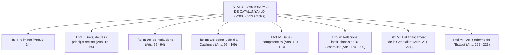
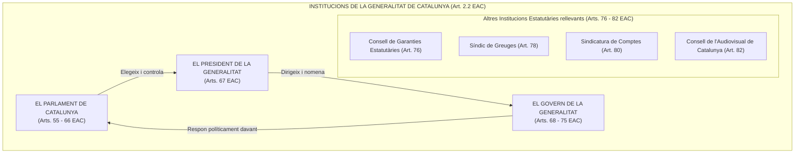
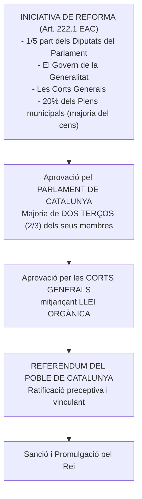

# Tema 5. Les Comunitats Autònomes segons la Constitució Espanyola. Estatut d’Autonomia de Catalunya: Llei Orgànica 6/2006

> **Fonts normatives de referència:** [`CORPUS/estatut_2006.pdf`](file:///home/oriol/Projectes/OPOS/CORPUS/estatut_2006.pdf) (Estatut d'Autonomia de Catalunya, LO 6/2006) i [`CORPUS/consitucio_1978.pdf`](file:///home/oriol/Projectes/OPOS/CORPUS/consitucio_1978.pdf) (Constitució Espanyola de 1978).

---

## 1. El Marc Constitucional de les Comunitats Autònomes

El model d'Estat autonòmic es fonamenta en l'**Article 2 de la Constitució Espanyola (CE)**, que reconeix i garanteix el *dret a l'autonomia de les nacionalitats i regions* que integren la indissoluble unitat de la Nació espanyola, i en el desplegament del **Títol VIII de la CE**.

### 1.1. Principis estructurals del model autonòmic
1. **Principi d'Autonomia Política:** Les Comunitats Autònomes (CCAA) disposen de potestat legislativa pròpia, govern autònom i administració pròpia.
2. **Principi d'Unitat i no fragmentació de la sobirania:** La sobirania nacional resideix únicament en el poble espanyol (art. 1.2 CE).
3. **Principi de Solidaritat interterritorial (Arts. 2 i 138 CE):** Prohibició de privilegis econòmics o socials entre territoris.
4. **Principi d'Igualtat de drets bàsics (Art. 139 CE):** Tots els ciutadans gaudeixen dels mateixos drets fonamentals a qualsevol part del territori de l'Estat.
5. **Principi de Disposició:** L'accés a l'autonomia i l'assumpció de competències va ser voluntari i gradual mitjançant els Estatuts d'Autonomia.

---

## 2. L'Estatut d'Autonomia de Catalunya de 2006 (Llei Orgànica 6/2006)

L'Estatut d'Autonomia de Catalunya és la **norma institucional bàsica de Catalunya** (art. 147 CE i art. 1 EAC), aprovat per les Corts Generals mitjançant la **Llei Orgànica 6/2006, de 19 de juliol**, ratificat pel poble de Catalunya en referèndum el 18 de juny de 2006 i publicat al DOGC núm. 4680 el 20 de juliol de 2006.

### 2.1. Estructura General de l'Estatut
L'Estatut de 2006 consta de:
- **1 Preàmbul**.
- **223 Articles**, estructurats en un **Títol Preliminar** i **7 Títols numerats** (del I al VII).
- **15 Disposicions Addicionals**.
- **2 Disposicions Transitòries**.
- **1 Disposició Derogatòria**.
- **4 Disposicions Finals**.

---

## 3. Anàlisi Sistemàtica dels Títols de l'Estatut

### 3.1. Títol Preliminar (Articles 1 a 14)
- **Article 1 (Nacionalitat):** Catalunya, com a nacionalitat, exerceix el seu autogovern constituïda en Comunitat Autònoma d'acord amb la Constitució i el present Estatut.
- **Article 2 (La Generalitat):** La Generalitat és el sistema institucional en què s'organitza políticament l'autogovern de Catalunya. Està integrada pel **Parlament**, la **Presidència de la Generalitat**, el **Govern** i les altres institucions que estableix el Títol II.
- **Article 5 (Drets històrics):** L'autogovern de Catalunya es fonamenta també en els drets històrics del poble català, en les seves institucions seculars i en la tradició jurídica catalana.
- **Article 6 (La llengua pròpia i les llengües oficials):**
  - La llengua pròpia de Catalunya és el **català**.
  - El català és la llengua oficial de Catalunya. També ho és el **castellà**, oficial a tot l'Estat espanyol. Totes les persones tenen el dret d'utilitzar les dues llengües oficials i els ciutadans de Catalunya tenen el **dret i el deure de conèixer-les**.
  - L'**occità**, denominat **aranès** a l'Aran, és la llengua pròpia d'aquest territori i és oficial a Catalunya.
- **Article 8 (Símbols nacionals):** Catalunya té com a símbols nacionals la **bandera** (les quatre barres vermelles sobre fons groc), la **festa** (l'Onze de Setembre, Diada Nacional de Catalunya) i l'**himne** (*Els Segadors*).
- **Article 9 (El territori):** El territori de Catalunya és el que correspon als límits geogràfics i administratius de la Generalitat.
- **Article 11 (La condició política de catalans):** Gaudeixen de la condició política de catalans o ciutadans de Catalunya els ciutadans espanyols que tenen **veïnatge administratiu en qualsevol municipi de Catalunya**.
- **Article 13 (La capital):** La capital de Catalunya és la ciutat de **Barcelona**, seu permanent del Parlament, de la Presidència de la Generalitat i del Govern.

---

### 3.2. Títol I: Drets, Deures i Principis Rectors (Articles 15 a 54)
L'Estatut català incorpora una carta exhaustiva de drets i deures estatutaris dividida en:
- **Capítol I (Arts. 15-36): Drets i deures dels ciutadans:** Drets civils i socials (dret a la igualtat, dret a viure amb dignitat el procés de la mort, drets en l'àmbit de la salut, educació, habitatge, medi ambient) i drets lingüístics (dret a no ser discriminat per raó de llengua, dret a ser atès en català en l'administració i serveis públics).
- **Capítol II (Arts. 37-38): Drets i deures en l'àmbit polític i d'administració:** Dret a una bona administració, dret d'accés a documents públics i dret de participació ciutadana.
- **Capítol III (Arts. 39-54): Principis rectors de les polítiques públiques:** Directrius d'actuació per als poders públics catalans en matèria de cohesió social, igualtat de gènere, joventut, gent gran, sostenibilitat, foment de la cultura i la recerca.

---

### 3.3. Títol II: De les Institucions de la Generalitat (Articles 55 a 94)

#### 1. El Parlament de Catalunya (Arts. 55 a 66 EAC)
- Representa el poble de Catalunya.
- Exerceix la **potestat legislativa**, aprova els **pressupostos de la Generalitat**, impulsa i controla l'acció política i de govern.
- És inviolable. Està integrat per un mínim de 100 i un màxim de 150 diputats (actualment **135 diputats** fixats per la Disposició Transitòria 4a EAC), elegits per 4 anys mitjançant sufragi universal, lliure, igual, directe i secret segons el sistema proporcional.
- Funcions rellevants: Designa els Senadors que representen la Generalitat al Senat; exerceix la iniciativa legislativa davant el Congrés dels Diputats; interposa recursos d'inconstitucionalitat davant el Tribunal Constitucional.

#### 2. El President de la Generalitat (Art. 67 EAC)
- Ostenta la **més alta representació de la Generalitat** i la **representació ordinària de l'Estat a Catalunya**.
- Dirigeix i coordina l'acció del Govern.
- **Elecció i nomenament:** És elegit pel Parlament d'entre els seus membres (per majoria absoluta en primera votació o simple en segona) i **nomenat pel Rei**.
- Pot dissoldre el Parlament anticipadament (tret que estigui en tramitació una moció de censura).

#### 3. El Govern i l'Administració de la Generalitat (Arts. 68 a 75 EAC)
- És l'òrgan col·legiat que dirigeix la política i l'administració de la Generalitat.
- Exerceix la **funció executiva i la potestat reglamentària**.
- Està integrat pel **President**, el **Conseller Primer** (si escau) i els **Consellers**.
- Respon políticament davant el Parlament de forma solidària (moció de censura constructiva per majoria absoluta i qüestió de confiança per majoria simple).

#### 4. Les Altres Institucions Estatutàries (Capítol IV del Títol II)
- **El Consell de Garanties Estatutàries (Art. 76 EAC):** Institució consultiva que dictamina sobre l'adequació a l'Estatut i a la Constitució dels projectes i proposicions de llei del Parlament i dels decrets llei del Govern. Els seus dictàmens sobre drets estatutaris són vinculants per al Govern i el Parlament.
- **El Síndic de Greuges (Art. 78 EAC):** Alt comissionat del Parlament per a la defensa dels drets i llibertats; supervisa l'activitat de l'Administració de la Generalitat i dels ens locals de Catalunya.
- **La Sindicatura de Comptes (Art. 80 EAC):** Òrgan fiscalitzador extern dels comptes, de la gestió econòmica i del sector públic de Catalunya, sense perjudici de les competències del Tribunal de Comptes estatal.
- **El Consell de l'Audiovisual de Catalunya - CAC (Art. 82 EAC):** Autoritat reguladora independent en l'àmbit de la comunicació audiovisual a Catalunya.

---

### 3.4. Títol III: Del Poder Judicial a Catalunya (Arts. 95 a 109)
- El **Tribunal Superior de Justícia de Catalunya (TSJC)** és l'òrgan jurisdiccional que culmina l'organització judicial a Catalunya i és competent en tots els ordres jurisdiccionals (civil, penal, contenciós administratiu, social).
- El **Fiscal Superior de Catalunya** dirigeix la Fiscalia del TSJC.

---

### 3.5. Títol IV: De les Competències (Arts. 110 a 173)

#### Tipologia estatutària de competències (Arts. 110 a 112 EAC):
1. **Competències exclusives (Art. 111 EAC):** Corresponen de manera íntegra a la Generalitat la potestat legislativa, la potestat reglamentària i la funció executiva (ex. dret civil català, turisme, organització institucional pròpia, consum, habitatge).
2. **Competències compartides (Art. 112 EAC):** L'Estat estableix les bases o legislació bàsica, i la Generalitat té la potestat legislativa de desenvolupament, la potestat reglamentària i la funció executiva (ex. sanitat, educació, medi ambient, protecció civil).
3. **Competències executives (Art. 112 EAC):** L'Estat té la potestat legislativa i reglamentària, i la Generalitat assumeix la potestat reglamentària interna d'organització dels serveis i la funció executiva i de gestió (ex. legislació laboral, sistema penitenciari).

---

### 3.6. Títol V: Relacions Institucionals de la Generalitat (Arts. 174 a 200)
- Regula la col·laboració amb l'Estat mitjançant la **Comissió Bilateral Generalitat-Estat** (òrgan permanent de cooperació bilateral).
- Relacions amb la **Unió Europea**: participació de la Generalitat en els assumptes comunitaris que afectin les seves competències i acció exterior.

---

### 3.7. Títol VI: Del Finançament de la Generalitat (Arts. 201 a 221)
- La Generalitat disposa d'**autonomia financera** i hisenda pròpia.
- Recursos: Rendiments dels tributs propis, rendiments dels **tributs cedits per l'Estat** (100% de l'Impost sobre el Patrimoni, Successions i Donacions, Transmissions Patrimonials i Actes Jurídics Documentats; 50% de l'IRPF i de l'IVA; 58% dels Impostos Especials).
- Instruments: L'**Agència Tributària de Catalunya (ATC)** per a la recaptació dels tributs propis i cedits, i la **Comissió Mixta d'Afers Econòmics i Fiscals Estat-Generalitat**.

---

### 3.8. Títol VII: De la Reforma de l'Estatut (Arts. 222 i 223)

---

## 4. Quadre Resum i Preguntes Típiques d'Examen Tipus Test

| Pregunta / Concepte Clau | Resposta Correcta / Trampa Freqüent |
| :--- | :--- |
| **Quina norma aprova l'Estatut d'Autonomia de Catalunya de 2006?** | La **Llei Orgànica 6/2006, de 19 de juliol**. |
| **Quants articles té l'Estatut de Catalunya de 2006?** | **223 articles** (distribuïts en un Títol Preliminar i 7 Títols numerats). |
| **Quines institucions integren la Generalitat segons l'art. 2 EAC?** | El **Parlament, el President de la Generalitat, el Govern** i les altres institucions de l'EAC (CGE, Síndic, Sindicatura, CAC). |
| **Quin deure lingüístic estableix l'Estatut als ciutadans de Catalunya?** | El **dret i el deure de conèixer les dues llengües oficials** (català i castellà) (Art. 6.2 EAC). |
| **Quina llengua és pròpia de l'Aran i oficial a Catalunya?** | L'**occità, denominat aranès a l'Aran** (Art. 6.5 EAC). |
| **Quants diputats té el Parlament de Catalunya segons la DT 4a EAC?** | **135 diputats** (85 per Barcelona, 18 per Tarragona, 17 per Girona i 15 per Lleida). |
| **Quina majoria parlamentària cal per aprovar la reforma de l'Estatut?** | **Majoria de dues terceres parts (2/3)** dels membres del Parlament (Art. 222 EAC). |
| **Quin és l'òrgan consultiu que dictamina la conformitat dels projectes de llei amb l'Estatut?** | El **Consell de Garanties Estatutàries (CGE)** (Art. 76 EAC). |
| **Qui fiscalitza externament els comptes de la Generalitat i el sector públic català?** | La **Sindicatura de Comptes** (Art. 80 EAC). |
