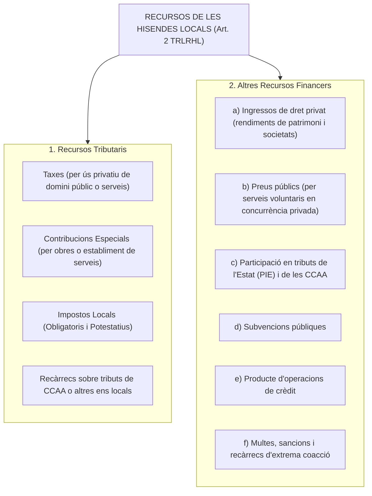
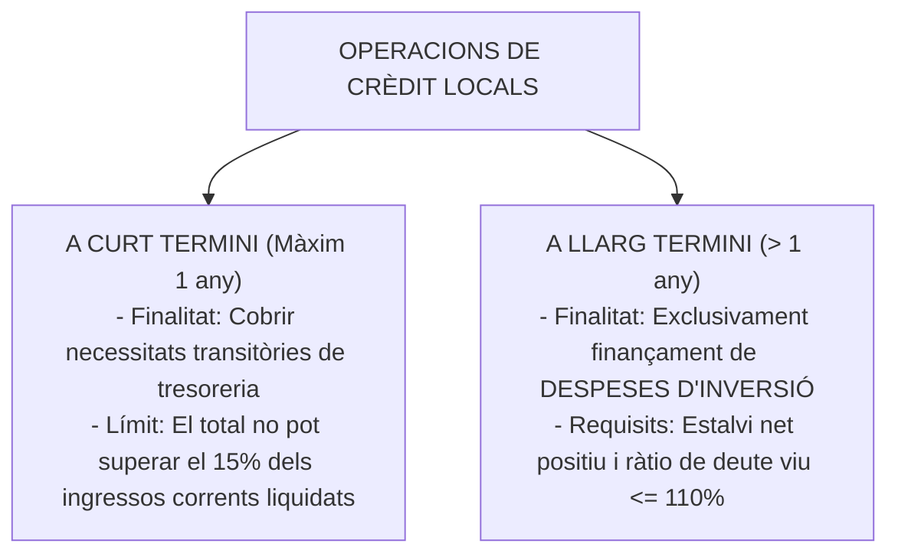

# Tema 6. Recursos de les hisendes locals (segons el Real Decreto Legislativo 2/2004, TRLRHL)

> **Font normativa de referència:** [`CORPUS/Hisenda.pdf`](file:///home/oriol/Projectes/OPOS/CORPUS/Hisenda.pdf)  
> **Text:** Reial Decret Legislatiu 2/2004, de 5 de març, pel qual s'aprova el text refós de la Llei reguladora de les hisendes locals (TRLRHL). Text consolidat.

---

## 1. Principis Generals del Finançament Local

El règim financer de les entitats locals es fonamenta en l'**Article 142 de la Constitució Espanyola**, que consagra el **principi de suficiència financera**:
- Les hisendes locals han de disposar dels mitjans suficients per a l'exercici de les funcions atribuïdes per la llei.
- Es nodreixen fonamentalment de **tributs propis** i de la **participació en els tributs de l'Estat i de les Comunitats Autònomes**.

---

## 2. Classificació dels Recursos de les Hisendes Locals (Art. 2 TRLRHL)

D'acord amb l'article 2 del TRLRHL, la hisenda de les entitats locals està constituïda pels següents recursos:

---

## 3. Els Tributs Propis Locals

Els tributs locals es classifiquen en **Taxes**, **Contribucions Especials** i **Impostos**.

### 3.1. Les Taxes Municipals (Arts. 20 a 27 TRLRHL)
Són tributs el fet imposable dels quals consisteix en:
1. La **utilització privativa o l'aprofitament especial del domini públic local** (ex. terrasses de bars, guals, caixers automàtics a la via pública).
2. La **prestació de serveis públics o la realització d'activitats administratives de competència local** que es refereixin, afectin o beneficiïn de manera particular el subjecte passiu, sempre que:
   - No siguin de sol·licitud o recepció voluntària (siguin coactius/imposats).
   - No es prestin pel sector privat (monopoli de fet o de dret).
- **Límit quantitatiu (Art. 24 TRLRHL):** L'import de les taxes per prestació de serveis **no pot superar en cap cas el cost real o previsible del servei o activitat**.

---

### 3.2. Les Contribucions Especials (Arts. 28 a 37 TRLRHL)
Són tributs que graven l'**obtenció pel subjecte passiu d'un benefici o d'un augment de valor dels seus béns** com a conseqüència de la realització d'**obres públiques** o de l'**establiment o ampliació de serveis públics locals** (ex. asfaltat de carrers, enllumenat nou, xarxa de clavegueram).
- **Repartiment del cost:** L'Ajuntament pot finançar mitjançant contribucions especials fins a un **màxim del 90% del cost de l'obra o servei**, repartit entre els propietaris directament afectats.

---

## 4. El Sistema d'Impostos Municipals (Arts. 59 a 110 TRLRHL)

L'article 59 del TRLRHL estableix un sistema integrat per **3 impostos de caràcter obligatori** i **2 impostos de caràcter potestatiu/voluntari**:

| Tipus | Impost Local | Denominació i Sigla | Caràcter | Fet Imposable |
| :---: | :--- | :---: | :---: | :--- |
| 🔴 **1** | **Impost sobre Béns Immobles** | **IBI** | **Obligatori** | Titularitat de drets reals (concessió, superfície, usdefruit o propietat) sobre béns immobles rústics, urbans o de característiques especials. |
| 🔴 **2** | **Impost sobre Activitats Econòmiques** | **IAE** | **Obligatori** | Exercici en territori municipal d'activitats empresarials, professionals o artístiques. |
| 🔴 **3** | **Impost sobre Vehicles de Tracció Mecànica** | **IVTM** | **Obligatori** | Titularitat de vehicles de tracció mecànica aptes per circular per vies públiques matriculats en el municipi. |
| 🟢 **4** | **Impost sobre Construccions, Instal·lacions i Obres** | **ICIO** | **Potestatiu** | Realització de qualsevol construcció, instal·lació o obra per a la qual s'exigeixi llicència d'obres o comunicació prèvia. |
| 🟢 **5** | **Impost sobre l'Increment de Valor dels Terrenys de Naturalesa Urbana** | **IIVTNU** *(Plusvàlua)* | **Potestatiu** | Increment de valor experimentat pels terrenys de naturalesa urbana posat de manifest per transmissió o constitució de drets reals. |

---

### 4.1. L'Impost sobre Béns Immobles (IBI) - Arts. 60 a 77 TRLRHL
- **Naturalesa:** Impost directe, real i obligatori que grava el valor dels béns immobles.
- **Base Imposable:** És el **valor cadastral** de l'immoble, fixat pel Cadastre Immobiliari (Ministeri d'Hisenda) sumant el valor del sòl i el valor de la construcció.
- **Base Liquidable:** Valor cadastral reduït, si escau, per reduccions legals en casos de revisió cadastral general (reducció decreixent durant 9 anys).
- **Tipus de gravamen:** Fixat per l'Ajuntament en ordenança fiscal dins els marges legals:
  - Béns urbans: mínim 0,4% - màxim 1,10% (ampliable segons població/capitalitat).
  - Béns rústics: mínim 0,3% - màxim 0,90%.
- **Recàrrec per immobles desocupats (Art. 72.4):** Els ajuntaments poden aplicar un recàrrec de fins al **50% (o fins al 100-150% en determinades condicions)** de la quota líquida de l'IBI per a immobles d'ús residencial desocupats amb caràcter permanent.

---

### 4.2. L'Impost sobre Activitats Econòmiques (IAE) - Arts. 78 a 91 TRLRHL
- **Naturalesa:** Impost directe, real i obligatori.
- **Exempcions clau (Art. 82 TRLRHL):**
  1. Les **persones físiques** (tots els autònoms estan exempts).
  2. Els subjectes passius que iniciïn la seva activitat durant els **dos primers períodes impositius**.
  3. Les societats i entitats que tinguin un **import net de la xifra de negocis inferior a 1.000.000 d'euros**.
- **Quota tributària:** Resultat d'aplicar les tarifes de l'IAE segons l'epígraf de l'activitat, multiplicades pel coeficient de ponderació (segons xifra de negocis) i el coeficient de situació física (categoria del carrer).

---

### 4.3. L'Impost sobre Vehicles de Tracció Mecànica (IVTM) - Arts. 92 a 99 TRLRHL
- **Naturalesa:** Impost directe, real i obligatori.
- **Subjecte passiu:** La persona física o jurídica a nom de la qual consti el vehicle en el permís de circulació a **1 de gener de cada any** (període impositiu anual).
- **Tarifes:** Quadre de quotes fixades per la llei en funció dels cavalls fiscals (turismes), cilindrada (motocicletes), places (autobusos) o càrrega útil (camions), que l'Ajuntament pot incrementar mitjançant coeficient fins a un màxim de 2.

---

### 4.4. L'Impost sobre Construccions, Instal·lacions i Obres (ICIO) - Arts. 100 a 103 TRLRHL
- **Naturalesa:** Impost indirecte, real i potestatiu (requereix aprovació prèvia d'Ordenança Fiscal).
- **Base Imposable:** El **cost real i efectiu de la construcció, instal·lació o obra** (cost d'execució material). *No formen part de la base l'IVA, les taxes municipals, els honoraris professionals ni el benefici industrial del contractista*.
- **Tipus de gravamen:** Fixat per l'Ajuntament, amb un **màxim absolut del 4%**.

---

### 4.5. L'Impost sobre l'Increment de Valor dels Terrenys de Naturalesa Urbana (IIVTNU / Plusvàlua) - Arts. 104 a 110 TRLRHL
- **Naturalesa:** Impost directe, real i potestatiu que grava l'increment de valor dels terrenys urbans en transmetre's (venda, herència, donació) o constituir-se drets reals sobre ells.
- **Subjecte passiu:**
  - En transmissions a títol **onerós** (venda): El **transmetent** (el venedor).
  - En transmissions a títol **lucratiu/gratuït** (donació o herència): L'**adquirent** (el qui rep el bé).
- **Mètode de determinació de la base imposable:** Després de la reforma per Reial Decret Llei 26/2021, el contribuent pot triar entre:
  1. *Mètode objectiu:* Multiplicant el valor cadastral del sòl per coeficients legals segons els anys de tinença.
  2. *Mètode de plusvàlua real:* Diferència real entre el valor de transmissió i el valor d'adquisició del sòl.
  3. **No-subjecció:** Si es demostra que no hi ha hagut increment de valor (pèrdua patrimonial), la transmissió no està subjecta a l'impost.
- **Tipus de gravamen:** Fixat per l'Ajuntament, amb un **màxim del 30%**.

---

## 5. Altres Recursos Locals: Participacions, Subvencions i Crèdit

### 5.1. Participació en Tributs de l'Estat (PIE - Arts. 111 a 128 TRLRHL)
Les entitats locals participen dels ingressos tributaris estatals a través de dos models:
1. **Model de Cessió de Tributs:** Aplicable a municipis que siguin capitals de província o de comunitat autònoma, o de població superior a 75.000 habitants (participen amb un percentatge de la recaptació de l'IRPF, IVA i Impostos Especials).
2. **Model General de Variables:** Aplicable a la resta de municipis; es distribueix mitjançant un fons general basat en criteris de població (75%), esforç fiscal (12,5%) i inversa de la capacitat tributària (12,5%).

---

### 5.2. Les Operacions de Crèdit (Arts. 48 a 55 TRLRHL)

- **Règim d'autorització:** Si el deute viu supera el **110% dels ingressos corrents liquidats** de l'exercici anterior, l'entitat local requereix **autorització prèvia de l'òrgan competent** (Departament d'Economia de la Generalitat o Ministeri d'Hisenda).

---

## 6. Quadre Resum i Preguntes Típiques d'Examen Tipus Test

| Pregunta / Concepte Clau | Resposta Correcta / Trampa Freqüent |
| :--- | :--- |
| **Quins són els 3 impostos municipals OBLIGATORIS?** | **IBI, IAE i IVTM** (Art. 59.1 TRLRHL). |
| **Quins són els 2 impostos municipals POTESTATIUS?** | **ICIO i IIVTNU (Plusvàlua)** (Art. 59.2 TRLRHL). |
| **Quin és el límit màxim de recaptació de les taxes?** | **No pot superar el cost real o previsible del servei** (Art. 24 TRLRHL). |
| **Qui està exempt de l'IAE en tot cas?** | Les **persones físiques** (autònoms), els **dos primers anys d'activitat** i empreses amb xifra de negocis **< 1.000.000 €** (Art. 82 TRLRHL). |
| **Quina és la base imposable de l'ICIO?** | El **cost d'execució material de l'obra** (exclosos IVA, taxes i benefici industrial) (Art. 102 TRLRHL). |
| **Quin és el tipus màxim de gravamen de l'ICIO?** | El **4%** (Art. 102.3 TRLRHL). |
| **Qui paga la Plusvàlua (IIVTNU) en una compravenda?** | El **venedor / transmetent** a títol onerós (Art. 106 TRLRHL). |
| **A què es poden destinar les operacions de crèdit a llarg termini?** | Exclusivament a **despeses d'inversió** (Art. 49 TRLRHL). |
| **Quin límit de deute viu marca la necessitat d'autorització creditícia?** | El **110% dels ingressos corrents liquidats** (Art. 53 TRLRHL). |
