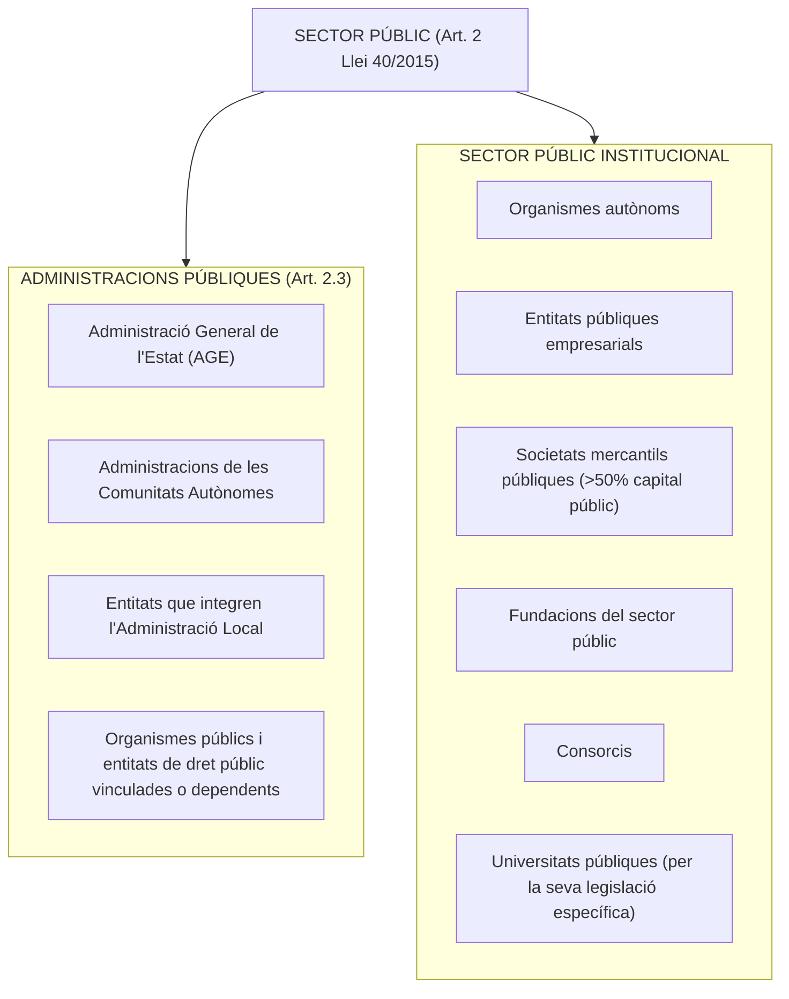
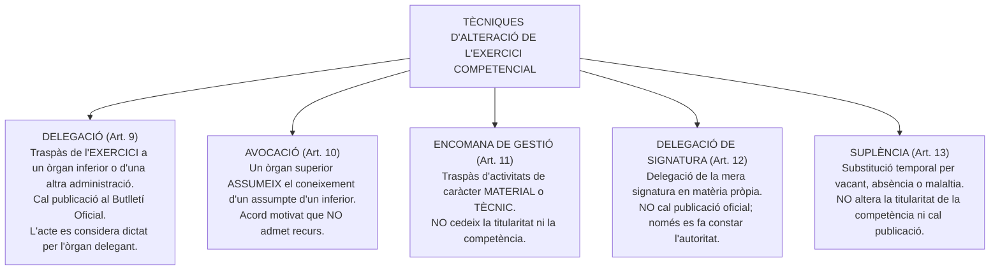
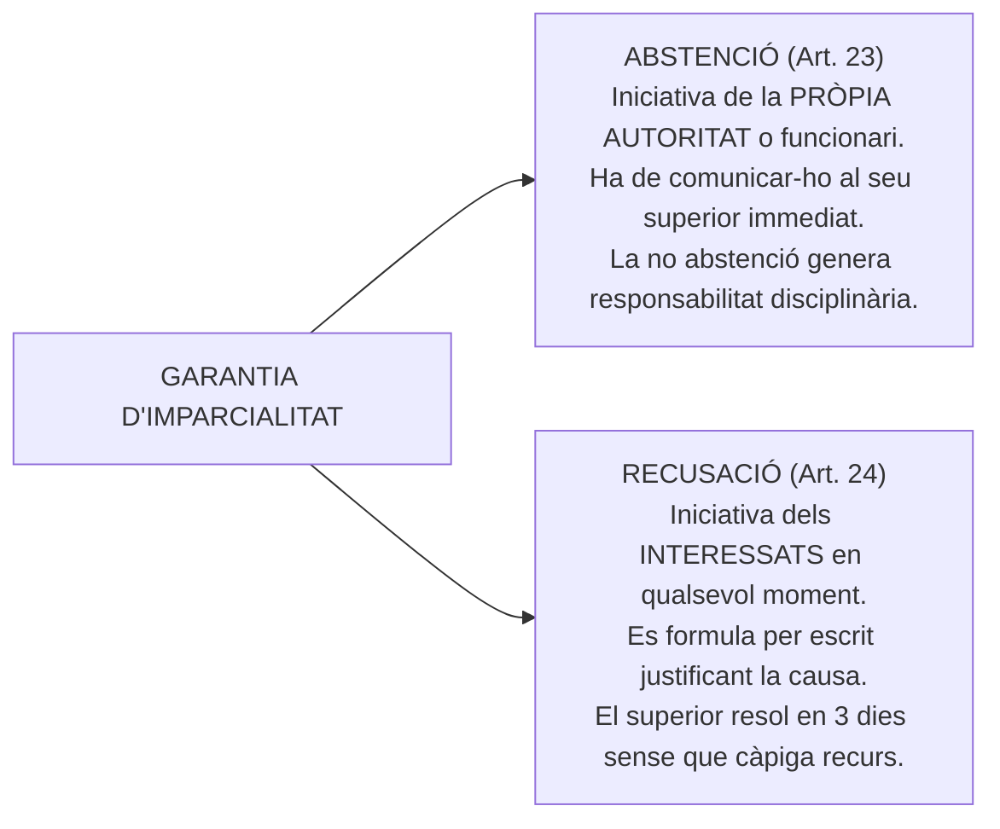
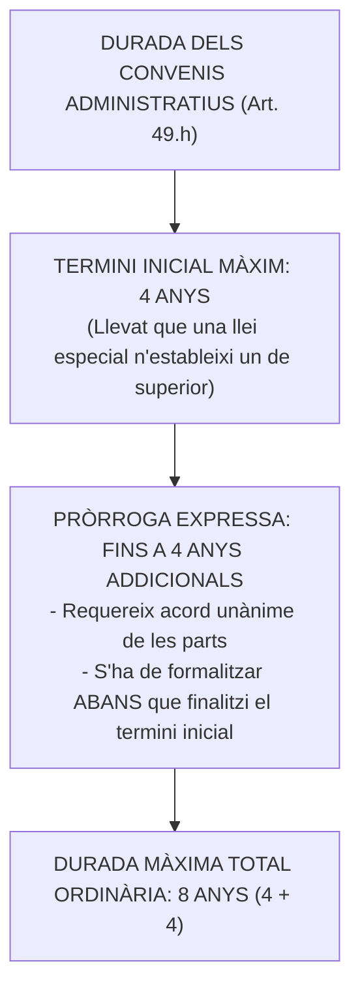

# Tema 7. Disposicions generals, principis d’actuació i funcionament del sector públic. Els convenis

> **Font normativa de referència:** [`CORPUS/40_2015.pdf`](file:///home/oriol/Projectes/OPOS/CORPUS/40_2015.pdf)  
> **Text:** Llei 40/2015, d'1 d'octubre, de règim jurídic del sector públic (LRJSP). Text consolidat.

---

## 1. Objecte i Àmbit Subjectiu del Sector Públic (Arts. 1 i 2 Llei 40/2015)

La **Llei 40/2015 (LRJSP)** estableix les bases del règim jurídic de les administracions públiques, els principis del sistema de responsabilitat i de la potestat sancionadora, i l'organització i funcionament de l'Administració General de l'Estat i del seu sector públic institucional.

---

## 2. Principis Generals d'Actuació i Funcionament (Art. 3 Llei 40/2015)

L'article 3 de la Llei 40/2015 distingeix entre principis d'actuació de servei a la ciutadania i principis de relació interadministrativa:

### 2.1. Principis generals d'actuació:
1. **Eficàcia** en el compliment dels objectius fixats.
2. **Jerarquia** en l'estructura dels seus òrgans administratius.
3. **Descentralització** territorial i funcional.
4. **Desconcentració** de funcions i competències cap als òrgans inferiors.
5. **Coordinació** entre els diferents departaments i administracions.
6. **Transparència** de l'actuació pública i accés a la informació.
7. **Bona fe, confiança legítima i lleialtat institucional**.
8. **Racionalització i agilitat** dels procediments administratius.
9. **Simplicitat, claredat i proximitat** als ciutadans.
10. **Eficiència** en l'assignació i utilització dels recursos públics.
11. **Sostenibilitat ambiental i accessibilitat universal**.

### 2.2. Principis de les relacions interadministratives:
- **Lleialtat institucional:** Respectar l'exercici legítim de les competències d'altres administracions.
- **Adequació a l'ordre de distribució de competències.**
- **Col·laboració, cooperació i coordinació.**
- **Solidaritat interterritorial.**
- **Ponderació dels interessos públics implicats.**

---

## 3. Dinàmica de les Competències Administratives (Arts. 8 a 14 Llei 40/2015)

La competència és **irrenunciable** i s'ha d'exercir pels òrgans que la tinguin atribuïda com a pròpia, llevat dels casos de delegació o avocació (Art. 8).

### 3.1. Matèries indelegables (Art. 9.2 Llei 40/2015)
En cap cas no es poden delegar:
- **a)** Els assumptes que es refereixin a **relacions amb la Prefectura de l'Estat, la Presidència del Govern de la Nació, les Corts Generals, les presidències dels consells de govern de les CCAA i les assemblees legislatives autonòmiques**.
- **b)** L'**adopció de disposicions de caràcter general (reglaments)**.
- **c)** La **resolució de recursos** en els òrgans administratius que hagin dictat els actes objecte de recurs.
- **d)** Les matèries en què així es determini per una norma amb rang de llei.

---

## 4. Òrgans Col·legiats: Funcionament i Règim Jurídic (Arts. 15 a 18 Llei 40/2015)

1. **Règim d'acords i celebració a distància:** Tots els òrgans col·legiats es poden constituir, convocar, celebrar sessions, adoptar acords i remetre actes tant de forma presencial com **a distància per mitjans electrònics** (audioconferència o videoconferència).
2. **Quòrum de constitució (Art. 17.2):** Per a la vàlida constitució de l'òrgan es requereix la presència del **President** i del **Secretari** (o de qui els substitueixi) i d'almenys la **meitat dels seus membres**.
3. **Majories i votacions:** Els acords s'adopten per **majoria de vots**. El President té vot de qualitat per dirimir els empats.
4. **Vots particulars (Art. 17.5):** Els membres que votin en contra o s'abstinguin queden exempts de la responsabilitat que pugui derivar-se dels acords. Poden formular vot particular per escrit en el termini de **2 dies**.
5. **Actes de les sessions (Art. 18):** De cada sessió el Secretari aixeca una acta que especifica els assistents, l'ordre del dia, les decisions i el resultat de les votacions. L'acta es pot aprovar en la mateixa sessió o en la següent.

---

## 5. Abstenció i Recusació (Arts. 23 i 24 Llei 40/2015)

Per garantir la imparcialitat de l'actuació administrativa, el personal al servei de les administracions públiques ha d'abstenir-se d'intervenir en els procediments en què concorri alguna de les causes legals.

### 5.1. Causes d'Abstenció i Recusació (Art. 23.2 Llei 40/2015)
1. Tenir **interès personal** en l'assumpte o ser administrador de societat interessada.
2. Tenir **parentiu de consanguinitat fins al 4t grau** (cosins germans) o d'**afinitat fins al 2n grau** (cunyats/sogres) amb qualsevol dels interessats o assessors.
3. Tenir **amistat íntima** o **enemistat manifesta** amb alguna de les persones esmentades.
4. Haver intervingut com a **pèrit o com a testimoni** en el procediment.
5. Tenir **relació de servei** amb persona física o jurídica interessada directament en l'assumpte, o haver-li prestat serveis professionals en els **dos últims anys**.

---

## 6. El Règim dels Convenis Administratius (Capítol VI, Arts. 47 a 53 Llei 40/2015)

Els convenis són **acords amb efectes jurídics adoptats per les administracions públiques** entre si o amb subjectes de dret privat per a una finalitat comuna.

### 6.1. Tipologia de Convenis (Art. 47.2 Llei 40/2015)
1. **Convenis interadministratius:** Signats entre dues o més administracions públiques (ex. Generalitat i Ajuntament).
2. **Convenis intradministratius:** Signats entre organismes o entitats d'una mateixa administració pública.
3. **Convenis amb subjectes de dret privat.**
4. **Convenis no normatius internacionals.**

> ⚠️ **Queden exclosos del règim de convenis:** Els contractes del sector públic (LCSP) i els convenis col·lectius laborals.

---

### 6.2. Contingut Mínim Obligatori dels Convenis (Art. 49 Llei 40/2015)
1. Subjectes que subscriuen el conveni i capacitat jurídica.
2. Competència en què es fonamenta l'actuació.
3. Objecte del conveni i actuacions a desenvolupar.
4. Obligacions i compromisos econòmics assumits per cadascuna de les parts.
5. Conseqüències aplicables en cas d'incompliment.
6. **Mecanismes de seguiment, vigilància i control** de l'execució (Comissió de Seguiment).
7. **Termini de vigència** del conveni.

---

### 6.3. Termini de Vigència i Pròrroga dels Convenis (Art. 49.h Llei 40/2015)

---

### 6.4. Eficàcia i Extinció dels Convenis (Arts. 48 i 51 Llei 40/2015)
- **Eficàcia (Art. 48.8):** En l'àmbit estatal, els convenis esdevenen eficaços un cop inscrits en el **Registre Electrònic Estatal d'Òrgans i Instruments de Cooperació (REOICO)** i publicats al **BOE**. En l'àmbit català, s'inscriuen en el Registre de Convenis de la Generalitat i es publiquen al DOGC.
- **Causes d'extinció (Art. 51):**
  1. Compliment de les actuacions que en constitueixin l'objecte.
  2. Transcurs del termini de vigència sense haver acordat la pròrroga.
  3. Acord unànime de les parts signants.
  4. Incompliment de les obligacions per part d'algun dels signants.
  5. Decisió judicial declaratòria de la nul·litat del conveni.

---

## 7. Quadre Resum i Preguntes Típiques d'Examen Tipus Test

| Pregunta / Concepte Clau | Resposta Correcta / Trampa Freqüent |
| :--- | :--- |
| **Quin acte es considera dictat per l'òrgan delegant?** | Els actes dictats per **delegació de competències** (Art. 9.4 Llei 40/2015). |
| **Es pot delegar la potestat reglamentària?** | **En cap cas** es pot delegar l'adopció de disposicions de caràcter general (Art. 9.2.b). |
| **Quina diferència hi ha entre encomana de gestió i delegació?** | L'encomana només transfereix activitats **materials o tècniques**, mai la titularitat ni la competència (Art. 11). |
| **Quina és la durada màxima inicial d'un conveni administratiu?** | **4 anys**, prorrogables expressament per un màxim de **4 anys més** (total 8 anys) (Art. 49.h). |
| **Fins a quin grau de parentiu arriba la causa d'abstenció?** | Fins al **4t grau de consanguinitat** (cosins) o **2n grau d'afinitat** (cunyats/sogres) (Art. 23.2.b). |
| **Quin termini té un funcionari per demanar abstenció o l'interessat recusació?** | En qualsevol moment del procediment; el superior resol la recusació en **3 dies** sense recurs (Art. 24). |
| **La manca d'abstenció d'un funcionari invalida automàticament l'acte?** | **No necessàriament** (l'art. 23.4 diu que no implica per si sola la invalidesa, però genera responsabilitat). |
| **Quin quòrum de constitució exigeix la Llei 40/2015 per als òrgans col·legiats?** | **President, Secretari** i almenys la **meitat dels seus membres** (Art. 17.2). |
