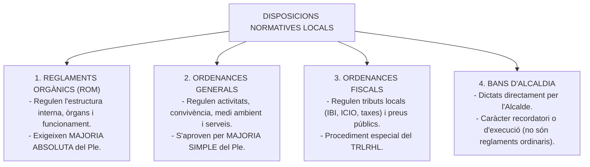
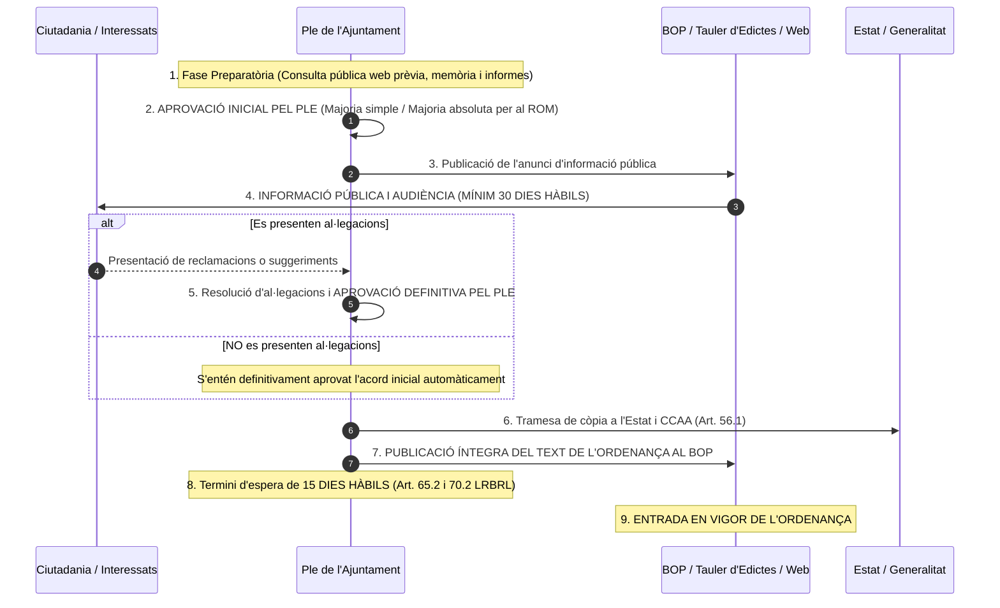

# Tema 8. La potestat normativa de les entitats locals: ordenances i reglaments

> **Fonts normatives de referència:** [`CORPUS/LRBRL.pdf`](file:///home/oriol/Projectes/OPOS/CORPUS/LRBRL.pdf) (Arts. 4.1.a, 47, 49, 70 i 84), [`CORPUS/TRLRBRL.pdf`](file:///home/oriol/Projectes/OPOS/CORPUS/TRLRBRL.pdf) (Arts. 178 a 180) i [`CORPUS/Hisenda.pdf`](file:///home/oriol/Projectes/OPOS/CORPUS/Hisenda.pdf) (Arts. 15 a 19).

---

## 1. Concepte i Fonament de la Potestat Normativa Local

La **potestat normativa local** és la capacitat jurídica atribuïda a les entitats locals territorials per dictar normes jurídiques generals i d'obligat compliment subordinades a les lleis, amb l'objectiu d'autoorganitzar-se i regular la convivència, els serveis i els tributs en el seu àmbit territorial.

### 1.1. Fonament i límits
- **Fonament constitucional:** Arts. 137 i 140 CE (autonomia local per a la gestió dels seus interessos).
- **Fonament legal:** Art. 4.1.a de la LRBRL i Art. 8 de la Llei 40/2015.
- **Límits materials i jeràrquics:**
  1. **Principi de jerarquia normativa:** Les ordenances i reglaments estan subordinats a la Constitució, a les lleis de l'Estat i a les lleis de la Comunitat Autònoma. Mai no poden contradir una norma de rang legal.
  2. **Principi de reserva de llei:** No poden regular matèries reservades constitucionalment a la llei (com la tipificació de delictes, penes, o la creació ex novo de tributs sense cobertura legal).
  3. **Àmbit territorial:** Només tenen vigència dins el terme municipal o l'àmbit territorial de l'entitat local emissora.

---

## 2. Tipologia de Disposicions Normatives Locals

### 2.1. Reglaments Orgànics Municipals (ROM)
- Són les normes d'autoorganització pròpia de la corporació.
- Regulen el règim dels òrgans municipals, el funcionament de les sessions del Ple, les comissions informatives, l'estatut dels regidors, la participació ciutadana i els procediments interns.
- **Requisit de votació (Art. 47.2.a LRBRL):** Requereixen el **vot favorable de la majoria absoluta del nombre legal de membres del Ple**.

### 2.2. Ordenances Generals
- Normes que regulen les relacions entre l'Administració municipal i els veïns en matèries com policia de convivència, civisme, via pública, neteja viària, residus, sorolls, tinença d'animals, mercats ambulants, urbanisme i medi ambient.
- S'aproven per **majoria simple** del Ple.

### 2.3. Ordenances Fiscals
- Regulen els aspectes substantius i formals dels tributs propis de l'Ajuntament (fet imposable, subjectes passius, tipus de gravamen, quotes, bonificacions i recaptació).
- Tenen una regulació específica en els articles 15 a 19 del TRLRHL.

### 2.4. Els Bans d'Alcaldia
- Són manifestacions de la potestat d'autoritat de l'Alcalde (Art. 21.1.m LRBRL).
- **Tipus de bans:**
  - *Bans de recordatori:* Recorden el compliment d'ordenances o lleis existents.
  - *Bans d'urgència o necessitat:* Dictats en casos de catàstrofe o infortuni públic per adoptar mesures immediates de protecció.

---

## 3. Procediment General d'Elaboració d'Ordenances i Reglaments (Art. 49 LRBRL)

L'article 49 de la LRBRL (i l'article 178 del TRLRBRL català) estableix el procediment reglamentari ordinari:

---

### 3.1. Fases detallades del Procediment Ordinari

#### 1. Fase d'Iniciativa i Tramitació Prèvia:
- **Consulta pública prèvia (Art. 133 Llei 39/2015):** A través del portal web de l'Ajuntament per recollir l'opinió dels ciutadans i organitzacions afectades abans de redactar el text.
- Redacció de l'esborrany per l'àrea municipal competent, acompanyat de la **memòria d'impacte**, memòria econòmica i **informe jurídic de la Secretaria**.
- Dictamen preceptiu de la **Comissió Informativa corresponent**.

#### 2. Aprovació Inicial pel Ple:
- El Ple municipal debat i aprova inicialment el projecte d'ordenança o reglament.

#### 3. Informació Pública i Audiència (Art. 49.b LRBRL):
- Publicació de l'anunci al **Butlletí Oficial de la Província (BOP)**, al tauler d'edictes i a la seu electrònica municipal.
- Termini d'exposició pública: **Mínim 30 dies hàbils** per a l'examen de l'expedient i la presentació de reclamacions i suggeriments.

#### 4. Aprovació Definitiva pel Ple (Art. 49.c LRBRL):
- **Si s'han presentat al·legacions:** El Ple ha de resoldre expressament cadascuna de les reclamacions i aprovar el text definitiu.
- **Si NO s'ha presentat cap al·legació:** L'acord d'aprovació inicial es considera **elevat automàticament a definitiu**, sense necessitat d'un nou acord plenari.

#### 5. Publicació Íntegra i Entrada en Vigor (Art. 70.2 LRBRL):
- Perquè l'ordenança produeixi efectes jurídics és requisit indispensable la **publicació íntegra del seu text en el BOP**.
- **Vacatio de 15 dies hàbils:** L'ordenança no entra en vigor fins que hagi transcorregut el termini de **15 dies hàbils** previst a l'article 65.2 de la LRBRL (comptats des de la recepció de l'acord per l'Administració de l'Estat i de la Comunitat Autònoma).

---

## 4. Procediment Especial de les Ordenances Fiscals (Arts. 15 a 19 TRLRHL)

Les ordenances fiscals segueixen una tramitació adaptada a les exigències tributàries i de l'exercici pressupostari anual:

| Fase procedimental | Ordenances Fiscals (Arts. 15-19 TRLRHL) | Ordenances Generals (Art. 49 LRBRL) |
| :--- | :--- | :--- |
| **Aprovació inicial** | Pel **Ple de la Corporació** (majoria simple). | Pel **Ple de la Corporació** (majoria simple o absoluta si és ROM). |
| **Exposició pública** | **Mínim 30 dies hàbils** al BOP, tauler i **diari de major difusió provincial** (en municipis >10.000 hab.). | **Mínim 30 dies hàbils** al BOP, tauler i seu electrònica. |
| **Aprovació definitiva** | Resolució pel Ple o elevació automàtica si no hi ha reclamacions. | Resolució pel Ple o elevació automàtica si no hi ha reclamacions. |
| **Publicació oficial** | **Publicació íntegra al BOP** dels acords i del text. | **Publicació íntegra al BOP** del text. |
| **Entrada en vigor** | **L'endemà de la publicació al BOP**, llevat que l'ordenança fixi una altra data (habitualment l'**1 de gener de l'exercici següent**). *NO s'aplica el termini de 15 dies de l'art. 70.2 LRBRL*. | **Transcorreguts 15 dies hàbils** des de la recepció de l'acord per l'Estat i CCAA (Art. 70.2 LRBRL). |

---

## 5. Règim d'Impugnació de les Disposicions Generals Locals

D'acord amb l'article 112.3 de la Llei 39/2015 i la Llei de la Jurisdicció Contenciosa Administrativa (LJCA):
1. **Inadmissibilitat de recursos administratius ordinaris:** Contra les ordenances i reglaments **no s'admet cap recurs en via administrativa** (no cap recurs d'alçada ni de reposició).
2. **Impugnació jurisdiccional directa:** Els ciutadans i les entitats interessades poden interposar **recurs contenciós administratiu directe** davant el Tribunal Superior de Justícia de Catalunya (TSJC) en el termini de **2 mesos** des de la publicació íntegra al BOP.
3. **Impugnació indirecta:** Es pot recórrer un acte administratiu d'aplicació individual fonamentant el recurs en la il·legalitat de l'ordenança en què es basa.

---

## 6. Quadre Resum i Preguntes Típiques d'Examen Tipus Test

| Pregunta / Concepte Clau | Resposta Correcta / Trampa Freqüent |
| :--- | :--- |
| **Quina majoria cal per aprovar el Reglament Orgànic Municipal (ROM)?** | **Majoria absoluta** del nombre legal de membres del Ple (Art. 47.2.a LRBRL). |
| **Quin és el termini mínim d'informació pública d'una ordenança?** | **30 dies hàbils** (Art. 49.b LRBRL i Art. 17 TRLRHL). |
| **Què passa si no es presenten al·legacions durant els 30 dies?** | L'acord inicial esdevé **definitiu automàticament** sense necessitat de nou acord plenari (Art. 49.c LRBRL). |
| **On s'ha de publicar íntegrament l'ordenança per entrar en vigor?** | Al **Butlletí Oficial de la Província (BOP)** (Art. 70.2 LRBRL). |
| **Quan entra en vigor una ordenança general municipal?** | **Transcorreguts 15 dies hàbils** des de la recepció de la comunicació per l'Estat i CCAA (Art. 70.2 LRBRL). |
| **S'aplica la vacatio legis de 15 dies a les ordenances fiscals?** | **No**. Les ordenances fiscals entren en vigor amb la seva publicació al BOP o en la data que indiquin (habitualment 1 de gener) (Art. 17.4 TRLRHL). |
| **Es pot interposar recurs de reposició contra una ordenança municipal?** | **No**, contra les disposicions de caràcter general no cap cap recurs administratiu; només recurs contenciós administratiu directe en 2 mesos (Art. 112.3 Llei 39/2015). |
