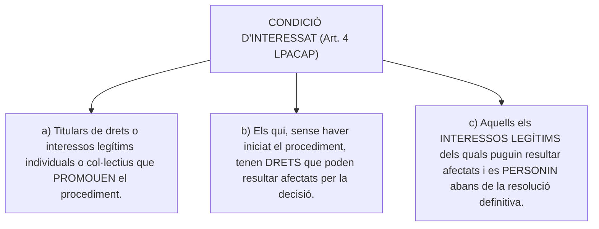
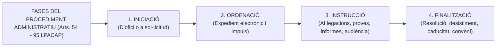
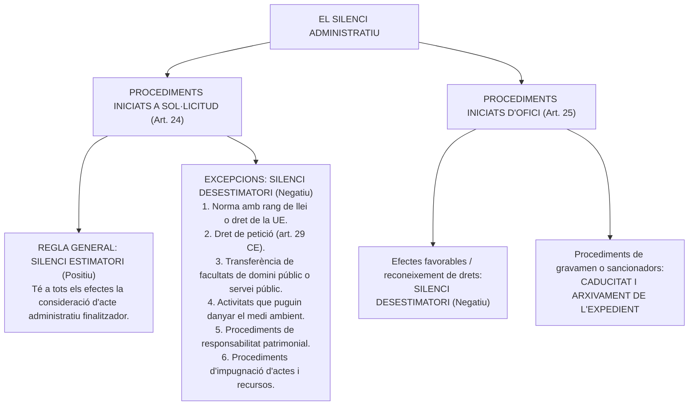

# Tema 9. El procediment administratiu: concepte, principis i importància. Disposicions generals sobre el procediment administratiu. Fases i terminis del procediment administratiu. Formes de finalització del procediment

> **Font normativa de referència:** [`CORPUS/39_2015.pdf`](file:///home/oriol/Projectes/OPOS/CORPUS/39_2015.pdf)  
> **Text:** Llei 39/2015, d'1 d'octubre, del procediment administratiu comú de les administracions públiques (LPACAP). Text consolidat.

---

## 1. Concepte, Principis i Importància del Procediment Administratiu

El **procediment administratiu** és el conjunt ordenat de tràmits i actuacions formalment realitzats segons el curs legalment establert, per dictar un acte administratiu o expressar la voluntat de l'Administració Pública.

### 1.1. Importància i doble dimensió
- **Garantia ciutadana:** Protegeix els drets i interessos legítims dels administrats evitant l'arbitrarietat i assegurant el seu dret de defensa i audiència (**Art. 105.c CE**).
- **Eficàcia administrativa:** Garantir l'encert, la racionalitat i l'oportunitat de les decisions públiques sotmeses plenament a la llei i al Dret (**Art. 103.1 CE**).

### 1.2. Principis rectors del procediment:
1. **Principi d'oficialitat (impuls d'ofici):** El procediment se sotmet al criteri de celeritat i s'impulsa d'ofici en tots els seus tràmits (Art. 71 LPACAP).
2. **Principi d'economia processal:** Concentració de tràmits en un sol acte quan la seva naturalesa ho admeti (Art. 72).
3. **Principi de contradicció i igualtat:** Les parts poden al·legar i aportar proves en igualtat de condicions.
4. **Principi d'antiformalisme:** La manca de requisits formals no essencials es pot esmenar i no invalida automàticament les actuacions.
5. **Tramitació exclusivament electrònica:** El procediment administratiu s'articula mitjançant l'**expedient electrònic** com a mitjà ordinari de treball.

---

## 2. Disposicions Generals: Subjectes, Actes i Notificacions

### 2.1. Els Interessats en el procediment (Arts. 3 i 4 LPACAP)
Tenen capacitat d'obrar davant les administracions públiques les persones físiques o jurídiques que ostentin capacitat civil, els menors d'edat per a l'exercici de drets permesos per l'ordenament sense assistència, i els grups d'afectats, unions i patrimonis autònoms quan la llei ho declari.



---

### 2.2. Obligats a relacionar-se electrònicament (Art. 14.2 LPACAP)
Mentre que les persones físiques poden triar lliurement si es relacionen per mitjans electrònics o en paper (llevat que estiguin obligades per reglament), estan **obligats en tot cas a relacionar-se per mitjans electrònics**:
1. Les **persones jurídiques** (societats mercantils, cooperatives, associacions).
2. Les **entitats sense personalitat jurídica** (comunitats de béns, comunitats de propietaris).
3. Els qui exerceixin una **activitat professional per a la qual es requereixi col·legiació obligatòria** (advocats, arquitectes, metges, etc.).
4. Els qui **representin un interessat** que estigui obligat a relacionar-se electrònicament.
5. Els **empleats de les administracions públiques** per als tràmits i actuacions derivats de la seva condició de funcionari/empleat.

---

### 2.3. L'Acte Administratiu: Nul·litat de ple dret vs. Anul·labilitat

```mermaid
graph TD
    Invalidesa["INVALIDESA DELS ACTES ADMINISTRATIUS"]
    
    Nul·litat["NUL·LITAT DE PLE DRET (Art. 47 LPACAP)<br/>- Vici gravíssim i insubsanable<br/>- No prescriu mai (acció de nul·litat permanent)<br/>- Efectes 'ex tunc' (des de l'origen)"]
    Anul·labilitat["ANUL·LABILITAT (Art. 48 LPACAP)<br/>- Regla general per a qualsevol infracció de l'ordenament<br/>- Subsanable i convalidable per l'òrgan competent<br/>- Efectes 'ex nunc' (des que es declara)"]

    Invalidesa --> Nul·litat
    Invalidesa --> Anul·labilitat
```

#### Causes taxades de Nul·litat de Ple Dret (Art. 47.1 LPACAP):
- **a)** Els que lesionin els **drets i llibertats susceptibles d'empara constitucional** (Arts. 14 a 29 CE).
- **b)** Els dictats per **òrgan manifestament incompetent per raó de la matèria o del territori** *(no per raó de jerarquia)*.
- **c)** Els que tinguin un **contingut impossible**.
- **d)** Els que siguin constitutius d'**infracció penal** o es dictin com a conseqüència d'aquesta.
- **e)** Els dictats **prescindint totalment i absolutament del procediment legalment establert** o de les normes essencials per a la formació de la voluntat dels òrgans col·legiats.
- **f)** Els actes expressos o presumptes contraris a l'ordenament pels quals s'adquireixen **facultats o drets quan es manqui dels requisits essencials** per a la seva adquisició.
- **g)** Qualsevol altre que s'estableixi expressament en una disposició amb rang de llei.

---

### 2.4. El Règim de Notificacions (Arts. 40 a 44 LPACAP)
- **Termini de notificació:** S'ha de cursar dins el termini de **10 dies hàbils** a partir de la data en què l'acte s'hagi dictat.
- **Contingut obligatori:** Text íntegre de la resolució, indicació de si posa fi o no a la via administrativa, recursos procedents, òrgan davant el qual interposar-los i termini de presentació.
- **Pràctica de notificacions electròniques (Art. 43):** Es posa a disposició a la seu electrònica / adreça electrònica habilitada. S'entén rebutjada quan transcorren **10 dies naturals** des de la posada a disposició sense que s'hagi accedit al seu contingut.
- **Pràctica en paper (Art. 42):** Si el destinatari no està al domicili, es fa constar en acta i es repeteix l'intent per una sola vegada i en una hora distinta dins els **3 dies següents** (si el primer va ser abans de les 15 h, el segon després de les 15 h amb marge de 3 hores).

---

## 3. Fases del Procediment Administratiu (Títol IV LPACAP)



---

### 3.1. Fase d'Iniciació (Arts. 54 a 69 LPACAP)
1. **D'ofici:** Per acord de l'òrgan competent per pròpia iniciativa, ordre superior, petició raonada d'altres òrgans o denúncia d'un ciutadà.
2. **A sol·licitud de la persona interessada (Art. 66):**
   - Contingut: Nom/cognoms o raó social, identificació del mitjà/lloc per a notificacions, fets, raons i petició concretada amb claredat, lloc, data, signatura i òrgan o unitat a què s'adreça.
   - **Esmena i millora (Art. 68):** Si la sol·licitud no reuneix els requisits, es requereix l'interessat perquè en un termini de **10 dies hàbils** esmeni la falta o aporti els documents preceptius, amb advertiment que si no ho fa es considerarà que desisteix de la seva petició. Aquest termini es pot ampliar prudencialment fins a 5 dies si no es tracta de procediments selectius o de concurrència competitiva.
3. **Declaració responsable i comunicació prèvia (Art. 69):** Documents que habiliten directament per a l'inici d'una activitat des del dia de la seva presentació, sens perjudici de les facultats posteriors de comprovació i inspecció de l'Administració.

---

### 3.2. Fase d'Ordenació (Arts. 70 a 74 LPACAP)
- **Expedient administratiu (Art. 70):** Conjunt ordenat de documents i actuacions en format electrònic que serveixen d'antecedent i fonament a la resolució.
- **Impuls d'ofici i principi de celeritat:** Tots els tràmits que admetin un impuls simultani es despatxen en un sol acte.
- **Termini general per a tràmits dels interessats (Art. 73):** Si la norma no fixa un altre termini, els tràmits que hagin d'emplenar els interessats s'han de realitzar en el termini de **10 dies hàbils**.

---

### 3.3. Fase d'Instrucció (Arts. 75 a 83 LPACAP)
Consisteix en la realització dels actes necessaris per a la determinació, coneixement i comprovació de les dades en virtut de les quals s'ha de pronunciar la resolució:
- **Al·legacions (Art. 76):** Els interessats poden adduir al·legacions i aportar documents en qualsevol moment anterior al tràmit d'audiència.
- **Prova (Arts. 77 i 78):** L'instructor pot obrir un període de prova per un termini **no superior a 30 dies ni inferior a 10 dies hàbils**.
- **Informes (Arts. 79 i 80):** Com a regla general són **facultatius i no vinculants**. S'han d'emetre en el termini de **10 dies hàbils**.
- **Tràmit d'Audiència (Art. 82):** Tràmit essencial que s'efectua immediatament abans de redactar la proposta de resolució, posant l'expedient a disposició dels interessats per un termini de **no menys de 10 dies ni més de 15 dies hàbils** perquè puguin al·legar i presentar els documents que estimin pertinents. *(Es pot prescindir d'aquest tràmit quan no figurin en el procediment ni es tinguin en compte altres fets o proves que els adduïts per l'interessat)*.
- **Informació pública (Art. 83):** Quan la naturalesa del procediment ho requereixi, s'anuncia al butlletí oficial per un termini **mínim de 20 dies hàbils**.

---

### 3.4. Fase de Finalització (Arts. 84 a 95 LPACAP)
Posen fi al procediment administratiu:

| Forma de Finalització | Regulació | Concepte i característiques |
| :--- | :---: | :--- |
| **1. Resolució expressa** | **Arts. 88-92** | Forma normal. Decideix totes les qüestions plantejades pels interessats i les derivades de l'expedient. Ha de ser motivada en els casos de l'art. 35 (actes que limitin drets, resolguin recursos, etc.). |
| **2. Desistiment** | **Art. 94** | L'interessat declara la seva voluntat de **no continuar amb el procediment concret** (no renuncia al dret de fons; podrà tornar-lo a exercir en un altre procediment futur si no ha prescrit). |
| **3. Renúncia** | **Art. 94** | L'interessat **abandona el mateix dret substantiu** en què fonamentava la seva pretensió (sempre que la renúncia no estigui prohibida per l'ordenament ni afecti tercers o l'interès públic). |
| **4. Declaració de Caducitat** | **Art. 95** | En procediments iniciats a sol·licitud de l'interessat, quan aquest s'hagi paralitzat per causa imputable a ell mateix. L'Administració li adverteix que transcorreguts **3 mesos** sense complir el tràmit, es declararà la caducitat i arxivament. |
| **5. Impossibilitat sobrevinguda** | **Art. 84.2** | Per causes sobrevingudes de caràcter material o jurídic (ex. desaparició de l'objecte del procediment o mort de l'interessat en drets personalíssims). |
| **6. Terminació convencional** | **Art. 86** | Acords, pactes o convenis entre l'Administració i els interessats que finalitzen el procediment. |

---

## 4. Obligació de Resoldre, Còmput de Terminis i Silenci Administratiu

### 4.1. L'Obligació de Resoldre (Art. 21 LPACAP)
- L'Administració està obligada a dictar resolució expressa i notificar-la en **tots els procediments**, sigui quin sigui el seu inici.
- **Termini màxim per resoldre i notificar:**
  - El que fixi la norma reguladora del procediment concret (que no pot excedir de 6 mesos llevat que una norma amb rang de llei o de la UE n'estableixi un de superior).
  - Si la norma no fixa cap termini: El termini és de **3 mesos**.
- **Còmput inicial del termini:**
  - En procediments d'ofici: Des de la **data de l'acord d'iniciació**.
  - En procediments a sol·licitud: Des de la **data en què la sol·licitud hagi tingut entrada en el registre electrònic de l'Administració competent**.

---

### 4.2. Còmput de Terminis (Art. 30 LPACAP)
- **Dies hàbils (Regla general):** S'exclouen del còmput els **dissabtes, diumenges i els dies declarats festius**. Comencen a comptar des de l'endemà de la notificació o publicació.
- **Dies naturals:** Només quan una llei o dret de la UE ho declari expressament.
- **Terminis per mesos o anys:** Es computen **de data a data** (començant l'endemà de la notificació i finalitzant el mateix dia ordinal del mes o any de venciment). Si en el mes de venciment no hi ha dia equivalent, el termini expira el darrer dia del mes.

---

### 4.3. El Silenci Administratiu (Arts. 24 i 25 LPACAP)



> ⚠️ **La regla del Doble Silenci en Recursos Administratius (Art. 24.1 paràgraf 4):**
> Quan s'hagi interposat un **recurs d'alçada contra la desestimació per silenci administratiu** d'una sol·licitud, si l'òrgan competent no resol el recurs en el termini de 3 mesos, el silenci sobre el recurs esdevé **POSITIU (estimatori)**, llevat que es tracti de matèries excepcionades (domini públic, medi ambient, responsabilitat patrimonial o dret de petició).

---

## 5. Quadre Resum i Preguntes Típiques d'Examen Tipus Test

| Pregunta / Concepte Clau | Resposta Correcta / Trampa Freqüent |
| :--- | :--- |
| **Qui està obligat en tot cas a la relació electrònica amb l'Administració?** | Les **persones jurídiques**, entitats sense personalitat, professionals col·legiats i empleats públics (Art. 14.2 LPACAP). |
| **Quina és la causa de nul·litat per incompetència?** | Incompetència manifesta per raó de la **matèria o del territori** (la incompetència jeràrquica és causa d'anul·labilitat convalidable) (Art. 47.1.b). |
| **Quin termini té l'interessat per esmenar la sol·licitud defectuosa?** | **10 dies hàbils** (ampliables fins a 5 dies més) (Art. 68 LPACAP). |
| **Quina és la durada del tràmit d'audiència a l'interessat?** | **Entre 10 i 15 dies hàbils** (Art. 82.2 LPACAP). |
| **Quin termini de paràlisi de l'interessat provoca la caducitat?** | **3 mesos** previs advertiment exprés de l'Administració (Art. 95 LPACAP). |
| **Com es computen els dies com a regla general a la Llei 39/2015?** | Com a **dies hàbils** (s'exclouen dissabtes, diumenges i festius) (Art. 30.2 LPACAP). |
| **Quan s'entén rebutjada una notificació electrònica?** | Transcorreguts **10 dies naturals** sense accedir al seu contingut (Art. 43.2 LPACAP). |
| **Quin és el termini supletori màxim per resoldre un procediment?** | **3 mesos** (Art. 21.3 LPACAP). |
| **Què passa si venç el termini en un procediment sancionador sense resolució?** | Es produeix la **caducitat i arxivament** de les actuacions (Art. 25.1.b LPACAP). |
