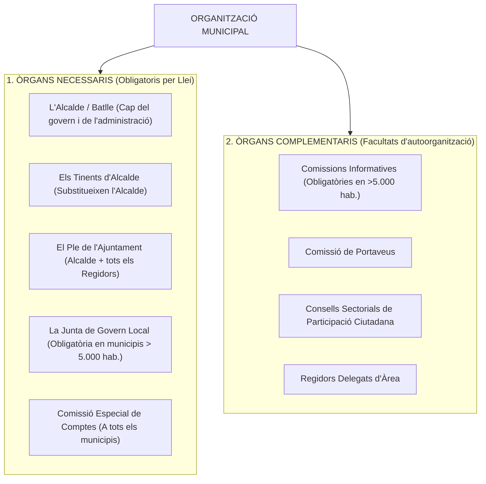
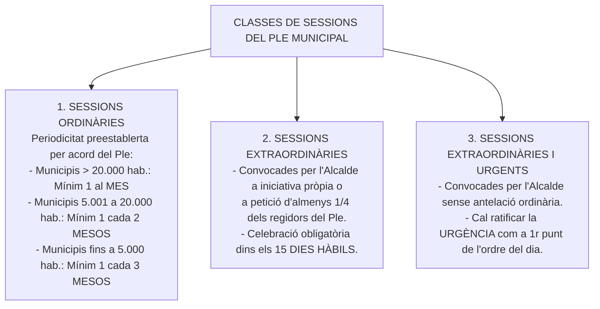
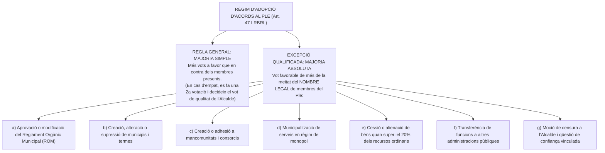

# Tema 10. L'organització municipal: òrgans necessaris i òrgans complementaris, règims de sessions i acords dels òrgans de govern local. Funcionament dels òrgans col·legiats d’àmbit municipal

> **Fonts normatives de referència:** [`CORPUS/LRBRL.pdf`](file:///home/oriol/Projectes/OPOS/CORPUS/LRBRL.pdf) (Arts. 19 a 24, 46 i 47) i [`CORPUS/TRLRBRL.pdf`](file:///home/oriol/Projectes/OPOS/CORPUS/TRLRBRL.pdf) (Arts. 44 a 60 i 98 a 105).

---

## 1. L'Estructura de l'Organització Municipal

El govern i l'administració del municipi corresponen a l'**Ajuntament**, integrat per l'**Alcalde / Batlle** i els **Regidors** (Art. 140 CE i Art. 19 LRBRL). L'organització municipal es divideix entre **òrgans necessaris** (preceptius per llei) i **òrgans complementaris** (potestatius).

---

## 2. Els Òrgans Municipals Necessaris

### 2.1. L'Alcalde / Batlle (Art. 21 LRBRL / Art. 53 TRLRBRL)
L'Alcalde és el president de la Corporació i ostenta la màxima representació del municipi:
- **Elecció (LOREG):** És elegit pels regidors en la sessió constitutiva de l'Ajuntament (cap de llista amb majoria absoluta o, en defecte d'aquesta, el cap de la llista més votada).
- **Competències pròpies principals (Art. 21.1 LRBRL):**
  1. Dirigir el govern i l'administració municipal.
  2. Representar l'Ajuntament.
  3. Convocar i presidir les sessions del Ple, de la Junta de Govern Local i de qualsevol altre òrgan municipal col·legiat, i decidir els empats amb **vot de qualitat**.
  4. Dirigir, inspeccionar i impulsar els serveis i les obres municipals.
  5. Dictar bans.
  6. L'aprovació del desenvolupament de la gestió econòmica d'acord amb el Pressupost aprovat, disposar despeses dins els límits de la seva competència i ordenar pagaments.
  7. Aprovar l'oferta d'ocupació pública d'acord amb el Pressupost, contractar i acomiadar el personal laboral i sancionar les faltes (llevat de separació del servei dels funcionaris).
  8. Exercir la prefectura superior de tot el personal i de la Policia Local.
  9. L'atorgament de llicències (llevat que la legislació sectorial ho atribueixi al Ple).
  10. Sancionar les faltes per infracció d'ordenances municipals.
- **Delegació de competències:** L'Alcalde pot delegar l'exercici de les seves atribucions en la **Junta de Govern Local**, en els **Tinents d'Alcalde** o en qualsevol **Regidor**, excepte aquelles expressament indelegables per la llei (convocar i presidir Plens, vot de qualitat, bans, comandament de la policia, etc.).

---

### 2.2. Els Tinents d'Alcalde (Art. 23.3 LRBRL / Art. 55 TRLRBRL)
- Són nomenats i revocats lliurement per l'Alcalde d'entre els membres de la Junta de Govern Local (o d'entre els regidors on aquesta no existeixi), donant-ne compte al Ple.
- **Funció exclusiva:** Substituir l'Alcalde, per l'ordre del seu nomenament (1r, 2n, 3r Tinent d'Alcalde), en els casos de **vacant, absència o malaltia**.

---

### 2.3. El Ple de l'Ajuntament (Art. 22 LRBRL / Art. 52 TRLRBRL)
Format per tots els regidors i presidit per l'Alcalde, és l'òrgan col·legiat de màxima representació política:
- **Competències indelegables del Ple (Art. 22.2 LRBRL):**
  1. El control i la fiscalització dels òrgans de govern.
  2. Els acords relatius a la participació en organitzacions supramunicipals, alteració del terme municipal, creació o supressió de municipis i adopció o modificació de la bandera, ensenya o escut.
  3. L'**aprovació del Reglament Orgànic Municipal (ROM) i de les Ordenances**.
  4. La determinació dels recursos tributaris propis i l'**aprovació i modificació dels Pressupostos**.
  5. L'aprovació de la plantilla de personal i de la relació de llocs de treball (RLT).
  6. L'alteració de la qualificació jurídica dels béns de domini públic.
  7. L'aprovació dels instruments de planejament urbanístic general (POUM).
  8. L'exercici d'accions judicials i administratives i la transacció sobre assumptes de la seva competència.
  9. La votació sobre la **moció de censura a l'Alcalde** i la **qüestió de confiança**.

---

### 2.4. La Junta de Govern Local (Art. 23 LRBRL / Art. 54 TRLRBRL)
- **Obligatorietat:** Obligatòria en tots els municipis amb població **superior a 5.000 habitants** (i en els de menor població si ho disposa el ROM o ho acorda el Ple per majoria absoluta).
- **Composició:** Integrada per l'**Alcalde** (que la presideix) i un nombre de regidors **no superior al terç (1/3) del nombre legal de membres del Ple**, nomenats i separats lliurement per l'Alcalde.
- **Atribucions:** L'assistència permanent a l'Alcalde en l'exercici de les seves atribucions i les competències que li deleguin expressament l'Alcalde o el Ple.

---

### 2.5. La Comissió Especial de Comptes (Art. 116 LRBRL / Art. 58 TRLRBRL)
- Obligatòria en **tots els ajuntaments**.
- Està integrada per membres de **tots els grups polítics integrants de la corporació**, d'acord amb el principi de proporcionalitat o vot ponderat.
- **Funció preceptiva:** L'examen, estudi i dictamen del **Compte General de la Corporació** (abans de l'1 de juny de cada any) previ a la seva aprovació pel Ple.

---

## 3. Els Òrgans Municipals Complementaris

1. **Comissions Informatives (Arts. 20.1.c LRBRL i 60 TRLRBRL):**
   - Òrgans sense atribució resolutòria que tenen per funció l'estudi, informe o consulta prèvia dels assumptes que s'han de sotmetre a la decisió del Ple o de la Junta de Govern Local quan actuï per delegació.
   - Són **obligatòries en municipis >5.000 habitants** (i en els de menys si ho preveu el ROM).
   - **Garantia de pluralisme:** Tots els grups polítics municipals tenen dret a comptar amb representació a les comissions en proporció al nombre de regidors que tinguin al Ple.
2. **Comissió de Portaveus:** Òrgan de caràcter consultiu integrat pels portaveus de cada grup polític per coordinar l'ordre del dia i el desenvolupament dels debats als Plens.
3. **Consells Sectorials:** Òrgans de participació ciutadana i consulta que canalitzen la participació de les entitats veïnals i sectors socials en matèries concretes (cultura, joventut, esports, urbanisme).

---

## 4. Règim de Sessions i Funcionament dels Òrgans Col·legiats Municipals

### 4.1. Classes de Sessions del Ple (Art. 46 LRBRL / Art. 98 TRLRBRL)

---

### 4.2. Convocatòria, Ordre del Dia i Documentació
- **Convocatòria:** Correspon a l'Alcalde, acompanyada de l'ordre del dia fixat per ell mateix.
- **Antelació mínima de convocatòria:** S'ha de notificar als regidors amb almenys **dos dies hàbils d'antelació** a la data de la sessió.
- **Dret d'accés a l'expedient:** Des del mateix moment de la convocatòria, tota la documentació íntegra dels assumptes compresos en l'ordre del dia ha d'estar a disposició dels regidors a la Secretaria municipal per al seu examen.

---

### 4.3. Quòrum de Constitució del Ple (Art. 46.2.c LRBRL)
- Perquè el Ple es pugui constituir vàlidament es requereix l'assistència d'almenys **un terç (1/3) del nombre legal de membres de la corporació**, que mai podrà ser inferior a **tres**.
- Aquest quòrum s'ha de mantenir durant tota la sessió.
- És preceptiva en tot cas l'assistència de l'**Alcalde** i del **Secretari** (o dels qui legalment els substitueixin).
- **Publicitat:** Les sessions del Ple són **públiques**. Només poden ser secretes quan es debatin afers que afectin el dret fonamental a l'honor o a la intimitat (art. 18 CE) mitjançant acord adoptat per majoria absoluta.

---

### 4.4. Règim d'Adopció d'Acords i Majories (Art. 47 LRBRL)

---

## 5. La Moció de Censura i la Qüestió de Confiança a l'Alcalde (LOREG)

### 5.1. La Moció de Censura a l'Alcalde (Art. 197 LOREG)
- **Requisits de presentació:** Ha de ser proposada per escrit per almenys la **majoria absoluta del nombre legal de regidors** i ha d'incloure un **candidat a l'Alcaldia** (*moció constructiva*).
- **Signatura de trànsfugues:** Si algun dels signants forma o ha format part del grup polític de l'Alcalde, la majoria exigida s'incrementa en el mateix nombre de regidors trànsfugues.
- **Convocatòria automàtica:** El Ple queda convocat automàticament per al **desè dia hàbil següent** al seu registre a les 12:00 hores.
- **Aprovació:** Requereix el vot favorable de la **majoria absoluta del nombre legal de membres del Ple**.

---

### 5.2. La Qüestió de Confiança vinculada (Art. 197 bis LOREG)
- L'Alcalde pot plantejar al Ple una qüestió de confiança vinculada a:
  1. L'aprovació o modificació dels **Pressupostos generals anuals**.
  2. L'aprovació o modificació del **Reglament Orgànic Municipal (ROM)**.
  3. L'aprovació del planejament urbanístic general.
- Si el Ple rebutja la qüestió de confiança i en el termini d'**un mes** no es presenta una moció de censura amb candidat alternatiu per majoria absoluta, **l'acord o pressupost s'entén automàticament aprovat** i l'Alcalde continua en el càrrec.

---

## 6. Quadre Resum i Preguntes Típiques d'Examen Tipus Test

| Pregunta / Concepte Clau | Resposta Correcta / Trampa Freqüent |
| :--- | :--- |
| **A partir de quants habitants és obligatòria la Junta de Govern Local?** | En municipis de **més de 5.000 habitants** (Art. 20.1.b LRBRL). |
| **Quin és el límit màxim de regidors que poden formar la Junta de Govern?** | **Un terç (1/3) del nombre legal de membres del Ple**, a més de l'Alcalde (Art. 23.1 LRBRL). |
| **Amb quina periodicitat s'ha de reunir el Ple en municipis >20.000 hab.?** | Com a mínim **una vegada al mes** (Art. 46.2.a LRBRL). |
| **Quin és el quòrum mínim de constitució del Ple?** | **Un terç (1/3) dels membres**, sense baixar mai de **3** (Art. 46.2.c LRBRL). |
| **Quina antelació mínima té la convocatòria del Ple?** | Almenys **dos dies hàbils** d'antelació (Art. 46.2.b LRBRL). |
| **Quina majoria cal per aprovar el ROM o municipalitzar serveis en monopoli?** | **Majoria absoluta** del nombre legal de membres del Ple (Art. 47.2 LRBRL). |
| **Són públiques les sessions de la Junta de Govern Local?** | **No**, són secretes/a porta tancada com a regla general (Art. 70.1 LRBRL). |
| **Quin és el termini per celebrar un Ple extraordinari sol·licitat per 1/4 dels regidors?** | Dins els **15 dies hàbils següents** a la sol·licitud (Art. 46.2.a LRBRL). |
