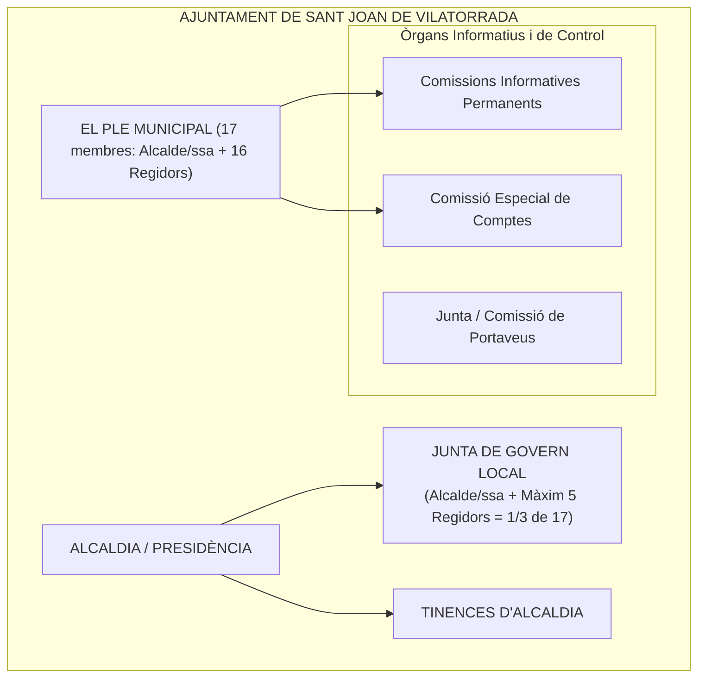
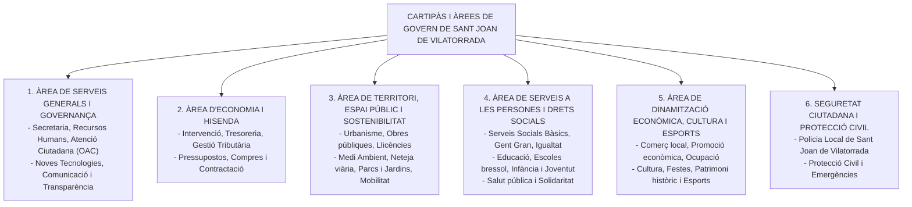

# Tema 11. L’organització municipal de l’Ajuntament de Sant Joan de Vilatorrada

> 📌 **Nota sobre les fonts d'informació:**  
> Aquest tema aplica el marc legal general ([`CORPUS/LRBRL.pdf`](file:///home/oriol/Projectes/OPOS/CORPUS/LRBRL.pdf) i [`CORPUS/TRLRBRL.pdf`](file:///home/oriol/Projectes/OPOS/CORPUS/TRLRBRL.pdf)) a l'estructura organitzativa de l'**Ajuntament de Sant Joan de Vilatorrada** (comarca del Bages, Catalunya). S'indica expressament l'ús de la font d'informació pública organitzativa municipal (Cartipàs municipal, Reglament Orgànic Municipal i dades oficials de població) com a complement al corpus general.

---

## 1. Dades Generals i Determinació del Nombre de Regidors

### 1.1. Població i escala electoral (Art. 179 LOREG)
Sant Joan de Vilatorrada és un municipi de la comarca del Bages amb una població situada en el tram de **10.001 a 20.000 habitants** (aproximadament 11.000 habitants).

D'acord amb l'escala de l'article 179 de la Llei Orgànica del Règim Electoral General (LOREG):

| Tram de Població del Municipi | Nombre Legal de Regidors |
| :--- | :---: |
| Fins a 100 habitants | 3 regidors |
| De 101 a 250 habitants | 5 regidors |
| De 251 a 1.000 habitants | 7 regidors |
| De 1.001 a 2.000 habitants | 9 regidors |
| De 2.001 a 5.000 habitants | 11 regidors |
| De 5.001 a 10.000 habitants | 13 regidors |
| **De 10.001 a 20.000 habitants (Sant Joan de Vilatorrada)** | **17 regidors** |
| De 20.001 a 50.000 habitants | 21 regidors |
| De 50.001 a 100.000 habitants | 25 regidors |

> 🏛️ **Composició del Ple de Sant Joan de Vilatorrada:**  
> El Ple municipal està format pel **Batlle/Alcaldessa** i **16 Regidors/Regidores**, sumant un **total de 17 membres corporatius**.

---

## 2. Òrgans de Govern i Estructura Institucional de Sant Joan de Vilatorrada

En tractar-se d'un municipi de més de 5.000 habitants, Sant Joan de Vilatorrada compta amb l'estructura completa d'òrgans necessaris i complementaris:

---

### 2.1. L'Alcaldia i les Tinències d'Alcaldia
- **L'Alcalde/Alcaldessa:** Presideix la corporació, representa l'Ajuntament, convoca i presideix els Plens i la Junta de Govern Local, dirigeix l'administració municipal i ostenta la prefectura de la Policia Local.
- **Tinències d'Alcaldia:** Nomenades per decret d'alcaldia d'entre els membres de la Junta de Govern Local. Substitueixen l'Alcaldia per ordre correlatiu (1r, 2n, 3r Tinent d'Alcalde) en cas de vacant, absència o malaltia.

---

### 2.2. La Junta de Govern Local de Sant Joan de Vilatorrada
- **Obligatorietat:** Preceptiva en superar els 5.000 habitants (Art. 20.1.b LRBRL).
- **Límit de membres (Art. 23.1 LRBRL):** No pot superar el terç del nombre legal de membres del Ple:
  $$\text{Límit JGL} = \frac{17}{3} = 5,66 \longrightarrow \mathbf{\text{Màxim 5 regidors/es}}$$
  (a més de l'Alcalde/Alcaldessa que la presideix).
- **Periodicitat ordinària:** Es reuneix habitualment de forma **quinzenal o setmanal** per exercir les competències delegades per l'Alcaldia i pel Ple (llicències d'obres majors, contractació menor, aprovació de factures, convenis ordinaris).

---

### 2.3. El Ple Municipal i el Règim de Sessions
- **Periodicitat mínima obligatòria per llei (Art. 46.2.a LRBRL):** En municipis d'entre 5.001 i 20.000 habitants, com a mínim **una sessió ordinària cada 2 mesos** *(a la pràctica, l'acord d'organització municipal de l'Ajuntament fixa sessions plenàries ordinàries de caràcter mensual)*.
- **Quòrum de constitució:** Requereix l'assistència de com a mínim **6 membres** (1/3 de 17 = 5,67 -> 6 membres) i la presència de l'Alcalde/ssa i Secretari/ària.

---

### 2.4. Comissions Informatives i Comissió Especial de Comptes
1. **Comissions Informatives:** Òrgans d'estudi i dictamen preceptiu no vinculant dels assumptes que van al Ple. Compten amb representació de tots els grups municipals segons la seva representativitat (o vot ponderat).
2. **Comissió Especial de Comptes:** Examina i dictamina el Compte General abans del seu sotmetiment al Ple. Integrada per representants de tots els grups polítics amb presència al consistori.
3. **Junta de Portaveus:** Reuneix els portaveus dels grups municipals sota la presidència de l'Alcaldia per preparar i agilitzar els debats plenaris.

---

## 3. L'Estructura Executiva del Cartipàs Municipal

L'organització executiva de l'Ajuntament s'estructura en **Àrees de Govern**, al capdavant de cadascuna de les quals hi ha un regidor o regidora delegada que coordina els serveis tècnics i administratius:

---

## 4. Administració Electrònica i Atenció a la Ciutadania a Sant Joan de Vilatorrada

- **Oficina d'Atenció Ciutadana (OAC):** Registre general d'entrada i sortida, atenció presencial multicanal i finestreta única de tramitació.
- **Seu Electrònica municipal:** Integrada amb les eines del Consorci d'Administració Oberta de Catalunya (Consorci AOC):
  - **e-TRAM:** Tramitació electrònica de sol·licituds ciutadanes.
  - **e-NOTUM:** Notificacions administratives electròniques fefaents.
  - **e-FACT:** Bústia de recepció i registre de factures electròniques.
  - **Portal de Transparència:** Publicació activa de la informació institucional, organitzativa, econòmica i contractual del consistori.

---

## 5. Quadre Resum i Preguntes Típiques d'Examen

| Pregunta / Concepte Clau | Resposta Correcta per a Sant Joan de Vilatorrada |
| :--- | :--- |
| **Quants regidors té l'Ajuntament de Sant Joan de Vilatorrada?** | **17 regidors/es** (per trobar-se en el tram de 10.001 a 20.000 habitants segons art. 179 LOREG). |
| **És obligatòria la Junta de Govern Local a Sant Joan de Vilatorrada?** | **Sí**, per ser un municipi de més de 5.000 habitants (Art. 20.1.b LRBRL). |
| **Quin és el nombre màxim de regidors a la Junta de Govern Local?** | **5 regidors/es** més l'Alcalde/Alcaldessa (1/3 de 17 = 5,66). |
| **Amb quina periodicitat mínima s'ha de reunir el Ple per llei?** | Com a mínim **una vegada cada dos mesos** segons art. 46.2.a LRBRL (sens perjudici de fixar periodicitat mensual pel mateix Ple). |
| **Quin és el quòrum mínim per constituir vàlidament el Ple?** | **6 membres** (1/3 de 17 membres = 5,67 -> 6 regidors) més Alcalde/ssa i Secretari/ària. |
| **Quin instrument normatiu regula l'autoorganització del consistori?** | El **Reglament Orgànic Municipal (ROM)**, aprovat per majoria absoluta del Ple (Art. 47.2.a LRBRL). |
| **Quina comissió és preceptiva a tots els ajuntaments per revisar els comptes?** | La **Comissió Especial de Comptes** (Art. 116 LRBRL). |
