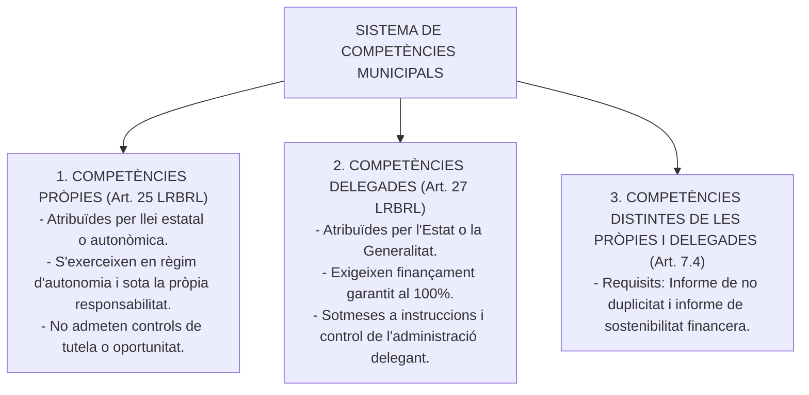
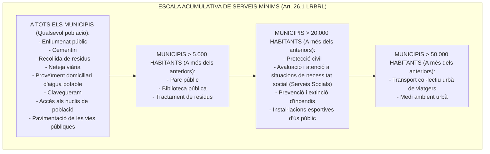

# Tema 12. Les competències municipals. Els serveis mínims. Delegació de competències i avocació

> **Fonts normatives de referència:** [`CORPUS/LRBRL.pdf`](file:///home/oriol/Projectes/OPOS/CORPUS/LRBRL.pdf) (Arts. 2, 7, 25 a 28), [`CORPUS/TRLRBRL.pdf`](file:///home/oriol/Projectes/OPOS/CORPUS/TRLRBRL.pdf) (Arts. 63 a 71) i [`CORPUS/40_2015.pdf`](file:///home/oriol/Projectes/OPOS/CORPUS/40_2015.pdf) (Arts. 9 i 10).

---

## 1. El Sistema de Competències Municipals

Les **competències municipals** són el conjunt de facultats, funcions i atribucions que l'ordenament jurídic atorga als ajuntaments per gestionar els interessos propis de la comunitat local.

---

## 2. Les Competències Pròpies dels Municipis (Art. 25 LRBRL / Art. 66 TRLRBRL)

L'article 25.2 de la LRBRL enumera les matèries en què el municipi ha d'exercir en tot cas competències pròpies en els termes de la legislació de l'Estat i de les CCAA:

1. **Urbanisme:** Planejament, gestió, execució i disciplina urbanística; protecció i gestió del patrimoni històric; promoció i gestió de l'habitatge de protecció pública.
2. **Medi ambient urbà:** Parcs i jardins públics, gestió dels residus sòlids urbans, protecció contra la contaminació acústica, lumínica i atmosfèrica en zones urbanes.
3. **Abastament d'aigua potable a domicili i evacuació i tractament d'aigües residuals.**
4. **Infraestructura viària:** Xarxa viària municipal, pavimentació i manteniment de camins i vies urbanes.
5. **Trànsit, estacionament de vehicles i mobilitat:** Transport col·lectiu urbà de viatgers.
6. **Seguretat ciutadana:** Policia Local, protecció civil, prevenció i extinció d'incendis.
7. **Trànsit i policia administrativa:** Informació i promoció de l'activitat turística d'interès i àmbit local.
8. **Fires, abastos, mercats, llotges i comerç ambulant.**
9. **Protecció de la salubritat pública:** Cementiris i activitats funeràries.
10. **Drets i serveis socials:** Avaluació i informació de situacions de necessitat social i atenció immediata a persones en situació o risc d'exclusió social.
11. **Cultura i esports:** Promoció de l'esport i instal·lacions esportives i d'ocupació del lleure; equipaments culturals, biblioteques públiques i ensenyament de les arts.
12. **Educació:** Participació en la vigilància del compliment de l'escolaritat obligatòria i cooperació amb les administracions educatives en la creació, construcció i manteniment dels centres docents públics.

---

## 3. Els Serveis Mínims Obligatoris (Art. 26 LRBRL / Art. 67 TRLRBRL)

L'article 26 de la LRBRL estableix els serveis públics que els municipis han de prestar obligatòriament, estructurats de forma acumulativa segons la seva xifra de població:

---

### 3.1. Taula Sistemàtica de Serveis Mínims

| Tram de Població | Serveis Mínims Obligatoris Específics que s'afegeixen |
| :--- | :--- |
| **A tots els municipis** *(sense límit)* | 1. Enllumenat públic. 2. Cementiri. 3. Recollida de residus. 4. Neteja viària. 5. Proveïment d'aigua potable a domicili. 6. Clavegueram. 7. Accés als nuclis de població. 8. Pavimentació de vies públiques. |
| **Més de 5.000 habitants** | *Tots els anteriors més:* 9. **Parc públic**. 10. **Biblioteca pública**. 11. **Tractament de residus**. |
| **Més de 20.000 habitants** | *Tots els anteriors més:* 12. **Protecció civil**. 13. **Avaluació i atenció a la necessitat social (Serveis socials bàsics)**. 14. **Prevenció i extinció d'incendis** (Bombers). 15. **Instal·lacions esportives d'ús públic**. |
| **Més de 50.000 habitants** | *Tots els anteriors més:* 16. **Transport col·lectiu urbà de viatgers**. 17. **Medi ambient urbà**. |

---

### 3.2. Dispensa i Coordinació Provincial de Serveis Mínims
1. **Dispensa de serveis (Art. 26.2 LRBRL):** Els municipis poden sol·licitar a la Comunitat Autònoma (Departament de Presidència/Governança de la Generalitat) la **dispensa de l'obligació de prestar serveis mínims** quan la prestació directa resulti impossible o de molt difícil compliment per raons tècniques o economicofinanceres.
2. **Coordinació provincial (Art. 26.2 LRBRL):** En municipis amb població **inferior a 20.000 habitants**, la **Diputació Provincial** coordina la prestació dels serveis de tractament de residus, proveïment d'aigua, neteja viària, bombers, etc., podent assumir la prestació directa o mitjançant consorcis o mancomunitats si l'Ajuntament no garanteix el cost efectiu.

---

## 4. Delegació de Competències i Avocació

### 4.1. Delegació Interadministrativa (Art. 27 LRBRL / Art. 69 TRLRBRL)
L'Estat o la Comunitat Autònoma poden delegar en els municipis l'exercici de competències en matèries que afectin els seus interessos propis per millorar l'eficàcia de la gestió:
- **Requisits imperatius:**
  1. Ha d'anar acompanyada de la **transferència o garantia del finançament del 100% del cost del servei** (*«no hi ha delegació sense dotació econòmica»*).
  2. Ha de determinar l'abast, el contingut, les condicions de la delegació i el termini de vigència (mínim 5 anys llevat d'acord diferent).
  3. L'administració delegant manté la potestat de dirigir i fiscalitzar l'exercici, dictar instruccions tècniques i revocar la delegació en cas d'incompliment.

---

### 4.2. Delegació Interorgànica i Avocació (Arts. 9 i 10 Llei 40/2015)

| Figura Jurídica | Òrgans Implicats | Concepte, Requisits i Efectes |
| :--- | :--- | :--- |
| **Delegació Interorgànica** *(Art. 9 Llei 40/2015)* | D'un òrgan superior a un inferior, o de l'Alcalde/Ple a la Junta de Govern Local. | - Traspàs de l'**exercici** de la competència (la titularitat continua sent de l'òrgan delegant). - Requereix publicació al Butlletí Oficial. - Els actes dictats s'entenen emanats per l'òrgan delegant. - És revocable en qualsevol moment. |
| **Avocació** *(Art. 10 Llei 40/2015)* | D'un òrgan jeràrquicament superior respecte d'un òrgan inferior o delegat. | - L'òrgan superior **assumeix el coneixement d'un assumpte concret** la resolució del qual corresponia a l'inferior. - Requereix **acord motivat** que s'ha de notificar als interessats abans o simultàniament a la resolució final. - **Contra l'acord d'avocació NO cap recurs independent** (es pot impugnar en recórrer la resolució que posi fi al procediment). |

---

## 5. Quadre Resum i Preguntes Típiques d'Examen Tipus Test

| Pregunta / Concepte Clau | Resposta Correcta / Trampa Freqüent |
| :--- | :--- |
| **Quin servei és obligatori a partir de 5.000 habitants?** | **Parc públic, biblioteca pública i tractament de residus** (Art. 26.1.b LRBRL). |
| **A partir de quina població és obligatori el transport col·lectiu urbà?** | A partir de **més de 50.000 habitants** (Art. 26.1.d LRBRL). |
| **A partir de quina població són obligatoris els serveis socials i bombers?** | A partir de **més de 20.000 habitants** (Art. 26.1.c LRBRL). |
| **L'enllumenat públic i el cementiri són obligatoris a tots els municipis?** | **Sí**, formen part dels serveis mínims universals de l'art. 26.1.a LRBRL. |
| **Qui pot dispensar a un municipi de prestar un servei mínim obligatori?** | La **Comunitat Autònoma** (Generalitat de Catalunya) (Art. 26.2 LRBRL). |
| **Quin requisit econòmic és indispensable per delegar competències a un ajuntament?** | La **dotació econòmica i garantia de finançament del 100%** del servei (Art. 27.6 LRBRL). |
| **Es pot recórrer autònomament l'acord d'avocació?** | **No**, contra l'acord d'avocació no s'admet cap recurs, sens perjudici de recórrer la resolució final (Art. 10.2 Llei 40/2015). |
| **Qui té la competència per delegar atribucions a la Junta de Govern Local?** | Tant l'**Alcalde** com el **Ple de l'Ajuntament** (Arts. 21.3 i 22.4 LRBRL). |
