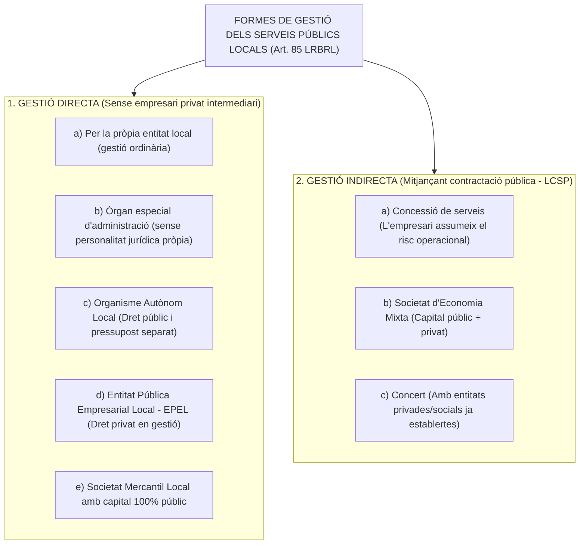
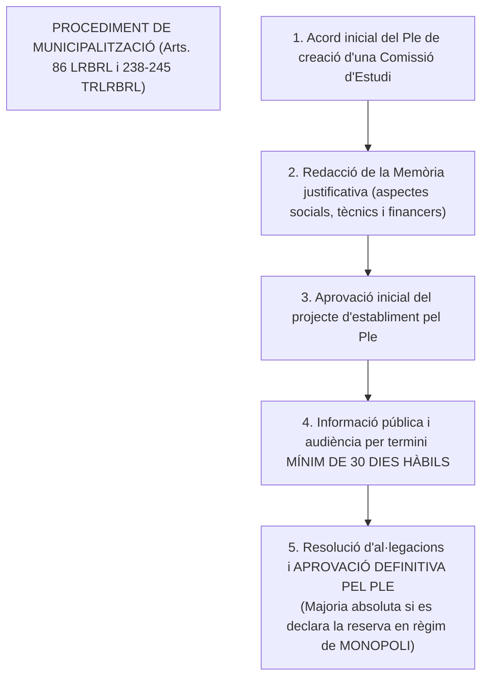

# Tema 13. Formes de gestió dels serveis públics

> **Fonts normatives de referència:** [`CORPUS/LRBRL.pdf`](file:///home/oriol/Projectes/OPOS/CORPUS/LRBRL.pdf) (Arts. 85 i 86), [`CORPUS/TRLRBRL.pdf`](file:///home/oriol/Projectes/OPOS/CORPUS/TRLRBRL.pdf) (Arts. 189 a 206) i [`CORPUS/Contractes_2017.pdf`](file:///home/oriol/Projectes/OPOS/CORPUS/Contractes_2017.pdf) (Llei 9/2017, LCSP).

---

## 1. Concepte i Principis dels Serveis Públics Locals

El **servei públic local** és l'activitat d'interès general de caràcter prestacional assumida per l'Administració municipal per satisfer les necessitats bàsiques de la comunitat ciutadana.

### 1.1. Principis rectors dels serveis públics:
1. **Continuïtat i regularitat:** El servei s'ha de prestar sense interrupcions injustificades.
2. **Igualtat i universalitat:** Accés no discriminatori a tots els ciutadans en condicions d'igualtat.
3. **Adaptabilitat / Mutabilitat:** Obligació de modernitzar i adequar el servei a les noves tecnologies i a l'evolució de les necessitats socials.
4. **Assequibilitat:** Tarifes i preus públics proporcionats a la capacitat econòmica dels usuaris.
5. **Neutralitat:** Prestació objectiva sense partidisme ni biaixos ideològics.

---

## 2. Classificació de les Formes de Gestió (Art. 85 LRBRL / Art. 190 TRLRBRL)

L'article 85 de la LRBRL estableix que els serveis públics de competència local es gestionen de forma **directa** o **indirecta**.

> ⚠️ **Límit legal absolut:**  
> En cap cas no es poden prestar mitjançant gestió indirecta els serveis públics que impliquin l'**exercici d'autoritat pública** (Policia Local, inspecció tributària, potestat sancionadora, llicències urbanístiques, etc.), els quals s'han de gestionar obligatòriament de forma **directa** mitjançant funcionaris públics.

---

## 3. Modalitats de Gestió Directa

La gestió és directa quan la mateixa entitat local, per si mateixa o mitjançant un ens instrumental públic dependent, assumeix l'explotació del servei al seu propi risc:

| Modalitat de Gestió Directa | Personalitat Jurídica | Règim Jurídic Aplicable | Exemples típics |
| :--- | :---: | :--- | :--- |
| **1. Gestió per la pròpia corporació** *(indiferenciada)* | La mateixa de l'Ajuntament. | **Dret Administratiu pur.** La gestió es realitza directament pels serveis i funcionaris municipals ordinaris. | Neteja viària directa, brigades municipals d'obres, cementiri municipal. |
| **2. Òrgan especial d'administració** | **No en té** (òrgan desconcentrat). | **Dret Administratiu.** Té consell d'administració propi, pressupost separat dins el municipal i comptabilitat diferenciada. | Comissions gestores de fires o festes locals. |
| **3. Organisme Autònom Local (OAL)** | **Personalitat jurídica pública pròpia** i patrimoni independent. | **Dret Administratiu.** Personal funcionari/laboral públic, règim pressupostari públic i contractació pública com a Administració Pública. | Patronat Municipal de Música, Institut Municipal d'Esports, Patronat d'Educació. |
| **4. Entitat Pública Empresarial Local (EPEL)** | **Personalitat jurídica pública pròpia** i patrimoni independent. | **Dret Privat** en contractació i gestió de personal, excepte en la formació de la voluntat dels seus òrgans i potestats administratives. Es finança amb preus i ingressos de mercat. | Entitats públiques locals d'habitatge, mitjans de comunicació públics locals. |
| **5. Societat Mercantil 100% pública** | **Personalitat jurídica privada** (S.A. o S.L.). | **Dret Mercantil, civil i laboral.** El capital social pertany íntegrament a l'Ajuntament. El Ple de l'Ajuntament actua com a Junta General d'Accionistes. | Societat municipal d'aparcaments, societat municipal d'aigües. |

---

## 4. Modalitats de Gestió Indirecta (Contractació Pública)

La gestió indirecta té lloc quan l'Ajuntament encomana a una persona física o jurídica privada l'explotació d'un servei de competència local sota fiscalització pública:

### 4.1. El Contracte de Concessió de Serveis (Art. 15 Llei 9/2017, LCSP)
- **Concepte:** Contracte a títol onerós en virtut del qual l'Ajuntament encomana a un empresari (*concessionari*) la gestió d'un servei públic.
- **La clau definidora: El Risc Operacional (Art. 15 LCSP):**  
  Hi ha concessió de serveis només si la contrapartida consisteix en el **dret a explotar el servei** (cobrant directament tarifes als usuaris) o en aquest dret acompanyat d'un pagament de l'Ajuntament, de manera que **el concessionari assumeix el risc operacional de l'explotació** (risc de fluctuació de la demanda o de costos de mercat sense rendibilitat garantida).
- **Durada màxima dels contractes de concessió de serveis (Art. 29 LCSP):**
  - Fins a **5 anys** en concessions de serveis no sanitaris ni d'obres.
  - Fins a **25 anys** en concessions de serveis que comprenguin l'explotació d'un servei no vinculat a obres sanitàries.
  - Fins a **40 anys** si inclou l'execució d'obres i l'explotació d'infraestructures sanitàries.

---

### 4.2. La Societat d'Economia Mixta
- Societat mercantil en què l'Ajuntament participa en el capital social conjuntament amb persones físiques o jurídiques privades.
- **Selecció del soci privat:** L'adjudicació del contracte per a la creació de la societat mixta i la selecció del soci tecnològic/financer privat s'ha de fer obligatòriament mitjançant un **procediment de concurrència pública competitiva** segons la LCSP.

---

### 4.3. El Concert
- Modalitat per la qual l'Administració estableix acords amb entitats privades o associatives ja existents que presten serveis anàlegs (educatius, assistencials, geriàtrics, culturals) per atendre usuaris derivats del servei públic municipal.

---

## 5. El Procediment per a la Municipalització de Serveis (Art. 86 LRBRL)

La **municipalització** és l'assumpció per l'Ajuntament d'una activitat econòmica o servei per a la seva prestació directa sota titularitat pública:

- **Reserva en règim de monopoli (Art. 86.2 LRBRL):** Es poden reservar en exclusiva a favor de les entitats locals determinats serveis essencials (proveïment d'aigua, sanejament, recollida i tractament de residus, transport públic). L'acord requereix la **majoria absoluta del Ple** i l'aprovació del Govern de la Comunitat Autònoma.

---

## 6. Quadre Resum i Preguntes Típiques d'Examen Tipus Test

| Pregunta / Concepte Clau | Resposta Correcta / Trampa Freqüent |
| :--- | :--- |
| **Quins serveis NO es poden gestionar mai de forma indirecta?** | Els que impliquin l'**exercici d'autoritat pública** (Policia, inspecció, sancions) (Art. 85.1 LRBRL). |
| **Quin element diferencia la concessió de serveis del contracte de serveis a la LCSP?** | La transferència del **risc operacional** al contractista concessionari (Art. 15 LCSP). |
| **Qui forma la Junta General d'una societat mercantil 100% municipal?** | El **Ple de l'Ajuntament** (Art. 195 TRLRBRL). |
| **Quin règim jurídic de contractació i personal s'aplica a les EPEL?** | El **Dret Privat**, amb límits de principis públics (Art. 85 bis LRBRL). |
| **Quina majoria plenària cal per municipalitzar un servei en règim de monopoli?** | **Majoria absoluta del nombre legal de membres del Ple** (Art. 47.2.k LRBRL). |
| **Quin és el termini mínim d'informació pública de l'expedient de municipalització?** | **30 dies hàbils** (Art. 240 TRLRBRL). |
| **Quina durada màxima té la concessió de serveis no sanitaris?** | Com a màxim **25 anys** (o 5 anys si és ordinari de gestió de serveis) (Art. 29 LCSP). |
