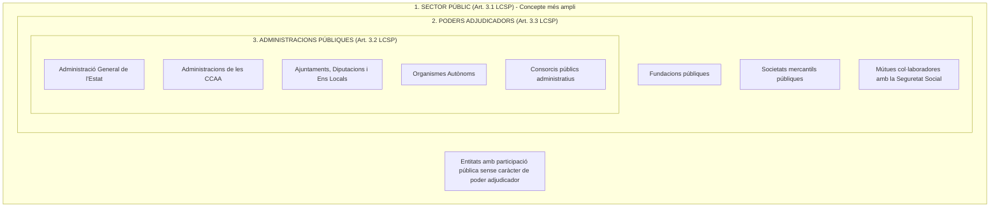
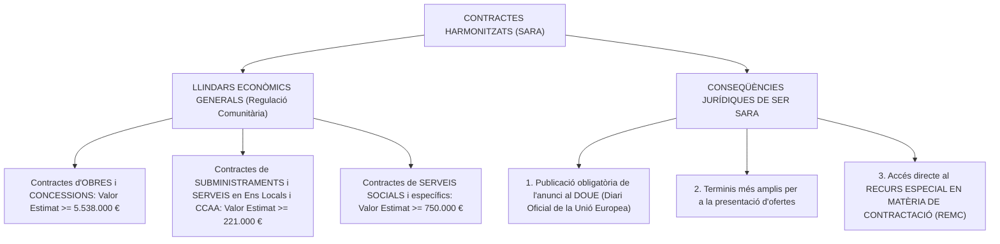
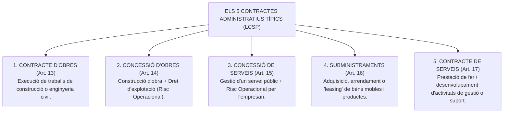
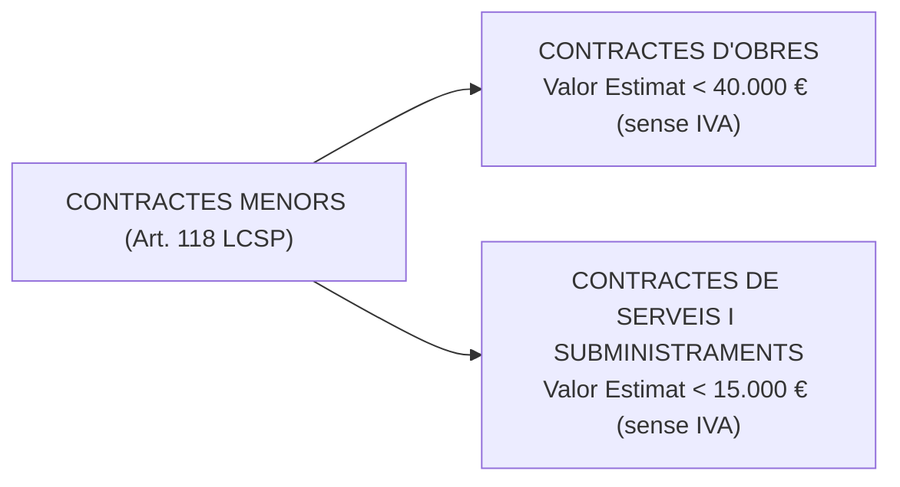

# Tema 14. Tipus de contractes del sector públic

> **Font normativa de referència:** [`CORPUS/Contractes_2017.pdf`](file:///home/oriol/Projectes/OPOS/CORPUS/Contractes_2017.pdf)  
> **Text:** Llei 9/2017, de 8 de novembre, de contractes del sector públic (LCSP). Text consolidat.

---

## 1. Àmbit Subjectiu de la Contractació Pública (Art. 3 LCSP)

La **Llei 9/2017 (LCSP)** s'aplica a tots els contractes onerosos celebrats per les entitats del sector públic. L'article 3 estructura els subjectes contractants en **tres cercles concèntrics**:

---

## 2. Classificació dels Contractes per la seva Naturalesa Jurídica

Els contractes del sector públic es classifiquen en **Contractes Administratius** i **Contractes Privats** (Arts. 24 a 27 LCSP):

| Criteri de Comparació | Contractes Administratius (Art. 25 LCSP) | Contractes Privats (Art. 26 LCSP) |
| :--- | :--- | :--- |
| **Subjecte contractant** | Celebrats exclusivament per una **Administració Pública (AP)**. | Celebrats per **Poders Adjudicadors NO AP** (PANAP), o per AP sobre matèries privades específiques. |
| **Objecte** | - **Contractes típics:** Obres, concessió d'obres, concessió de serveis, subministraments i serveis. - **Contractes especials:** Vinculats al gir o tràfic específic de l'AP o satisfacció d'una finalitat pública directa. | Serveis financers, creació i interpretació artística, espectacles, subscripció a revistes i compravenda/arrendament de béns immobles. |
| **Règim de Preparació i Adjudicació** | **Dret Administratiu (LCSP)**. | **Dret Administratiu (LCSP)**. |
| **Règim d'Efectes, Modificació i Extinció** | **Dret Administratiu (LCSP)**. *(Prerrogatives públiques: interpretació unilateral, modificació 'ius variandi' i resolució)*. | **Dret Privat (Codi Civil i Codi de Comerç)**. |
| **Jurisdicció competent** | **Jurisdicció Contenciosa Administrativa** (en totes les fases). | **Jurisdicció Civil ordinària** per a efectes i extinció (Contenciós només per a actes preparatoris i adjudicació). |

---

## 3. Contractes Subjectes a Regulació Harmonitzada (Contractes SARA)

Els contractes **SARA** (Arts. 19 a 23 LCSP) són contractes celebrats per poders adjudicadors que superen determinats llindars econòmics fixats per les Directives de la Unió Europea:

---

## 4. Els 5 Contractes Administratius Típics (Arts. 13 a 18 LCSP)

---

### 4.1. Contracte d'Obres (Art. 13 LCSP)
- **Objecte:** Execució d'una obra de construcció, reforma, rehabilitació o enginyeria civil sobre un bé immoble, o treballs que modifiquin la forma o substància del terreny.
- **Tipus d'obres:** Primer establiment, reforma, gran reparació, conservació i manteniment, o demolició.
- **Requisit preceptiu:** Requereix la redacció prèvia d'un **Projecte d'Obres** degudament supervisat i aprovat (llevat d'obres d'emergència).

---

### 4.2. Contracte de Concessió d'Obres (Art. 14 LCSP)
- **Objecte:** La realització per part del concessionari de la construcció, restauració o reparació d'una obra pública.
- **Contraprestació:** Consisteix exclusivament en el **dret a explotar l'obra** (ex. peatges d'autopistes, aparcaments soterrats) o en aquest dret acompanyat del dret a percebre un preu.
- **Risc operacional:** El concessionari assumeix el risc econòmic lligat a l'ús i la demanda de la infraestructura.

---

### 4.3. Contracte de Concessió de Serveis (Art. 15 LCSP)
- **Objecte:** La gestió i prestació d'un servei públic la titularitat del qual continua sent de l'Administració.
- **Contraprestació:** Dret a explotar el servei cobrant taxes/tarifes als usuaris o un preu de l'administració vinculat a la demanda, **assumint el concessionari el risc operacional de l'explotació**.

---

### 4.4. Contracte de Subministraments (Art. 16 LCSP)
- **Objecte:** L'adquisició, l'arrendament financer (*leasing*), o l'arrendament ordinari (amb o sense opció de compra) de **productes o béns mobles**.
- **Supòsits típics:**
  - Compra de mobiliari, vehicles, combustible, equips i programari informàtic no a mida.
  - L'adquisició i arrendament d'equips de telecomunicacions.
  - Fabricació de béns mobles segons característiques particulars fixades per l'Administració.
  - Subministrament continuat d'energia elèctrica, gas o aigua.

---

### 4.5. Contracte de Serveis (Art. 17 LCSP)
- **Objecte:** Prestacions de fer consistents en el desenvolupament d'una activitat o dirigides a l'obtenció d'un resultat distint d'una obra o d'un subministrament.
- **Supòsits típics:** Serveis de neteja d'edificis públics, seguretat privada, manteniment d'ascensors i calderes, assistència tècnica d'enginyeria o arquitectura, assessoria jurídica, auditories, activitats docents o culturals.
- **Prohibició taxativa:** El contracte de serveis **mai no pot implicar la cessió il·legal de treballadors** ni l'exercici de potestats públiques o funcions d'autoritat reservades a funcionaris.

---

## 5. Els Contractes Menors (Art. 118 LCSP)

Són contractes de quantia reduïda que compten amb una tramitació àgil i abreujada per a despeses ordinàries puntuals:

### 5.1. Requisits i límits dels Contractes Menors:
1. **Tramitació simplificada (Art. 118.2 LCSP):** Només exigeix:
   - **Informe de l'òrgan de contractació** que justifiqui la necessitat de la contractació.
   - Justificació expressa que **no s'està alterant l'objecte del contracte per fraccionar-lo fraudulentament**.
   - Aprovació de la despesa pel servei econòmic.
   - Factura degudament conformada (i en contractes d'obres, a més, el pressupost i projecte si és exigible).
2. **Durada màxima (Art. 29.8 LCSP):** **Màxim 1 any**. No poden ser objecte de cap pròrroga ni revisió de preus.
3. **Publicitat a posteriori:** S'han de publicar trimestralment al Portal de Transparència i al Perfil de Contractant de l'Ajuntament.

---

## 6. Quadre Resum i Preguntes Típiques d'Examen Tipus Test

| Pregunta / Concepte Clau | Resposta Correcta / Trampa Freqüent |
| :--- | :--- |
| **Quin és el límit econòmic del contracte menor d'OBRES?** | **Inferior a 40.000 euros** (sense IVA) (Art. 118.1 LCSP). |
| **Quin és el límit del contracte menor de SERVEIS o SUBMINISTRAMENTS?** | **Inferior a 15.000 euros** (sense IVA) (Art. 118.1 LCSP). |
| **Quina és la durada màxima d'un contracte menor?** | Com a màxim **1 any, sense possibilitat de pròrroga** (Art. 29.8 LCSP). |
| **Quin element distingeix el contracte de serveis de la concessió de serveis?** | En la concessió, l'empresari assumeix el **risc operacional de l'explotació** (Art. 15 LCSP). |
| **Quin és el llindar SARA per a contractes d'obres i concessions?** | Valor estimat **igual o superior a 5.538.000 euros** (Art. 20 LCSP). |
| **Quin és el llindar SARA per a serveis i subministraments en l'Administració Local?** | Valor estimat **igual o superior a 221.000 euros** (Art. 21 i 22 LCSP). |
| **Davant de quina jurisdicció es resolen els litigis dels contractes administratius?** | Davant la **jurisdicció contenciosa administrativa** en totes les seves fases (Art. 27 LCSP). |
| **Quina part dels contractes privats es regeix pel dret civil/mercantil?** | Els seus **efectes, modificació i extinció** (Art. 26.2 LCSP). |
