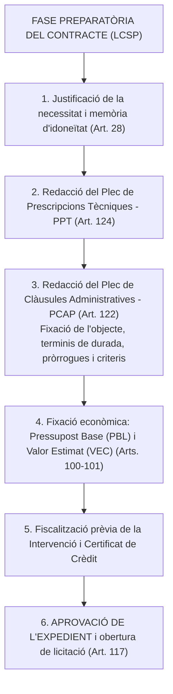
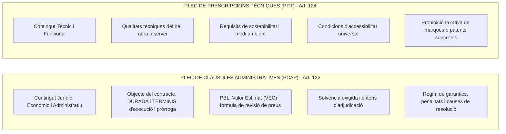
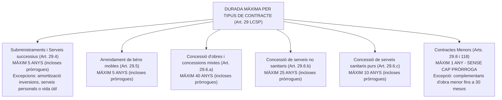
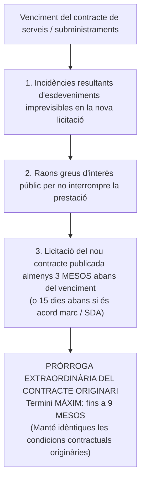
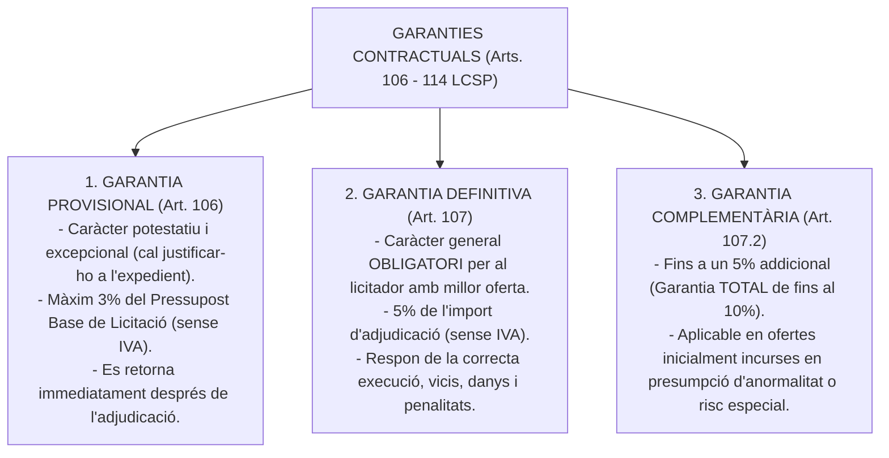
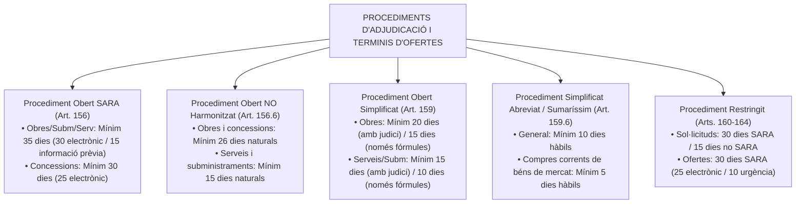
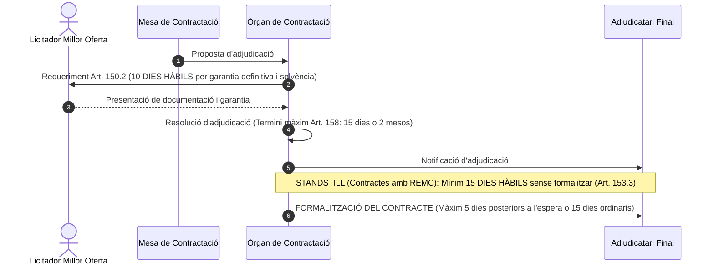

# Tema 15. La preparació dels contractes: l'expedient de contractació, els plecs de clàusules administratives i els plecs de prescripcions tècniques

> **Font normativa de referència:** [`CORPUS/Contractes_2017.pdf`](file:///home/oriol/Projectes/OPOS/CORPUS/Contractes_2017.pdf)  
> **Text:** Llei 9/2017, de 8 de novembre, de contractes del sector públic (LCSP). Text consolidat.

---

## 1. La Fase Preparatòria dels Contractes del Sector Públic

La preparació dels contractes administratius és el conjunt d'actuacions internes prèvies que l'òrgan de contractació ha de desenvolupar per definir la necessitat pública a satisfer, fixar les condicions jurídiques i tècniques, garantir la dotació pressupostària i aprovar l'obertura del procediment d'adjudicació (**Arts. 115 a 124 LCSP**).

---

## 2. Magnituds Econòmiques del Contracte: PBL, Preu i VEC

La LCSP distingeix amb precisió tres conceptes econòmics essencials:

| Concepte Econòmic | Definició Legal (LCSP) | Elements que inclou / no inclou |
| :--- | :--- | :--- |
| **1. Pressupost Base de Licitació (PBL)** *(Art. 100 LCSP)* | Límit màxim de despesa que l'òrgan de contractació pot comprometre per a l'execució del contracte. | Desglossat en: **Costos directes + Costos indirectes + Despeses generals (13-17%) + Benefici industrial (6%) + IVA**. |
| **2. Preu del Contracte** *(Art. 102 LCSP)* | Contraprestació econòmica que rep el contractista adjudicatari. Ha de ser cert i expressar com a partida independent l'**Impost sobre el Valor Afegit (IVA)**. | Preu d'adjudicació final ofertat per l'empresari guanyador. |
| **3. Valor Estimat del Contracte (VEC)** *(Art. 101 LCSP)* | Import total pagable calculat per l'òrgan de contractació per determinar si el contracte és SARA o el tipus de procediment d'adjudicació aplicable. | **SENSE IVA**. Inclou: l'import inicial + **totes les pròrrogues possibles** + **totes les modificacions contractuals previstes** (fins a un màxim del 20%) + primes o pagaments als licitadors. |

> ⚠️ **Fórmula clau per a exàmens tipus test:**  
> $$\text{VEC} = (\text{Pressupost d'execució inicial sense IVA}) + (\text{Import de totes les pròrrogues}) + (\text{Modificacions previstes})$$

---

## 3. L'Expedient de Contractació (Arts. 116 a 120 LCSP)

L'expedient de contractació s'inicia per l'òrgan de contractació motivant la necessitat de la prestació i es clou amb la resolució motivada d'aprovació.

---

### 3.1. Tramitació d'Urgència (Art. 119 LCSP)
- **Supòsit d'aplicació:** Expedients relatius a contractes la celebració dels quals respongui a una **necessitat inajornable** o la tramitació dels quals sigui necessari accelerar per raons d'interès públic.
- **Efectes i terminis legals:**
  1. **Despatx preferent** de l'expedient per part de tots els òrgans administratius que hi intervinguin.
  2. Termini improrrogable de **5 dies** per emetre informes o complimentar tràmits (o el termini fixat pel plec si fos inferior).
  3. **Reducció a la meitat (1/2) de tots els terminis** generals establerts per a la licitació, presentació de proposicions i adjudicació (amb l'excepció dels terminis d'enviament d'anuncis al DOUE en contractes SARA, que es regeixen pel seu règim propi d'urgència de l'art. 156.3.b: mínim 15 dies).
  4. L'inici de l'execució del contracte no es pot demorar més d'**un mes** a comptar des de la formalització del contracte. Si se supera aquest termini, el contracte queda resolt automàticament per causa imputable a l'Administració.

---

### 3.2. Tramitació d'Emergència (Art. 120 LCSP)
- **Supòsit d'aplicació:** Aconteciments catastròfics, situacions de greu perill o necessitats relatives a la defensa nacional.
- **Règim excepcional i terminis:**
  1. L'òrgan de contractació pot ordenar directament l'execució de les obres, serveis o subministraments necessaris **sense tramitar cap expedient previ ni disposar de crèdit pressupostari previ**.
  2. **Termini perentori d'inici:** Les actuacions s'han d'iniciar en un termini màxim d'**un mes** a comptar des que es dicta l'acord. Si transcorre aquest mes sense inici de les prestacions, l'execució requereix la tramitació ordinària.
  3. **Règim de control:** S'ha de donar compte immediat de l'acord al Consell de Ministres o al **Ple de l'Ajuntament** en la primera sessió que celebri.
  4. Executades les actuacions d'emergència, s'ha de procedir a la intervenció i recepció de les prestacions i a la liquidació de la despesa.

---

## 4. Els Plecs Contractuals: PCAP i PPT

Els plecs són els documents administratius i tècnics fonamentals que regulen les condicions de la licitació i de l'execució contractual (*«el plec és la llei del contracte»*):

---

### 4.1. Plec de Clàusules Administratives Particulars (PCAP - Art. 122 LCSP)
- Inclou els aspectes jurídics, econòmics i de control de la contractació:
  - Definició de l'objecte del contracte, **durada del contracte i terminis parcials i totals d'execució i de pròrroga**.
  - Pressupost base de licitació i valor estimat del contracte.
  - Requisits de capacitat, **solvència econòmica, financera i tècnica** o classificació empresarial preceptiva.
  - **Criteris d'adjudicació:** Criteris quantificables mitjançant fórmules matemàtiques (preu, reducció de terminis, millores automàtiques) i criteris dependents d'un judici de valor (qualitat del projecte, memòria tècnica).
  - Condicions especials d'execució de caràcter social, ètic o mediambiental (obligatòries segons l'art. 202 LCSP).

---

### 4.2. Plec de Prescripcions Tècniques Particulars (PPT - Art. 124 LCSP)
- Defineix les especificacions tècniques exigides a les obres, productes o serveis.
- **Principi de no discriminació:** Les prescripcions tècniques han de permetre l'accés en condicions d'igualtat als licitadors i **no poden fer referència a marques, patents, orígens o fabricants determinats** (llevat que s'acompanyi de l'expressió *«o equivalent»*).

---

## 5. El Règim de Durada i Terminis en els Diferents Tipus de Contracte (Art. 29 LCSP)

L'**Article 29 de la LCSP** estableix les regles substantives sobre la durada dels contractes del sector públic, els seus terminis màxims d'execució i les condicions taxades per atorgar pròrrogues.

---

### 5.1. Quadre Sinòptic de Durades Màximes per Tipologia de Contracte

| Tipus de Contracte | Durada Màxima Legal (incloent pròrrogues) | Base Legal (LCSP) | Particularitats, Excepcions i Regles d'Amortització |
| :--- | :--- | :--- | :--- |
| **Subministraments de prestació successiva** | **5 anys** | Art. 29.4 | Es pot superar quan ho exigeixi el període de recuperació d'inversions directament vinculades (desindexació Llei 2/2015). |
| **Serveis de prestació successiva** | **5 anys** | Art. 29.4 | - Es pot superar per període d'amortització d'inversions rellevants. - **Serveis a les persones:** Es pot fixar un termini superior per garantir la continuïtat de tractaments als usuaris. - **Manteniment conjunt amb compra:** Fins a la **vida útil del producte** si hi ha exclusivitat tècnica del fabricant. |
| **Arrendament de béns mobles** *(rènting / leasing)* | **5 anys** | Art. 29.5 | Termini màxim computant totes les pròrrogues possibles acordades per l'òrgan de contractació. |
| **Concessió d'Obres** | **40 anys** | Art. 29.6.a | Inclou també contractes de concessió de serveis que comprenguin simultàniament execució d'obres i explotació de serveis. |
| **Concessió de Serveis (no sanitaris)** | **25 anys** | Art. 29.6.b | Concessions de serveis públics generals (transports, aigua, recollida de residus, etc.) sense execució d'obres estructurals. |
| **Concessió de Serveis Sanitaris** | **10 anys** | Art. 29.6.c | Serveis estrictament sanitaris sense execució d'obra pública (llevat que s'integrin a la lletra a). |
| **Contracte d'Obres** | **Segons Projecte i Plec** | Arts. 29.1, 193 i 237 | - Termini total i parcials fixats al PCAP. - **Comprovació del replantejament:** Màxim **1 mes** des de la formalització. - **Recepció:** **1 mes** des de la terminació. - **Garantia:** Mínim **1 any** (Art. 243). |
| **Contractes Menors** | **1 any** | Art. 29.8 | **Prohibició absoluta de pròrroga** i de revisió de preus. |
| **Serveis complementaris d'Obres o Subministraments** | **Termini del contracte principal** | Art. 29.7 | Pot superar els 5 anys, però no pot excedir la durada del contracte principal (tret del temps de liquidació). Si complementa una obra menor: màxim **30 mesos**. |

---

### 5.2. El Règim Legal de les Pròrrogues dels Contractes (Art. 29.2 LCSP)

La pròrroga d'un contracte administratiu se sotmet a límits legals molt estrictes per garantir la lliure concurrència i la licitació periòdica:

1. **Previsió expressa en els plecs:** El contracte només es pot prorrogar si la possibilitat de pròrroga ha estat expressament prevista al PCAP i les seves característiques essencials es mantenen inalterables.
2. **Prohibició de pròrroga tàcita:** L'article 29.2 disposa expressament: *«En cap cas no es pot produir la pròrroga pel consentiment tàcit de les parts»*. Requereix resolució expressa de l'òrgan de contractació.
3. **Termini de preavís:** L'òrgan de contractació ha de notificar el preavís de la pròrroga al contractista amb una antelació mínima de **dos mesos** a la data de finalització del contracte (llevat que el plec fixi un termini superior). En contractes amb una durada inferior a 2 mesos no s'exigeix preavís.
4. **Obligatorietat per al contractista:** La pròrroga és d'acceptació **obligatòria per a l'empresari**, sempre que s'hagi notificat en termini.
   - **Excepció:** La pròrroga **NO és obligatòria** per a l'adjudicatari si l'Administració ha incorregut en demora en el pagament del preu per un període superior a **sis mesos** (**Art. 198.6 LCSP**).

---

### 5.3. La Pròrroga Extraordinària de Continuïtat de Servei Públic (Art. 29.4 LCSP)

Quan al venciment d'un contracte de serveis o subministraments de prestació successiva no s'hagi pogut formalitzar el nou contracte, la llei preveu un mecanisme d'urgència per evitar la interrupció del servei públic:

> ⚠️ **Atenció oposicions:**  
> La pròrroga extraordinària de l'article 29.4 té un sostre màxim absolut de **9 mesos** i exigeix inexcusablement que la licitació del nou contracte s'hagi publicat amb una antelació mínima de **3 mesos** respecte del venciment de l'anterior.

---

### 5.4. L'Ampliació del Termini en Concessions per Restablir l'Equilibri Econòmic (Art. 29.6 LCSP)
En els contractes de concessió d'obres i de serveis, els terminis fixats als plecs només es poden ampliar com a màxim en un **15 per cent de la seva durada inicial** quan sigui necessari per restablir l'equilibri econòmic del contracte per acord de l'Administració o modificacions imposades (**Arts. 270 i 290 LCSP**).

---

## 6. El Règim de Garanties en la Contractació Pública

---

## 7. Procediments d'Adjudicació i Terminis de Presentació d'Ofertes (Arts. 131 a 165 LCSP)

La LCSP determina terminis mínims estrictes per a la presentació de les proposicions per garantir el principi de lliure concurrència i publicitat, distingint segons la tipologia del contracte i si està subjecte a regulació harmonitzada (**SARA**):

---

### 7.1. Taula Comparativa de Terminis de Presentació de Proposicions

| Procediment de Contractació | Tipus de Contracte | Termini General Mínim | Reducció per Mitjans Electrònics | Reducció per Urgència / Altres Reduccions |
| :--- | :--- | :--- | :--- | :--- |
| **Procediment Obert SARA** *(Art. 156.2)* | Obres, Subministraments i Serveis | **35 dies** *(des de l'enviament de l'anunci al DOUE)* | **30 dies** *(reducció de 5 dies)* | - **15 dies** amb anunci d'informació prèvia (Art. 156.3.a). - **15 dies** per urgència (Art. 156.3.b). |
| **Procediment Obert SARA** *(Art. 156.2)* | Concessió d'Obres i Concessió de Serveis | **30 dies** *(des de l'enviament al DOUE)* | **25 dies** *(reducció de 5 dies)* | No admet reducció per informació prèvia. |
| **Procediment Obert No Harmonitzat** *(Art. 156.6)* | Obres, Concessió d'Obres i Concessió de Serveis | **26 dies naturals** *(des de l'endemà de la publicació al Perfil)* | Ja previst per mitjans telemàtics | **13 dies naturals** en cas de tramitació d'urgència (reducció a la meitat, Art. 119). |
| **Procediment Obert No Harmonitzat** *(Art. 156.6)* | Subministraments i Serveis | **15 dies naturals** *(des de l'endemà de la publicació al Perfil)* | Ja previst per mitjans telemàtics | **8 dies naturals** per tramitació d'urgència (Art. 119). |
| **Obert Simplificat** *(Art. 159.3)* | Obres *(VEC $\le$ 2.000.000 €)* | **20 dies** *(amb judici de valor)* **15 dies** *(només criteris automàtics)* | Únicament electrònic | - |
| **Obert Simplificat** *(Art. 159.3)* | Serveis i Subministraments *(VEC $<$ SARA)* | **15 dies** *(amb judici de valor)* **10 dies** *(només criteris automàtics)* | Únicament electrònic | - |
| **Obert Simplificat Abreviat / Sumaríssim** *(Art. 159.6)* | Obres $<$ 80.000 € Serveis/Subm $<$ 60.000 € | **10 dies hàbils** *(regla general)* | Únicament electrònic | **5 dies hàbils** quan es tracti de compres corrents de béns disponibles en el mercat. |
| **Procediment Restringit** *(Arts. 161 i 164)* | Contractes SARA | Sol·licituds: **30 dies** Ofertes: **30 dies** | Ofertes: **25 dies** *(electrònic)* | - Sol·licituds urgència: **15 dies**. - Ofertes urgència: **10 dies**. |
| **Procediment Restringit** *(Art. 161 i 164)* | Contractes no SARA | Sol·licituds: **15 dies** Ofertes: segons plec | - | Reducció a la meitat per tramitació d'urgència. |

---

## 8. Terminis Clau en l'Adjudicació, Formalització i Execució dels Contractes

La tramitació de l'expedient i la perfecció del contracte es regeixen per terminis legals d'obligat compliment per a l'Administració i els licitadors:

---

### 8.1. Requeriment de Documentació a la Millor Oferta (Art. 150.2 LCSP)
- Un cop acceptada la proposta de la Mesa, l'òrgan de contractació requereix el licitador que ha presentat la millor oferta perquè, en el termini de **deu dies hàbils** a comptar de l'endemà d'haver rebut el requeriment:
  1. Presenti la documentació acreditativa de la seva capacitat i solvència.
  2. Acrediti estar al corrent de les seves obligacions tributàries i amb la Seguretat Social.
  3. Acrediti haver constituït la **garantia definitiva** (5% de l'import d'adjudicació sense IVA).
- *Especialitat en l'obert simplificat (Art. 159.4.f):* Aquest termini es redueix a **7 dies hàbils**. En el procediment simplificat abreujat o sumaríssim no s'exigeix garantia definitiva ni solvència.
- *Incompliment:* Si el licitador no aporta la documentació en el termini de 10 dies hàbils, s'entén que ha retirat la seva oferta, se li exigeix una penalitat del **3% del pressupost base de licitació (sense IVA)** i es requereix el següent licitador per ordre de puntuació.

---

### 8.2. Terminis per Dictar la Resolució d'Adjudicació (Art. 158 LCSP)
L'òrgan de contractació ha de dictar la resolució d'adjudicació dins dels terminis màxims següents:
- **15 dies** a comptar de l'endemà de l'obertura de les proposicions quan l'**únic criteri sigui el preu**.
- **2 mesos** a comptar de l'obertura de les proposicions quan s'utilitzi una **pluralitat de criteris** o el criteri del cost del cicle de vida (llevat que el PCAP fixi un altre termini).
- **Ampliació de 15 dies hàbils addicionals:** Quan sigui necessari tramitar el procediment d'acreditació per a **ofertes anormalment baixes** (**Art. 149.4 LCSP**).
- *Dret de desistiment:* Si transcorren aquests terminis sense haver-se dictat l'adjudicació, els licitadors tenen dret a **retirar les seves proposicions** i a percebre la devolució de les garanties constituïdes.

---

### 8.3. Terminis per a la Formalització del Contracte (Art. 153 LCSP)
Els contractes del sector públic s'han de formalitzar en un document administratiu. Els terminis varien de forma determinant segons si el contracte és susceptible de recurs especial:

1. **Contractes susceptibles de Recurs Especial en Matèria de Contractació (REMC - Art. 153.3):**
   - **Període d'espera preceptiu (*standstill*):** La formalització **no es pot efectuar abans que transcorrin 15 dies hàbils** des de la tramesa de la notificació de l'adjudicació als licitadors. Aquest termini permet interposar el recurs amb efecte suspensiu automàtic.
   - Transcorregut el termini de 15 dies hàbils sense interposició de recurs o aixecada la suspensió pel Tribunal Contractual, es requereix l'adjudicatari per formalitzar el contracte en un termini **no superior a cinc dies** a comptar de l'endemà del requeriment.
2. **Contractes NO susceptibles de REMC (Art. 153.4):**
   - La formalització del contracte s'ha d'efectuar en un termini màxim de **quinze dies hàbils** següents a la recepció de la notificació de l'adjudicació.

---

### 8.4. Terminis en la Fase d'Execució, Recepció i Pagament (Arts. 198, 210, 237 i 243 LCSP)
- **Comprovació del replantejament (Contracte d'obres - Art. 237):** S'ha d'efectuar en el termini màxim d'**un mes** des de la formalització del contracte (termini essencial el retard del qual faculta a demanar la resolució contractual).
- **Recepció o conformitat de la prestació (Art. 210.2):** S'ha de produir dins del mes següent al lliurament o realització de la prestació de l'obra, servei o subministrament.
- **Termini de garantia general:** Mínim **1 any** en contractes d'obres (Art. 243.3) o el que fixi el PCAP segons la naturalesa del contracte.
- **Pagament del preu per l'Administració (Art. 198.4):** L'Administració té l'obligació d'abonar el preu dins dels **trenta dies següents** a la data d'aprovació dels certificats d'obra o dels documents que acreditin la realització del contracte.
- **Règim de demora en el pagament (Art. 198.5 i 198.6):**
  - Si es retarda més de **30 dies:** L'Administració ha d'abonar al contractista els interessos de demora legals i les indemnitzacions pels costos de cobrament.
  - Si la demora supera els **4 mesos:** El contractista pot procedir a la **suspensió del compliment del contracte**, amb un preavís d'un mes.
  - Si la demora supera els **6 mesos:** El contractista té dret a **resoldre el contracte** i exigir el rescabalament dels danys i perjudicis patits, i queda expressament alliberat de l'obligatorietat d'acceptar pròrrogues contractuals (**Art. 29.2**).

---

## 9. Quadre Resum i Preguntes Típiques d'Examen Tipus Test

| Pregunta / Concepte Clau de Terminis | Resposta Legal Correcta (LCSP) / Parany Freqüent |
| :--- | :--- |
| **Quina és la durada màxima dels contractes de serveis i subministraments successius?** | Com a regla general **5 anys incloses les pròrrogues** (Art. 29.4 LCSP). Es pot superar per amortització d'inversions, serveis a persones o manteniment vinculat a compra per vida útil. |
| **En quin termini s'ha de notificar el preavís de pròrroga a l'empresari?** | Amb un mínim de **2 mesos d'antelació** a la finalització del contracte (Art. 29.2 LCSP). La pròrroga tàcita està taxativament **prohibida**. |
| **Quan pot l'empresari negar-se a acceptar una pròrroga obligatòria?** | Quan l'Administració s'ha demorat en el pagament més de **sis mesos** (Arts. 29.2 i 198.6 LCSP). |
| **Quin és el límit temporal de la pròrroga extraordinària per continuïtat del servei?** | Fins a un màxim de **9 mesos**, sempre que la nova licitació s'hagi publicat amb almenys **3 mesos d'antelació** al venciment del contracte originari (Art. 29.4 LCSP). |
| **Quina durada màxima tenen les concessions d'obres públiques?** | Com a màxim **40 anys** incloent pròrrogues (Art. 29.6.a LCSP). |
| **Quina durada màxima tenen les concessions de serveis no sanitaris?** | Com a màxim **25 anys** incloent pròrrogues (Art. 29.6.b LCSP). |
| **Quina durada màxima tenen les concessions de serveis purament sanitaris?** | Com a màxim **10 anys** incloent pròrrogues (Art. 29.6.c LCSP). |
| **Fins a quin percentatge es pot ampliar una concessió per restablir l'equilibri financer?** | Com a màxim fins a un **15% de la durada inicial** del contracte (Arts. 29.6, 270 i 290 LCSP). |
| **Quina durada màxima té un contracte menor?** | Màxim **1 any, sense cap possibilitat de pròrroga** (Art. 29.8 LCSP). |
| **Quant pot durar un servei complementari a un contracte menor d'obres?** | Fins a **30 mesos**, justificat exclusivament pel període de garantia i liquidació (Art. 29.7 LCSP). |
| **Quin termini de presentació d'ofertes regeix en l'obert harmonitzat (SARA)?** | Com a mínim **35 dies** per a obres, subministraments i serveis (30 dies per mitjans electrònics; 15 dies per informació prèvia o urgència) (Art. 156 LCSP). |
| **Quin termini de licitació regeix en contractes d'obres en procediment obert no SARA?** | Com a mínim **26 dies naturals** des de la publicació de l'anunci al perfil de contractant (Art. 156.6 LCSP). |
| **Quin termini de licitació regeix en serveis o subministraments ordinaris no SARA?** | Com a mínim **15 dies naturals** des de la publicació de l'anunci al perfil de contractant (Art. 156.6 LCSP). |
| **Quin és el termini d'ofertes en l'obert simplificat sumaríssim (Art. 159.6)?** | Mínim **10 dies hàbils** (reduït a **5 dies hàbils** en compres corrents de béns de mercat). |
| **Quin efecte produeix la tramitació d'urgència sobre els terminis procedimentals?** | **Reducció a la meitat (1/2)** de tots els terminis generals establerts (Art. 119 LCSP). |
| **En quin termini s'ha d'iniciar l'execució d'un contracte d'emergència?** | En el termini màxim d'**un mes** des de l'adopció de l'acord (Art. 120 LCSP). |
| **Quin termini té el millor licitador per aportar la garantia definitiva (Art. 150.2)?** | **10 dies hàbils** des del requeriment (o **7 dies hàbils** en procediment obert simplificat). |
| **Quin és el termini màxim per dictar l'adjudicació si l'únic criteri és el preu?** | **15 dies** des de l'obertura de les proposicions (Art. 158.1 LCSP). |
| **Quin és el termini màxim per adjudicar si hi ha pluralitat de criteris?** | **2 mesos** des de l'obertura de les proposicions (Art. 158.2 LCSP). |
| **Quin és el termini d'espera (standstill) per formalitzar un contracte amb REMC?** | **15 dies hàbils** des de la notificació de l'adjudicació abans de formalitzar (Art. 153.3 LCSP). |
| **En quin termini ha de pagar l'Administració les certificacions i factures?** | Dins dels **30 dies següents** a l'aprovació dels documents o certificacions (Art. 198.4 LCSP). |
| **A partir de quants mesos de retard en el pagament pot el contractista suspendre el contracte?** | A partir dels **4 mesos** d'impagament, amb preavís d'un mes (Art. 198.5 LCSP). |
| **A partir de quants mesos de retard en el pagament pot el contractista resoldre el contracte?** | A partir dels **6 mesos** d'impagament continuat (Art. 198.6 LCSP). |
