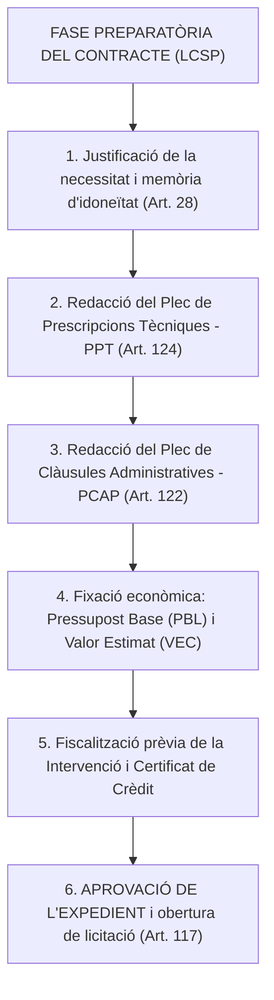
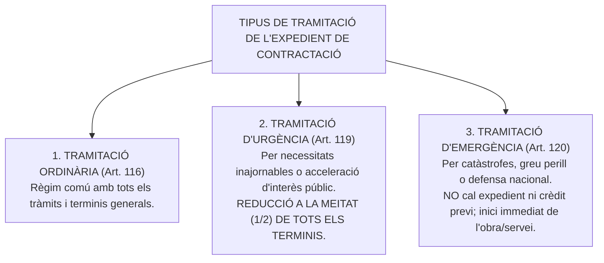
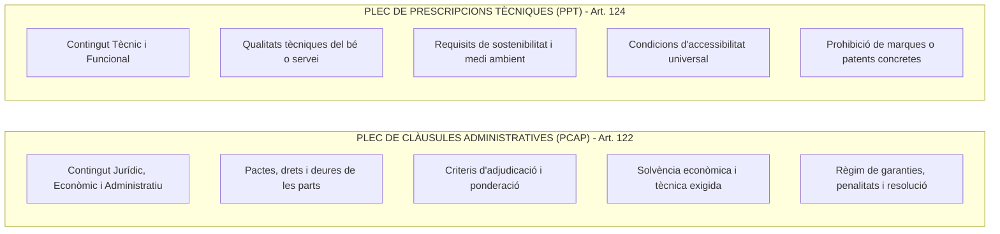
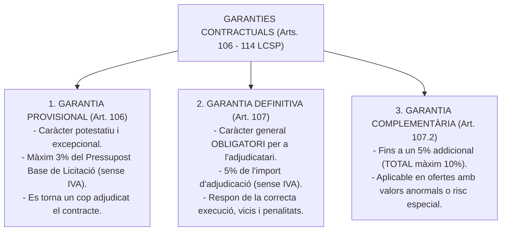

# Tema 15. La preparació dels contractes: l'expedient de contractació, els plecs de clàusules administratives i els plecs de prescripcions tècniques

> **Font normativa de referència:** [`CORPUS/Contractes_2017.pdf`](file:///home/oriol/Projectes/OPOS/CORPUS/Contractes_2017.pdf)  
> **Text:** Llei 9/2017, de 8 de novembre, de contractes del sector públic (LCSP). Text consolidat.

---

## 1. La Fase Preparatòria dels Contractes del Sector Públic

La preparació dels contractes administratius és el conjunt d'actuacions internes prèvies que l'òrgan de contractació ha de desenvolupar per definir la necessitat pública a satisfer, fixar les condicions jurídiques i tècniques, garantir la dotació pressupostària i aprovar l'obertura del procediment d'adjudicació (**Arts. 115 a 124 LCSP**).

---

## 2. Magnituds Econòmiques del Contracte: PBL, Preu i VEC

La LCSP distingeix amb precisió tres conceptes econòmics essencials:

| Concepte Econòmic | Definició Legal (LCSP) | Elements que inclou / no inclou |
| :--- | :--- | :--- |
| **1. Pressupost Base de Licitació (PBL)** *(Art. 100 LCSP)* | Límit màxim de despesa que l'òrgan de contractació pot comprometre per a l'execució del contracte. | Desglossat en: **Costos directes + Costos indirectes + Despeses generals (13-17%) + Benefici industrial (6%) + IVA**. |
| **2. Preu del Contracte** *(Art. 102 LCSP)* | Contraprestació econòmica que rep el contractista adjudicatari. Ha de ser cert i expressar com a partida independent l'**Impost sobre el Valor Afegit (IVA)**. | Preu d'adjudicació final ofertat per l'empresari guanyador. |
| **3. Valor Estimat del Contracte (VEC)** *(Art. 101 LCSP)* | Import total pagable calculat per l'òrgan de contractació per determinar si el contracte és SARA o el tipus de procediment d'adjudicació aplicable. | **SENSE IVA**. Inclou: l'import inicial + **totes les pròrrogues possibles** + **totes les modificacions contractuals previstes** (fins a un màxim del 20%) + primes o pagaments als licitadors. |

> ⚠️ **Fórmula clau per a exàmens tipus test:**  
> $$\text{VEC} = (\text{Pressupost d'execució inicial sense IVA}) + (\text{Import de totes les pròrrogues}) + (\text{Modificacions previstes})$$

---

## 3. L'Expedient de Contractació (Arts. 116 a 120 LCSP)

L'expedient de contractació s'inicia per l'òrgan de contractació motivant la necessitat de la prestació i es clou amb la resolució motivada d'aprovació.

---

### 3.1. Tramitació d'Urgència (Art. 119 LCSP)
- **Supòsit:** Expedients relatius a contractes la celebració dels quals respongui a una **necessitat inajornable** o la tramitació dels quals sigui necessari accelerar per raons d'interès públic.
- **Efectes jurídics:**
  1. Despatx preferent de l'expedient per tots els òrgans administratius (termini de 5 dies per emetre informes).
  2. **Reducció a la meitat de tots els terminis** de presentació de proposicions i tramitació (excepte en contractes SARA pel que fa a terminis d'anuncis europeus).
  3. L'inici de l'execució del contracte no es pot demorar més d'**un mes** des de la formalització.

---

### 3.2. Tramitació d'Emergència (Art. 120 LCSP)
- **Supòsit:** Aconteciments catastròfics, situacions de greu perill o necessitats relatives a la defensa nacional.
- **Règim excepcional:**
  1. L'òrgan de contractació pot ordenar directament l'execució de les obres, serveis o subministraments necessaris **sense tramitar expedient previ ni disposar de crèdit pressupostari previ**.
  2. Les actuacions s'han d'iniciar en un termini màxim d'**un mes** des de l'acord.
  3. S'ha de donar compte immediat de l'acord al Consell de Ministres o al **Ple de l'Ajuntament** en la primera sessió que celebri.

---

## 4. Els Plecs Contractuals: PCAP i PPT

Els plecs són els documents administratius i tècnics fonamentals que regulen les condicions de la licitació i de l'execució contractual (*«el plec és la llei del contracte»*):

---

### 4.1. Plec de Clàusules Administratives Particulars (PCAP - Art. 122 LCSP)
- Inclou els aspectes jurídics de la contractació:
  - Definició de l'objecte del contracte i durada.
  - Pressupost base de licitació i valor estimat.
  - Requisits de capacitat i **solvència econòmica, financera i tècnica** o classificació empresarial.
  - **Criteris d'adjudicació:** Criteris quantificables mitjançant fórmules matemàtiques (preu, terminis, millores automàtiques) i criteris dependents d'un judici de valor (memòria tècnica, qualitat del projecte).
  - Condicions especials d'execució de caràcter social, ètic o mediambiental (obligatòries segons l'art. 202 LCSP).

---

### 4.2. Plec de Prescripcions Tècniques Particulars (PPT - Art. 124 LCSP)
- Defineix les especificacions tècniques exigides a les obres, productes o serveis.
- **Principi de no discriminació:** Les prescripcions tècniques han de permetre l'accés en condicions d'igualtat als licitadors i **no poden fer referència a marques, patents, orígens o fabricants determinats** (llevat que s'acompanyi de l'expressió *«o equivalent»*).

---

## 5. El Règim de Garanties en la Contractació Pública

---

## 6. Procediments d'Adjudicació dels Contractes (Arts. 131 a 165 LCSP)

1. **Procediment Obert Ordinari (Arts. 156 a 158):** Tot empresari interessat pot presentar una proposició. Queda exclosa tota negociació dels termes del contracte.
2. **Procediment Obert Simplificat (Art. 159):** Per a contractes d'obres de valor estimat $< 2.000.000$ € i de serveis/subministraments $< 140.000$ €:
   - Inscripció obligatòria en el Registre Oficial de Licitadors (ROLECE / RELI).
   - No s'exigeix garantia provisional.
   - Obertura en un sol acte públic o electrònic.
3. **Procediment Obert Simplificat Abreviat o «Sumaríssim» (Art. 159.6):** Per a obres $< 80.000$ € i serveis/subministraments $< 60.000$ €: termini d'ofertes de només 10 dies hàbils, valoració exclusiva per criteris automàtics i sense garantia definitiva.
4. **Procediment Restringit (Arts. 160 a 165):** Només poden presentar ofertes els empresaris seleccionats prèviament per l'òrgan de contractació a partir de la seva sol·licitud (mínim 5 candidats).
5. **Procediment Licitació amb Negociació (Arts. 166 a 171):** L'adjudicació recau en el licitador justificadament escollit després de negociar les condicions tècniques o econòmiques de l'oferta.

---

## 7. Quadre Resum i Preguntes Típiques d'Examen Tipus Test

| Pregunta / Concepte Clau | Resposta Correcta / Trampa Freqüent |
| :--- | :--- |
| **Com es calcula el Valor Estimat del Contracte (VEC)?** | **Sense IVA**, incloent l'import inicial, **totes les pròrrogues** i les **modificacions contractuals previstes** (Art. 101 LCSP). |
| **Quin percentatge màxim té la garantia provisional?** | Com a màxim el **3% del Pressupost Base de Licitació sense IVA** (Art. 106 LCSP). |
| **Quin percentatge té la garantia definitiva ordinària?** | El **5% de l'import d'adjudicació sense IVA** (Art. 107.1 LCSP). |
| **Quin efecte té la tramitació d'urgència sobre els terminis?** | **Reducció a la meitat (1/2)** de tots els terminis procedimentals (Art. 119 LCSP). |
| **En quin termini s'han d'iniciar les prestacions en un contracte d'emergència?** | En el termini màxim d'**un mes** des de l'acord (Art. 120 LCSP). |
| **Quin document és conegut com la «llei del contracte»?** | El **Plec de Clàusules Administratives Particulars (PCAP)** (Art. 122 LCSP). |
| **Es poden citar marques o fabricants concrets al Plec Tècnic (PPT)?** | **No com a regla general**, llevat que s'acompanyi del terme *«o equivalent»* (Art. 124 LCSP). |
