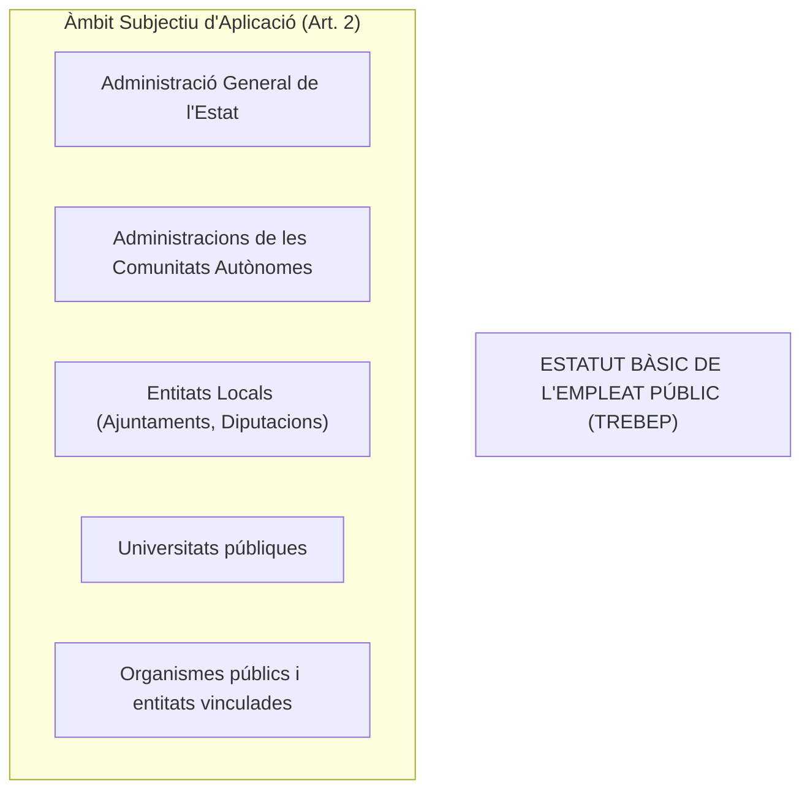
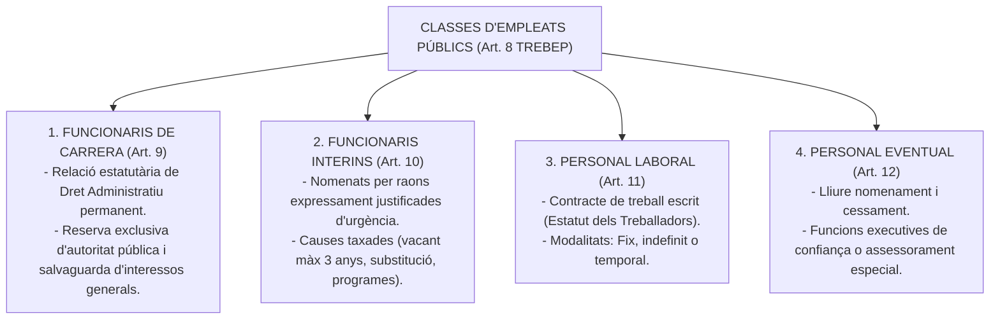
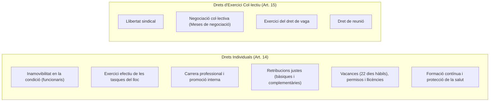
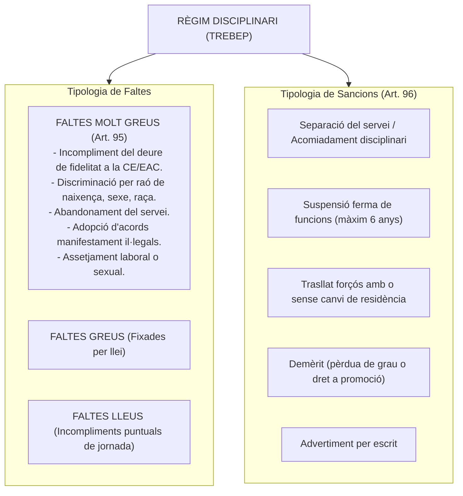

# Tema 16. Drets i deures del personal al servei de les administracions públiques (TREBEP)

> **Font normativa de referència:** [`CORPUS/TREBEP.pdf`](file:///home/oriol/Projectes/OPOS/CORPUS/TREBEP.pdf)  
> **Text:** Reial Decret Legislatiu 5/2015, de 30 d'octubre, pel qual s'aprova el text refós de la Llei de l'Estatut Bàsic de l'Empleat Públic (TREBEP). Text consolidat.

---

## 1. Objecte, Àmbit i Fonament Constitucional

El **TREBEP (RDLeg 5/2015)** estableix les bases del règim estatutari dels funcionaris públics i les normes aplicables al personal laboral al servei de totes les administracions públiques (**Art. 149.1.18a CE**), per garantir la professionalitat, objectivitat, mèrit i capacitat en l'accés i exercici de la funció pública (**Arts. 23.2 i 103.3 CE**).

---

## 2. Classes de Personal al Servei de les Administracions Públiques (Arts. 8 a 13 TREBEP)

Són empleats públics els qui exerceixen funcions retribuïdes en les administracions públiques al servei dels interessos generals:

---

### 2.1. Els Funcionaris de Carrera i la Reserva d'Autoritat (Art. 9 TREBEP)
- Vinculats a l'Administració Pública per una relació estatutària regulada pel Dret Administratiu per a la prestació de serveis professionals retribuïts de caràcter permanent.
- **Reserva exclusiva de potestats públiques (Art. 9.2 TREBEP):** L'exercici de les funcions que impliquin la participació directa o indirecta en l'**exercici de les potestats públiques** o en la **salvaguarda dels interessos generals de l'Estat i de les administracions públiques** corresponen **exclusivament als funcionaris públics** (no poden ser exercides per personal laboral ni privat).

---

### 2.2. Els Funcionaris Interins (Art. 10 TREBEP)
Nomenats per circumstàncies justificades de necessitat i urgència en els següents supòsits taxats:
1. **Places vacants:** Quan no sigui possible la seva cobertura per funcionaris de carrera, per un **màxim de 3 anys**. Transcorregut aquest termini, la vacant ha de ser coberta o amortitzada.
2. **Substitució transitòria dels titulars:** Pel temps estrictament necessari (ex. baixes mèdiques, llicències).
3. **Execució de programes de caràcter temporal:** Per un termini **màxim de 3 anys**, prorrogable fins a 12 mesos més si ho preveu la legislació autonòmica.
4. **Excés o acumulació de tasques:** Per un termini **màxim de 9 mesos dins d'un període de 18 mesos**.

---

### 2.3. Grups de Classificació Professional dels Funcionaris (Art. 76 TREBEP)

| Grup / Subgrup | Titulació Acadèmica Exigida per a l'Ingrés |
| :---: | :--- |
| **Grup A - Subgrup A1** | Títol universitari de **Grau** (amb exigència de nivell superior de responsabilitat / màster). |
| **Grup A - Subgrup A2** | Títol universitari de **Grau** (funcions executives de gestió i col·laboració tècnica). |
| **Grup B** | Títol de **Tècnic Superior** (Formació Professional de Grau Superior). |
| **Grup C - Subgrup C1** | Títol de **Batxiller** o Tècnic (Formació Professional de Grau Mitjà). |
| **Grup C - Subgrup C2** | Títol de **Graduat en Educació Secundària Obligatòria (ESO)**. |
| **Altres Agrupacions Professionals** | Sense requisit de titulació del sistema educatiu (antigament Grup E). |

---

## 3. Drets dels Empleats Públics (Arts. 14 i 15 TREBEP)

### 3.1. Estructura Retributiva dels Funcionaris (Arts. 22 a 24 TREBEP)
1. **Retribucions Bàsiques:**
   - **El Sou:** Fixat en funció del Grup o Subgrup de classificació professional.
   - **Els Triennis:** Quantitat igual per a cada Grup per cada **3 anys de servei**.
   - **Les Pagues Extraordinàries:** Dues a l'any (juny i desembre), que inclouen el sou íntegre, triennis i el complement de destí.
2. **Retribucions Complementàries:**
   - **Complement de Destí (CD):** Retribueix el nivell del lloc de treball que s'exerceix (nivells de l'1 al 30).
   - **Complement Específic (CE):** Retribueix les condicions particulars del lloc (dificultat tècnica, dedicació, responsabilitat, incompatibilitat o perillositat).
   - **Complement de Productivitat:** Retribueix l'especial rendiment, l'activitat i la iniciativa.
   - **Gratificacions:** Per serveis extraordinaris prestats fora de la jornada normal (hores extres).

---

## 4. Deures dels Empleats Públics i Codi de Conducta (Arts. 52 a 54 TREBEP)

Els empleats públics han d'exercir amb diligència les tasques assignades i protegir l'interès general:

### 4.1. Principis Ètics (Art. 53 TREBEP):
- Respecte a la Constitució i a l'Estatut d'Autonomia.
- Neutralitat i imparcialitat política en la gestió pública.
- **Prohibició d'acceptar regals, favors o serveis** en condicions avantatjoses que vagin més enllà dels usos habituals de cortesia.
- Guardar el degut **secret de les matèries reservades**.

### 4.2. Principis de Conducta (Art. 54 TREBEP):
- Tractar amb atenció i respecte els ciutadans i subordinats.
- Complir amb diligència la jornada i els horaris de treball.
- Obeir les instruccions i ordres professionals dels superiors, **llevat que constitueixin una infracció manifesta, clara i terminant de l'ordenament jurídic**.

---

## 5. Règim Disciplinari (Arts. 93 a 98 TREBEP)

### 5.1. Terminis de Prescripció de Faltes i Sancions (Art. 97 TREBEP)

| Gravetat de la Infracció | Prescripció de les Faltes | Prescripció de les Sancions Imposades |
| :---: | :---: | :---: |
| 🔴 **Molt Greus** | **3 anys** | **3 anys** |
| 🟠 **Greus** | **2 anys** | **2 anys** |
| 🟢 **Lleus** | **6 mesos** | **1 any** |

---

## 6. Situacions Administratives dels Funcionaris (Arts. 85 a 92 TREBEP)

1. **Servei Actiu (Art. 86):** La situació normal del funcionari que ocupa un lloc de treball de la seva plantilla.
2. **Serveis Especials (Art. 87):** Quan és designat membre del Govern, diputat a les Corts/Parlament, alcalde o regidor amb dedicació exclusiva, membre del TC o CGPJ. Es computa el temps a efectes d'antiguitat (triennis), reserva del lloc i drets passius.
3. **Servei en altres Administracions Públiques (Art. 88):** Mitjançant processos de transferència o provisió de llocs (concurs o lliure designació).
4. **Excedències (Art. 89):**
   - **Voluntària per interès particular:** Requereix haver prestat serveis efectius durant almenys **5 anys** immediatament anteriors. Es roman un mínim continuat de **2 anys**. No genera triennis ni reserva de lloc.
   - **Per agrupació familiar:** Sense requisit de serveis previs, quan el cònjuge resideix en un altre municipi per ser funcionari o laboral fix.
   - **Per cura de familiars:** Fins a **3 anys** per fill o menor acollit; fins a **3 anys** per familiars fins al 2n grau que no puguin valer-se per si mateixos. *Es computa a efectes de triennis i reserva de lloc durant el primer any (i fins a 3 anys segons la legislació autonòmica)*.
   - **Per raó de violència de gènere o violència terrorista:** Sense requisit de serveis previs; dret a reserva de lloc durant els primers 6 mesos (ampliables fins a 18 mesos).
5. **Suspensió de Funcions (Art. 90):** Provisional (màxim 6 mesos durant el procediment disciplinari) o Ferma (per sentència judicial o sanció disciplinària ferma de fins a 6 anys).

---

## 7. Quadre Resum i Preguntes Típiques d'Examen Tipus Test

| Pregunta / Concepte Clau | Resposta Correcta / Trampa Freqüent |
| :--- | :--- |
| **A qui correspon en exclusiva l'exercici de les potestats públiques?** | Exclusivament als **funcionaris de carrera** (Art. 9.2 TREBEP). |
| **Quin és el límit temporal del nomenament d'interí per vacant?** | **Màxim 3 anys** (Art. 10.1.a TREBEP). |
| **Quina titulació exigeix el Subgrup C1?** | Títol de **Batxiller o Tècnic de Formació Professional** (Art. 76 TREBEP). |
| **Quants dies hàbils de vacances anuals té un funcionari?** | **22 dies hàbils** per any complet de serveis (Art. 48 TREBEP). |
| **Quins conceptes integren les retribucions bàsiques?** | El **sou, els triennis i les pagues extraordinàries** (Art. 23 TREBEP). |
| **En quin termini prescriuen les faltes molt greus?** | Als **3 anys** (Art. 97 TREBEP). |
| **En quin termini prescriuen les faltes lleus?** | Als **6 mesos** (les sancions lleus prescriuen a l'any) (Art. 97 TREBEP). |
| **Quin temps mínim de servei es demana per a l'excedència voluntària per interès particular?** | **5 anys de serveis efectius** previs (Art. 89.2 TREBEP). |
| **Quina durada màxima té la suspensió provisional de funcions?** | **6 mesos** (Art. 98.3 TREBEP). |
