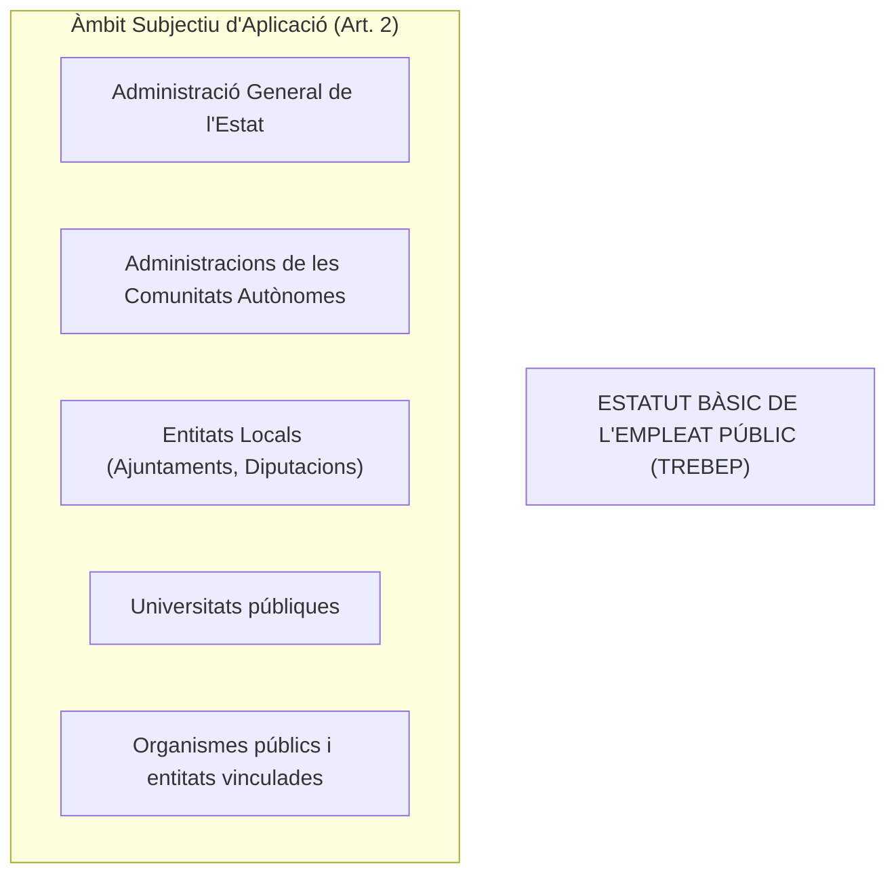
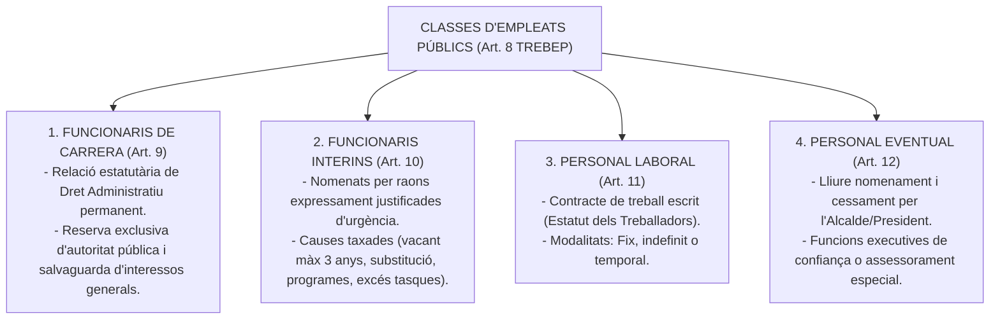
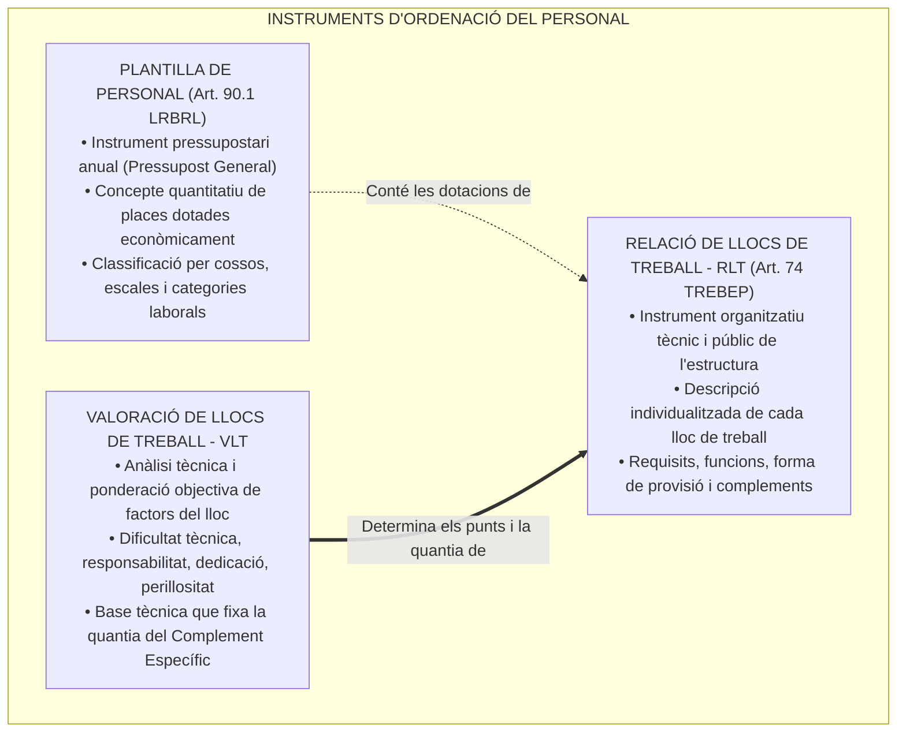
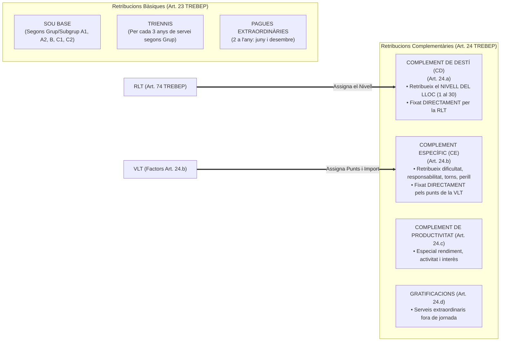
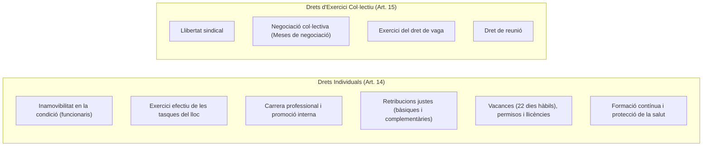
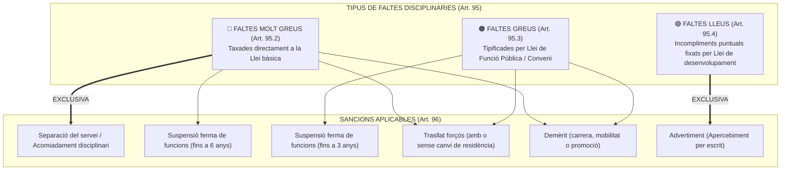

# Tema 16. Drets i deures del personal al servei de les administracions públiques (TREBEP)

> **Font normativa de referència:** [`CORPUS/TREBEP.pdf`](file:///home/oriol/Projectes/OPOS/CORPUS/TREBEP.pdf) i [`CORPUS/LRBRL.pdf`](file:///home/oriol/Projectes/OPOS/CORPUS/LRBRL.pdf)  
> **Textos:** Reial Decret Legislatiu 5/2015, de 30 d'octubre (TREBEP) i Llei 7/1985, de 2 d'abril, de bases del règim local (LRBRL). Textos consolidats.

---

## 1. Objecte, Àmbit i Fonament Constitucional

El **TREBEP (RDLeg 5/2015)** estableix les bases del règim estatutari dels funcionaris públics i les normes aplicables al personal laboral al servei de totes les administracions públiques (**Art. 149.1.18a CE**), per garantir la professionalitat, objectivitat, mèrit i capacitat en l'accés i exercici de la funció pública (**Arts. 23.2 i 103.3 CE**).

---

## 2. Classes de Personal al Servei de les Administracions Públiques (Arts. 8 a 13 TREBEP)

Són empleats públics els qui exerceixen funcions retribuïdes en les administracions públiques al servei dels interessos generals:

---

### 2.1. Els Funcionaris de Carrera i la Reserva d'Autoritat (Art. 9 TREBEP)
- Vinculats a l'Administració Pública per una relació estatutària regulada pel Dret Administratiu per a la prestació de serveis professionals retribuïts de caràcter permanent.
- **Reserva exclusiva de potestats públiques (Art. 9.2 TREBEP):** L'exercici de les funcions que impliquin la participació directa o indirecta en l'**exercici de les potestats públiques** o en la **salvaguarda dels interessos generals de l'Estat i de les administracions públiques** corresponen **exclusivament als funcionaris públics** (mai a personal laboral ni extern).

---

### 2.2. Els Funcionaris Interins (Art. 10 TREBEP)
Nomenats per circumstàncies justificades de necessitat i urgència en els següents supòsits taxats:
1. **Places vacants:** Quan no sigui possible la seva cobertura per funcionaris de carrera, per un **màxim de 3 anys**. Transcorregut aquest termini, la vacant ha de ser coberta mitjançant procés selectiu o amortitzada.
2. **Substitució transitòria dels titulars:** Pel temps estrictament necessari (baixes mèdiques, llicències, reserves de lloc).
3. **Execució de programes de caràcter temporal:** Per un termini **màxim de 3 anys**, prorrogable fins a 12 mesos més si ho preveu la llei de funció pública aplicable.
4. **Excés o acumulació de tasques:** Per un termini **màxim de 9 mesos dins d'un període de 18 mesos**.

---

### 2.3. Grups de Classificació Professional dels Funcionaris (Art. 76 TREBEP)

| Grup / Subgrup | Titulació Acadèmica Exigida per a l'Ingrés |
| :---: | :--- |
| **Grup A - Subgrup A1** | Títol universitari de **Grau** (amb exigència de nivell superior de responsabilitat o títol específic quan la llei ho exigeixi). |
| **Grup A - Subgrup A2** | Títol universitari de **Grau** (funcions executives de gestió i col·laboració tècnica). |
| **Grup B** | Títol de **Tècnic Superior** (Formació Professional de Grau Superior). |
| **Grup C - Subgrup C1** | Títol de **Batxiller** o Tècnic (Formació Professional de Grau Mitjà). |
| **Grup C - Subgrup C2** | Títol de **Graduat en Educació Secundària Obligatòria (ESO)**. |
| **Altres Agrupacions Professionals** | Sense requisit de titulació del sistema educatiu (Disposició Addicional Sisena TREBEP, antic Grup E). |

---

## 3. L'Ordenació dels Llocs de Treball: Plantilla, RLT i VLT (Art. 74 TREBEP i Art. 90 LRBRL)

L'organització del personal en les administracions públiques s'articula mitjançant dos instruments complementaris però jurídicament diferenciats: la **Plantilla de Personal** i la **Relació de Llocs de Treball (RLT)**, fonamentada en la **Valoració de Llocs de Treball (VLT)**.

---

### 3.1. Diferències entre Plantilla de Personal i Relació de Llocs de Treball (RLT)

| Criteri de Diferenciació | Plantilla de Personal (Art. 90.1 LRBRL) | Relació de Llocs de Treball - RLT (Art. 74 TREBEP i 90.2 LRBRL) |
| :--- | :--- | :--- |
| **Naturalesa jurídica** | Document de **caràcter estrictament pressupostari**. | Instrument tècnic de **planificació i ordenació organitzativa**. |
| **Objecte bàsic** | Enumera les **places** dotades pressupostàriament segons vincle jurídic (funcionaris, laborals, eventuals). | Defineix els **llocs de treball** individualitzats que integren l'organització. |
| **Periodicitat i vigència** | S'aprova **anualment** de forma indissociable amb el **Pressupost General** de la Corporació. | Vigència indefinida; es modifica quan ho exigeixin les necessitats organitzatives. |
| **Contingut obligatori** | Places reservades a funcionaris (per cossos i escales), places de personal laboral i dotacions d'eventuals. | Denominació del lloc, grup/subgrup de classificació, cos o escala, sistema de provisió (concurs/lliure designació) i **retribucions complementàries (CD i CE)**. |
| **Òrgan d'aprovació local** | **Ple de l'Ajuntament** (**Art. 22.2.i LRBRL**). | **Ple de l'Ajuntament** (**Art. 22.2.i LRBRL**), prèvia negociació a la Mesa General (**Art. 37.1.c TREBEP**). |
| **Publicitat** | Publicació al Butlletí Oficial de la Província (BOP) amb el resum del pressupost. | Publicació íntegra obligatòria al BOP i al Diari Oficial corresponent (**Art. 74 TREBEP**). |

---

### 3.2. La Valoració de Llocs de Treball (VLT) i els seus Factors
La **VLT** és el procés tècnic mitjançant el qual s'avaluen i es comparen de manera objectiva les exigències de cada lloc de treball de l'organització, establint una jerarquia i una puntuació relativa per a cadascun d'ells.

Els factors legals de valoració vénen determinats directament per l'**Article 24.b del TREBEP**:
1. **Especial dificultat tècnica:** Complexitat dels processos, grau d'iniciativa i autonomia exigida, volum i especialització de coneixements necessaris.
2. **Responsabilitat:** Gestió i custòdia de fons o valors públics, responsabilitat de comandament o direcció d'equips, repercussió econòmica o jurídica de les decisions, maneig d'informació confidencial o protegida per la LOPD.
3. **Dedicació i disponibilitat:** Exigència de disponibilitat horària fora de la jornada habitual, règim de flexibilitat o prolongació de jornada, i exigència d'incompatibilitat absoluta.
4. **Condicions particulars en què es desenvolupa el treball:** 
   - **Penositat i toxicitat:** Treball en contacte amb agents contaminants, químics o en condicions climatològiques extremes.
   - **Perillositat:** Risc físic directe per a la integritat o la salut (policia local, brigada d'obres).
   - **Torns i nocturnitat:** Treball a torns rotatius continus o durant la franja nocturna i dies festius.

---

## 4. Estructura Retributiva i la seva Connexió amb la RLT i VLT (Arts. 22 a 24 TREBEP)

El sistema retributiu dels funcionaris públics distingeix entre **retribucions bàsiques** (vinculades a la pertinença al grup professional i l'antiguitat) i **retribucions complementàries** (vinculades directament a les característiques del lloc determinades per la **RLT** i la **VLT**):

---

### 4.1. Connexió Estricta: RLT $\rightarrow$ Complement de Destí (CD)
- El **Complement de Destí (CD)** retribueix el nivell del lloc de treball que s'exerceix (**Art. 24.a TREBEP**).
- Aquest nivell (de l'**1 al 30**) s'atribueix a cada lloc de forma expressa a la **RLT** dins dels intervals establerts per a cada subgrup de classificació:
  - **Subgrup A1:** Nivells del 22 al 30.
  - **Subgrup A2:** Nivells del 18 al 26.
  - **Grup B:** Nivells del 16 al 22.
  - **Subgrup C1:** Nivells del 14 al 22.
  - **Subgrup C2:** Nivells del 12 al 18.
  - **Agrupacions Professionals:** Nivells del 10 al 14.

---

### 4.2. Connexió Estricta: VLT $\rightarrow$ Complement Específic (CE)
- El **Complement Específic (CE)** retribueix les condicions especials del lloc de treball (**Art. 24.b TREBEP**).
- **Relació directa amb la VLT:** La quantia del Complement Específic no es fixa de manera arbitrària ni discrecional, sinó que és el **resultat numèric directe de la Valoració de Llocs de Treball (VLT)**. A la VLT s'assigna una puntuació a cada factor (dificultat tècnica, responsabilitat, dedicació, penositat/perillositat), es determina un valor econòmic per punt en la negociació col·lectiva i el total de punts es tradueix en l'import monetari del complement específic que s'aprova a la **RLT**.
- És un complement únic per a cada lloc de treball, si bé a la VLT i RLT pot desglossar-se en diferents components segons els factors que el motiven.

---

## 5. Drets dels Empleats Públics i Codi de Conducta (Arts. 14, 15 i 52 a 54 TREBEP)

### 5.1. Codi de Conducta: Principis Ètics i de Conducta (Arts. 52 a 54 TREBEP)
- **Principis Ètics (Art. 53):** Respecte a la Constitució i l'Estatut; neutralitat política; **prohibició taxativa d'acceptar regals, favors o serveis avantatjosos** més enllà de la mera cortesia social; secret en matèries reservades.
- **Principis de Conducta (Art. 54):** Diligència en la jornada i compliment dels horaris; tracte respectuós als ciutadans i subordinats; **deure d'obediència als superiors**, llevat quan les ordres constitueixin una infracció manifesta, clara i terminant de l'ordenament jurídic (en aquest cas s'han d'abstenir de complir-les i advertir-ne a qui les dicta).

---

## 6. Règim Disciplinari: Correlació Estricta entre Faltes i Sancions (Arts. 93 a 98 TREBEP)

El règim disciplinari té com a finalitat assegurar l'adequat compliment de les funcions públiques i garantir la responsabilitat dels empleats públics, sotmès als **principis de legalitat, tipicitat, presumpció d'innocència i proporcionalitat** (**Art. 94 TREBEP**).

---

### 6.1. Tipologia Legal de les Faltes (Art. 95 TREBEP)

1. **Faltes Molt Greus (Art. 95.2 TREBEP - Catàleg Bàsic Estatal Tancat):**
   - Incompliment del deure de fidelitat a la Constitució i a l'Estatut d'Autonomia en l'exercici de la funció pública.
   - Tota actuació que suposi **discriminació** per raó de naixença, origen racial o ètnic, gènere, sexe, orientació sexual, religió, discapacitat o edat.
   - L'**abandonament del servei**, així com no fer-se càrrec voluntàriament de les funcions encomanades.
   - L'adopció d'**acords manifestament il·legals** que causin greu perjudici a l'Administració o als ciutadans.
   - La publicació o ús indegut de matèries reservades o secretes conegudes per raó del càrrec.
   - La **manca notòria de rendiment** que comporti inhibició en el compliment de les tasques.
   - La violació de la neutralitat o independència polítiques fent ús de facultats oficials.
   - L'incompliment de les normes sobre **incompatibilitats** quan doni lloc a una situació efectiva d'incompatibilitat.
   - L'**assetjament laboral (*mobbing*)** i l'**assetjament sexual o per raó de sexe**.
   - L'obstaculització a les llibertats públiques i drets sindicals o coartar el dret de vaga.
   - L'incompliment de l'obligació d'atendre els **serveis essencials en cas de vaga**.
   - La **desobediència oberta** a les ordres o instruccions d'un superior (llevat infracció manifesta).
   - La prevalença de la condició d'empleat públic per obtenir benefici indegut per a si mateix o per a un tercer.
   - La incompareixença injustificada en les Comissions d'Investigació de les Corts Generals o Parlament.

2. **Faltes Greus (Art. 95.3 TREBEP):** Han de ser tipificades per llei de les Corts Generals o assemblea legislativa autonòmica (o conveni col·lectiu en laborals) atenent a:
   - Grau de vulneració de la legalitat.
   - Gravetat dels danys causats a l'interès públic, patrimoni o béns de l'Administració o ciutadans.
   - Descrèdit per a la imatge pública de l'Administració.
   - *Supòsits típics:* Desobediència a superiors que no impliqui rebuig obert; abús d'autoritat en l'exercici del càrrec; manca d'assistència injustificada reiterada; negligència greu en la custòdia de documents; agressió o falta greu de respecte a companys o subordinats.

3. **Faltes Lleus (Art. 95.4 TREBEP):** Tipificades per les lleis de funció pública:
   - *Supòsits típics:* Retards injustificats i reiterats en la jornada laboral; incorrecció o desconsideració lleu amb ciutadans o companys; descuit no greu en la conservació d'equips o locals.

---

### 6.2. Matriu de Correspondència Vinculant entre Falta i Sanció (Art. 96 TREBEP)

La llei no permet aplicar qualsevol sanció a qualsevol falta, sinó que fixa una **correlació estricta i taxada**:

| Tipus de Falta Comesa | Sancions Jurídicament Aplicables (Art. 96.1 TREBEP) | Durada o Abast Màxim Legal |
| :--- | :--- | :--- |
| 🔴 **FALTA MOLT GREU** | **1. Separació del servei** *(en funcionaris)* / **Acomiadament disciplinari** *(en laborals)* | **Caràcter Definitiu** (pèrdua irreversible de la condició de funcionari; en interins revocació del nomenament). |
| | **2. Suspensió ferma de funcions** *(o d'ocupació i sou en laborals)* | Fins a un **màxim de 6 anys** (comporta la pèrdua del lloc de treball de conformitat amb la legislació aplicable). |
| | **3. Trasllat forçós amb o sense canvi de residència** | Període determinat per la resolució amb prohibició d'obtenir nou destí a la localitat per un termini establert (1 a 3 anys). |
| | **4. Demèrit** | Pèrdua de graus consolidats i prohibició de participar en concursos de provisió o promoció interna per un màxim fixat per llei. |
| 🟠 **FALTA GREU** | **1. Suspensió ferma de funcions** *(o d'ocupació i sou en laborals)* | **Màxim de fins a 3 anys** (segons la legislació de funció pública de desenvolupament). **Mai pot arribar a 6 anys**. |
| | **2. Trasllat forçós** *(generalment sense canvi de residència)* | Període establert per la sanció. |
| | **3. Demèrit** | Inhabilitació per a promoció o mobilitat per un temps limitat. |
| 🟢 **FALTA LLEU** | **1. Advertiment (Apercebiment per escrit)** | Constància escrita a l'expedient personal. **Sanció exclusiva per a faltes lleus**. |
| | **2. Suspensió curta de funcions** *(només si ho preveu expressament la llei autonòmica)* | Per un període curt (ex. d'1 a 4 dies). |

> ⚠️ **Regles d'or per a exàmens tipus test sobre règim disciplinari:**  
> 1. La **separació del servei** i l'**acomiadament disciplinari** **NOMÉS es poden imposar per la comissió de faltes MOLT GREUS** (**Art. 96.1.a i b TREBEP**).  
> 2. La sanció d'**advertiment (apercebiment per escrit)** **NOMÉS es pot imposar per a faltes LLEUS** (**Art. 96.1.f TREBEP**).  
> 3. La **suspensió ferma de funcions** té un límit màxim absolut de **6 anys** (per a molt greus); en cap cas pot superar aquest període.

---

### 6.3. Graduació de les Sancions i Proporcionalitat (Art. 96.3 TREBEP)
L'òrgan sancionador ha de determinar l'abast i gravetat concreta de la sanció aplicant els següents criteris reglats:
1. Grau d'**intencionalitat, negligència o descuit** que reveli la conducta.
2. Dany causat a l'interès públic, als ciutadans o al patrimoni administratiu.
3. **Reiteració o reincidència** (comissió en el termini d'un any de més d'una infracció de la mateixa naturalesa quan hagi estat declarada per resolució ferma).
4. Grau de participació del responsable.

---

### 6.4. Garanties Procedimentals i Mesures Provisionals (Art. 98 TREBEP)
- **Procediment contradictori preceptiu:** No es pot imposar cap sanció per falta greu o molt greu sense la tramitació prèvia del procediment legalment establert, amb **separació estricta entre la fase instructora i la fase sancionadora**, encomanades a òrgans diferents.
- **Procediment sumari per a faltes lleus:** Les sancions per faltes lleus s'imposen mitjançant un tràmit sumari garantint sempre l'**audiència prèvia a l'interessat**.
- **Suspensió provisional cautelar (Art. 98.3 TREBEP):**
  - Es pot adoptar durant la tramitació de l'expedient per resolució motivada.
  - Termini màxim ordinari de **6 mesos** (llevat de paralització del procediment imputable a l'interessat).
  - Durant la suspensió provisional, el funcionari té dret a percebre les **retribucions bàsiques** i les prestacions familiars per fill a càrrec (no percep complements).
  - Si la suspensió provisional no es converteix en sanció definitiva de suspensió ferma o separació, l'Administració ha de restituir la totalitat de les retribucions deixades de percebre i computar el temps com a servei actiu.

---

### 6.5. Terminis de Prescripció de Faltes i Sancions (Art. 97 TREBEP)

| Gravetat de la Infracció | Prescripció de les Faltes *(des de la comissió)* | Prescripció de les Sancions *(des de la fermesa)* |
| :---: | :---: | :---: |
| 🔴 **Molt Greus** | **3 anys** | **3 anys** |
| 🟠 **Greus** | **2 anys** | **2 anys** |
| 🟢 **Lleus** | **6 mesos** | **1 any** |

---

## 7. Situacions Administratives dels Funcionaris (Arts. 85 a 92 TREBEP)

1. **Servei Actiu (Art. 86):** Situació ordinària del funcionari que ocupa un lloc de treball de la seva plantilla.
2. **Serveis Especials (Art. 87):** Quan és designat membre del Govern, diputat a les Corts/Parlament, alcalde o regidor amb dedicació exclusiva, membre del Tribunal Constitucional o CGPJ. Es computa el temps a efectes d'antiguitat (triennis), reserva del lloc i drets passius.
3. **Servei en altres Administracions Públiques (Art. 88):** Per transferència o procediments de provisió de llocs (concurs o lliure designació).
4. **Excedències (Art. 89):**
   - **Voluntària per interès particular:** Requereix haver prestat serveis efectius durant almenys **5 anys** immediatament anteriors. S'hi ha de romandre un mínim continuat de **2 anys**. No genera triennis ni reserva de lloc.
   - **Per agrupació familiar:** Sense requisit de serveis previs, quan el cònjuge resideix en un altre municipi per ser funcionari o laboral fix.
   - **Per cura de familiars:** Fins a **3 anys** per fill o menor acollit; fins a **3 anys** per familiars fins al 2n grau que no puguin valer-se per si mateixos. *Es computa a efectes de triennis i reserva de lloc durant el primer any (i fins a 3 anys segons la legislació autonòmica)*.
   - **Per raó de violència de gènere o violència terrorista:** Sense requisit de serveis previs; dret a reserva de lloc durant els primers 6 mesos (ampliables fins a 18 mesos).
5. **Suspensió de Funcions (Art. 90):** Provisional (màxim 6 mesos durant el procediment disciplinari) o Ferma (per sentència judicial o sanció disciplinària ferma de fins a 6 anys).

---

## 8. Quadre Resum i Preguntes Típiques d'Examen Tipus Test

| Pregunta / Concepte Clau | Resposta Correcta / Trampa Freqüent |
| :--- | :--- |
| **Quina és la diferència bàsica entre Plantilla de Personal i RLT?** | La **Plantilla** és un document pressupostari anual quantitatiu de places (Art. 90.1 LRBRL); la **RLT** és un instrument tècnic organitzatiu que descriu individualment cada lloc i els seus complements (Art. 74 TREBEP). |
| **Quin complement retribueix el nivell del lloc de treball assignat a la RLT?** | El **Complement de Destí (CD)**, assignat als nivells de l'1 al 30 (Art. 24.a TREBEP). |
| **Quina relació té la Valoració de Llocs de Treball (VLT) amb les retribucions?** | La **VLT** avalua la dificultat tècnica, responsabilitat, dedicació i perillositat (Art. 24.b TREBEP), i els seus punts determinen matemàticament la quantia del **Complement Específic (CE)**. |
| **Quin òrgan municipal és competent per aprovar la Plantilla i la RLT?** | El **Ple de l'Ajuntament** (Art. 22.2.i LRBRL), prèvia negociació a la Mesa General. |
| **Per a quina classe de faltes es pot imposar la separació del servei?** | **Únicament per a faltes MOLT GREUS** (Art. 96.1.a TREBEP). Mai per faltes greus o lleus. |
| **Per a quina classe de faltes es pot imposar l'advertiment (apercebiment per escrit)?** | **Únicament per a faltes LLEUS** (Art. 96.1.f TREBEP). |
| **Quin és el límit màxim de la suspensió ferma de funcions per falta molt greu?** | Com a màxim **6 anys** (Art. 96.1.c TREBEP). |
| **Quina durada màxima pot tenir la suspensió provisional cautelar?** | **6 mesos** com a regla general (Art. 98.3 TREBEP). |
| **Quines retribucions percep el funcionari suspès provisionalment?** | Les **retribucions bàsiques** (sou i triennis) i prestacions familiars, però cap complement (Art. 98.3 TREBEP). |
| **En quin termini prescriuen les faltes i sancions greus?** | Als **2 anys** totes dues (Art. 97 TREBEP). |
| **En quin termini prescriuen les faltes lleus i les seves sancions?** | Les **faltes lleus prescriuen als 6 mesos**, mentre que les **sancions lleus prescriuen a l'any** (Art. 97 TREBEP). |
| **A qui correspon en exclusiva l'exercici de les potestats públiques?** | Exclusivament als **funcionaris de carrera** (Art. 9.2 TREBEP). |
| **Quin és el límit temporal del nomenament d'interí per vacant?** | **Màxim 3 anys** (Art. 10.1.a TREBEP). |
| **Quina titulació acadèmica exigeix el Subgrup C1?** | Títol de **Batxiller o Tècnic de Formació Professional** (Art. 76 TREBEP). |
| **Quin temps mínim de servei previ es requereix per a l'excedència voluntària per interès particular?** | **5 anys de serveis efectius** previs i permanència mínima de **2 anys** (Art. 89.2 TREBEP). |
