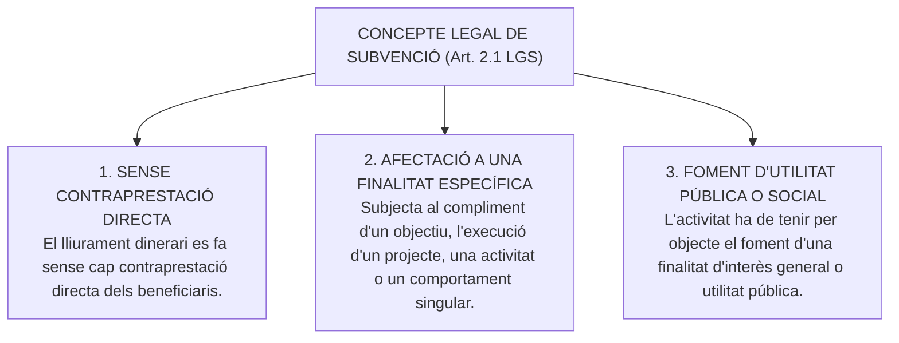
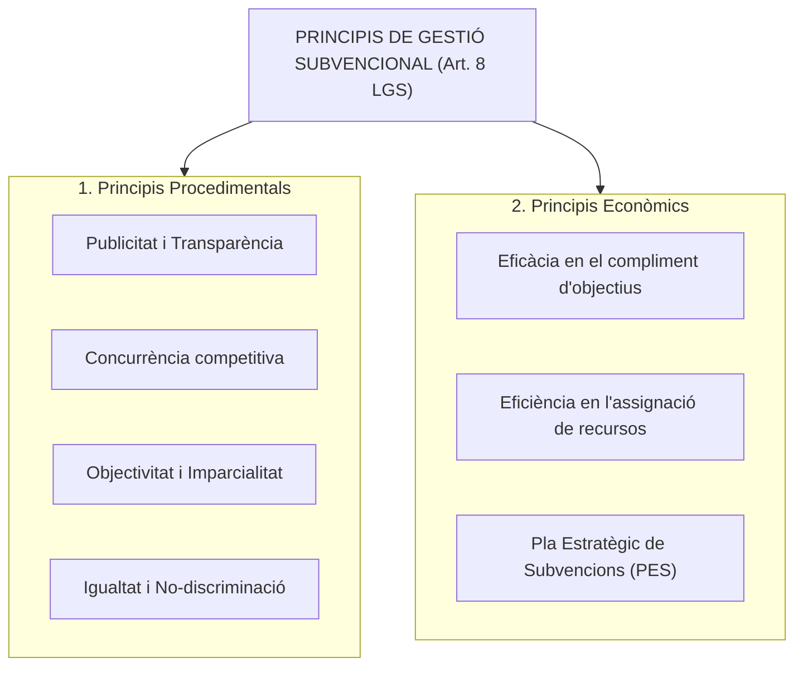
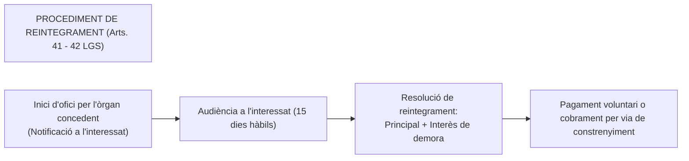

# Tema 17. El concepte de subvenció i el règim jurídic de les subvencions (Llei 38/2003)

> **Font normativa de referència:** [`CORPUS/Subvencions.pdf`](file:///home/oriol/Projectes/OPOS/CORPUS/Subvencions.pdf)  
> **Text:** Llei 38/2003, de 17 de novembre, general de subvencions (LGS). Text consolidat.

---

## 1. Concepte Legal de Subvenció (Art. 2 LGS)

D'acord amb l'article 2.1 de la Llei 38/2003 (LGS), s'entén per **subvenció** tota disposició dinerària realitzada per qualsevol dels subjectes del sector públic a favor de persones públiques o privades que compleixi els següents **tres requisits acumulatius**:

### 1.1. Supòsits exclosos de l'àmbit de la Llei de Subvencions (Arts. 2.4 i 4 LGS)
No tenen caràcter de subvenció:
- Les prestacions contributives i no contributives del sistema de la **Seguretat Social**.
- Les pensions de classes passives i prestacions d'assistència sanitària.
- Els **beneficis i incentius fiscals** (desgravacions i bonificacions tributàries).
- Els contractes del sector públic (LCSP) i convenis de col·laboració que no tinguin contingut subvencional.
- Les aportacions dineràries entre administracions públiques derivades de la seva participació en tributs o fons de finançament general.

---

## 2. Principis Generals de la Gestió Subvencional (Art. 8 LGS)

Les administracions públiques han d'ajustar la gestió de les subvencions als principis següents:

### 2.1. El Pla Estratègic de Subvencions (PES - Art. 8.1 LGS)
- Els òrgans de les administracions públiques que proposin l'establiment de subvencions han d'aprovar prèviament un **Pla Estratègic de Subvencions (PES)**.
- **Contingut del PES:** Ha de concretar els **objectius estratègics** que es pretenen assolir, els **costos previsibles**, les **fonts de finançament** i el sistema d'indicadors d'avaluació de resultats.

---

## 3. Requisits per a l'Atorgament de Subvencions (Art. 9 LGS)

Abans de concedir qualsevol subvenció, és indispensable el compliment previ dels següents requisits:
1. **Aprovació prèvia de les Bases Reguladores** de la concessió (que s'han de publicar oficialment).
2. **Competència de l'òrgan concedent** (Alcalde o Ple segons el cartipàs municipal).
3. **Existència de crèdit pressupostari adequat i suficient** (certificat de retenció de crèdit o document comptable 'A').
4. **Tramitació de l'expedient administratiu** corresponent segons el procediment aplicable.
5. **Fiscalització prèvia** dels actes econòmics per part de la Intervenció municipal.

---

## 4. Subjectes: Beneficiaris i Entitats Col·laboradores

### 4.1. Concepte de Beneficiari (Art. 11 LGS)
- És la persona física o jurídica que ha de realitzar l'activitat que va fonamentar la concessió de la subvenció o que es troba en la situació que legitima la seva percepció.
- També poden tenir la condició de beneficiaris les **comunitats de béns**, agrupacions de persones físiques o jurídiques i unions temporals d'empreses (UTE) quan la convocatòria ho autoritzi expressament.

---

### 4.2. Prohibicions per Obtenir la Condició de Beneficiari (Art. 13 LGS)
No poden obtenir la condició de beneficiari les persones o entitats que incorrin en alguna de les següents circumstàncies:
- **a)** Haver estat condemnades per sentència ferma a la pena de pèrdua de la possibilitat d'obtenir subvencions públiques (per delictes de prevaricació, suborn, malversació, tràfic d'influències o delictes contra la Hisenda Pública).
- **b)** Haver sol·licitat la declaració de concurs de creditors o haver estat declarades insolvents.
- **c)** Haver donat lloc a la **resolució culpable de qualsevol contracte** celebrat amb l'Administració.
- **d)** Estar incurs en causes d'incompatibilitat legal o alts càrrecs.
- **e) No estar al corrent en el compliment de les obligacions tributàries (Agència Tributària estatal i autonòmica/local) o amb la Seguretat Social**.
- **f)** Tenir la residència fiscal en un país o territori qualificat com a **paradís fiscal**.
- **g)** Tenir pendents de pagament obligacions per **reintegrament de subvencions**.
- **h)** Haver estat sancionat administrativament amb la pèrdua de la possibilitat d'obtenir subvencions.

---

### 4.3. Les Entitats Col·laboradores (Arts. 12 a 16 LGS)
- És l'entitat pública o privada que, actuant en nom i per compte de l'òrgan concedent a tots els efectes relacionats amb la subvenció, **lliura i distribueix els fons públics als beneficiaris** o col·labora en la seva gestió, comprovació i justificació.
- La col·laboració es formalitza mitjançant un **Conveni de Col·laboració**.

---

## 5. Obligacions dels Beneficiaris (Art. 14 LGS)

Són obligacions principals dels beneficiaris:
1. **Execució de l'activitat:** Realitzar l'activitat o complir el comportament que fonamenta la concessió.
2. **Justificació de la despesa:** Acreditar davant l'òrgan concedent o entitat col·laboradora la realització de l'activitat i el compliment dels requisits i condicions.
3. **Control financer:** Sotmetre's a les actuacions de comprovació de l'òrgan concedent, de la Intervenció municipal i de la Sindicatura de Comptes / Tribunal de Comptes.
4. **Comunicació de concurrència:** Comunicar a l'òrgan concedent l'**obtenció d'altres subvencions o ajuts per a la mateixa finalitat**.
5. **Acreditació tributària:** Acreditar abans del cobrament que es troba al corrent de les seves obligacions tributàries i amb la Seguretat Social.
6. **Conservació de documents:** Conservar els documents justificatius de l'aplicació dels fons rebuts (factures, nòmines, extractes bancaris) durant el termini de prescripció de 4 anys.
7. **Publicitat del finançament públic:** Difondre que l'activitat o projecte ha estat finançat per l'Ajuntament.
8. **Reintegrament de fons:** Reintegrar els fons percebuts en els supòsits d'incompliment o invalidesa.

---

## 6. La Invalidesa i el Reintegrament de Subvencions (Arts. 36 a 43 LGS)

### 6.1. Causes de Reintegrament (Art. 37 LGS)
Procedirà el reintegrament de les quantitats percebudes i l'exigència de l'**interès de demora corresponent des del moment del pagament** de la subvenció fins a la data en què s'acordi la procedència del reintegrament:
- **a)** Obtenció de la subvenció **falsejant les condicions requerides** o ocultant aquelles que ho haguessin impedit.
- **b)** **Incompliment total o parcial de l'objectiu**, de l'activitat, del projecte o la no adopció del comportament que fonamenten la concessió.
- **c)** **Incompliment de l'obligació de justificació** o la justificació insuficient.
- **d)** Incompliment de l'obligació d'adoptar les mesures de difusió i publicitat institucional.
- **e)** Resistència, excusa, obstrucció o negativa a les actuacions de comprovació i control financer.
- **f)** Incompliment de les obligacions que doni lloc a un **sobrefinançament** (l'import de les subvencions en cap cas no pot superar el cost total de l'activitat subvencionada).

---

### 6.2. Prescripció del Dret de Reintegrament (Art. 39 LGS)
- **Termini de prescripció:** Prescriurà als **4 anys** el dret de l'Administració a reconèixer o liquidar el reintegrament.
- **Inici del còmput:** Des del moment en què va vèncer el termini per presentar la justificació per part del beneficiari, o des de la data de concessió en subvencions sense justificació posterior.

---

## 7. Quadre Resum i Preguntes Típiques d'Examen Tipus Test

| Pregunta / Concepte Clau | Resposta Correcta / Trampa Freqüent |
| :--- | :--- |
| **Quins són els 3 elements del concepte legal de subvenció?** | **Lliurament dinerari sense contraprestació directa, afectat a un fi d'utilitat pública o interès social** (Art. 2.1 LGS). |
| **Les prestacions de la Seguretat Social són subvencions?** | **No**, estan expressament excloses de l'àmbit de la Llei de Subvencions (Art. 2.4.a LGS). |
| **Quin instrument de planificació és obligatori aprovar prèviament?** | El **Pla Estratègic de Subvencions (PES)** (Art. 8.1 LGS). |
| **Pot un deutor tributari ser beneficiari d'una subvenció?** | **No**, és una prohibició taxativa de l'article 13.2.e de la LGS. |
| **Quina entitat lliura els fons en nom de l'òrgan concedent?** | L'**Entitat Col·laboradora**, mitjançant conveni (Art. 12 LGS). |
| **Què s'exigeix juntament amb la devolució del principal en un reintegrament?** | L'**interès de demora** meritat des del moment del pagament (Art. 37.1 LGS). |
| **En quin termini prescriu el dret de l'Administració a exigir el reintegrament?** | Als **4 anys** (Art. 39 LGS). |
| **Poden les subvencions superar el cost total del projecte?** | **En cap cas**; si se supera, s'ha de reduir o reintegrar l'excés (Art. 19.3 LGS). |
