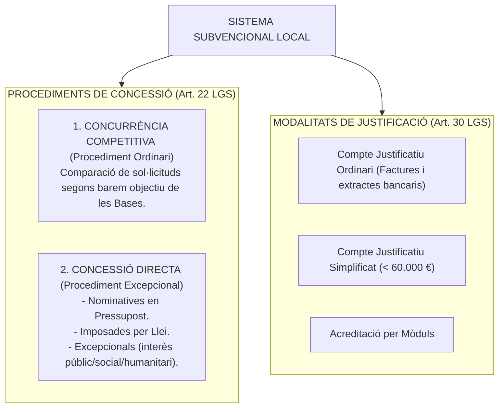
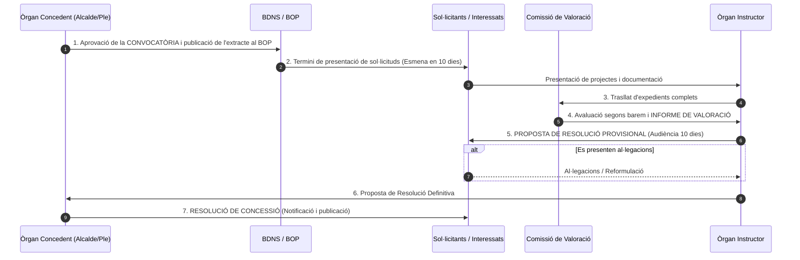
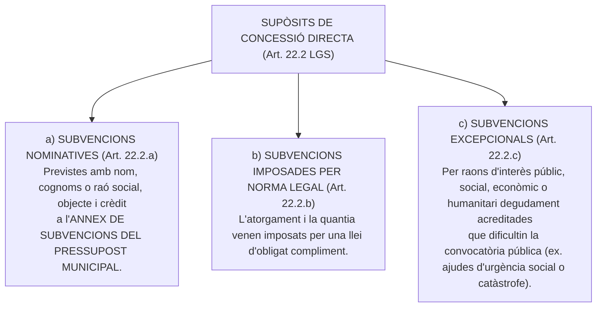
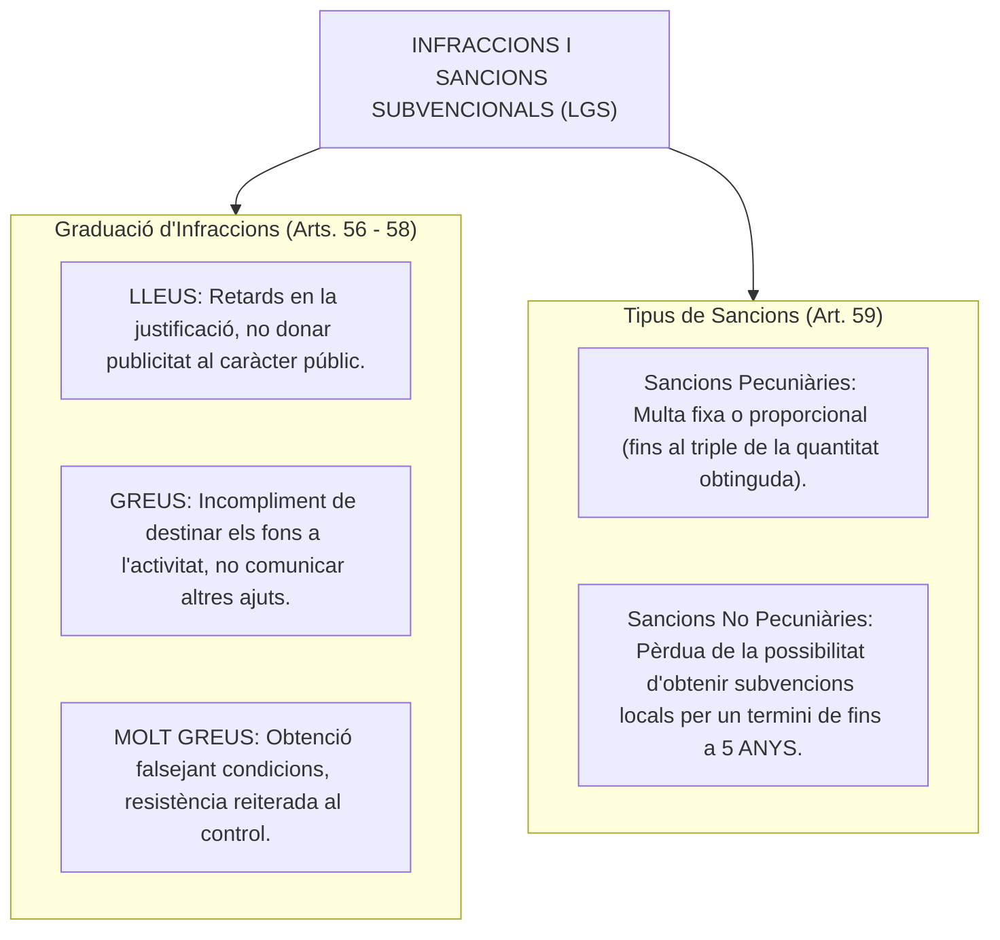

# Tema 18. L'activitat subvencional a l’administració local. Procediments de concessió

> **Fonts normatives de referència:** [`CORPUS/Subvencions.pdf`](file:///home/oriol/Projectes/OPOS/CORPUS/Subvencions.pdf) (Llei 38/2003, General de Subvencions) i [`CORPUS/LRBRL.pdf`](file:///home/oriol/Projectes/OPOS/CORPUS/LRBRL.pdf) (Llei 7/1985).

---

## 1. El Marc de l'Activitat Subvencional Local

L'activitat de foment mitjançant subvencions en l'àmbit municipal s'articula mitjançant l'**Ordenança General de Subvencions (OGS)** de l'Ajuntament, el **Pla Estratègic de Subvencions (PES)** i la publicitat a través de la **Base de Dades Nacional de Subvencions (BDNS)**.

---

## 2. El Procediment de Concurrència Competitiva (Arts. 22.1 i 23 a 27 LGS)

És el **procediment ordinari** de concessió de subvencions, mitjançant el qual la concessió es realitza a través de la comparació de les sol·licituds presentades, a fi d'establir una prelació d'acord amb els criteris de valoració fixats prèviament en les bases reguladores, i adjudicar els ajuts fins al límit del crèdit disponible.

---

### 2.1. Fases detallades de la Concurrència Competitiva

#### 1. Convocatòria Pública (Art. 23 LGS):
- Aprovada per decret d'Alcaldia o acord de la Junta de Govern Local / Ple.
- **Publicitat preceptiva:** El text complet es remet a la **Base de Dades Nacional de Subvencions (BDNS)** i es publica un extracte oficial al **Butlletí Oficial de la Província (BOP)** i a la seu electrònica municipal.
- Fixa l'objecte, requisits dels sol·licitants, crèdit pressupostari disponible, terminis de sol·licitud i de justificació, i criteris de baremació.

#### 2. Instrucció de l'expedient i Comissió de Valoració (Arts. 24 i 22.1 LGS):
- L'òrgan instructor comprova el compliment dels requisits formals i demana les esmenes necessàries (**10 dies hàbils**).
- La **Comissió de Valoració** (òrgan col·legiat format per tècnics municipals) avalua les sol·licituds d'acord amb els criteris de les bases i emet un **informe de valoració vinculant**.

#### 3. Proposta de Resolució i Tràmit d'Audiència (Art. 24.4 LGS):
- L'instructor formula la **proposta de resolució provisional**, degudament motivada, que es notifica als interessats concedint un termini de **10 dies hàbils per presentar al·legacions** o reformular el projecte.
- Un cop examinades les al·legacions, es formula la **proposta de resolució definitiva**.

#### 4. Resolució de Concessió i Silenci Administratiu (Art. 25 LGS):
- L'òrgan competent dicta la resolució expressa motivada adjudicant les subvencions i desestimant la resta de sol·licituds.
- **Termini màxim de resolució:** El que fixi la convocatòria, que **no pot superar els 6 mesos** (comptats des de la publicació de la convocatòria).
- **Sentit del silenci administratiu (Art. 25.5 LGS):** El venciment del termini màxim sense haver-se notificat resolució expressa legitima els interessats per entendre **DESESTIMADA la sol·licitud per silenci administratiu negatiu**.

---

## 3. Els Procediments de Concessió Directa (Art. 22.2 LGS)

Poden concedir-se de forma directa, amb caràcter excepcional, únicament en els següents supòsits taxats:

- **Formalització de la Concessió Directa (Art. 28 LGS):** Les subvencions de concessió directa es formalitzen mitjançant **Conveni de Col·laboració** o resolució motivada, acompanyades de les seves condicions particulars de compliment i justificació.

---

## 4. Justificació de les Subvencions Locals (Art. 30 LGS)

La justificació de la subvenció és la rendició de comptes que el beneficiari està obligat a presentar per demostrar la realització de l'activitat subvencionada i la correcta aplicació dels fons públics:

| Modalitat de Justificació | Requisits i Contingut | Àmbit d'aplicació típic |
| :--- | :--- | :--- |
| **1. Compte Justificatiu Ordinari amb aportació de justificants** | - **Memòria d'actuació justificativa** de les activitats realitzades. - **Memòria econòmica abreujada o detallada** amb la relació classificada de despeses. - **Factures originals o documents de valor probatori equivalent** i extractes bancaris acreditatius del pagament efectiu. | Modalitat general aplicable a la majoria de subvencions a entitats i associacions. |
| **2. Compte Justificatiu Simplificat** | - Memòria d'actuació. - Relació classificada de despeses i ingressos sense necessitat d'aportar inicialment totes les factures. - L'Ajuntament comprova posteriorment els justificants mitjançant una **tècnica de mostreig aleatori**. | Per a subvencions d'import inferior a **60.000 euros**. |
| **3. Acreditació per Mòduls** | - Justificació mitjançant el compliment d'indicadors de mesura o mètriques determinades (preu/hora, nombre d'usuaris atesos, quilòmetres). - No requereix justificants individuals de despesa. | Activitats amb costos unitaris estandarditzats. |
| **4. Informe d'Auditor de Comptes** | - El compte justificatiu s'acompanya d'un informe d'un auditor de comptes inscrit al ROAC que fiscalitza la documentació. | Projectes de gran quantia econòmica. |

---

## 5. Infraccions i Sancions en Matèria de Subvencions (Arts. 52 a 69 LGS)

- **Prescripció de les infraccions i sancions (Art. 65 LGS):** Les infraccions i les sancions administratives en matèria de subvencions prescriuen al cap de **4 anys**.

---

## 6. Quadre Resum i Preguntes Típiques d'Examen Tipus Test

| Pregunta / Concepte Clau | Resposta Correcta / Trampa Freqüent |
| :--- | :--- |
| **Quin és el procediment ORDINARI de concessió de subvencions?** | El procediment de **concurrència competitiva** (Art. 22.1 LGS). |
| **On s'ha de publicar l'extracte de la convocatòria de subvencions?** | Al **Butlletí Oficial de la Província (BOP)** a través de la **BDNS** (Art. 23.2 LGS). |
| **Quin termini té l'òrgan instructor per resoldre el procediment de concurrència?** | Com a màxim **6 mesos** des de la publicació de la convocatòria (Art. 25.4 LGS). |
| **Quin efecte té el silenci administratiu en la concessió de subvencions?** | **Desestimatori / Negatiu** (Art. 25.5 LGS). |
| **On han de figurar les subvencions nominatives de concessió directa?** | A l'**Annex de subvencions del Pressupost General** de la corporació (Art. 22.2.a LGS). |
| **Fins a quin import es pot utilitzar el compte justificatiu simplificat?** | Fins a **60.000 euros** (Art. 75 Reial Decret 887/2006, RDLGS). |
| **Quin termini de prescripció tenen les infraccions i sancions de subvencions?** | **4 anys** (Art. 65 LGS). |
| **Per quant de temps es pot inhabilitar un beneficiari sancionat?** | Fins a un **màxim de 5 anys** per a infraccions molt greus (Art. 59.2 LGS). |
