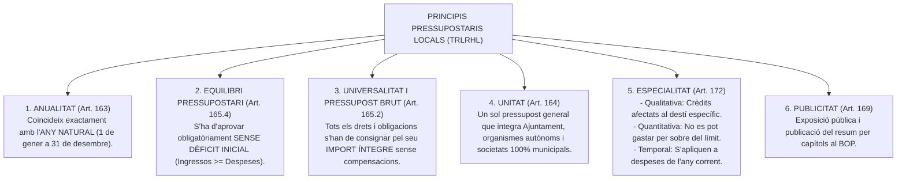
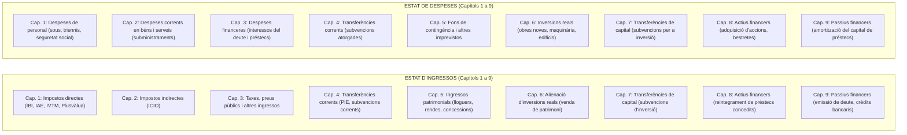
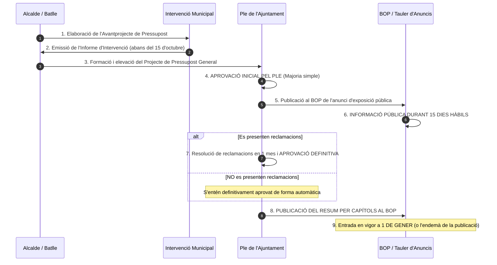
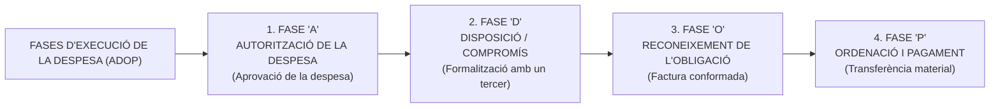
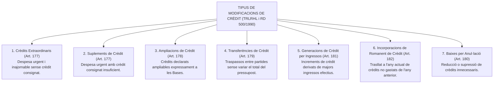

# Tema 19. El pressupost general dels ens locals: concepte i contingut. Les fases d’execució del pressupost. Concepte i tipus de modificació de crèdit

> **Fonts normatives de referència:** [`CORPUS/Hisenda.pdf`](file:///home/oriol/Projectes/OPOS/CORPUS/Hisenda.pdf) (Reial Decret Legislatiu 2/2004, TRLRHL - Arts. 162 a 193) i Reial Decret 500/1990, de 4 de febrer.

---

## 1. Concepte, Naturalesa i Principis Pressupostaris

D'acord amb l'article 162 del TRLRHL, el **Pressupost General dels ens locals** és l'expressió xifrada, conjunta i sistemàtica de les obligacions que, com a màxim, poden reconèixer l'entitat local i els seus organismes autònoms, i dels drets que es prevegin liquidar durant el corresponent exercici pressupostari.

---

## 2. Contingut i Estructura del Pressupost General (Arts. 164 a 167 TRLRHL)

El Pressupost General està integrat per:
1. El pressupost de la **pròpia entitat local** (Ajuntament).
2. Els pressupostos dels seus **organismes autònoms locals**.
3. Els estats de previsió de despeses i ingressos de les **societats mercantils locals** amb capital 100% públic.

---

### 2.1. Classificació dels Ingressos i Despeses per Capítols

- **Operacions Corrents:** Capítols 1 a 5.
- **Operacions de Capital / Inversió:** Capítols 6 i 7.
- **Operacions Financeres:** Capítols 8 i 9.

---

## 3. Cicle d'Elaboració, Tramitació i Aprovació del Pressupost (Arts. 168 i 169 TRLRHL)

- **Pròrroga automàtica del Pressupost (Art. 169.6 TRLRHL):** Si a l'inici de l'exercici econòmic (1 de gener) no ha entrat en vigor el nou pressupost, es considera **prorrogat automàticament el pressupost de l'exercici anterior** fins a l'aprovació i publicació del nou.

---

## 4. Les Fases d'Execució del Pressupost de Despeses

L'execució de la despesa pública local es desenvolupa a través de quatre fases successives conegudes per la regla mnemotècnica **ADOP** (Arts. 183 a 190 TRLRHL i RD 500/1990):

### 4.1. Anàlisi detallada de les fases:
1. **Fase A - Autorització de la despesa (Art. 184 TRLRHL):** Acte administratiu mitjançant el qual l'òrgan competent (Alcalde o Ple) acorda la realització d'una despesa calculada de forma certa o aproximada, reservant a aquest efecte la totalitat o part del crèdit disponible (*document comptable A*).
2. **Fase D - Disposició o compromís de la despesa (Art. 185 TRLRHL):** Acte pel qual l'Administració formalitza i concerta amb una persona física o jurídica l'execució d'obres, serveis o subministraments per un import cert i determinat (*document comptable D*).
   *(Es poden acumular en un sol acte: fases AD).*
3. **Fase O - Reconeixement de l'obligació (Art. 186 TRLRHL):** Acte administratiu pel qual es declara l'existència d'un deute líquid i exigible contra l'entitat local, derivat de la recepció efectiva de la prestació contractada i la comprovació de la factura (*document comptable O*).
   *(Es poden acumular les tres primeres fases: fases ADO).*
4. **Fase P - Ordenació del pagament i pagament material (Art. 187 TRLRHL):** L'Alcalde (*ordenador de pagaments*) expedeix l'ordre formal de pagament i la Tresoreria municipal materialitza la sortida de fons líquids (transferència o xec bancari).

---

## 5. Concepte i Tipus de Modificació de Crèdit (Arts. 177 a 182 TRLRHL)

Els crèdits inicials aprovats en el pressupost poden ser modificats al llarg de l'exercici per ajustar-los a noves necessitats mitjançant els següents tipus d'expedients:

---

### 5.1. Quadre Sistemàtic de Modificacions de Crèdit

| Modificació de Crèdit | Concepte i Finalitat | Finançament habitual | Òrgan Competent per a l'Aprovació |
| :--- | :--- | :--- | :--- |
| **Crèdit Extraordinari** *(Art. 177)* | Despesa específica i urgent per a la qual **no existeix cap crèdit** al pressupost. | Romanent líquid de tresoreria, nous ingressos o baixes d'altres partides. | **Ple de la Corporació** (amb informació pública de 15 dies). |
| **Suplement de Crèdit** *(Art. 177)* | Despesa específica i urgent quan el **crèdit existent és insuficient**. | Romanent líquid de tresoreria, nous ingressos o baixes d'altres partides. | **Ple de la Corporació** (amb informació pública de 15 dies). |
| **Transferències de Crèdit** *(Art. 179)* | Trasllat de dotacions pressupostàries entre partides. | Traspàs directe d'una partida a una altra. | **Alcalde** (ordinàriament entre mateixa àrea de despesa) o **Ple** (entre diferents àrees de despesa). |
| **Generacions de Crèdit** *(Art. 181)* | Increments de despesa derivats de **majors ingressos efectivament reconeguts**. | Subvencions no previstes, donacions, indemnitzacions o venda de béns. | **Alcalde** (o el Ple segons les Bases d'Execució). |
| **Incorporació de Romanents** *(Art. 182)* | Crèdits de l'any anterior compromesos o d'inversions que s'incorporen a l'actual. | Romanent de tresoreria per a despeses generals o ingressos afectats. | **Alcalde**. |

---

## 6. Quadre Resum i Preguntes Típiques d'Examen Tipus Test

| Pregunta / Concepte Clau | Resposta Correcta / Trampa Freqüent |
| :--- | :--- |
| **Quan s'ha d'elevar l'Avantprojecte de Pressupost a la Presidència?** | Abans del **15 d'octubre** de cada any (Art. 168.1 TRLRHL). |
| **Quin és el termini d'exposició pública del Pressupost General?** | **15 dies hàbils** al BOP i tauler d'anuncis (Art. 169.1 TRLRHL). |
| **Què passa si a 1 de gener no s'ha aprovat el nou pressupost?** | Es **prorroga automàticament** el pressupost de l'exercici anterior (Art. 169.6 TRLRHL). |
| **Quines són les 4 fases d'execució de la despesa?** | **Autorització (A), Disposició (D), Reconeixement de l'Obligació (O) i Pagament (P)** (ADOP). |
| **Quina fase reconeix formalment el deute líquid amb el contractista?** | El **Reconeixement de l'Obligació (Fase O)** mitjançant la conformitat de factura (Art. 186). |
| **Qui té la condició d'ordenador de pagaments a l'Ajuntament?** | L'**Alcalde / Batlle** (Art. 187 TRLRHL). |
| **Quina modificació s'aplica si NO hi ha crèdit per a una despesa urgent?** | **Crèdit Extraordinari**, aprovat pel Ple de la Corporació (Art. 177 TRLRHL). |
| **A quins capítols corresponen les operacions de capital / inversions?** | **Capítols 6 i 7** tant en ingressos com en despeses. |
