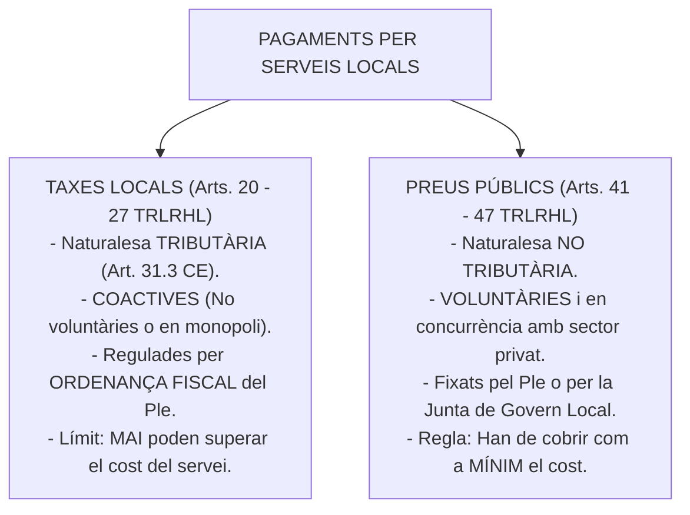
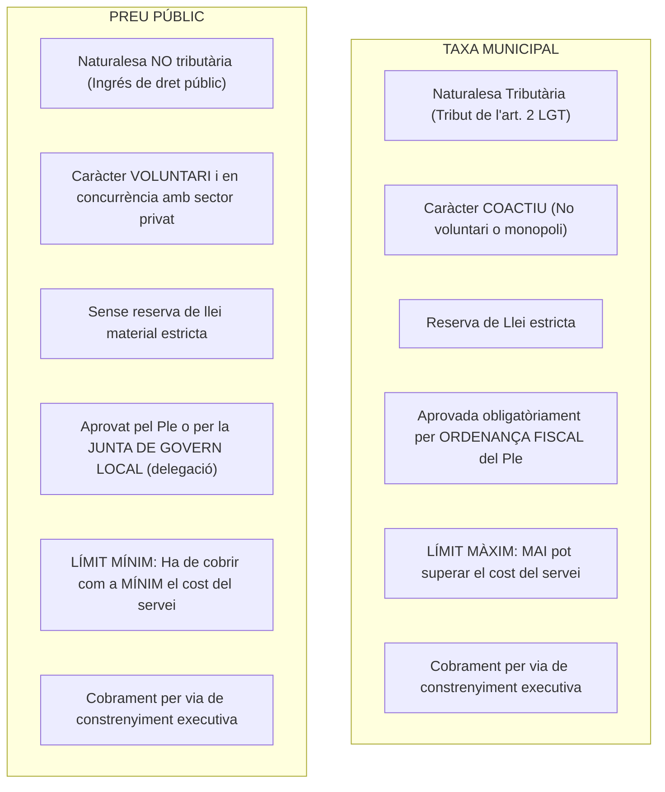

# Tema 20. Preus públics i taxes

> **Font normativa de referència:** [`CORPUS/Hisenda.pdf`](file:///home/oriol/Projectes/OPOS/CORPUS/Hisenda.pdf)  
> **Text:** Reial Decret Legislatiu 2/2004, de 5 de març, pel qual s'aprova el text refós de la Llei reguladora de les hisendes locals (TRLRHL - Arts. 20 a 27 i 41 a 47).

---

## 1. Marc Conceptual i Fonament Constitucional

El finançament dels serveis i activitats públiques locals mitjançant pagaments dels usuaris es divideix en dues categories jurídicament diferenciades: **Taxes** (tributs coactius) i **Preus Públics** (contraprestacions voluntàries en concurrència amb el sector privat).

Aquesta diferenciació troba el seu fonament en la doctrina constitucional de la **STC 185/1995**, que estableix que qualsevol prestació dinerària exigida per l'Administració de forma coactiva és una **prestació patrimonial de caràcter públic** sotmesa al **principi de reserva de llei** (**Art. 31.3 CE**).

---

## 2. Les Taxes Locals (Arts. 20 a 27 TRLRHL)

### 2.1. Concepte i Fets Imposables (Art. 20 TRLRHL)
Les entitats locals poden establir taxes en dos supòsits:

#### 1. Per la utilització privativa o l'aprofitament especial del domini públic local:
- Ocupació de terrenys d'ús públic amb **terrasses de bars, taules i cadires**.
- Entrada de vehicles a través de les voreres (**guals**).
- Instal·lació de quioscos a la via pública, caixers automàtics a façanes, llocs de mercat ambulant.
- Ocupació del subsòl, sòl o vol de les vies públiques per empreses explotadores de subministraments i telecomunicacions.

#### 2. Per la prestació de serveis públics o activitats administratives quan concorri alguna d'aquestes dues condicions:
- **a) Que no siguin de sol·licitud o recepció voluntària** per als administrats (són imposades coactivament per la llei o per raons de seguretat, salubritat o ordre públic).
- **b) Que no es prestin pel sector privat** (l'Administració actua en règim de monopoli de fet o de dret).

---

### 2.2. Serveis prohibits d'exacció de taxes (Art. 21 TRLRHL)
Els ajuntaments **no poden exigir taxes** en cap cas per:
1. **Enllumenat públic de les vies públiques**.
2. **Neteja general de la via pública**.
3. **Seguretat ciutadana i vigilància pública**.
4. **Protecció civil**.
5. **Prevenció i extinció d'incendis com a servei general** (només es pot cobrar per actuacions singulars i concretes en benefici d'immobles determinats).
6. **Ensenyament obligatori**.

---

### 2.3. Quantificació de les Taxes i l'Estudi Economicofinancer (Art. 24 TRLRHL)
- **Límit legal màxim:** L'import de les taxes per prestació d'un servei o realització d'una activitat **no pot superar en cap cas el cost real o previsible del servei o activitat**, calculat sumant les despeses directes i indirectes (personal, amortitzacions, consums).
- **Informe preceptiu:** Tot expedient d'aprovació o modificació d'una taxa ha d'incorporar obligatòriament un **estudi economicofinancer** que justifiqui el cost del servei i la procedència de les quotes proposades.

---

## 3. Els Preus Públics (Arts. 41 a 47 TRLRHL)

### 3.1. Concepte i Requisits (Art. 41 TRLRHL)
Tenen la consideració de **preus públics** les contraprestacions pecuniàries que s'estableixin per la prestació de serveis o la realització d'activitats de la competència de l'entitat local, sempre que concorrin **simultàniament** les dues circumstàncies següents:
1. Que els serveis o activitats **siguin de sol·licitud o recepció voluntària** pels administrats.
2. Que els serveis o activitats **siguin prestats o realitzats també pel sector privat**.

#### Exemples típics de Preus Públics:
- Entrades a teatres, auditoris i museus municipals.
- Ús d'instal·lacions esportives municipals (piscina, gimnàs, pistes de pàdel).
- Matrícules d'escoles bressol municipals o escoles de música.
- Cursos, tallers culturals o activitats de lleure d'estiu.
- Servei de menjador municipal.

---

### 3.2. Quantificació dels Preus Públics (Art. 44 TRLRHL)
- **Regla general de cobertura mínima:** L'import dels preus públics s'ha de fixar a un nivell que **cobreixi, com a mínim, el cost del servei o de l'activitat** ($\text{Preu Públic} \ge \text{Cost}$).
- **Preus públics deficitaris per raons socials (Art. 44.2 TRLRHL):** Quan existeixin raons socials, benèfiques, culturals o d'interès públic que ho aconsellin, l'entitat local pot fixar preus públics per sota del cost del servei (preus deficitaris o subvencionats), sempre que es consignin en el Pressupost les dotacions suficients per cobrir la part del cost no finançada amb el preu públic.

---

### 3.3. Procediment de Fixació i Competència (Art. 47 TRLRHL)
- **Òrgan competent:** L'establiment o modificació dels preus públics correspon originàriament al **Ple de la Corporació**.
- **Delegació:** El Ple **pot delegar la facultat de fixar i modificar els preus públics en la Junta de Govern Local** (Art. 47.1 TRLRHL).

---

## 4. Quadre Comparatiu Integral: Taxes vs. Preus Públics

| Criteri de Comparació | Taxa Local (Arts. 20-27 TRLRHL) | Preu Públic (Arts. 41-47 TRLRHL) |
| :--- | :--- | :--- |
| **Naturalesa jurídica** | **Tribut** (prestació patrimonial pública tributària). | **Contraprestació no tributària** (ingrés de dret públic). |
| **Principi de Reserva de Llei** | **Sí**, sotmesa a reserva de llei estricta (Art. 31.3 CE). | **No**, regulació flexible. |
| **Concurrència de mercat** | **Monopoli** de fet o de dret (no prestat pel sector privat). | **Concurrència efectiva** amb empreses del sector privat. |
| **Grau de voluntarietat** | **Coactiva** (obligatòria o indispensable per a la vida). | **Voluntària** (lliure sol·licitud per part de l'usuari). |
| **Norma reguladora** | **Ordenança Fiscal** aprovada pel Ple segons l'art. 17 TRLRHL. | Acord de fixació de preus (no requereix ordenança fiscal). |
| **Òrgan competent** | **Exclusivament el Ple** de la Corporació (indelegable). | El **Ple**, o la **Junta de Govern Local per delegació**. |
| **Criteri econòmic de tarifació** | Com a màxim el **100% del cost del servei** ($\le \text{cost}$). | Com a **mínim el cost del servei** ($\ge \text{cost}$), llevat de motius socials. |
| **Informe economicofinancer** | **Preceptiu** per demostrar que no es supera el cost. | **Preceptiu** per calcular el cost i justificar el preu. |
| **Via de cobrament executiu** | Per **via de constrenyiment** (com qualsevol tribut). | Per **via de constrenyiment** (Art. 46.3 TRLRHL). |

---

## 5. Quadre Resum i Preguntes Típiques d'Examen Tipus Test

| Pregunta / Concepte Clau | Resposta Correcta / Trampa Freqüent |
| :--- | :--- |
| **Quina és la diferència clau entre taxa per serveis i preu públic?** | La **voluntarietat** de la sol·licitud i la **concurrència amb el sector privat** (Art. 41 TRLRHL). |
| **Quin límit econòmic té l'import d'una taxa per prestació de serveis?** | **Mai no pot superar el cost real o previsible del servei** (Art. 24.2 TRLRHL). |
| **Quin criteri econòmic regeix com a regla general els preus públics?** | Han de **cobrir com a mínim el cost del servei** (Art. 44.1 TRLRHL). |
| **Es pot delegar la fixació de preus públics en la Junta de Govern Local?** | **Sí**, el Ple pot delegar aquesta atribució en la Junta de Govern (Art. 47.1 TRLRHL). |
| **Es pot delegar l'aprovació d'una taxa en la Junta de Govern Local?** | **No**, les taxes són tributs i la seva aprovació correspon exclusivament al Ple (Art. 22.2.d LRBRL). |
| **Es pot cobrar taxa per l'enllumenat públic o la neteja viària?** | **No**, està prohibit expressament per l'article 21 del TRLRHL. |
| **Poden ser deficitaris els preus públics municipals?** | **Sí**, per raons socials, benèfiques o culturals, si el Pressupost en cobreix la diferència (Art. 44.2 TRLRHL). |
| **Es poden cobrar els preus públics impagats per via de constrenyiment?** | **Sí**, gaudeixen de la via administrativa de constrenyiment (Art. 46.3 TRLRHL). |
