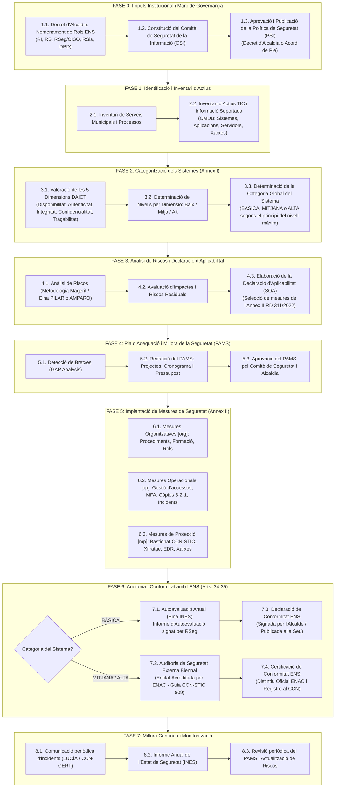
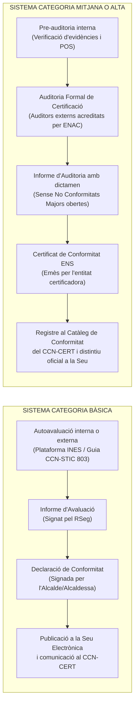

# Cas Pràctic 01: Pla Seqüencial Integral per a l'Aprovació, Implantació i Conformitat de l'ENS en una Organització Local

> **Marc Normatiu de Referència:** Reial Decret 311/2022 (Esquema Nacional de Seguretat - ENS), Llei 40/2015 (Règim Jurídic del Sector Públic - Arts. 156-158), Llei Orgànica 3/2018 (LOPDGDD), Guies CCN-STIC (sèries 800: 801, 802, 803, 804, 805, 808, 809, 824) i Instruccions Tècniques de Seguretat del CCN.  
> **Àmbit d'Aplicació:** Administració Local (Ajuntaments, Consells Comarcals, Diputacions i organismes autònoms locals).

---

## 1. Enunciat i Context del Supòsit Pràctic

### Context de l'Organització
L'Ajuntament de *Vila-real del Vallès* (municipi fictici de 28.000 habitants, amb 190 empleats públics) disposa d'una seu electrònica plenament operativa, tramitació telemàtica, padró d'habitants connectat amb l'INE, gestió tributària delegada parcialment, registre d'entrada/sortida integrat amb SIR, aplicacions de gestió d'expedients i policia local. 

Fins a la data, les actuacions en ciberseguretat s'han realitzat de manera reactiva (instal·lació d'antivirus, còpies de seguretat locals i firewall perimetral), sense disposar d'una estructura formal de governança de seguretat ni d'una Política de Seguretat de la Informació aprovada.

### Requeriment Institucional
En virtut del **Reial Decret 311/2022, de 3 de maig**, pel qual es regula l'Esquema Nacional de Seguretat (ENS), i arran d'un informe de fiscalització de la Sindicatura de Comptes que adverteix de la manca de Declaració o Certificació de Conformitat amb l'ENS, l'Alcaldia dicta una providència mitjançant la qual encomana al Responsable del Departament TIC i Sistemes la redacció d'un **Pla Seqüencial Integral per a l'Adequació, Aprovació, Implantació i Acreditació de la Conformitat amb l'ENS** a la corporació municipal.

---

## 2. Mapa Conceptual i Flux Seqüencial de Fases

L'adequació a l'ENS no és un projecte purament tècnic, sinó un **procés de governança institucional, gestió del risc i millora contínua (Cicle PDCA: Planificar-Fer-Verificar-Actuar)** que comprèn 8 fases seqüencials:



---

## 3. Desenvolupament Detallat de la Seqüència d'Implantació

### Pas 1: Impuls Institucional i Marc de Governança (Art. 11, Mesura `[org.1]`)

El primer pas és de caràcter estrictament administratiu i organitzatiu. L'ENS estableix com a principi bàsic la **seguretat integral** i la **diferenciació de responsabilitats**.

#### 1.1. Nomenament Formal dels Rols ENS (Resolució d'Alcaldia)
Cal formalitzar mitjançant Decret d'Alcaldia els següents nomenaments preceptius:
1. **Responsable de la Informació (RI):** Recau en el Secretari/ària General o caps de servei de les àrees gestores de dades. Té la potestat de determinar els requisits de seguretat de la informació en les 5 dimensions (DAICT).
2. **Responsable del Servei (RS):** Recau en els Caps d'Àrea o Responsables de les unitats administratives (Padró, Hisenda, Urbanisme). Determina els requisits de disponibilitat i continuïtat dels serveis (RPO/RTO).
3. **Responsable de Seguretat de la Informació (RSeg / CISO):** Professional tècnic amb formació especialitzada en ciberseguretat. Fixa les decisions per satisfer els requisits de seguretat de la informació i dels serveis, supervisa l'eficàcia de les mesures i reporta directament a la direcció (Alcaldia).
4. **Responsable del Sistema (RSis):** Responsable de la infraestructura tecnològica (Cap de Sistemes/TIC). S'encarrega d'implementar, operar i mantenir les mesures tècniques prescrites pel RSeg.
5. **Delegat/ada de Protecció de Dades (DPD):** Participa de forma coordinada amb el RSeg per garantir el compliment del RGPD i la LOPDGDD.

> [!IMPORTANT]
> **Principi de Diferenciació de Responsabilitats (Art. 11.2 RD 311/2022):**  
> El **Responsable de Seguretat (RSeg)** ha de ser diferent i independent del **Responsable del Sistema (RSis)** per evitar conflictes d'interès entre la gestió operativa diària (celeritat, funcionalitat) i la seguretat de la informació (controls, bastionat, restriccions). En municipis petits on la plantilla no permeti separació física, l'Alcaldia ha d'assumir o externalitzar la funció d'assessorament de seguretat mitjançant assistència tècnica o serveis mancomunats de la Diputació (o Consorci AOC).

#### 1.2. Constitució del Comitè de Seguretat de la Informació (CSI)
Es crea com a òrgan col·legiat de coordinació i seguiment, format per:
- Alcalde/sa o Regidor/a delegat/ada de TIC (Presidència).
- Secretari/ària de la Corporació (Fe pública i seguretat jurídica).
- Responsable de Seguretat (RSeg / Secretari del Comitè).
- Responsable del Sistema (RSis).
- Delegat/ada de Protecció de Dades (DPD).
- Representants dels principals Responsables de Servei (Intervenció, Padró, Serveis Ciutadans).

#### 1.3. Aprovació i Publicació de la Política de Seguretat de la Informació (PSI)
El RSeg redacta la proposta de PSI segons la **Guia CCN-STIC 805**, la qual s'eleva a la Junta de Govern Local o Ple Municipal (o Decret d'Alcaldia segons l'estructura municipal). 
- **Contingut mínim:** Missió, objectius, marc legal, estructura de governança, deures dels usuaris, règim sancionador i directrius generals d'aplicació de l'ENS.
- **Difusió obligatòria:** Publicació a la seu electrònica municipal i notificació a tot el personal empleat públic.

> [!NOTE]
> **Es fa constar la Categoria del Sistema (Bàsica, Mitjana o Alta) dins del text de la PSI?**  
> **No en el text principal de la Política.** La PSI és una norma d'alt nivell de governança institucional amb vocació de permanència (revisable cada 2-3 anys). Si s'hi fixés la categoria concreta de cada aplicació o servei, qualsevol canvi, nou servei o segmentació de xarxa obligaria a modificar la PSI i portar-la novament al Ple Municipal o a Decret d'Alcaldia.  
> Per tant, la PSI estableix el **mandat obligatori de categoritzar** (qui ho fa i sota quin procediment), mentre que la categoria concreta es formalitza en el **Document de Categorització del Sistema** (elaborat pel RI i RS amb suport del RSeg, segons la Guia CCN-STIC 803), a la **Declaració d'Aplicabilitat (SOA)** i, finalment, a la **Declaració o Certificació de Conformitat** pública (Art. 40 RD 311/2022). En petits ajuntaments amb un únic sistema homogeni, es pot adjuntar com a **Annex informatiu** actualitzable pel Comitè de Seguretat sense haver de republicar la PSI.

---

### Pas 2: Identificació de Serveis, Processos i Inventari d'Actius (`[mp.eq.1]`, `[op.pl.1]`)

Per protegir els sistemes, cal conèixer exactament què contenen. Es desenvolupa un doble inventari:
1. **Inventari de Serveis i Processos:**
   - Catàleg de procediments administratius de la Seu Electrònica (instància general, llicències d'obres, ajuts socials).
   - Processos interns (gestió de nòmines, comptabilitat pública, expedientació electrònica, multes de trànsit).
2. **Inventari d'Actius de Tecnologies de la Informació (CMDB):**
   - Servidors físics i màquines virtuals (on-premise i al núvol).
   - Serveis SaaS/Cloud contractats (gestor d'expedients, correu electrònic Microsoft 365, plataforma de padró).
   - Equips de lloc de treball (ordinadors de sobretaula, portàtils, tauletes, smartphones corporatius).
   - Dispositius de xarxa i perimetrals (firewalls, routers, switches, punts d'accés Wi-Fi).
   - Repositoris de dades i fitxers que contenen dades personals o d'alt impacte municipal.

---

### Pas 3: Categorització dels Sistemes de la Informació (Art. 15 i Annex I RD 311/2022)

La categorització és l'exercici clau que determina quines mesures de seguretat s'han d'implantar de forma obligatòria.

#### 3.1. Valoració de les 5 Dimensions de Seguretat (DAICT)
Per a cada servei i tipologia d'informació, el Responsable del Servei (RS) i el Responsable de la Informació (RI), amb l'assessorament del RSeg, valoren l'impacte que tindria un incident de seguretat sobre 5 dimensions:
- **Disponibilitat [D]:** Propietat de ser accessible i utilitzable per usuaris autoritzats quan ho requereixin.
- **Autenticitat [A]:** Propietat que garanteix que una entitat o dada és qui diu ser o procedeix de qui diu procedir.
- **Integritat [I]:** Propietat que garanteix que la informació no ha estat alterada de forma no autoritzada.
- **Confidencialitat [C]:** Propietat que assegura que la informació no està a disposició d'entitats o persones no autoritzades.
- **Traçabilitat [T]:** Propietat que permet registrar i rastrejar de manera inequívoca les accions realitzades sobre el sistema.

#### 3.2. Nivells de Seguretat per Dimensió
Segons la gravetat del perjudici en cas d'incident (incompliment de lleis, pèrdua econòmica, dany a drets ciutadans, paralització del servei públic):
- **BAIX:** El dany és limitat o menor.
- **MITJÀ:** El dany és greu sobre l'organització o la ciutadania.
- **ALT:** El dany és molt greu o irreparable.

#### 3.3. Determinació de la Categoria Global del Sistema
L'ENS defineix tres categories per al sistema complet:
- **Categoria BÀSICA:** Si totes les dimensions són de nivell Baix.
- **Categoria MITJANA:** Si alguna dimensió és de nivell Mitjà i cap és de nivell Alt.
- **Categoria ALTA:** Si almenys una de les dimensions és de nivell Alt.

*Exemple pràctic en el municipi:*
| Servei Municipal | D | A | I | C | T | Categoria Resultant |
| :--- | :---: | :---: | :---: | :---: | :---: | :---: |
| **Padró Municipal d'Habitants** | Mitjà | Mitjà | Mitjà | Mitjà | Mitjà | **MITJANA** |
| **Seu Electrònica i Registre General** | Mitjà | Alt | Mitjà | Mitjà | Mitjà | **ALTA** (o Mitjana si es segmenta) |
| **Serveis Socials (Dades d'Alta Vulnerabilitat)** | Mitjà | Mitjà | Alt | Alt | Mitjà | **ALTA** |
| **Portal Web d'Informació Turística** | Baix | Baix | Baix | Baix | Baix | **BÀSICA** |

> [!TIP]
> **Segmentació com a Millor Pràctica:**  
> Si tot l'Ajuntament es categoritza com un únic sistema, la categoria global esdevé **ALTA** (principi del màxim nivell), obligant a aplicar controls màxims a tots els equips. La solució recomanada és **segmentar els sistemes i xarxes** per aïllar els entorns crítics (Serveis Socials, Seu Electrònica) de la gestió ofimàtica estàndard.

---

### Pas 4: Anàlisi de Riscos i Declaració d'Aplicabilitat (Art. 13 i `[op.pl.1]`)

1. **Metodologia d'Anàlisi:** S'aplica la metodologia **Magerit v3** utilitzant l'eina oficial del CCN-CERT (**PILAR**, **microPILAR** o l'eina en línia **AMPARO** per a entitats locals).
2. **Identificació d'amenaces:** Desastres naturals, talls de subministrament, errors humans, atacs de ransomware, fugues de dades, programari maliciós, enginyeria social (*phishing*).
3. **Càlcul del risc intrínsec i residual:** Es creuen amenaces, vulnerabilitats existents i impacte en cas de materialització per obtenir el risc residual un cop aplicades les salvaguardes existents.
4. **Declaració d'Aplicabilitat (SOA - Statement of Applicability):**
   - Document formal que llista totes les mesures de seguretat de l'Annex II del RD 311/2022.
   - Per a cada mesura, s'especifica si aplica o no al sistema, el seu grau d'implantació (implantada, en curs, planificada) i, en cas de no aplicar, la justificació tècnica motivada o la mesura compensatòria adoptada.

---

### Pas 5: Pla d'Adequació i Millora de la Seguretat (PAMS)

El resultat de l'anàlisi de riscos i del SOA posa de manifest les mancances (*GAP Analysis*). El RSeg elabora el **Pla d'Adequació i Millora de la Seguretat (PAMS)**:
1. **Definició de Projectes i Actuacions:**
   - *Projecte 1:* Desplegament de doble factor d'autenticació (MFA) a tots els accessos remots i d'administrador.
   - *Projecte 2:* Xifratge complet de discs dels portàtils corporatius (BitLocker / TPM 2.0).
   - *Projecte 3:* Redacció i aprovació dels 8 Procediments Operatius de Seguretat (POS).
   - *Projecte 4:* Contractació d'un servei d'EDR gestionat (connexió al SOC de la Generalitat o Consorci AOC / CCN).
   - *Projecte 5:* Implantació de còpies de seguretat immutables amb regla 3-2-1.
   - *Projecte 6:* Pla de formació i conscienciació en ciberseguretat per als 190 empleats.
2. **Assignació de Recursos:** Pressupost econòmic detallat (capítols 2 i 6 del pressupost municipal) i calendari d'execució (fites a 3, 6, 12 i 18 mesos).
3. **Aprovació institucional:** El PAMS és aprovat formalment pel Comitè de Seguretat de la Informació i ratificat per l'Alcaldia.

---

### Pas 6: Implantació i Operació de les Mesures de Seguretat (Annex II RD 311/2022)

S'executen les accions del PAMS organitzades en els tres marcs de l'ENS:

#### Marc Organitzatiu (`[org]`)
- Formalització dels procediments d'autorització i control d'accessos (`[org.2]`).
- Formació periòdica obligatòria en seguretat i protecció de dades a tots els empleats públics (`[org.3]`).

#### Marc Operacional (`[op]`)
- **Planificació:** Anàlisi de seguretat en projectes nous i manteniment de la configuració (`[op.pl.1]`, `[op.pl.4]`).
- **Control d'accés:** Menor privilegi, identificació unívoca i **MFA obligatori** (`[op.acc.1-5]`).
- **Explotació:** Gestió de canvis (CAB), protecció contra codi maliciós i gestió d'incidents connectada a la plataforma **LUCÍA** del CCN-CERT (`[op.exp.1-8]`).
- **Continuïtat:** Política de còpies de seguretat immutables i pla de recuperació davant desastres (DRP) provat periòdicament (`[op.cont.1-3]`).
- **Monitorització:** Registre d'activitat i tramesa de logs al SIEM (`[op.mon.1-2]`).

#### Mesures de Protecció (`[mp]`)
- **Instal·lacions:** Control d'accés físic al CPD, SAI redundant i climatització (`[mp.if.1-4]`).
- **Equips:** Inventari formal (CMDB), bastionat segons Guies CCN-STIC i xifratge de dispositius mòbils (`[mp.eq.1-4]`).
- **Comunicacions:** Segmentació en VLANs, firewall d'última generació (NGFW) i xifratge en trànsit mitjançant TLS 1.3 (`[mp.com.1-4]`).
- **Informació:** Xifratge en repòs i esborrament segur certificat de suports retirats segons NIST SP 800-88 (`[mp.info.1-6]`).

---

### Pas 7: Auditoria i Acreditació de la Conformitat amb l'ENS (Arts. 34, 35 i 41)

El procediment formal per aprovar i certificar l'ENS varia segons la Categoria Global obtinguda en la Fase 2:



#### Modalitat A: Categoria BÀSICA (Declaració de Conformitat)
1. **Autoavaluació:** Es realitza una avaluació periòdica (mínim anual) de les mesures implantades mitjançant l'eina **INES** del CCN-CERT.
2. **Informe d'Autoavaluació:** El RSeg redacta un informe formal constatant l'estat de compliment de les mesures de l'Annex II per a categoria bàsica.
3. **Declaració de Conformitat:** L'Alcalde/Alcaldessa signa el document oficial de **Declaració de Conformitat amb l'ENS**.
4. **Publicació:** Es publica a la Seu Electrònica municipal i es comunica al CCN-CERT.

#### Modalitat B: Categoria MITJANA o ALTA (Certificació de Conformitat per Tercer Independent)
1. **Pre-auditoria interna:** L'equip TIC i el RSeg comproven la traçabilitat de totes les evidències (registres de canvis, actes del CSI, proves de restauració de còpies, informes de bastionat).
2. **Contractació de l'Auditoria Externa:** Es licita un contracte de serveis d'auditoria de conformitat ENS amb una **entitat de certificació formalment acreditada per l'ENAC** (Entitat Nacional d'Acreditació) d'acord amb la Guia CCN-STIC 809.
3. **Execució de l'Auditoria:**
   - *Fase 1:* Revisió documental (polítiques, procediments, inventaris, anàlisi de riscos, SOA).
   - *Fase 2:* Auditoria in-situ de sistemes, CPD, entrevistes amb RI, RS, RSeg, RSis i usuaris, i comprovació d'evidències tècniques als servidors.
4. **Resolució de No Conformitats:** En cas de detecció de desviacions, l'Ajuntament presenta un Pla d'Accions Correctives (PAC) en el termini màxim establert per l'auditor.
5. **Emissió del Certificat:** L'entitat acreditada emet el **Certificat de Conformitat amb l'Esquema Nacional de Seguretat** (vigència de **2 anys**, subjecte a auditoria de seguiment anual).
6. **Publicació i Distintiu:** L'Ajuntament rep el segell oficial de conformitat ENS i s'inscriu al **Registre de Conformitat del CCN**.

---

### Pas 8: Millora Contínua i Manteniment del Sistema (PDCA)

L'adequació a l'ENS no s'acaba amb l'obtenció del certificat:
1. **Plataforma INES:** Tramesa anual de l'Informe Nacional de l'Estat de Seguretat (obligatori per a totes les AAPP).
2. **Plataforma LUCÍA:** Notificació i seguiment d'incidents greus o molt greus al CCN-CERT segons la Guia CCN-STIC 817.
3. **Auditoria Biennal:** Renovació preceptiva cada 2 anys per a categories Mitjana i Alta (o auditoria extraordinària si es produeixen canvis substancials al sistema - Art. 34.3 RD 311/2022).
4. **Revisió de la PSI i Riscos:** Actualització anual de l'Anàlisi de Riscos i de la PSI aprovada pel Comitè de Seguretat.

---

## 4. Models d'Actes Administratius i Plantilles

### Model de Decret d'Alcaldia per a la Governança de l'ENS

```text
DECRET D'ALCALDIA DE NOMENAMENT DELS ROLS DE SEGURETAT DE L'ESQUEMA NACIONAL DE SEGURETAT (RD 311/2022)

Vist el Reial Decret 311/2022, de 3 de maig, pel qual es regula l'Esquema Nacional de Seguretat (ENS).
Atès que l'article 11 de l'esmentat Reial Decret i la mesura [org.2] de l'Annex II estableixen l'obligatorietat 
d'assignar de manera formal les responsabilitats de seguretat diferenciades.

Per tot això, en ús de les atribucions conferides per l'article 21 de la Llei 7/1985, de 2 d'abril, 
reguladora de les Bases del Règim Local (LRBRL),

RESOLC:

PRIMER. Nomenar formalment com a titulars dels rols de seguretat de l'ENS de l'Ajuntament:
- Responsable de la Informació (RI): Sra. [Nom i Cognoms], Secretària General.
- Responsable de Seguretat de la Informació (RSeg / CISO): Sr. [Nom i Cognoms], Tècnic de Seguretat TIC.
- Responsable del Sistema (RSis): Sr. [Nom i Cognoms], Cap del Servei d'Informàtica i Sistemes.
- Responsables dels Serveis (RS): Els titulars de les direccions de les àrees gestores d'expedients.

SEGON. Constituir el Comitè de Seguretat de la Informació de la Corporació com a òrgan col·legiat 
de coordinació, consulta i decisió estratègica en matèria de ciberseguretat.

TERCER. Encomanar al Responsable de Seguretat (RSeg) la revisió del Pla d'Adequació i Millora de la Seguretat (PAMS) 
i l'inici dels tràmits per a l'auditoria de conformitat ENS.

QUART. Notificar la present resolució a les persones afectades i publicar-la al tauler d'edictes electrònic.
```

---

## 5. Taula Resum de Verificació per a Tribunals d'Oposicions

| FASE | ACCIÓ CLAU | RESULTAT / EVIDÈNCIA DOCUMENTAL | BASE LEGAL (RD 311/2022) |
| :---: | :--- | :--- | :--- |
| **0** | **Governança** | Decret d'Alcaldia de rols (RI, RS, RSeg, RSis) i constitució del CSI | Art. 11, Mesura `[org.2]` |
| **0** | **Política (PSI)** | Aprovació de la PSI per Ple/Alcaldia i publicació | Art. 12, Mesura `[org.1]`, CCN-STIC 805 |
| **1** | **Inventari** | CMDB d'actius i Catàleg de serveis digitals | Mesura `[mp.eq.1]`, `[op.pl.1]` |
| **2** | **Categorització** | Informe DAICT i determinació de Categoria (Bàsica/Mitjana/Alta) | Art. 15, Annex I |
| **3** | **Anàlisi de Riscos** | Informe Magerit/PILAR/AMPARO i Declaració d'Aplicabilitat (SOA) | Art. 13, Mesura `[op.pl.1]`, CCN-STIC 801 |
| **4** | **Pla d'Adequació** | PAMS aprovat amb cronograma, fites i pressupost | Art. 14, Mesura `[op.pl.1]` |
| **5** | **Implantació** | Desplegament de controls de l'Annex II (MFA, bastionat, POS, EDR) | Annex II (`[org]`, `[op]`, `[mp]`) |
| **6** | **Conformitat** | Autoavaluació INES (Bàsica) o Auditoria ENAC (Mitjana/Alta) | Arts. 34, 35, 41, CCN-STIC 809 |
| **7** | **Manteniment** | Informe anual INES, gestió d'incidents LUCÍA i recertificació | Arts. 36-38, Guia CCN-STIC 817 |
