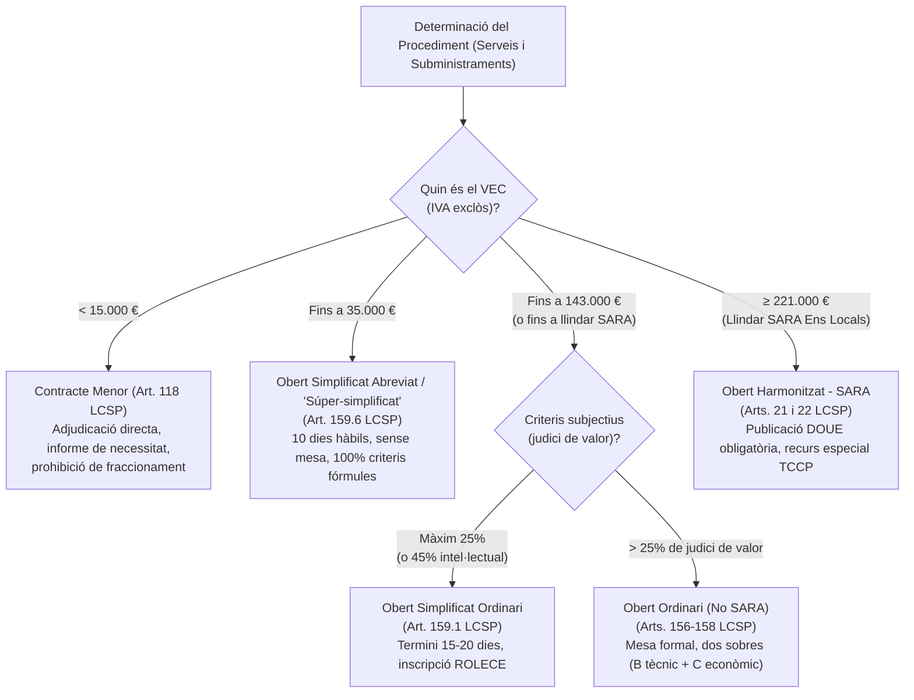
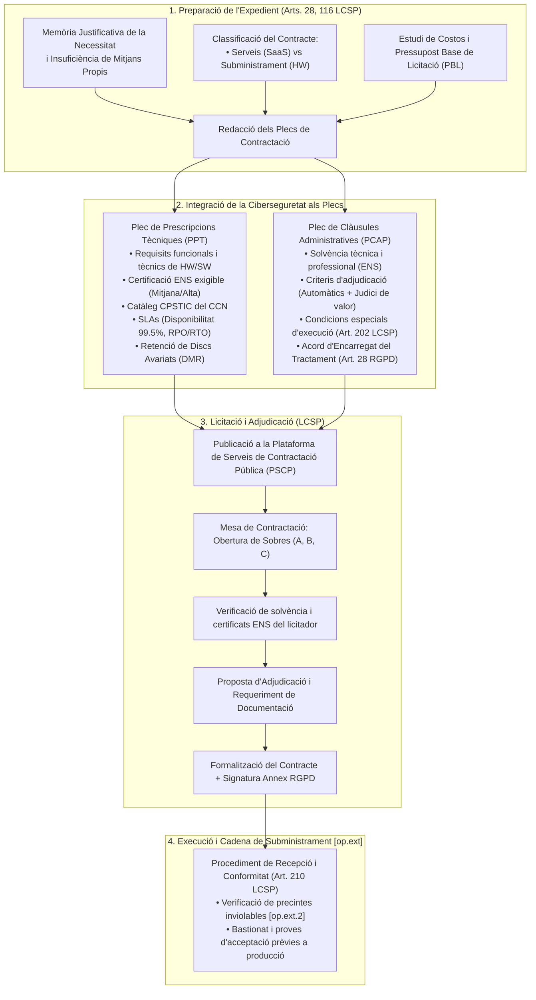
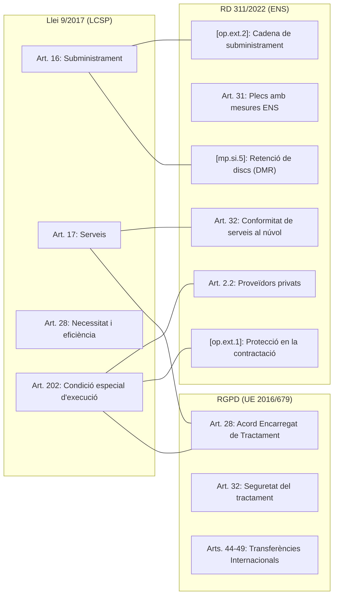

# Cas Pràctic 02: Contractació Pública d'un Servei Cloud (SaaS) i Subministrament de Servidor i Llocs de Treball

> **Marc Normatiu de Referència:** Llei 9/2017, de Contractes del Sector Públic (LCSP), Reial Decret 311/2022 (Esquema Nacional de Seguretat - ENS, Arts. 2.2, 9, 31, 32, 33 i Mesures `[op.ext.1]`, `[op.ext.2]`, `[mp.eq]`, `[mp.si]`), Reglament (UE) 2016/679 (RGPD - Art. 28), Guia CCN-STIC 823 i Catàleg CPSTIC del CCN.  
> **Àmbit d'Aplicació:** Administració Local (Expedients de contractació del Departament TIC municipal).

---

## 1. Enunciat i Context del Supòsit Pràctic

### Context Municipal
L'Ajuntament necessita emprendre de forma simultània dues licitacions estratègiques per renovar el seu ecosistema tecnològic i garantir el compliment de l'Esquema Nacional de Seguretat (RD 311/2022):

1. **Expedient 1 (Contracte de Serveis):** Contractació d'una plataforma integral de **Gestió d'Expedients Electrònics, Padró i Seu Electrònica en modalitat SaaS (Software as a Service / Cloud)**, que allotjarà dades personals de tota la ciutadania municipal (incloses dades d'alta sensibilitat en matèria de serveis socials i tributs).
2. **Expedient 2 (Contracte de Subministrament):** Contractació del **subministrament d'1 servidor físic d'alta disponibilitat per al Centre de Processament de Dades (CPD)** local i de **50 ordinadors portàtils per a la renovació dels equips de lloc de treball** dels empleats municipals (inclosos comandaments i teletreball).

### Encomana
Com a Tècnic/a de Sistemes i Seguretat de l'Ajuntament, l'Alcaldia us demana preparar la memòria justificativa, determinar la tipologia contractual i redactar els requisits tècnics i administratius essencials (PPT i PCAP), amb especial èmfasi en les **clàusules de seguretat ENS, garanties del RGPD i controls de la cadena de subministrament**.

---

### 1.1. Fonamentació Jurídica: Delimitació entre Contracte de Serveis (SaaS) i Contracte de Subministrament

Un dels dubtes i preguntes clàssiques en oposicions TIC és per què una plataforma al núvol (SaaS) és un **Contracte de Serveis** i no un **Contracte de Subministrament**:

| Modalitat de Programari / TIC | Tipologia Jurídica LCSP | Fonament Doctrinal (JCCA i Tribunals de Contractes) | CPV Habitual |
| :--- | :--- | :--- | :--- |
| **Llicència tradicional On-Premise** | **Contracte de Subministrament** (Art. 16.3.b LCSP) | L'adquisició o arrendament de paquets de programari que s'instal·len en servidors de l'Ajuntament és una prestació de *donar* (béns mobles incorporals). | `48000000-8` (Paquets de programari i sistemes informàtics) |
| **Plataforma Cloud / SaaS (*Software as a Service*)** | **Contracte de Serveis** (Art. 17 LCSP) | **Prestació de fer, no de donar.** No hi ha cessió de programari per descarregar ni transmissió de la propietat. L'Ajuntament contracta l'accés continuat a una solució remota, allotjament (hosting), disponibilitat garantida (SLA), manteniment correctiu/evolutiu, seguretat i suport tècnic integral gestionat pel proveïdor. | `72268000-1` (Serveis de subministrament de programari) o `72000000-5` (Serveis TI) |
| **Desenvolupament a mida (*Ad-hoc*)** | **Contracte de Serveis** (Art. 17 LCSP) | Prestació intel·lectual i d'enginyeria per programar una solució segons requisits singulars de l'ens local. | `72212000-4` (Serveis de programació de programari) |
| **Model Híbrid (Llicència perpètua + Serveis anuals de manteniment)** | **Contracte Mixt** (Art. 18 LCSP) | Es regeix per les regles del contracte la prestació del qual tingui un **valor econòmic més elevat** (normalment serveis de manteniment plurianuals si superen el cost de la llicència inicial). | CPV combinat segons prestació principal |

> **Criteri d'Oposició:** En un model **SaaS pur**, la concurrència indisociable d'infraestructura (cloud hosting), operació continuada, actualitzacions normatives automàtiques i suport fa que la qualificació correcta i pacífica sigui sempre **Contracte de Serveis (Art. 17 LCSP)**.

---

### 1.2. Procediments d'Adjudicació a l'Administració Local segons Imports i Criteris

A més de conèixer si un contracte és harmonitzat o no, cal saber seleccionar el procediment d'adjudicació idoni segons el **Valor Estimat del Contracte (VEC, Art. 101 LCSP)** i la naturalesa dels criteris d'adjudicació:

#### Quadre Comparatiu dels Procediments de Contractació (Serveis i Subministraments en Ens Locals):

| Procediment | Llindar Econòmic (VEC sense IVA) | Termini d'Ofertes | Criteris Sotmesos a Judici de Valor | Mesa de Contractació | Garanties (Prov. / Def.) | Publicitat Obligatòria | Recursos (REMC) |
| :--- | :--- | :--- | :--- | :--- | :--- | :--- | :--- |
| **Contracte Menor** (Art. 118) | < 15.000 € | Immediat (petició directa de 3 pressupostos) | N/A (proposta tècnica directa) | No | No exigibles | Perfil de contractant (trimestral) | No escau recurs especial |
| **Obert Simplificat Abreviat / Súper-simplificat** (Art. 159.6) | Fins a **35.000 €** | **10 dies hàbils** | **0% (prohibit).** Només criteris avaluables per fórmules automàtiques. | No obligatòria (pot avaluar l'òrgan/servei tècnic) | Exempció total de garantia provisional i definitiva | Perfil de contractant (PSCP) | No escau (VEC < 100.000 €) |
| **Obert Simplificat Ordinari** (Art. 159.1) | Fins a **143.000 €** (o fins a 221.000 €) | **15 dies hàbils** (20 si hi ha criteris subjectius) | **Màxim 25%** del total de la ponderació (o 45% en prestacions de caràcter intel·lectual). | Facultativa (pot actuar la mesa o serveis tècnics) | Provisional: No. Definitiva: 5% VEC. | Perfil de contractant (PSCP) | No escau si VEC < 100.000 € |
| **Obert Ordinari (No SARA)** (Arts. 156-158) | > 143.000 € i < 221.000 € (o amb judici de valor > 25%) | **35 dies naturals** (reduïble a 15 per urgència) | **Sense límit legal** (però es recomana que prevalguin les fórmules objectives). | **Obligatòria** (Secretari/Interventor/Vocal Tècnic) | Provisional: No. Definitiva: 5% VEC. | Perfil de contractant (PSCP) | Escau si VEC ≥ 100.000 € davant el TCCP |
| **Obert Harmonitzat (SARA)** (Arts. 21, 22) | **≥ 221.000 €** (Llindar vigent per a Ens Locals) | **35 dies naturals** (reduïble amb anunci previ o mitjans electrònics) | Sense límit | **Obligatòria** | Provisional: Excepcional. Definitiva: 5% VEC. | **DOUE** (Diari Oficial UE) + Perfil (PSCP) | **Recurs Especial Previ preceptiu** davant el TCCP amb efectes suspensius automàtics |

---

## 2. Diagrama de Flux dels Processos de Contractació amb Controls ENS

---

## 3. Expedient 1: Contractació de la Plataforma SaaS (Contracte de Serveis)

### 3.1. Tipificació Jurídica i Elecció del Procediment
- **Tipus de contracte:** Contracte de Serveis (Article 17 de la LCSP). Com s'ha fonamentat a l'apartat 1.1, la modalitat SaaS té naturalesa de servei d'allotjament, disponibilitat i manteniment continuat.
- **Càlcul del VEC (Art. 101 LCSP):** Pressupost anual de 60.000 €/any x 3 anys inicials + 2 pròrrogues d'1 any = **300.000 € (VEC sense IVA)**.
- **Procediment d'adjudicació aplicable:**
  1. Com que el VEC (300.000 €) supera el llindar de **221.000 €**, el contracte està **Subjecte a Regulació Harmonitzada (SARA)** (Art. 21.1.b LCSP).
  2. Procediment: **Procediment Obert Harmonitzat (SARA)** amb publicació preceptiva al **DOUE** (Diari Oficial de la Unió Europea) i al Perfil de Contractant de la Generalitat (PSCP).
  3. **Nota sobre criteris:** Encara que l'import hagués estat inferior a 221.000 € (per exemple 120.000 €), com que els criteris sotmesos a judici de valor representen el **40%** de la ponderació (memòria d'arquitectura de seguretat, continuïtat i reversibilitat), **no s'hauria pogut utilitzar l'Obert Simplificat Ordinari** (que té el topall legal del 25% per a judici de valor, art. 159.1.b LCSP), obligant en qualsevol cas a un Procediment Obert Ordinari.
- **Divisió en lots (Art. 99 LCSP):** Si la solució és una suite integrada (e-Administració + Padró), cal justificar degudament a la memòria la no divisió en lots per motius d'interoperabilitat estricta, integritat de la base de dades única i coherència procedimental.

### 3.2. Prescripcions Tècniques de Seguretat ENS al PPT (Arts. 2.2, 9, 31, 32 i `[op.ext.1]`)

Per complir amb el principi de **Seguretat per Defecte** i la protecció en la contractació externa (`[op.ext.1]`), el PPT ha d'establir els següents requisits com a condicions tècniques d'admissió obligatòria:

#### 1. Certificació de Conformitat amb l'ENS
- El proveïdor del servei SaaS i la infraestructura al núvol (IaaS/PaaS) sobre la qual s'executa han de disposar d'un **Certificat de Conformitat amb l'Esquema Nacional de Seguretat (RD 311/2022) en Categoria MITJANA o ALTA**, emès per una entitat de certificació formalment acreditada per **ENAC**, amb abast explícit per al servei SaaS licitat.
- Els serveis al núvol utilitzats han d'estar inclosos en el **Catàleg de Productes i Serveis de Seguretat de les TIC (CPSTIC)** del CCN en la família de Serveis Cloud (*Qualificats*).

#### 2. Localització de les Dades i Centres de Processament de Dades (CPD)
- Els centres de dades principal i secundari (reserva/Disaster Recovery) han d'estar ubicats físicament dins del territori de la **Unió Europea / Espai Econòmic Europeu (EEE)**.
- Queda expressament prohibida qualsevol transferència internacional de dades a països tercers sense decisió d'adequació de la Comissió Europea o sense autorització expressa prèvia de l'Ajuntament.

#### 3. Autenticació, MFA i Gestió d'Identitats (`[op.acc]`)
- El SaaS ha de permetre la integració nativa mitjançant protocols estàndard de federació d'identitats: **SAML 2.0** o **OpenID Connect (OIDC)** amb el proveïdor d'identitat corporatiu de l'Ajuntament (Microsoft Entra ID / Keycloak).
- Suport obligatori d'**Autenticació Multifactor (MFA)** per a tots els usuaris d'administració i gestió municipal.
- Control d'accés basat en rols (**RBAC**) amb aplicació del principi de menor privilegi.

#### 4. Acord de Nivell de Servei (SLA) i Continuïtat (`[op.cont]`)
- **Disponibilitat mínima:** 99,5% mensual (24x7x365), excloent finestres de manteniment autoritzades prèviament per l'Ajuntament.
- **RPO (*Recovery Point Objective*):** Màxim **1 hora** (pèrdua màxima de dades permesa en cas de catàstrofe).
- **RTO (*Recovery Time Objective*):** Màxim **4 hores** per a la restauració del servei en cas de caiguda greu.
- Còpies de seguretat automàtiques diàries amb custòdia immutable contra ransomware.

#### 5. Criptografia i Xifratge (`[mp.info]`)
- Xifratge de totes les dades en trànsit mitjançant protocols criptogràfics robustos: **TLS 1.3** (o TLS 1.2 com a mínim estricte, amb suites de xifratge segures reconegudes pel CCN-STIC).
- Xifratge de totes les dades en repòs (*at rest*) mitjançant algoritme **AES de 256 bits**.

#### 6. Reversibilitat, Sortida del Servei i Propietat de la Informació
- Tota la informació, bases de dades, documents electrònics i registres d'auditoria són propietat exclusiva de l'Ajuntament.
- **Pla de sortida (*Exit Plan*):** En finalitzar el contracte per qualsevol causa, l'adjudicatari està obligat a lliurar en el termini màxim de 30 dies naturals una còpia completa de totes les dades municipals en formats oberts i estandarditzats segons l'ENI (XML, JSON, PostgreSQL/MySQL dump, PDF/A), acompanyada de la certificació de destrucció segura de les dades als seus servidors segons NIST SP 800-88.

---

### 3.3. Clàusules Administratives (PCAP) i Compliment RGPD

#### 1. Condicions Especials d'Execució (Art. 202 LCSP)
El contractista tindrà la consideració de **mesura d'execució essencial**, de caràcter contractual:
- El deure de mantenir en vigor el Certificat ENS durant tota la vida del contracte.
- L'obligació de notificar qualsevol incident de seguretat a l'Ajuntament en un **termini màxim de 24 hores** des de la seva detecció.

#### 2. Annex del Contracte: Acord d'Encarregat del Tractament (Art. 28 RGPD)
Com que el SaaS implica el tractament de dades personals per compte de l'Ajuntament (Responsable del Tractament), el contracte formal incorporarà com a annex preceptiu l'Acord d'Encarregat del Tractament amb el següent contingut:
- Tractament de dades exclusivament segons les instruccions documentades de l'Ajuntament.
- Obligació de secret i confidencialitat de tot el personal adscrit al servei.
- Mesures de seguretat tècniques i organitzatives equivalents a les de l'ENS.
- Règim de subcontractació: Prohibició de subcontractar serveis sense autorització expressa i prèvia per escrit de l'Ajuntament.
- Suport a l'Ajuntament en l'exercici de drets dels afectats (drets ARSULIPO).
- Dret d'auditoria: L'Ajuntament o un auditor independent designat per aquest tindrà dret a auditar les instal·lacions, procediments i logs del proveïdor.

---

## 4. Expedient 2: Subministrament de Servidor i Llocs de Treball

### 4.1. Tipificació Jurídica, VEC i Procediment d'Adjudicació
- **Tipus de contracte:** Contracte de Subministrament (Article 16 de la LCSP), en tractar-se de l'adquisició de béns mobles físics (maquinari de xarxa/servidor i equips microinformàtics).
- **Càlcul del VEC (Art. 101 LCSP):**
  - 1 Servidor físic CPD d'alta disponibilitat: ~15.000 € (IVA exclòs).
  - 50 Ordinadors portàtils corporatius: ~50.000 € (IVA exclòs).
  - **VEC total de la licitació:** **65.000 € (sense IVA)**.
- **Elecció del Procediment d'Adjudicació:**
  1. **Supera el límit del contracte menor (< 15.000 €)** i del **simplificat abreujat (≤ 35.000 €)**.
  2. Com que el VEC (65.000 €) és **inferior a 143.000 €** i es defineixen els criteris d'adjudicació **100% mitjançant fórmules matemàtiques objectives** (preu, extensió de garantia DMR, ampliació de memòria/disc), és el procediment òptim: **Procediment Obert Simplificat Ordinari (Art. 159.1 LCSP)**.
     - *Avantatges:* Termini de presentació de només **15 dies hàbils**, sense exigència de garantia provisional, mesa potestativa i tramitació electrònica 100% àgil.
  3. **Alternativa estratègica (Central de Compres):** Adhesió a un Acord Marc o Sistema Dinàmic d'Adquisició (SDA) de la **Central de Compres de l'Associació Catalana de Municipis (ACM)** o de la **DGRCC de l'Estat**, adjudicant mitjançant contracte basat amb invitació directa als proveïdors homologats, estalviant la redacció de plecs propis.

---

### 4.2. Prescripcions Tècniques del Servidor per al CPD (PPT)

El maquinari de CPD ha de respondre als estàndards de resiliència física i seguretat de l'ENS (`[mp.eq.1]`, `[mp.eq.2]`, `[mp.if]`):

| Component / Característica | Especificació Tècnica Mínima al PPT | Justificació / Mesura ENS |
| :--- | :--- | :--- |
| **Factor de Forma** | Xassís per a muntatge en rack estàndard de 19 polzades (màxim 2U). | `[mp.if.1]` Optimització de l'espai i flux d'aire al CPD. |
| **Fonts d'Alimentació** | **Doble font d'alimentació redundant *hot-plug*** (1+1) d'alta eficiència (80 PLUS Platinum o Titanium). | `[mp.if.4]` Continuïtat davant caiguda d'una línia elèctrica o SAI. |
| **Processadors (CPU)** | 2 processadors de darrera generació x86-64 (mínim 16 nuclis / 32 fils per CPU) amb instruccions de seguretat per maquinari (Secure Memory Encryption, mitigacions d'execució especulativa). | Rendiment i aïllament de processos virtuals. |
| **Memòria RAM** | Mínim 128 GB DDR5 ECC (*Error-Correcting Code*) registrada, ampliable a 512 GB. | `[mp.eq.2]` Prevenció de corrupció de dades en memòria. |
| **Emmagatzematge i RAID** | • 2 discos SSD SAS/NVMe Enterprise *hot-plug* en **RAID 1** per a SO / Hipervisor. • Mínim 4 discos SSD/NVMe Enterprise en **RAID 10 o RAID 6** per a dades. • Controladora RAID maquinari amb memòria cau protegida per condensador/flash (*cache vault*). | `[mp.eq.2]`, `[op.cont]` Tolerància a fallades de disc simultànies i integritat d'escriptura. |
| **Xip Criptogràfic de Seguretat** | **Mòdul TPM 2.0 físic (*Trusted Platform Module*)** dedicat a la placa base i certificat Common Criteria (EAL4+). | `[mp.eq.2]` Arrencada segura mesurada, emmagatzematge de claus i Secure Boot. |
| **Seguretat de Firmware** | Suport nadiu de **UEFI Secure Boot**, protecció contra modificacions no autoritzades del BIOS (*Hardware Root of Trust*). | `[mp.eq.2]` Prevenció de bootkits i atacs a baix nivell. |
| **Targeta de Gestió Remota (OOB)** | Controlador de gestió fora de banda dedicat (*iDRAC Enterprise / iLO Advanced*) amb **port Ethernet físic propi i independent**, suport de xifratge TLS 1.3, integració LDAP/MFA i firmware signat digitalment pel fabricant. | `[mp.eq.2]` Gestió remota segura aïllada en VLAN de gestió. |
| **Garantia i Retenció de Discs (DMR)** | Mínim **5 anys de garantia in-situ 24x7x4h** (*Mission Critical*), amb **clàusula obligatòria de Retenció de Suports Defectuosos (*Defective Media Retention - DMR*)**. | **CRÍTIC ENS `[mp.si.5]`:** L'Ajuntament reté físicament qualsevol disc dur avariat per evitar la fuga de dades en mans del fabricant. |

---

### 4.3. Prescripcions Tècniques dels 50 Ordinadors Portàtils (PPT)

Els equips del lloc de treball han d'incorporar els mecanismes requerits per a un entorn de mobilitat i teletreball segur (`[mp.eq.3]`, `[op.acc.4]`):

1. **Processador i Seguretat de Virtualització:**
   - Processador d'arquitectura corporativa amb suport per maquinari per a **VBS (*Virtualization-Based Security*)** i **HVCI (*Hypervisor-Enforced Code Integrity*)**.
2. **Criptografia i Protecció del Disc:**
   - Mòdul **TPM 2.0 físic actiu** a la placa base.
   - Disc d'emmagatzematge SSD NVMe de mínim 512 GB amb xifratge per maquinari (compatibilitat certificada amb **Microsoft BitLocker** sota estàndard TCG Opal 2.0).
3. **Autenticació i Identitat:**
   - **Lector de targetes intel·ligents (*Smart Card*) integrat** o subministrament de lector extern homologat compatible amb targetes criptogràfiques **T-CAT** i DNIe.
   - Càmera web integrada amb obturador físic de privacitat i suport d'identificació biomètrica segura (Windows Hello compatible / FIDO2).
4. **Protecció de BIOS i Ports:**
   - BIOS/UEFI corporativa que permeti establir contrasenya d'administrador, bloquejar l'arrencada des de dispositius USB no autoritzats i actualitzacions automàtiques signades.
5. **Cadena de Subministrament i Garantia (`[op.ext.2]`):**
   - Lliurament dels equips en caixes originals de fàbrica amb **precintes de seguretat hologràfics/inviolables**.
   - Garantia in-situ de mínim 3 anys amb clàusula DMR de retenció de discs durs defectuosos.

---

## 5. Criteris d'Adjudicació Ponderats per als Plecs

### 5.1. Ponderació de Criteris per al Contracte SaaS (Expedient 1):
- **Criteris avaluables mitjançant fórmules (60%):**
  - Oferta econòmica (Preu de subscripció anual): 40 punts.
  - Millores de disponibilitat de l'SLA (p. ex. 99,9% vs 99,5% de base): 10 punts.
  - Reducció del temps màxim de resposta a incidències crítiques (MTTR): 10 punts.
- **Criteris avaluables mitjançant judici de valor (40% - Sobre B):**
  - Memòria tècnica d'arquitectura de seguretat, model de xifratge i integració federada SSO/MFA: 20 punts.
  - Pla de continuïtat de negoci, recuperació davant desastres (DRP) i periodicitat de simulacres: 10 punts.
  - Proposta metodològica del Pla de Reversibilitat i format d'exportació de dades: 10 punts.

> **Avís d'Oposició:** Com que els criteris sotmesos a judici de valor superen el 25% (40%), **queda legalment vetat l'ús del procediment obert simplificat** (Art. 159.1.b LCSP), obligant a tramitar la licitació per **Procediment Obert Ordinari** (en aquest cas, a més, SARA pel seu volum VEC).

### 5.2. Ponderació de Criteris per al Contracte de Subministrament (Expedient 2):
Per poder aprofitar la celeritat del **Procediment Obert Simplificat Ordinari (Art. 159.1 LCSP)**, tots els criteris es configuren **100% mitjançant fórmules matemàtiques objectives**:
- **Oferta econòmica (Preu total del lot):** 60 punts (fórmula proporcional inversa).
- **Extensió del període de garantia in-situ amb DMR:** 20 punts (5 punts per any addicional de garantia in-situ 24x7 amb retenció de discs fins a un màxim de 2 anys addicionals als portàtils).
- **Millora de prestacions tècniques del maquinari:** 20 punts (10 punts per lliurament dels portàtils amb 32 GB RAM en comptes de 16 GB; 10 punts per SSD de 1 TB en comptes de 512 GB).

---

## 6. Quadre de Referència Legal i Punts de Control per a Oposicions

### Resum de Termes Crítics per a l'Examen d'Oposició:
1. **DMR (*Defective Media Retention*):** Clàusula contractual que impedeix retornar al proveïdor de maquinari els discs avariats que continguin dades públiques.
2. **CPSTIC:** Catàleg oficial del CCN on han de figurar els productes i serveis cloud qualificats per al sector públic.
3. **Principi de Responsabilitat Proactiva (*Accountability*):** L'Ajuntament continua sent el responsable final de la seguretat de les dades encara que contracti un SaaS.
4. **Condició Especial d'Execució (Art. 202 LCSP):** Permet vincular l'incompliment de la certificació ENS a penalitats econòmiques greus o a la resolució del contracte.
