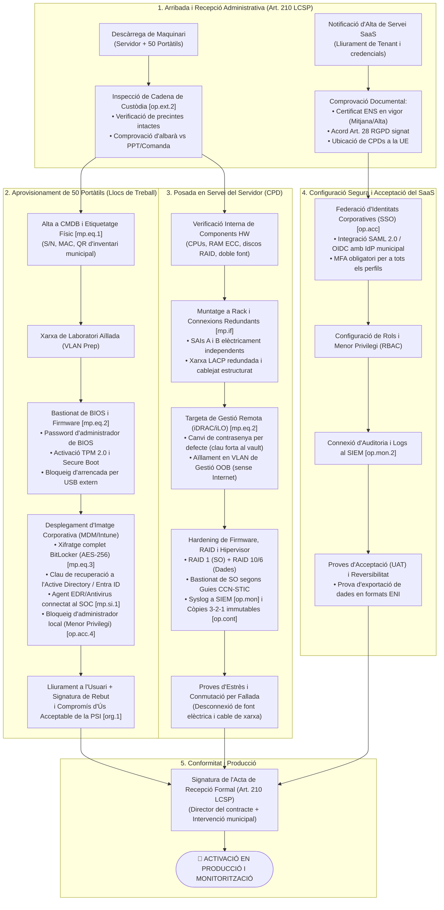
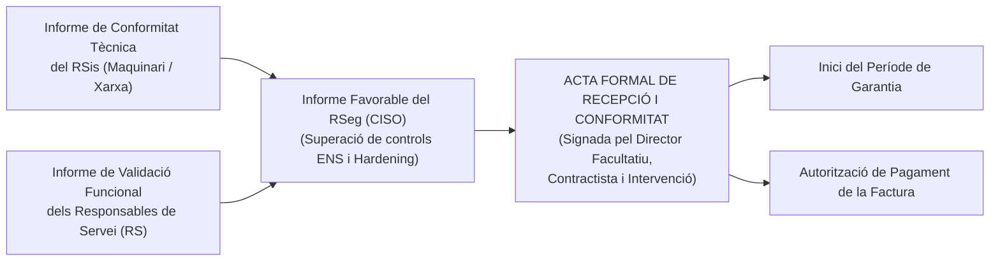

# Cas Pràctic 03: Procediment i Criteris de Recepció, Conformitat i Posada en Explotació de Servidor, Ordinadors i Servei SaaS

> **Marc Normatiu de Referència:** Llei 9/2017 (LCSP - Art. 210 sobre recepció i liquidació), Reial Decret 311/2022 (Esquema Nacional de Seguretat - ENS, Mesures `[op.ext.2]`, `[mp.eq.1]`, `[mp.eq.2]`, `[mp.eq.3]`, `[mp.if]`, `[op.acc]`, `[op.mon]`, `[op.cont]`), Guies CCN-STIC (500 i 800) i NIST SP 800-88.  
> **Àmbit d'Aplicació:** Administració Local (Recepció tècnica, verificació de conformitat i posada en servei corporatiu).

---

## 1. Enunciat i Context del Supòsit Pràctic

### Context Operatiu
L'Ajuntament ha tramitat i adjudicat amb èxit les dues licitacions analitzades en el supòsit pràctic anterior:
1. El subministrament d'**1 servidor físic d'alta disponibilitat** per al CPD municipal i de **50 ordinadors portàtils corporatius** per als llocs de treball.
2. La contractació del servei al núvol en modalitat **SaaS per a la Gestió d'Expedients i Padró**.

En una mateixa setmana:
- L'empresa transportista descarrega a la Casa de la Vila el maquinari adquirit (servidor i 50 caixes de portàtils).
- L'adjudicatari del SaaS comunica formalment que la instància o *tenant* de producció ja està provisionada al núvol i lliura les credencials d'administrador inicial.

### Encomana
Com a Responsable del Sistema (RSis) i en coordinació amb el Responsable de Seguretat (RSeg / CISO), se us demana definir i executar el **procediment formal de recepció administrativa (Art. 210 LCSP), comprovació de seguretat física i lògica, bastionat (*hardening*), proves d'acceptació i posada en producció** d'aquests actius, garantint que cap dispositiu ni servei entri en servei actiu sense complir estrictament les mesures de l'ENS.

---

## 2. Diagrama de Flux Integrat de Recepció i Posada en Producció

---

## 3. Bloc 1: Recepció i Aprovisionament dels 50 Ordinadors Portàtils

### 3.1. Recepció Administrativa i Cadena de Custòdia (`[op.ext.2]`, Art. 210 LCSP)
1. **Comprovació d'Albarà:** Es contrasta el nombre d'unitats, la marca, el model exacte i el número de comanda amb el Plec de Prescripcions Tècniques.
2. **Inspecció de la Cadena de Custòdia (`[op.ext.2]`):**
   - Es comprova que cap caixa presenti ruptures, doble cinta adhesiva o indicis d'obertura prèvia.
   - Es verifica la integritat dels **precintes de seguretat inviolables** de fàbrica. Si un precinte està trencat, l'equip es rebutja immediatament davant el risc de manipulació maliciosa de firmware o maquinari (*tampering*).
3. **Presència d'Intervenció:** Si l'import total del contracte supera el límit reglamentari de comprovació material de la inversió (generalment 50.000 € a l'administració local), l'Interventor/a municipal o funcionari delegat ha d'assistir a l'acte de comprovació.

### 3.2. Inventari Físic i Registre a la CMDB (`[mp.eq.1]`)
Abans de qualsevol connexió a la xarxa:
1. **Lectura òptica:** Amb lector làser, s'escanegen els números de sèrie (S/N) i les adreces MAC de les targetes Wi-Fi i Ethernet de cada portàtil.
2. **Alta a l'inventari (GLPI / Snipe-IT / CMDB):**
   - Assignació de codi d'inventari municipal únic.
   - Enllaç amb l'expedient de contractació, número de factura i data de fi de garantia.
3. **Etiquetatge físic:** Es fixa una etiqueta metàl·lica o adhesiva d'alta resistència amb el logotip de l'Ajuntament, el número d'inventari i un codi QR per a la identificació ràpida en auditories.

### 3.3. Bastionat i Configuració de Seguretat segons l'ENS (`[mp.eq.2]`, `[mp.eq.3]`)
Els equips es traslladen al laboratori informàtic i es connecten a una **VLAN de preparació aïllada**, sense accés a la xarxa corporativa de producció:

#### 1. Bastionat de BIOS / Firmware
- Actualització del firmware/BIOS a la darrera versió recomanada pel fabricant.
- Establiment d'una **contrasenya d'administrador de BIOS** forta i única (diferent per a cada equip o gestionada centralment mitjançant Microsoft LAPS/Intune).
- Activació preceptiva del mòdul criptogràfic **TPM 2.0 (*Trusted Platform Module*)**.
- Activació de **UEFI Secure Boot** per impedir la càrrega de sistemes operatius o bootkits no signats.
- **Inhabilitació d'arrencada per dispositius externs (USB / PXE extern).**

#### 2. Desplegament de la Imatge Corporativa Neta
- No s'utilitza mai la instal·lació d'origen de fàbrica amb programari de consum (*bloatware*). Es desplega una imatge corporativa neta mitjançant eines de gestió centralitzada (**Microsoft Intune / Autopilot / SCCM**).
- **Xifratge Complet de Disc (`[mp.eq.3]`):** S'activa automàticament **Microsoft BitLocker** amb xifratge **XTS-AES de 256 bits** lligat al xip TPM 2.0.
  - La clau de recuperació numèrica de 48 dígits es custodia de manera automatitzada i segura al directori corporatiu (**Active Directory / Entra ID**).
  - Queda expressament prohibit anotar les claus de recuperació en suports físics o fitxers desprotegits.

#### 3. Desplegament de Mesures de Protecció en l'Endpoint (`[mp.si.1]`, `[op.acc.4]`)
- **Agent EDR / Antivirus corporatiu:** Instal·lació de l'agent de seguretat connectat al Centre d'Operacions de Seguretat (SOC) del CCN/AOC, amb mòduls de detecció de comportament, prevenció d'amenaces i aïllament remot.
- **Principi de Menor Privilegi (`[op.acc.4]`):**
  - Es desactiva o renombra el compte d'administrador local integrat.
  - Els perfils dels empleats públics es configuren com a **usuaris estàndard**, sense permisos d'administrador local.
  - L'administració puntual es gestiona mitjançant **LAPS (*Local Administrator Password Solution*)** amb claus rotatòries que expiren després de cada ús.
- **Control de ports i dispositius extraïbles (`[mp.si.5]`):** Bloqueig per directiva (GPO/Intune) de la connexió de llapis de memòria USB o discs externs que no estiguin prèviament xifrats i autoritzats pel RSeg.

### 3.4. Lliurament Formal a l'Empleat Públic (`[org.1]`, `[org.3]`)
1. L'empleat signa l'**Acta de Lliurament de Maquinari**, on consta el número de sèrie i el codi d'inventari municipal.
2. L'empleat signa el **Document de Compromís i Acceptació de la Política de Seguretat de la Informació (PSI)** i de la Política d'Ús Acceptable dels Recursos Tecnològics.
3. Se li fa entrega d'una guia ràpida de bones pràctiques: bloqueig de pantalla en absència (`Windows + L`), custòdia física de l'equip en mobilitat i canal d'avís d'incidents (POS-04).

---

## 4. Bloc 2: Recepció, Muntatge i Posada en Producció del Servidor (CPD)

### 4.1. Inspecció Física de Components i Garantia DMR
1. **Obertura del xassís:** Comprovació visual que els components interns coincideixen amb el PPT:
   - 2 processadors exactes.
   - Mòduls de memòria RAM ECC (capacitat total de 128 GB en configuració multicanal).
   - Nombre de discs SSD SAS/NVMe de classe Enterprise.
   - Doble font d'alimentació hot-plug.
   - Mòdul TPM 2.0 instal·lat físicament.
2. **Registre de Garantia DMR (*Defective Media Retention*):** Es comprova al portal del fabricant que la garantia associada al número de sèrie (*Service Tag*) té activat el servei DMR, assegurant que cap disc defectuós haurà de ser lliurat al servei tècnic.

### 4.2. Instal·lació Física al CPD (`[mp.if.1]`, `[mp.if.2]`, `[mp.if.4]`)
- **Muntatge:** Fixació mecànica de les guies telescòpiques i del xassís al bastidor (rack de 19") del CPD municipal.
- **Redundància Elèctrica (`[mp.if.4]`):**
  - Font d'alimentació 1 -> Connectada a la **Línia A** (SAI 1).
  - Font d'alimentació 2 -> Connectada a la **Línia B** (SAI 2 o xarxa amb commutador STS).
- **Cablatge de Xarxa:**
  - Connexions de xarxa agrupades en **LACP (*Link Aggregation Control Protocol*)** connectades a dos commutadors (*switches*) diferents per evitar el punt únic de fallada (*single point of failure*).
  - Connexió del port de gestió fora de banda (*iDRAC / iLO*) mitjançant cablatge específic de color diferenciat.

### 4.3. Bastionat del Maquinari i Xarxa de Gestió (`[mp.eq.2]`)
1. **Aïllament de la Targeta de Gestió Remota (iDRAC/iLO):**
   - Assignació d'IP estàtica en una **VLAN de gestió OOB (*Out-Of-Band*)**.
   - Aquesta VLAN està absolutament prohibida per als usuaris ordinaris i no té sortida a Internet. L'accés està restringit exclusivament als equips d'administració de sistemes mitjançant túnel VPN xifrat o estació de salt (*bastion host*).
   - **Canvi immediat de la contrasenya d'administrador per defecte** per una clau aleatòria de més de 20 caràcters, desada al gestor de claus corporatiu.
   - Desactivació de protocols insegurs (SNMPv1/v2, Telnet, HTTP) i forçat de **HTTPS amb TLS 1.3** i certificat digital reconegut.
2. **Actualització de Firmware:** S'aplica l'últim paquet d'actualitzacions del fabricant (*firmware* de BIOS, controladora RAID, discs i targetes de xarxa).
3. **Configuració del Sistema d'Emmagatzematge (RAID):**
   - **RAID 1 (Mirall):** Per als dos discs del sistema operatiu / hipervisor (tolerància a la pèrdua d'1 disc).
   - **RAID 10 o RAID 6:** Per al volum de dades / màquines virtuals (rendiment òptim i tolerància a fallades simultànies).

### 4.4. Bastionat del Sistema Operatiu / Hipervisor i Proves de Seguretat
1. **Hardening del SO/Hipervisor:** S'apliquen les pautes de la **Guia CCN-STIC pertinent** (Guia CCN-STIC 570 per a Windows Server, Guia CCN-STIC 580 per a Linux Server, o Guia específica de VMware/Proxmox).
   - Tancament de tots els ports i serveis innecessaris.
   - Activació del tallafoc local.
   - Configuració d'accés exclusiu per SSH amb claus públiques o RDP amb NLA (*Network Level Authentication*).
2. **Monitorització i Logs (`[op.mon]`):**
   - Configuració de l'agent Syslog / Wazuh per remetre tots els registres d'inici de sessió i errors al **SIEM corporatiu**.
   - Monitorització de paràmetres de salut per **SNMPv3** cap a Zabbix (temperatura, consum elèctric, estat dels discs del RAID).
3. **Còpies de Seguretat (`[op.cont]`):**
   - Inclusió del nou servidor a la plataforma de backup corporativa segons la regla 3-2-1.
   - **Execució d'una prova pilot de restauració**, cronometrant el temps necessari per verificar el compliment del RTO (*Recovery Time Objective*) definit pel Responsable del Servei.
4. **Proves de Conmutació per Fallada (Estrès):**
   - Es desconnecta manualment el cable elèctric de la Font 1 per verificar que la Font 2 manté l'equip encès sense reinici i genera l'alerta corresponent a la monitorització.
   - Es desconnecta un dels enllaços de xarxa per comprovar el failover transparent del LACP.
5. **Escaneig de Vulnerabilitats Previ:** S'executa un escaneig de seguretat amb **OpenVAS / Nessus** per comprovar l'absència de ports oberts indegudament o serveis vulnerables.
6. **Autorització del RSeg:** El Responsable de Seguretat emet l'informe favorable de validació tècnica.

---

## 5. Bloc 3: Recepció, Acceptació i Entrada en Producció del Servei SaaS

### 5.1. Verificació Documental i de Seguretat Prèvia
1. **Comprovació de Certificació:** Es verifica al Catàleg de Conformitat del CCN que el Certificat ENS del proveïdor està en vigor i que l'abast cobreix el servei contractat.
2. **Revisió de l'Acord RGPD:** Comprovació que el contracte incorpora l'annex d'Encarregat del Tractament (Art. 28 RGPD) signat electrònicament per ambdues parts.
3. **Declaració de Localització de Dades:** Certificat emès pel proveïdor declarant les adreces i proveïdors dels CPDs principal i de contingència dins de la Unió Europea.
4. **Verificació Tècnica de Residència de Dades del Tenant (*Data Location Check*):**
   - Abans d'admetre el lliurament, el Tècnic de Sistemes accedeix a la consola d'administració de la plataforma (o al panell de *Microsoft 365 Admin Center* > *Configuració de l'organització* > *Ubicació de les dades*) per comprovar físicament que la instància i els magatzems de dades resideixen a la **Unió Europea (UE)**.
   - **Punt de control legal crític (Art. 46 bis Llei 40/2015):** Es verifica que les dades del Padró d'Habitants no s'hagin aprovisionat per defecte en països tercers (com ara regions de Gran Bretanya `UK South` o Estats Units). Si la instància s'ha creat en una regió incorrecta, **es rebutja l'acta de recepció (Art. 210 LCSP)** i s'exigeix la correcció o trasllat (*tenant data move*) abans d'iniciar cap ingesta de dades reals de producció.

### 5.2. Configuració Segura del Tenant Municipal (`[op.acc]`, `[op.ext.1]`)
1. **Federació d'Identitats (SSO):**
   - Es configura la federació d'identitats via **SAML 2.0 / OpenID Connect** entre el SaaS i l'IdP municipal (**Microsoft Entra ID / Active Directory**).
   - Es prohibeix la creació de credencials locals independents en el SaaS, garantint que la baixa d'un funcionari al directori central inhabilita immediatament l'accés al SaaS.
2. **Accés Condicional i MFA Obligatori (`[op.acc.5]`):**
   - S'apliquen polítiques d'accés condicional que exigeixen **Autenticació Multifactor (MFA)** per a tots els usuaris.
   - Restricció d'accés administratiu exclusivament a dispositius gestionats i conformes (*compliant devices*).
3. **Matriu de Control d'Accés Basat en Rols (RBAC):**
   - Els usuaris s'assignen a perfils funcionals estrictes (ex. *Operador de Registre*, *Tramitador d'Urbanisme*, *Interventor*).
   - S'assigna el perfil d'administrador del SaaS a un màxim de dues persones nominals de l'equip TIC (prohibint comptes genèrics).

### 5.3. Traçabilitat i Monitorització del Servei Cloud (`[op.mon.2]`)
- S'activa el registre d'auditoria complet de totes les operacions (lectures d'expedients, modificacions de dades, descàrregues massives).
- Es configura la connexió via **API / Webhook** perquè els logs d'administració i seguretat del SaaS es transmetin periòdicament al **SIEM corporatiu de l'Ajuntament**, garantint la custòdia d'evidències independent del proveïdor.

### 5.4. Proves d'Acceptació Funcional i de Reversibilitat (UAT)
1. **Proves d'Usuari (UAT):** Els usuaris líders de les àrees gestores validen el circuit complet d'un expedient administratiu real (registre, tramitació, signatura electrònica i notificació telemàtica).
2. **Prova de Rendiment i Disponibilitat:** Monitorització dels temps de càrrega i resposta durant 5 dies hàbils consecutius.
3. **Prova de Reversibilitat i Exportació de Dades:** Es sol·licita una exportació de prova de la base de dades i documents per verificar que el format d'extracció s'ajusta a l'ENI (XML/JSON/PDF-A) i no genera bloqueig tecnològic (*vendor lock-in*).

---

## 6. Formalització Administrativa de la Recepció (Art. 210 LCSP)

Un cop executades amb èxit totes les fases anteriors, té lloc l'**acte formal de recepció**:

1. **Acta de Recepció del Subministrament (Servidor i 50 Portàtils):**
   - Signada pel Director del contracte (Cap de Sistemes/TIC), el representant de l'empresa adjudicatària i l'Interventor/a municipal.
   - S'hi adjunta l'annex amb la relació de números de sèrie i el justificant de verificació dels precintes i la garantia DMR.
2. **Acta de Recepció del Contracte de Serveis (SaaS):**
   - Signada pel Responsable del Contracte i la intervenció municipal, acreditant que la instància està disponible, federada i superada la fase de proves.
3. **Efectes Jurídics:**
   - S'inicia el còmput del **termini de garantia** (3 anys per als portàtils, 5 anys per al servidor).
   - Es tramita la **conformitat de la factura** per a la seva aprovació per l'òrgan competent i pagament (dins dels 30 dies següents a la data de l'acta).

---

## 7. Matriu de Control i Checklist de Recepció per a Oposicions

| Element de Control | Servidor CPD | 50 Portàtils | Servei SaaS | Mesura ENS / LCSP |
| :--- | :---: | :---: | :---: | :--- |
| **Comprovació d'albarà vs PPT** | ✅ Obligatori | ✅ Obligatori | ✅ Notificació formal | Art. 210 LCSP |
| **Cadena de custòdia / Precintes** | ✅ Inviolables | ✅ Inviolables | N/A (Cloud) | `[op.ext.2]` |
| **Alta a CMDB i etiquetatge** | ✅ Etiqueta QR | ✅ Etiqueta QR | ✅ Registre Tenant | `[mp.eq.1]` |
| **Retenció de discs avariats (DMR)** | ✅ 5 anys 24x7 | ✅ 3 anys in-situ | N/A (Cloud) | `[mp.si.5]` |
| **Mòdul TPM 2.0 físic actiu** | ✅ TPM 2.0 | ✅ TPM 2.0 | N/A (Cloud) | `[mp.eq.2]` |
| **Xifratge de dades** | ✅ RAID / LUKS | ✅ BitLocker 256 | ✅ AES-256 / TLS 1.3 | `[mp.eq.3]`, `[mp.info]` |
| **MFA obligatori** | ✅ SSH/RDP/iDRAC | ✅ Inici / VPN | ✅ SSO SAML/OIDC | `[op.acc.5]` |
| **Aïllament de xarxa** | ✅ VLAN Gestió OOB | ✅ VLAN Lab / Corp | ✅ Accés Condicional | `[mp.com.1]` |
| **Agent EDR / Antivirus SOC** | ✅ Wazuh/EDR | ✅ EDR corporatiu | N/A (Cloud) | `[mp.si.1]` |
| **Backup i prova de restauració** | ✅ 3-2-1 immutable | N/A (Dades a Cloud) | ✅ Backup immutable | `[op.cont]` |
| **Monitorització de logs al SIEM** | ✅ Syslog / SNMP | ✅ EventLog / EDR | ✅ API / Webhook | `[op.mon]` |
| **Document de compromís usuari** | N/A | ✅ Signatura PSI | ✅ Formació / PSI | `[org.1]`, `[org.3]` |
| **Acta de Recepció Formal** | ✅ Art. 210 LCSP | ✅ Art. 210 LCSP | ✅ Art. 210 LCSP | Art. 210 LCSP |
