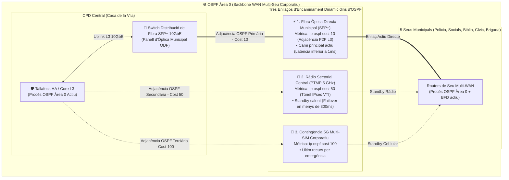
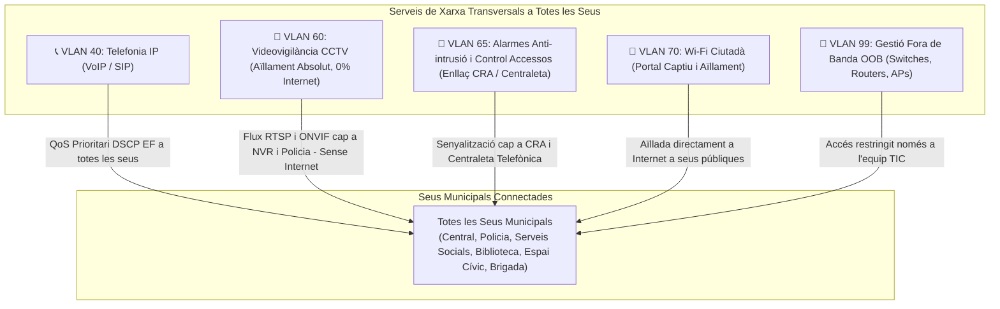
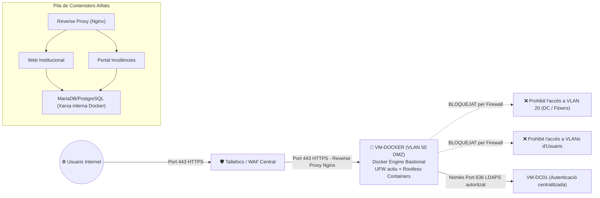
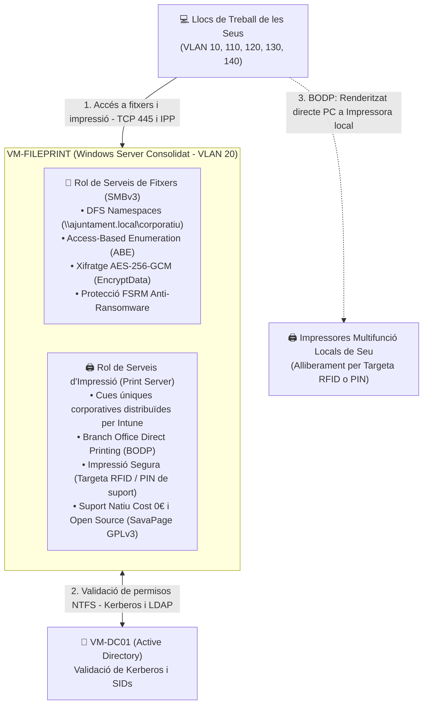
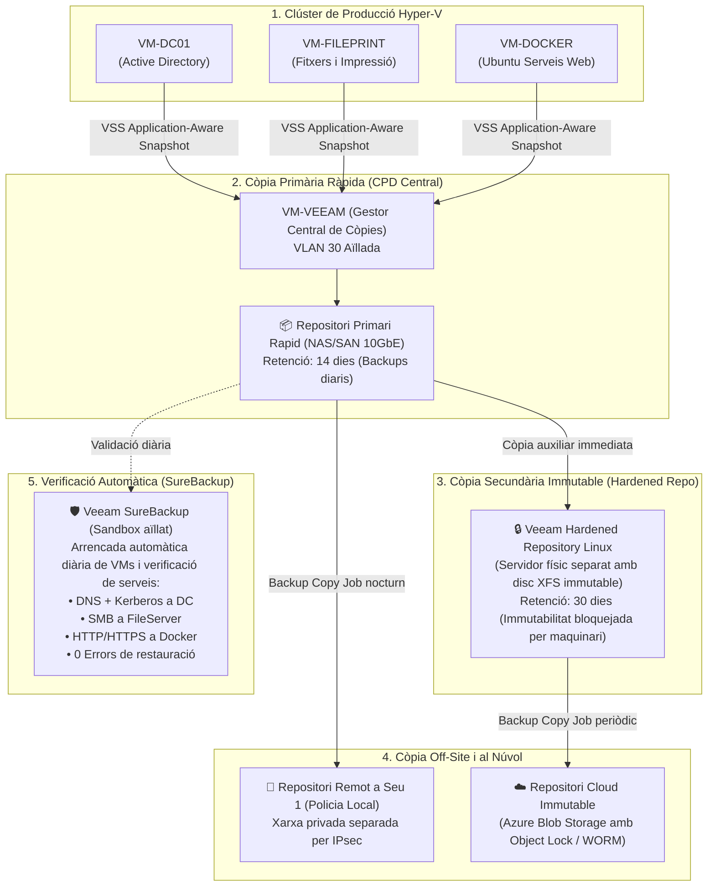
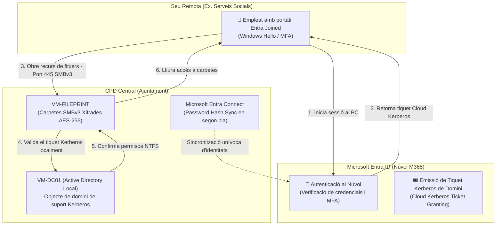
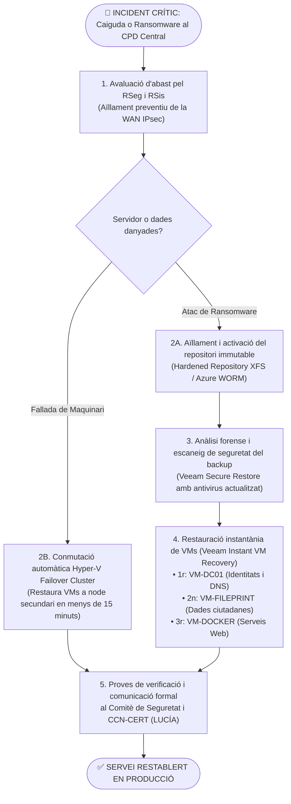

# Cas Pràctic 04: Projecte d'Arquitectura de Xarxa Segura Multi-Seu i Estratègia de Còpies de Seguretat ENS

> **Marc Normatiu i Tecnològic de Referència:** Reial Decret 311/2022 (ENS - Mesures `[mp.com]`, `[mp.if]`, `[mp.eq]`, `[op.cont]`, `[op.acc]`, `[op.mon]`), Guies CCN-STIC (570 per a Windows Server, 580 per a Linux, 811 per a interconnectivitat, 823 per a núvol), Llei Orgànica 3/2018 (LOPDGDD).  
> **Ecosistema Tecnològic:** Clúster Hyper-V redundant, Veeam Backup & Replication, Ubuntu Server (Dockerització), File & Print Server, Clúster Firewall HA, 5 seus remotes amb routers/switches gestionats, Tenant híbrid Microsoft 365 (Business Premium i F3).

---

## 1. Enunciat i Context del Supòsit Pràctic

### Context de l'Organització Municipal
L'Ajuntament compta amb una **Seu Central (Casa de la Vila)**, on s'ubica el Centre de Processament de Dades (CPD) principal, i **5 seus remotes distribuïdes pel municipi**:
1. **Seu 1: Prefectura de la Policia Local** (Servei 24/7 crític, càmeres i comunicacions policials).
2. **Seu 2: Edifici de Serveis Socials** (Dades d'especial protecció i vulnerabilitat ciutadana).
3. **Seu 3: Biblioteca Pública Municipal** (Zona d'usuaris interns municipals i accés públic/Wi-Fi ciutadana).
4. **Seu 4: Espai Cívic i Juvenil / Àrea d'Esports** (Gestió d'activitats municipals i xarxa per a visitants).
5. **Seu 5: Nau de la Brigada Municipal i Obres** (Personal operatiu de carrer, magatzem i control de flota).

### Infraestructura Disponible
- **Ecosistema Microsoft 365:** Tenant corporatiu amb llicenciament híbrid:
  - **Microsoft 365 Business Premium:** Per als empleats administratius, tècnics i comandaments (inclou Microsoft Entra ID P1, Microsoft Intune, Defender for Business, Conditional Access i protecció d'identitats).
  - **Microsoft 365 F3 (*Frontline Workers*):** Per al personal operatiu de carrer (Brigada Municipal, operaris d'instal·lacions esportives, agents de camp) amb accés segur web/mòbil, protecció bàsica i MFA.
- **CPD Central (Seu Principal):**
  - **Clúster de virtualització Microsoft Hyper-V** redundant sobre servidors físics d'alta disponibilitat connectats a emmagatzematge SAN/RAID.
  - **Màquines Virtuals (VMs) en producció:**
    - `VM-DC01`: Controlador de Domini principal (Active Directory Domain Services, DNS, DHCP corporatiu amb IP Helper, NTP oficial).
    - `VM-FILEPRINT`: Servidor unificat de fitxers departamentals (SMBv3 xifrat AES-256, DFS-N, ABE) i gestió d'impressió corporativa (*Print Server* amb Branch Office Direct Printing i Follow-Me Printing).
    - `VM-DOCKER`: Servidor Ubuntu Linux per a allotjament de serveis web municipals dockeritzats a la DMZ (portal d'incidències, webs informatives).
    - `VM-VEEAM`: Servidor de gestió de còpies de seguretat **Veeam Backup & Replication** (regla 3-2-1-1-0).
- **Equipament de Comunicacions i Xarxa:**
  - **Tallafocs perimetral d'Alta Disponibilitat (Clúster HA Actiu-Passiu)** al CPD central.
  - **Commutador de Distribució de Fibra Òptica Municipal (Switch SFP/SFP+ 10GbE)** al CPD per concentrar els enllaços de fibra directa procedents de cada edifici municipal.
  - **Estació Base Ràdio:** Antena sectorial central PTMP a la torre municipal (5 GHz) per a redundància de radioenllaç a totes les seus.
  - A cadascuna de les 5 seus remotes: **Router multi-WAN amb port SFP de fibra, interfícies Gigabit Ethernet, antena client CPE i mòdem 5G**, i commutadors gestionables (*managed switches PoE*) amb suport per a 802.1Q (VLANs), LLDP-MED (Voice VLAN) i QoS.

### Encomana del Projecte
Es demana dissenyar un **Projecte Tècnic Integral** que defineixi:
1. **L'Arquitectura i Disseny de Xarxa:** Topologia WAN multi-seu segura, segmentació estricta per VLANs, aïllament de la DMZ per a serveis web Ubuntu/Docker, xarxa de gestió OOB i matriu de filtratge de tallafocs.
2. **L'Estratègia de Còpies de Seguretat:** Arquitectura Veeam Backup sota la regla **3-2-1-1-0**, immutabilitat contra ransomware, polítiques de protecció específiques per màquina virtual i plans de recuperació (RPO/RTO).
3. **La Integració amb Microsoft 365:** Sincronització d'identitats, gestió de dispositius amb Intune i polítiques d'accés segur (MFA i Accés Condicional).

---

## 2. Mapa Global de l'Arquitectura de Xarxa Multi-Seu

```mermaid
flowchart TD
    subgraph INTERNET_CLOUD["Núvol i Connexions Externes"]
        M365["Tenant Microsoft 365<br/>(Entra ID + Intune + Defender)"]
        INTERNET(("🌐 Internet / Operadors"))
        AZURE_S3["Repositori Cloud Immutable<br/>(Azure Blob Storage WORM)"]
    end

    subgraph CPD_CENTRAL["SEU CENTRAL (Casa de la Vila - CPD)"]
        FW_HA["🛡️ Tallafocs HA Central (Clúster Actiu-Passiu)<br/>Next-Gen Firewall / WAF / IPS / OSPF"]
        SW_CORE["Commutadors Core 10GbE (Stack redundant)"]
        SW_DIST_FIBRA["🔀 Switch Distribució de Fibra Òptica Municipal (SFP/SFP+ 10GbE)<br/>(Concentrador de fibra directa seu a seu)"]
        SECTORIAL["📡 Estació Base: Antena Sectorial Central (PTMP 5 GHz)<br/>(Torre municipal amb cobertura global a totes les seus)"]
        
        subgraph VLANS_CPD["Segmentació de Xarxa Central"]
            VLAN_DMZ["VLAN 50 - DMZ (Exposada)<br/>[VM-DOCKER (Ubuntu Web)]"]
            VLAN_SERVERS["VLAN 20 - Servidors Interns<br/>[VM-DC01, VM-FILEPRINT]"]
            VLAN_BACKUP["VLAN 30 - Xarxa de Backup Aïllada<br/>[VM-VEEAM + Hardened Repo Linux]"]
            VLAN_MGMT["VLAN 99 - Gestió OOB (Aïllada)<br/>[iDRAC, Hyper-V Hosts, Switches, APs]"]
            VLAN_USERS_C["VLAN 10 - Usuaris Administratius Central"]
            VLAN_VOIP_C["VLAN 40 - Telefonia IP (QoS DSCP EF)"]
            VLAN_CCTV_C["VLAN 60 - Videovigilància CCTV (Aïllada, 0% Internet)<br/>[NVR Central / Gravador VMS]"]
            VLAN_ALARM_C["VLAN 65 - Alarmes Anti-intrusió i Accessos<br/>[Sortida a CRA / Centraleta Telefònica]"]
            VLAN_WIFI_C["VLAN 70 - Wi-Fi Ciutadà OAC Central"]
        end
    end

    subgraph SEUS_REMOTES["5 SEUS MUNICIPALS (SERVEIS TRANSVERSALS)"]
        subgraph S1["Seu 1: Policia Local (24/7)"]
            R_S1["Router Multi-WAN + CPE Ràdio"] --> SW_S1["Managed Switch PoE"]
            SW_S1 --> V_POL["VLAN 110: Dades Policials (Crítica)"]
            SW_S1 --> V_VOIP1["VLAN 40: Telefonia IP (VoIP)"]
            SW_S1 --> V_CCTV1["VLAN 60: Càmeres CCTV (Sense Internet)"]
            SW_S1 --> V_ALM1["VLAN 65: Alarmes i Accessos (Enllaç CRA)"]
            SW_S1 --> B_REPO["📦 Repositori Veeam Off-Site (Hardened Linux)"]
        end

        subgraph S2["Seu 2: Serveis Socials"]
            R_S2["Router Multi-WAN + CPE Ràdio"] --> SW_S2["Managed Switch PoE"]
            SW_S2 --> V_SOC["VLAN 120: Dades Socials Sensibles"]
            SW_S2 --> V_VOIP2["VLAN 40: Telefonia IP (VoIP)"]
            SW_S2 --> V_CCTV2["VLAN 60: Càmeres CCTV (Sense Internet)"]
            SW_S2 --> V_ALM2["VLAN 65: Alarmes i Accessos (Enllaç CRA)"]
            SW_S2 --> V_WIFI2["VLAN 70: Wi-Fi Ciutadà Atenció"]
        end

        subgraph S3["Seu 3: Biblioteca Pública"]
            R_S3["Router Multi-WAN + CPE Ràdio"] --> SW_S3["Managed Switch PoE"]
            SW_S3 --> V_BIB["VLAN 130: Gestió Biblioteca"]
            SW_S3 --> V_VOIP3["VLAN 40: Telefonia IP (VoIP)"]
            SW_S3 --> V_CCTV3["VLAN 60: Càmeres CCTV (Sense Internet)"]
            SW_S3 --> V_ALM3["VLAN 65: Alarmes i Accessos (Enllaç CRA)"]
            SW_S3 --> V_WIFI3["VLAN 70: Wi-Fi Ciutadà (Portal Captiu)"]
        end

        subgraph S4["Seu 4: Espai Cívic / Esports"]
            R_S4["Router Multi-WAN + CPE Ràdio"] --> SW_S4["Managed Switch PoE"]
            SW_S4 --> V_CIV["VLAN 140: Gestió Monitors"]
            SW_S4 --> V_VOIP4["VLAN 40: Telefonia IP (VoIP)"]
            SW_S4 --> V_CCTV4["VLAN 60: Càmeres CCTV (Sense Internet)"]
            SW_S4 --> V_ALM4["VLAN 65: Alarmes i Accessos (Enllaç CRA)"]
            SW_S4 --> V_WIFI4["VLAN 70: Wi-Fi Públic Entitats"]
        end

        subgraph S5["Seu 5: Brigada Municipal"]
            R_S5["Router Multi-WAN + CPE Ràdio"] --> SW_S5["Managed Switch PoE"]
            SW_S5 --> V_BRI["VLAN 150: Nau i Magatzem (F3)"]
            SW_S5 --> V_VOIP5["VLAN 40: Telefonia IP (VoIP)"]
            SW_S5 --> V_CCTV5["VLAN 60: Càmeres CCTV (Sense Internet)"]
            SW_S5 --> V_ALM5["VLAN 65: Alarmes i Accessos (Enllaç CRA)"]
        end
    end

    INTERNET --- FW_HA
    FW_HA --- M365
    FW_HA --- AZURE_S3
    FW_HA --- SW_CORE
    FW_HA --- SECTORIAL
    SW_CORE --- SW_DIST_FIBRA
    SW_CORE --- VLAN_DMZ & VLAN_SERVERS & VLAN_BACKUP & VLAN_MGMT & VLAN_USERS_C & VLAN_VOIP_C & VLAN_CCTV_C & VLAN_ALARM_C & VLAN_WIFI_C

    SW_DIST_FIBRA -->|1. Fibra Òptica Directa Municipal - OSPF Cost 10| R_S1 & R_S2 & R_S3 & R_S4 & R_S5
    SECTORIAL -.->|2. Ràdio Sectorial PTMP 5 GHz - OSPF Cost 50| R_S1 & R_S2 & R_S3 & R_S4 & R_S5
    VLAN_BACKUP -.->|Replicació Off-Site nocturna| B_REPO
```



---

## 3. Disseny de la Xarxa i Mesures de Seguretat Perimetral

### 3.1. Topologia WAN Multi-Seu Redundant i Encaminament Dinàmic (OSPF)

Per garantir la continuïtat de servei i l'alta disponibilitat exigida per l'ENS (`[mp.com.1]`, `[mp.com.2]`, `[op.cont]`), la connexió entre la Seu Central i les 5 seus municipals es recolza en una **xarxa corporativa de fibra òptica municipal directa**, complementada per una triangulació redundant híbrida (**Fibra Municipal + Ràdio Sectorial PTMP / 5G**) gestionada mitjançant **encaminament dinàmic OSPF**:



#### 1. Com s'integra la Fibra Directa dins d'OSPF Àrea 0?
La fibra directa municipal **no és un simple cable pla L2, sinó un enllaç d'encaminament dinàmic integrat a l'Àrea 0 (Backbone) d'OSPF**:
- **Subxarxes de trànsit punt a punt L3 (`/30`):** A través del Switch de Distribució de Fibra del CPD, cada enllaç físic d'òptica amb una seu remota es canalitza mitjançant una **VLAN de trànsit 802.1Q** fins al Tallafocs HA / Core L3, on finalitza en una **subinterfície L3 dedicada** (mentre que a l'extrem remot es connecta a la interfície WAN L3 del router de seu):
  - Seu 1 (Policia): Subxarxa de trànsit `10.255.0.0/30` (VLAN de trànsit 101 al CPD)
  - Seu 2 (Socials): Subxarxa de trànsit `10.255.0.4/30` (VLAN de trànsit 102 al CPD)
  - Seu 3 (Biblio): Subxarxa de trànsit `10.255.0.8/30` (VLAN de trànsit 103 al CPD)
  - Seu 4 (Cívic): Subxarxa de trànsit `10.255.0.12/30` (VLAN de trànsit 104 al CPD)
  - Seu 5 (Brigada): Subxarxa de trànsit `10.255.0.16/30` (VLAN de trànsit 105 al CPD)

> **Criteri d'Enginyeria de Xarxes:** L'etiqueta VLAN (tag 802.1Q) és només el mecanisme d'encapsulament de Nivell 2 necessari perquè el commutador de distribució agregui tots els parells de fibra cap al tallafocs central a través d'un tronc (trunk) 10GbE. El que realment defineix i aïlla l'enllaç punt a punt és la **subinterfície L3 amb el seu direccionament IP `/30` i l'adjacència d'encaminament OSPF**. A l'extrem de la seu remota, el router pot rebre el trànsit de forma nativa sense necessitat de coincidir en el número de tag VLAN intern.

- **Configuració d'interfície OSPF sobre la Fibra Directa (Costat CPD):**
  ```text
  interface TenGigabitEthernet0/0/1.101
   description Enllaç Fibra Municipal Seu 1 Policia
   encapsulation dot1Q 101
   ip address 10.255.0.1 255.255.255.252
   ip ospf 1 area 0
   ip ospf network point-to-point
   ip ospf cost 10
   bfd interval 50 min_rx 50 multiplier 3
  ```
- **Resultat:** El tallafocs central i el router de seu estableixen una **relació de veïnatge OSPF (*OSPF Neighbor Adjacency*) directa sobre la fibra**. Com que té el menor cost de mètrica (`cost 10`), OSPF encamina sempre el 100% del trànsit corporatiu per la fibra municipal a velocitat de gigabit i amb latència inferior a 1 ms.

#### 2. Triangulació i Mitjans Físics de Redundància
A cada seu remota s'instal·la un **router de seu multi-WAN amb ports SFP de fibra, interfícies Gigabit Ethernet i ranura mòbil 5G**, connectant tres vies independents:

1. **Via Primària: Fibra Òptica Directa Municipal (MAN / Fibra Fosca seu a seu amb Switch de Distribució al CPD):**
   - **Xarxa de Fibra Municipal:** L'Ajuntament disposa d'un estel de fibra òptica corporativa directa (canalitzada per via pública municipal o fibra fosca metropolitana dedicada) que uneix cadascuna de les seus amb el CPD central.
   - **Commutador de Distribució/Agregació de Fibra al CPD:** A la Casa de la Vila, tots els parells de fibra procedents dels edificis remots arriben a un repartidor òptic central (*ODF - Optical Distribution Frame*) connectat a un **switch d'agregació de fibra amb ports SFP/SFP+ (1/10 Gbps dedicat)**, enllaçat directament al *stack* de commutadors Core 10GbE i al clúster de tallafocs HA.
   - **A les seus remotes:** L'extrem de la fibra es connecta directament a un mòdul òptic SFP (*transceiver*) inserit al router o al commutador gestionat de la seu.
   - **Avantatges decisius d'enginyeria (ENS `[mp.com.1]`, `[mp.info.4]`):**
     - *Ample de banda simètric i no compartit:* Enllaços dedicats d'1 Gbps a 10 Gbps per seu, garantint rendiment de xarxa d'àrea local per a les còpies de seguretat remotes (Veeam Off-Site), la telefonia VoIP i el trànsit d'arxius pesats SMBv3 xifrat.
     - *Latència submil·lisegon (inferior a 1 ms):* Absència total de fluctuacions (*jitter*), essencial per a les comunicacions policials i trucades SIP 24/7.
     - *Sobirania i Seguretat:* Les dades municipals no surten mai a la xarxa pública d'un operador comercial per viatjar entre edificis de la corporació.
     - *Seus perifèriques sense fibra pròpia:* Si alguna dependència allunyada no disposa de canalització de fibra municipal directa, es connecta mitjançant un circuit **FTTH Corporatiu d'operador** amb IP fixa i túnel IPsec, o bé mitjançant l'enllaç ràdio.
2. **Via Secundària per Radioenllaç amb Antena Sectorial (Punt a Multipunt - PTMP):**
   - **Estació Base Central:** A la torre de la Casa de la Vila (o punt elevat municipal) s'ubica una **antena sectorial d'alta guany** (obertura de 90°/120° a 5 GHz, tecnologia tipus Ubiquiti Rocket Prism / Cambium ePMP) que dona cobertura radioelèctrica global a tots els edificis municipals.
   - **Antenes Clientes (CPEs) a les Seus:** A cadascuna de les 5 seus només cal instal·lar una petita antena subscriptora client (*CPE - Customer Premises Equipment*, tipus NanoStation/LiteBeam) orientada directament cap a la sectorial central.
   - **Avantatges d'enginyeria per a l'Ajuntament:**
     - *Estalvi econòmic i d'infraestructura:* No cal instal·lar 5 parelles d'antenes punt a punt independents (10 antenes), sinó una única antena sectorial emissora central i 5 antenes receptores clientes (6 antenes en total).
     - *Neteja de l'espai radioelèctric:* S'utilitza un únic canal/freqüència central, evitant interferències creuades en bandes lliures.
     - *Escalabilitat:* Si el municipi incorpora un nou equipament futur (nova llar d'infants o pavelló esportiu), només cal afegir una antena client CPE orientada a la mateixa sectorial sense fer cap canvi al CPD.
     - *Seguretat ràdio:* Protocol TDMA propietari amb **xifratge WPA2/WPA3-Enterprise o AES-128 per maquinari**, aïllament d'estacions (*Client Isolation*) i encapsulament del túnel IPsec VTI sobre l'enllaç ràdio.
   - En cas d'obres al carrer que tallin el cablatge subterrani de fibra, l'enllaç ràdio sectorial assumeix el trànsit sense caiguda del servei.
3. **Via de Contingència Cel·lular (5G / 4G LTE Corporatiu):**
   - Per a seus perifèriques o com a tercer enllaç d'emergència (ex. Nau de Brigada o Policia Local).
   - Router amb ranura per a targeta SIM 5G corporativa amb **APN privat governamental** (o connectat per túnel IPsec xifrat sobre xarxa mòbil comercial).
   - Assegura la continuïtat de les comunicacions mínimes i tramesa d'alarmes en cas de caiguda catastròfica simultània de la fibra i de la xarxa ràdio.

#### 2. Protocol d'Encaminament Dinàmic OSPF v2/v3 amb BFD
En lloc d'utilitzar rutes estàtiques rígides, s'implanta el protocol d'estat d'enllaç **OSPF (*Open Shortest Path First*)** executat sobre interfícies virtuals túnels xifrades (**IPsec VTI - Virtual Tunnel Interface** o GRE over IPsec):

- **Disseny d'Àrees OSPF:**
  - **Àrea 0 (Backbone):** Agrupa els tallafocs HA del CPD i els extrems dels túnels WAN de les 5 seus.
  - **Àrees Stub / Totally Stubby:** A cada seu municipal per mantenir les taules d'encaminament locals optimitzades i reduir la tramesa de paquets LSA.
- **Jerarquia de Costos OSPF (`ip ospf cost`):**
  - **Interfície Túnel sobre Fibra:** `ip ospf cost 10` -> *Camí seleccionat per defecte per a tot el trànsit.*
  - **Interfície Túnel sobre Ràdio Sectorial (PTMP):** `ip ospf cost 50` -> *Ruta secundària en standby càlid.*
  - **Interfície Túnel sobre 5G/LTE:** `ip ospf cost 100` -> *Ruta d'últim recurs.*
- **Convergència Ultraràpida amb BFD (*Bidirectional Forwarding Detection*):**
  - Els temporitzadors estàndard d'OSPF (Hello de 10 segons i Dead interval de 40 segons) són massa lents per a serveis crítics com la Policia Local o la telefonia VoIP.
  - S'activa **BFD associat a OSPF**: BFD envia paquets de sondeig cada 50-100 ms amb un multiplicador de 3. Si un enllaç cau, BFD el declara caigut en **menys de 300 mil·lisegons**, provocant que OSPF recalcula immediatament l'arbre SPF i commuti el trànsit cap a l'antena o 5G **de forma transparent i sense caiguda de sessions ni talls a la veu IP**.
- **Seguretat OSPF segons l'ENS (`[mp.com.1]`, `[mp.com.3]`):**
  - Tots els missatges d'intercanvi de rutes OSPF s'autentiquen obligatòriament mitjançant claus criptogràfiques **HMAC-SHA256**, impedint la injecció de rutes malicioses (*route poisoning*).
  - Totes les comunicacions OSPF circulen estrictament encapsulades dins dels túnels xifrats IPsec (AES-GCM-256), sense que cap paquet de control viatgi en clar per Internet o l'espai radioelèctric.

#### 3. Accés a Internet Centralitzat (*Clean Pipe*) i Optimització Microsoft 365
- **Navegació General:** Tot el trànsit cap a Internet de les 5 seus remotes s'encamina a través del túnel principal cap al CPD central abans de sortir a l'exterior (*Clean Pipe*), aplicant-hi la inspecció centralitzada IPS, antivirus de passarel·la i filtre de contingut web del tallafocs HA.
- **Optimització Microsoft 365 (*Local Breakout* segur):** Per evitar sobrecarregar la WAN amb trànsit ofimàtic pesant (videoconferències de Teams o sincronització de SharePoint), els routers de seu poden disposar d'una regla de desviament directe a Internet (*Local Breakout*) restringida exclusivament a les subxarxes i FQDNs oficials de Microsoft 365 validades dinàmicament.


---

### 3.2. Pla d'Adreçament IP i Segmentació per VLANs Transversals (`[mp.com.1]`)

Per complir amb el principi de compartimentació de l'ENS i garantir una gestió escalable i homogènia a tota la corporació, s'adopta un **model d'adreçament jeràrquic modular (`10.<Codi_Seu>.<ID_VLAN>.0/24`)** on els **serveis clau arriben de forma transversal a totes les seus municipals**:



#### 1. Justificació dels Serveis Transversals a Totes les Seus:
1. **Telefonia IP Unificada (VLAN 40 - Present a les 5 seus + Central):**
   - Tots els telèfons IP corporatius de l'Ajuntament pertanyen a la VLAN 40 (o subxarxa `10.<Seu>.40.0/24`), permetent la marcació directa per extensions curtes (ex. 101, 102, 201) i el registre contra la centraleta SIP o Microsoft Teams Phone System.
   - Als commutadors gestionats s'activa **LLDP-MED / Voice VLAN**: el telèfon IP s'assigna automàticament a la VLAN 40 etiquetada (*tagged*), mentre que el PC connectat al port de pas (*passthrough*) del propi telèfon s'encamina a la **VLAN de dades específica de la seu** sense etiquetar (*untagged*, p. ex. VLAN 10 a la Central, VLAN 110 a Policia, VLAN 120 a Socials, VLAN 130 a Biblioteca, VLAN 140 a Espai Cívic).
   - **QoS estricte (ENS `[mp.com.1]`):** Prioritat absoluta de trànsit de veu amb etiquetatge **DSCP EF (46) / CoS 5**, tant als commutadors de seu com sobre el radioenllaç sectorial PTMP i la fibra.
2. **Videovigilància CCTV (VLAN 60 - Present a les 5 seus + Central):**
   - **Aïllament Absolut d'Internet (ENS `[mp.com.1]`, `[op.cont]`):** Les càmeres IP de videovigilància són dispositius IoT amb greu risc de vulnerabilitats de microprogramari (*firmware backdoors*, atacs Mirai/botnets).
   - **Regla d'or:** La VLAN 60 té **ZERO accés a Internet** (el tallafocs bloqueja explícitament `0.0.0.0/0`).
   - El seu trànsit (protocols de transmissió de vídeo RTSP / ONVIF) està estrictament confinat i només té permís per comunicar-se cap al gravador centralitzat NVR/VMS del CPD i a les consoles de monitoratge autoritzades de la Prefectura de la Policia Local.
3. **Alarmes Anti-intrusió, Incendis i Control d'Accessos (VLAN 65 - Present a les 5 seus + Central):**
   - **Motiu de la separació estricta respecte al CCTV:** A diferència de les càmeres de videovigilància, les centrals d'alarma anti-intrusió (Grau 2 / Grau 3 segons normativa de seguretat privada) i els sistemes de control d'accessos **SÍ que requereixen comunicació amb l'exterior**, específicament per transmetre salts d'alarma, incidències i supervisió de línia cap a la **Central Receptora d'Alarmes (CRA)**.
   - **Canals de comunicació de seguretat autoritzats:**
     - **Canal IP cap a la CRA:** Trànsit limitat al protocol d'alarma (SIA-IP / Contact-ID sobre IP xifrat) canalitzat pel tallafocs **únicament i exclusivament cap a la IP pública fixa de la CRA contractada** (drop de la resta d'Internet).
     - **Canal Telefònic d'Emergència / Centraleta:** Enllaç cap a la centraleta telefònica (per trucada vocal d'alerta o línia de seguretat) o mòdem de comunicació secundari (backup per telefonia mòbil 4G/GSM/GPRS amb targeta SIM M2M de seguretat).
     - **Lectors de control d'accessos:** Es comuniquen únicament amb el programari/controladora centralitzada de gestió d'usuaris i fitxatges.
   - En cap cas es barregen amb el flux massiu de dades de vídeo del CCTV ni amb les estacions de treball d'usuaris.
4. **Wi-Fi Públic i Ciutadà (VLAN 70 - Present a totes les seus amb atenció ciutadana):**
   - Els punts d'accés Wi-Fi (APs) emeten a tota la xarxa municipal el mateix SSID públic unificat (ex. `WiFi_Ajuntament` o `WiFi4EU`).
   - Aquest trànsit està confinat a la VLAN 70 amb **aïllament d'estacions clientes (*Client Isolation*)**, impedint que els dispositius dels ciutadans es puguin veure o atacar entre ells.
   - Sortida directa a Internet a través del tallafocs amb portal captiu i limitació d'amplada de banda per usuari, **sense cap possibilitat d'accedir a servidors ni dades de l'Ajuntament**.

---

#### 2. Matriu d'Adreçament Modular Municipal

| ID VLAN | Nom del Servei | Codi Seu / Àmbit | Subxarxa IPv4 | Propòsit i Nivell de Seguretat ENS |
| :---: | :--- | :---: | :--- | :--- |
| **VLAN 10**  | `LAN-DADES-CENTRAL`| Seu Central (Casa de la Vila) | `10.0.10.0/23` | Llocs de treball administratius corporatius (Padró, Intervenció, RRHH). |
| **VLAN 110** | `LAN-DADES-POL`    | Seu 1 (Policia Local)         | `10.1.10.0/24` | Dades operatives policials, atestats i seguretat ciutadana. |
| **VLAN 120** | `LAN-DADES-SOC`    | Seu 2 (Serveis Socials)       | `10.2.10.0/24` | Expedients d'alta vulnerabilitat i assistència (RGPD Art. 9). |
| **VLAN 130** | `LAN-DADES-BIB`    | Seu 3 (Biblioteca Pública)    | `10.3.10.0/24` | Gestió de préstecs i llocs administratius bibliotecaris. |
| **VLAN 140** | `LAN-DADES-CIV`    | Seu 4 (Espai Cívic / Esports) | `10.4.10.0/24` | Gestió d'entitats cíviques i instal·lacions esportives. |
| **VLAN 150** | `LAN-DADES-BRI`    | Seu 5 (Nau de la Brigada)     | `10.5.10.0/24` | Operaris de camp i manteniment (Llicències F3 Cloud-Only). |
| **VLAN 20** | `LAN-SERVERS-INT`| Seu Central (CPD)| `10.0.20.0/24` | Servidors interns (`VM-DC01`, `VM-FILEPRINT`). |
| **VLAN 30** | `LAN-BACKUP`    | Seu Central (CPD)| `10.0.30.0/24` | Xarxa aïllada de Veeam Backup i repositoris. |
| **VLAN 40** | `VOIP-CORP`     | **TOTES LES SEUS** | `10.X.40.0/24` | **Telefonia IP Transversal** amb QoS prioritari (DSCP EF). |
| **VLAN 50** | `DMZ-WEB`       | Seu Central (CPD)| `10.0.50.0/24` | Servidor Ubuntu Dockeritzat (Serveis web públics). |
| **VLAN 60** | `SEC-CCTV-VIDEO`| **TOTES LES SEUS** | `10.X.60.0/24` | **Videovigilància CCTV Transversal**: Càmeres IP cap a NVR/Policia. Aïllament total, **0% Internet**. |
| **VLAN 65** | `SEC-ALARM-CRA` | **TOTES LES SEUS** | `10.X.65.0/24` | **Alarmes d'Intrusió i Accessos**: Panells d'alarma i lectors. Sortida autoritzada a CRA (SIA-IP) i centraleta. |
| **VLAN 70** | `WIFI-PUBLIC`   | **Seus Públiques** | `10.X.70.0/24` | **Wi-Fi Ciutadà Transversal** (Portal captiu, aïllat a Internet). |
| **VLAN 99** | `MGMT-OOB`      | **TOTES LES SEUS** | `10.X.99.0/24` | **Gestió Fora de Banda Transversal** (Switches, Routers, APs, iDRAC). |

---

### 3.3. Ubicació Segura i Bastionat del Servidor Ubuntu Docker (`VM-DOCKER` a la DMZ)

El servidor Ubuntu que allotja els serveis web municipals en contenidors Docker és un actiu d'alta exposició. La seva ubicació i configuració requereixen controls extrems segons la **Guia CCN-STIC 580**:



#### Regles d'Arquitectura per a la DMZ:
1. **Separació de Zones:** `VM-DOCKER` s'ubica exclusivament a la **VLAN 50 (DMZ-WEB)**. El seu commutador virtual (vSwitch) a Hyper-V està separat i etiquetat amb el TAG 50.
2. **Tallafocs d'Aplicacions Web (WAF):** El trànsit exterior entra a través del mòdul WAF del tallafocs central, protegint contra atacs de l'OWASP Top-10 (injeccions SQL, XSS, CSRF).
3. **Sentit de les Comunicacions (Principi de No Iniciativa cap a l'Interior):**
   - La DMZ **mai pot iniciar connexions** cap a les xarxes internes (VLAN 10, 20 o seus remotes).
   - L'única excepció permesa és la consulta d'autenticació iniciada des del servidor web cap a `VM-DC01` mitjançant el protocol segur **LDAPS (Port TCP 636 amb certificat corporatiu)**, bloquejant expressament el port LDAP insegur (TCP 389).
4. **Bastionat del Sistema Operatiu Ubuntu i Docker:**
   - Desactivació de l'arrencada com a `root` per als contenidors (*Docker Rootless Mode*).
   - Emmagatzematge de dades persistents dels contenidors en volums muntats locals `/srv/docker/volumes/` amb permisos `0700`.
   - Ús de xarxes internes de Docker de tipus `bridge` personalitzades, impedint que contenidors de diferents serveis es vegin entre ells si no és necessari.
   - Activació del tallafoc local **UFW** a la màquina Ubuntu per limitar accessos administratius exclusivament per SSH (Port 22) des de la VLAN 99 (Gestió OOB) amb clau criptogràfica Ed25519 (sense contrasenya).

---

### 3.4. Arquitectura Unificada del Servidor de Fitxers i Impressió (`VM-FILEPRINT`)

Per optimitzar el cost de llicenciament de Windows Server, reduir la sobrecàrrega de màquines virtuals al clúster Hyper-V i simplificar la governança de la seguretat, s'unifiquen els rols de **Servidor de Fitxers** i **Servidor d'Impressió** en una única màquina virtual consolidada: `VM-FILEPRINT`, ubicada a la **VLAN 20 (LAN-SERVERS-INT)** del CPD Central.



#### 1. Serveis de Fitxers Departamentals i Protecció Avançada (SMBv3)
- **Espai de Noms Únic (DFS Namespaces):** Els usuaris mai connecten per adreça IP ni per nom de màquina virtual, sinó a través d'una ruta corporativa unificada: `\\ajuntament.local\corporatiu` (o `\\ajuntament.cat\dfs`). Això permet desacoblar la infraestructura física del punt d'accés de l'usuari.
- **Enumeració Basada en l'Accés (ABE - *Access-Based Enumeration*):** Cada funcionari només veu a l'explorador les carpetes a les quals té permisos efectius de lectura. Les carpetes d'altres seus (p. ex., un monitor de l'Espai Cívic mai veurà les carpetes d'Atestats Policials ni d'Assistència Social) romanen totalment invisibles, evitant fuites d'informació estructurals.
- **Model d'Assignació de Permisos AGDLP:**
  - **A**ccounts (Comptes d'usuari) $\rightarrow$ **G**lobal Groups (Grups departamentals, p. ex. `GG_Socials`) $\rightarrow$ **D**omain **L**ocal Groups (Permisos sobre la carpeta, p. ex. `DL_Carpeta_Socials_RW`) $\rightarrow$ **P**ermissions (Permisos NTFS granulars).
- **Xifratge SMBv3 Obligatori (`[mp.info.4]`):** S'habilita `Set-SmbServerConfiguration -EncryptData $True` per forçar que qualsevol fitxer que viatgi pel radioenllaç sectorial o fibra entre les seus i `VM-FILEPRINT` viatgi xifrat amb **AES-256-GCM**, neutralitzant atacs d'*eavesdropping* o intercepció de dades a la WAN.
- **Protecció Activa contra Ransomware:** S'activa el rol de *File Server Resource Manager (FSRM)* amb plantilles de cribratge de fitxers (*File Screening*) que monitoritzen i bloquegen immediatament la sessió de qualsevol usuari si intenta crear o modificar extensions vinculades a ransomware (.locked, .crypto, etc.), llançant una alerta automàtica al SIEM.

#### 2. Serveis d'Impressió Centralitzats, Optimització WAN i Impressió Segura
- **Branch Office Direct Printing (BODP - Optimització de Xarxa):**
  - Per evitar que l'enviament de documents pesants (plànols d'urbanisme, memòries de 50 MB) viatgi dues vegades per la WAN saturant el radioenllaç sectorial o la fibra (PC $\rightarrow$ Servidor Central $\rightarrow$ Impressora de seu), s'activa **BODP**:
  - Les polítiques, permisos, controladors signats i auditories es registren de manera centralitzada a `VM-FILEPRINT`.
  - El renderitzat pesant del document s'envia **directament des del PC cap a la impressora multifunció local de la seu**, estalviant el 100% de trànsit innecessari a la xarxa corporativa WAN.
- **Mètodes d'Autenticació Flexibles per a l'Alliberament Segur (*Pull Printing*):**
  Per garantir el compliment de l'ENS (`[mp.si.1] Protecció d'aplicacions i dades`) i el RGPD, s'evita que qualsevol document quedi abandonat a la safata d'impressió:
  1. **Targeta RFID / Identificador d'Empleat:** L'usuari apropa la targeta corporativa de control horari/accessos al lector de la impressora per alliberar la cua.
  2. **Codi PIN d'Empleat (Alternativa preceptiva de continuïtat):** Si un funcionari s'oblida la targeta física o aquesta es malmet, pot teclejar el seu codi PIN personal (o credencials d'usuari d'AD/Entra ID) directament a la pantalla tàctil de la impressora multifunció per imprimir sense interrupció del servei.
  3. **Doble Factor (Targeta + PIN):** Configurable per a departaments d'alta sensibilitat com **Policia Local** (atestats) o **Serveis Socials** (expedients de vulnerabilitat i salut), impedint que una targeta robada permeti extreure informació confidencial.
  4. **Alliberament per Codi QR mòbil:** Possibilitat d'alliberar feines escanejant un codi QR enganxat a la màquina des del telèfon corporatiu enrolat a Intune.
- **Arquitectura de Programari d'Impressió Segura (Opcions de Cost Zero i Codi Obert):**
  Per evitar dependre de costoses suites privatives de pagament (*PaperCut MF*, *SafeQ*), el projecte planteja dues alternatives tècniques homologades d'alta eficiència pressupostària (Art. 1 LCSP):
  * **Opció A: Funcionalitat Nativa dels Fabricants (*Secure Print amb PIN* - Cost = 0 €):**
    - S'utilitza la funció nativa d'impressió xifrada retinguda present de sèrie als controladors i microprogramari de les impressores multifunció professionals (Ricoh, HP, Canon, Konica Minolta, Kyocera).
    - El document es transmet xifrat des del PC i roman a la memòria/disc xifrat de la màquina local fins que l'usuari tecleja el seu PIN de 4 dígits a la pantalla.
    - **Avantatges:** Cost de llicència addicional = 0 €, zero manteniment de servidors tercers i funcionament autònom encara que caigui la connexió amb la seu central.
  * **Opció B: Suite de Gestió d'Impressió Open Source SavaPage (Llicència GNU GPLv3):**
    - Desplegament de la plataforma lliure [SavaPage](https://www.savapage.org/) integrada a `VM-FILEPRINT`.
    - Suporta de manera nativa *Secure Pull Printing* / *Follow-Me*, lectors de targetes RFID USB estàndard, alliberament per PIN/LDAP, portal web per a mòbils i auditoria completa de treballs d'impressió i despesa de paper/tòner.
    - **Avantatges:** Codi obert auditable, absència de quotes per volum de pàgines (*no vendor lock-in*), estalvi pressupostari total per a la hisenda municipal i plena sobirania tecnològica.ressora multifunció local de la seu**, estalviant el 100% de trànsit innecessari a la xarxa corporativa WAN.
- **Impressió Segura Corporativa (*Follow-Me Printing* amb targeta):**
  - Les impressions d'expedients policials o de serveis socials queden retingudes al *spool* xifrat del servidor.
  - El document només s'imprimeix quan el funcionari apropa la seva **targeta d'identificació d'empleat / credencial RFID** o introdueix el seu PIN al lector de la impressora física, garantint el compliment de l'ENS (`[mp.si.1]`) i evitant que informació confidencial quedi exposada a la safata de sortida.

---

### 3.5. Estratègia de Serveis DHCP, DNS i Resolució Híbrida

Davant la decisió d'arquitectura de xarxa de si oferir DHCP i DNS des de l'Active Directory (`VM-DC01`) o des del tallafocs, s'implanta el model recomanat per les bones pràctiques del CCN-STIC i Microsoft:

1. **DNS Corporatiu a l'Active Directory (`VM-DC01`):**
   - **Motiu estructural:** L'Active Directory depèn de registres de servei dinàmics (`SRV Records`) per a la localització de controladors de domini i autenticació Kerberos.
   - **Actualitzacions Dinàmiques Segures:** Només els equips autoritzats poden registrar el seu nom i IP, prevenint atacs de *DNS poisoning* o suplantació a la xarxa corporativa.
   - **DNS Forwarder cap al Tallafocs (DNS Sinkhole):** Per a la navegació a Internet, `VM-DC01` no resol directament cap a servidors arrel, sinó que reenvia les consultes (*forwarding*) cap al tallafocs HA central, el qual filtra dominis maliciosos de *ransomware*, *phishing* i *C&C*.
2. **DHCP Corporatiu Centralitzat amb IP Helper (DHCP Relay):**
   - El servei DHCP corporatiu es gestiona des de Windows Server (`VM-DC01`) per a les VLANs internes i seus municipals.
   - **Sincronització DHCP ⇄ DNS:** En assignar una IP, el DHCP registra immediatament el nom al DNS de l'AD, mantenint l'inventari i la CMDB permanentment sincronitzats.
   - **Mecanisme IP Helper:** Els commutadors/routers de les seus remotes utilitzen la directiva `ip helper-address 10.20.0.10` a cada VLAN corporativa, convertint el broadcast local en una petició unicast cap al servidor DHCP central a través del túnel VPN.
   - **Protecció Rogue DHCP:** Només els servidors autoritzats expressament a l'Active Directory poden emetre adreces IP corporatives.
3. **DHCP i DNS Delegats al Tallafocs per a Xarxes Aïllades:**
   - Per a la **VLAN 70 (Wi-Fi Públic Ciutadà a Biblioteca, Espai Cívic, OAC)**, el DHCP i el DNS es deleguen **al tallafocs de seu/central**, utilitzant servidors DNS públics segurs (Quad9 `9.9.9.9` o Cloudflare `1.1.1.2`).
   - **Regla d'or de seguretat:** Mai es permet que usuaris externs o ciutadans puguin consultar directament ni tinguin visibilitat de la IP del Controlador de Domini municipal.

---

### 3.6. Matriu de Regles de Firewall de Menor Privilegi (Tallafocs HA Central)

El tallafocs aplica el principi de **Denegació per Defecte (*Default Deny*)**. Gràcies al model **Microsoft Entra Joined** als llocs de treball, les seus remotes ja no necessiten obrir la totalitat de ports d'Active Directory, sinó exclusivament els recursos autoritzats:

| Origen | Destinació | Protocol / Port | Acció | Justificació / Finalitat |
| :--- | :--- | :---: | :---: | :--- |
| **Internet (WAN)** | `VM-DOCKER` (DMZ) | TCP 443 (HTTPS) | **PERMETRE** | Accés públic als serveis web municipals via WAF. |
| **Internet (WAN)** | Qualsevol xarxa interna | Qualsevol | **DENEGAR** | Bloqueig absolut d'entrades no autoritzades. |
| `VM-DOCKER` (DMZ) | `VM-DC01` (VLAN 20) | TCP 636 (LDAPS) | **PERMETRE** | Autenticació segura d'usuaris per a portals web interns. |
| `VM-DOCKER` (DMZ) | VLAN 10, 20, Seus | Qualsevol | **DENEGAR** | Aïllament absolut de la DMZ cap a xarxes internes. |
| `VM-FILEPRINT` (VLAN 20)| `VM-DC01` (VLAN 20) | TCP 88, 389/636, 135, 445 | **PERMETRE** | Afiliació al domini, validació de tiquets Kerberos i resolució de permisos NTFS (AGDLP). |
| **VLAN 99 (Gestió OOB)** | `VM-DC01` (VLAN 20) | TCP 3389 (RDP NLA), RSAT (RPC/LDAP), 5985/5986 | **PERMETRE** | Administració d'Active Directory, GPOs i DNS corporatiu des de PAW de l'equip TIC. |
| `VM-DC01` (VLAN 20) | Internet (Microsoft Cloud) | TCP 443 (HTTPS) | **PERMETRE** | Sincronització d'identitats Microsoft Entra Connect i claus Cloud Kerberos Trust. |
| `VM-DC01` (VLAN 20) | Servidors NTP Oficials | UDP 123 (NTP) | **PERMETRE** | Sincronització horària de referència oficial (ROA - Reial Observatori de l'Armada). |
| `VM-VEEAM` (VLAN 30) | `VM-DC01` i `VM-FILEPRINT` | TCP 6162, 135 (VSS / RPC) | **PERMETRE** | Còpies de seguretat consistents (Application-Aware VSS snapshot). |
| Routers / Switches Seus | `VM-DC01` (VLAN 20) | UDP 67/68 (DHCP Relay) | **PERMETRE** | Adquisició d'IP corporativa per IP Helper (el client mai parla directe amb el DC). |
| **Llocs Usuaris (Totes)**| `VM-DC01` (VLAN 20) | **TCP 135, 445, 389, 88** | **DENEGAR** | **AÏLLAMENT CRÍTIC DE L'AD:** Bloqueig d'exploits de moviment lateral (PetitPotam, ZeroLogon). |
| **Llocs Usuaris (10, 110-140)**| `VM-FILEPRINT` (VLAN 20)| **TCP 445 (SMBv3 xifrat)**, TCP 9100/631 (Print) | **PERMETRE** | Accés a carpetes departamentals via **Cloud Kerberos Trust** i cues unificades (BODP). |
| **VLAN 150 (Nau Brigada - F3)**| CPD Central (VLAN 20/30) | Qualsevol | **DENEGAR** | **Seu 100% Cloud-Only**: Zero accés a arxius locals per blindatge d'operaris de camp. |
| `VM-VEEAM` (VLAN 30) | Repositori Remot Seu 1 (Policia)| TCP 6162, 2500-3300 (Veeam Data Mover) | **PERMETRE** | Rèplica de còpies de seguretat off-site immutable. |
| **VLANs Usuaris** (Totes) | `VM-VEEAM` (VLAN 30) | Qualsevol | **DENEGAR** | **CRÍTIC:** Inaccessibilitat absoluta de la xarxa de backups davant ransomware. |
| **VLAN 60 (CCTV Càmeres)** | Internet (WAN) | Qualsevol | **DENEGAR** | **Aïllament estricte IoT (0% Internet):** Càmeres sense accés exterior ni exposició a botnets. |
| **VLAN 60 (CCTV Càmeres)** | NVR CPD Central / Policia | TCP 554 (RTSP), TCP 8000/37777 (ONVIF/SDK) | **PERMETRE** | Transmissió exclusiva de fluxos de vídeo cap a l'enregistrador i monitors policials. |
| **VLAN 65 (Alarmes / Accessos)**| IP Central Receptora (CRA) | Ports SIA-IP / Contact-ID over IP | **PERMETRE** | Senyalització de salts d'alarma, incidències i supervisió 24/7 a la CRA externa contractada. |
| **VLAN 65 (Alarmes / Accessos)**| Centraleta Telefònica / VoIP | Enllaç SIP / telefònic d'emergència | **PERMETRE** | Canal telefònic de seguretat per a avisos d'intrusió / emergència. |
| **VLAN 65 (Alarmes / Accessos)**| Internet General / Altres VLANs | Qualsevol | **DENEGAR** | Bloqueig de qualsevol navegació web oberta o accés no relacionat amb la seguretat física. |
| **VLAN 99 (Gestió OOB)** | Tots els servidors i xarxes | TCP 22 (SSH), 3389 (RDP NLA), 443 (HTTPS) | **PERMETRE** | Administració tècnica restringida exclusivament a l'equip TIC. |
| **VLAN 70 (Wi-Fi Públic)** | Qualsevol xarxa municipal | Qualsevol | **DENEGAR** | Aïllament absolut respecte a qualsevol recurs intern de l'Ajuntament. |
| **VLAN 70 (Wi-Fi Públic)** | Internet (WAN) | TCP 80, 443, UDP 53 (DNS) | **PERMETRE** | Navegació ciutadana a través del portal captiu amb aïllament entre clients. |

---

## 4. Estratègia Integral de Còpies de Seguretat amb Veeam Backup (Regla 3-2-1-1-0)

Per garantir la continuïtat dels serveis municipals i la resiliència davant atacs de ransomware destructiu (`[op.cont]`), s'implanta la regla ampliada **3-2-1-1-0** mitjançant **Veeam Backup & Replication**:



---

### 4.1. Desglossament dels 5 Pilars de la Regla 3-2-1-1-0

1. **3 Còpies de les dades:**
   - Còpia 1: Dades originals en producció als discs del clúster Hyper-V.
   - Còpia 2: Còpia de seguretat local primària al repositori del CPD central.
   - Còpia 3: Còpia de seguretat secundària externa (Seu Policia Local i Núvol).
2. **2 Suports o tecnologies diferents:**
   - Suport A: Emmagatzematge en xarxa de blocs/iSCSI sobre discs SAS/SSD per a la còpia primària ràpida.
   - Suport B: Sistema de fitxers Linux **XFS immutable** i emmagatzematge d'objectes al núvol (**Object Lock / WORM**).
3. **1 Còpia fora de la Seu Central (*Off-Site*):**
   - Una còpia es replica automàticament a través del túnel VPN cap al repositori ubicat a la **Prefectura de la Policia Local (Seu 1)**, garantint la disponibilitat si es produeix un incendi o inundació a la Casa de la Vila.
4. **1 Còpia Immutable / Desconnectada (*Air-Gapped*):**
   - **Veeam Hardened Repository Linux:** Servidor físic amb sistema operatiu Linux mínim i sistema de fitxers XFS amb atribut d'immutabilitat actiu. Durant el període de retenció definit (ex. 30 dies), **cap usuari, ni tan sols l'administrador de domini o un ransomware que hagi pres el control de Veeam, pot esborrar o xifrar els fitxers de backup**.
5. **0 Errors de restauració (*Zero Errors*):**
   - Execució programada de **Veeam SureBackup**: De forma automatitzada i en un laboratori virtual aïllat (*Virtual Lab*), Veeam arrenca les màquines virtuals copiades, verifica que el sistema operatiu puja correctament, executa scripts de comprovació dels serveis (ping, arrencada d'Active Directory, lectura d'un fitxer de la xarxa SMB, resposta HTTP del contenidor Docker) i envia un informe d'èxit certificat al Responsable de Seguretat (RSeg).

---

### 4.2. Polítiques Específiques de Còpia i Mètriques RPO / RTO per Màquina Virtual

| Màquina Virtual | Categoria ENS | Tipus de Backup | Freqüència i Retenció | Mètode de Consistència | RPO Objectiu | RTO Objectiu |
| :--- | :---: | :--- | :--- | :--- | :---: | :---: |
| **`VM-DC01` (Active Directory)** | **ALTA** | Incremental diari + Sintètic setmanal | • Diari a les 22:00h (retenció 30d)<br/>• GFS: 12 mensuals, 2 anuals | **VSS Application-Aware** actiu (truncat de logs i estat del sistema) | **< 24 hores** | **< 1 hora** |
| **`VM-FILEPRINT` (Fitxers i Impressió)**| **MITJANA** | Incremental per blocs (CBT) diari | • Diari a les 23:00h (retenció 30d)<br/>• Còpia cada 4h de carpetes crítiques | **VSS activat** (consistència del sistema de fitxers NTFS) | **< 4 hores** | **< 2 hores** |
| **`VM-DOCKER` (Ubuntu Web)** | **BÀSICA/MITJANA** | Imatge completa de VM + Dump BD | • Diari a les 01:00h (retenció 14d)<br/>• Script pre-freeze per a dump SQL | Script pre-freeze: `pg_dump / mysqldump`<br/>Snapshot d'hipervisor Hyper-V | **< 24 hores** | **< 2 hores** |
| **Hosts Físics Hyper-V (Configuració)**| **MITJANA** | Backup d'estat de configuració | Setmanal (diumenges) | Veeam Host Configuration Backup | **< 7 dies** | **< 4 hores** |

---

## 5. Integració Híbrida amb Microsoft 365 i Model de Lloc de Treball Cloud-First

### 5.1. Model de Lloc de Treball Cloud-First (Microsoft Entra Joined vs Domain Join Tradicional)

En una infraestructura moderna adaptada a l'ENS i alineada amb les directrius del CCN-STIC (Guia CCN-STIC 823), **els equips del lloc de treball de les seus no s'uneixen al domini local clàssic (`ajuntament.local`), sinó que s'enrolen directament a Microsoft Entra ID (*Microsoft Entra Joined purs*) mitjançant Microsoft Intune**.

Aquest enfocament aporta beneficis estratègics en ciberseguretat i continuïtat de servei:

1. **Desacoblament i Resiliència davant Caigudes de la WAN:**
   - Si cau el túnel IPsec, l'antena de ràdio o s'atura el CPD central per manteniment, **cap empleat de les seus remotes queda bloquejat**. L'inici de sessió a Windows es valida contra el núvol d'Entra ID (o mitjançant credencials emmagatzemades en cau protegides per TPM 2.0 i Windows Hello for Business).
   - El personal pot continuar treballant amb total normalitat amb el correu (Exchange Online), Teams, documents al núvol (SharePoint/OneDrive) i les aplicacions de gestió en modalitat SaaS.
2. **Eliminació de l'exposició de l'Active Directory a la WAN:**
   - Els equips de les seus **no necessiten visibilitat directa dels ports crítics del Controlador de Domini** (Kerberos 88, LDAP 389/636, RPC 135). Això redueix dràsticament la superfície d'atac davant un possible moviment lateral si un ordinador de seu és infectat.

---

### 5.2. Accés al Servidor de Fitxers On-Premise mitjançant "Cloud Kerberos Trust"

Com que l'Ajuntament disposa d'un servidor de fitxers departamental local (`VM-FILEPRINT`) al CPD, cal resoldre com un ordinador unit exclusivament a Entra ID pot accedir a carpetes compartides SMBv3 amb permisos NTFS sense estar unit a l'AD clàssic.

Això s'aconsegueix mitjançant la tecnologia **Microsoft Entra Kerberos (Cloud Kerberos Trust)**:



- **Com funciona el flux?:**
  1. L'usuari inicia sessió al portàtil contra Entra ID amb MFA. L'equip rep un tiquet Kerberos del núvol associat al domini corporatiu.
  2. Quan l'usuari obre una carpeta compartida (`\\VM-FILEPRINT\Urbanisme`), l'equip envia el tiquet Kerberos directament a `VM-FILEPRINT` pel port **TCP 445 (SMBv3)** a través del túnel VPN.
  3. `VM-FILEPRINT` valida el tiquet contra `VM-DC01` internament dins del CPD i aplica els permisos NTFS (model AGDLP).
  4. **Conclusió clau:** L'equip de la seu **mai necessita comunicar-se directament amb l'Active Directory (`VM-DC01`)**, només amb el servidor de fitxers.

---

### 5.3. Matriu de Dependència de les 5 Seus respecte a l'Active Directory i al CPD

Aquesta arquitectura permet classificar les 5 seus en funció de la seva dependència real de la xarxa corporativa central:

| Seu Municipal | Perfil d'Usuaris i Llicències | Model d'Identitat i Dispositiu | Dependència de l'AD Local (`VM-DC01`) | Dependència del CPD Central |
| :--- | :--- | :--- | :---: | :--- |
| **Seu 5: Nau de la Brigada** | Personal operatiu de camp.<br/>**Llicències M365 F3**. | **100% Cloud-Only**.<br/>Smartphones corporatius i tauletes gestionades per Intune (MAM). | **NUL·LA (0%)** | **NUL·LA (0%)**: No requereixen túnel VPN cap al CPD. Treballen directament contra M365 (Teams, correu web, formularis d'ordres de treball). |
| **Seu 3: Biblioteca Pública** | Personal bibliotecari (BP) i usuaris ciutadans. | • Personal: Entra Joined pur.<br/>• Ciutadans: VLAN 70 aïllada amb portal captiu. | **NUL·LA (0%)** | **MÍNIMA**: Només accés opcional a `VM-FILEPRINT` per al personal. Els PCs ciutadans surten exclusivament a Internet. |
| **Seu 4: Espai Cívic / Esports**| Gestors d'instal·lacions i monitors.<br/>**Llicències Business Premium**. | Entra Joined pur gestionat per Intune. | **NUL·LA (0%)** | **BAIXA / HÍBRIDA**: Accés exclusiu al port TCP 445 de `VM-FILEPRINT` per a documents departamentals. |
| **Seu 2: Serveis Socials** | Treballadors socials i administració.<br/>**Llicències Business Premium**. | Entra Joined pur amb xifratge BitLocker i Defender for Business. | **NUL·LA (0%)** (Inici sessió al núvol) | **MITJANA**: Accés a carpetes d'alta confidencialitat a `VM-FILEPRINT` i cues d'impressió protegides. |
| **Seu 1: Policia Local** | Agents i comandaments 24/7.<br/>**Llicències Business Premium**. | Entra Joined pur + Estacions de control de trànsit. | **BAIXA** (Autenticació al núvol amb MFA / T-CAT) | **ALTA**: Connexió 24/7 amb centraleta SIP, circuit de càmeres CCTV i allotjament del repositori remot immutable de Veeam. |

---

### 5.4. Distribució de Seguretat segons Llicenciament Microsoft 365

1. **Microsoft 365 Business Premium (Oficines, Tècnics, Policia, Serveis Socials):**
   - **Microsoft Intune (UEM):** Desplegament automatitzat de directives de bastionat CIS, bloqueig d'USB no xifrats i xifratge obligatori **BitLocker (XTS-AES 256 bits)** amb clau custodiada a Entra ID.
   - **Microsoft Defender for Business:** Agent EDR corporatiu per a endpoints amb anàlisi de comportament, aïllament automàtic d'equips compromesos i tramesa de telemetria al SOC.
   - **Accés Condicional:** Bloqueig d'accés des de països de risc i exigència de dispositiu conforme (*compliant*) per accedir als recursos municipals.
2. **Microsoft 365 F3 (*Frontline Workers* - Brigada i Operaris de Camp):**
   - **Polítiques de Protecció d'Aplicacions (MAM):** Els documents municipals estan protegits dins d'un contenidor xifrat a l'aplicació mòbil de Teams/Outlook, impedint que el treballador pugui copiar informació cap a aplicacions personals (WhatsApp) o desar-la a l'emmagatzematge local del dispositiu mòbil.
   - **Autenticació Multifactor (MFA):** Verificació preceptiva mitjançant l'aplicació *Microsoft Authenticator* o clau de seguretat FIDO2 física.

---

## 6. Procediment de Continuïtat davant Desastres (Disaster Recovery Plan)

En compliment de la mesura de l'ENS `[op.cont.2]`, es formalitza el protocol d'actuació davant un incident catastròfic al CPD central (caiguda massiva o atac de ransomware):



### Punts Clau del Pla de Restauració:
1. **Priorització d'Arrencada:**
   - **Ordre 1:** `VM-DC01` (sense controlador de domini i DNS, cap altre servei pot autenticar usuaris ni arrencar correctament).
   - **Ordre 2:** `VM-FILEPRINT` (serveis interns de tramitació municipal).
   - **Ordre 3:** `VM-DOCKER` (serveis web ciutadans a la DMZ).
2. **Veeam Instant VM Recovery:** Tecnologia que permet arrencar la màquina virtual directament des del fitxer de còpia de seguretat comprimit i deduplicat en menys de 5 minuts, mentre en segon pla es migren les dades cap a l'emmagatzematge de producció definitiu (*Storage vMotion / Live Storage Migration*).
3. **Veeam Secure Restore:** Abans de restaurar una VM a la xarxa corporativa, Veeam executa una anàlisi amb l'antivirus corporatiu actualitzat sobre el disc de la còpia per garantir que no s'està restaurant una amenaça adormida (*dormant malware*).

---

## 7. Taula Resum de Verificació i Compliment ENS

| Àmbit del Projecte | Mesura ENS (RD 311/2022) | Implementació Tècnica al Supòsit |
| :--- | :--- | :--- |
| **Segmentació de Xarxa** | `[mp.com.1]` | 12 VLANs aïllades per serveis, seus i rols (VLAN 10 a 150). |
| **Redundància WAN Multi-Seu** | `[mp.com.1]`, `[op.cont]` | Triangulació híbrida: Fibra Municipal Directa seu a seu amb Switch de Distribució SFP+ al CPD (Cost 10) + Ràdio Sectorial Central PTMP (Cost 50) + Backup 5G (Cost 100) amb OSPF i BFD (subsegon). |
| **Zona Desmilitaritzada (DMZ)** | `[mp.com.1]`, `[mp.com.2]` | Servidor Ubuntu Docker en VLAN 50 aïllada amb protecció WAF. |
| **Gestió Fora de Banda** | `[mp.eq.2]` | VLAN 99 OOB sense accés des d'Internet ni xarxes d'usuaris. |
| **Xarxes Sense Fils** | `[mp.com.4]` | Wi-Fi corporatiu amb WPA3-Enterprise (802.1X/RADIUS) i Wi-Fi públic aïllat amb portal captiu. |
| **Xifratge de Comunicacions** | `[mp.com.3]` | Túnels WAN IPsec IKEv2 AES-256 i xifratge intern SMBv3 AES-256-GCM. |
| **Còpies de Seguretat** | `[op.cont.1]` | Estratègia 3-2-1-1-0 amb repositoris immutables Linux XFS i Azure WORM. |
| **Proves de Restauració** | `[op.cont.2]` | Verificació automatitzada diària amb Veeam SureBackup en Sandbox. |
| **Control d'Accés i MFA** | `[op.acc.1]`, `[op.acc.5]` | Polítiques d'Accés Condicional a M365 (Business Premium i F3) amb MFA obligatori. |
| **Protecció de l'Endpoint** | `[mp.si.1]`, `[mp.eq.3]` | Enrolament a Intune, xifratge BitLocker i agent Defender for Business. |
| **Monitorització i Logs** | `[op.mon.1]`, `[op.mon.2]` | Trameses de logs del firewall HA, Veeam i servidors cap al SIEM corporatiu. |

