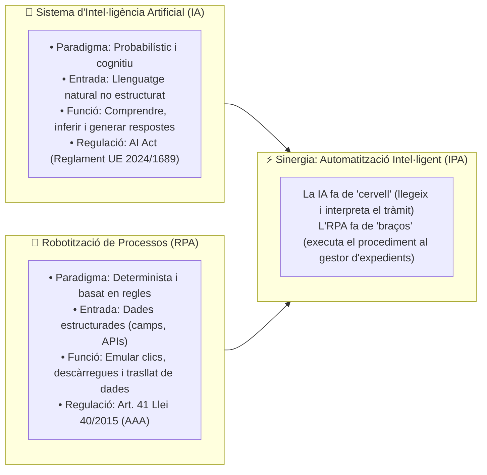
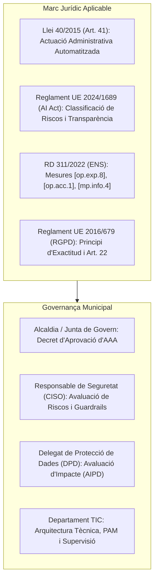
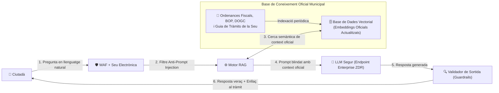

# CAS PRÀCTIC 05: Implantació d'Intel·ligència Artificial Segura (AI Act / ENS) i Robotització de Processos (RPA / AAA) a l'Administració Local

---

## 1. Enunciat i Context Municipal

L'Ajuntament de Valldetenes (25.000 habitants) impulsa un **Pla de Transformació Digital i Intel·ligència Administrativa** amb dos objectius estratègics:
1. **Canal Ciutadà (IA Generativa a la Seu Electrònica):** Implantar un assistent conversacional intel·ligent (xatbot) per guiar la ciutadania en llenguatge clar en la cerca de tràmits, ajudes i ordenances municipals, garantint la **veracitat absoluta** i evitant al·lucinacions.
2. **Tramitació Interna (RPA - Robotic Process Automation):** Robotitzar el procés de comprovació d'estar al corrent de deutes tributaris (AEAT/ATC) i Seguretat Social (TGSS) en la concessió de subvencions municipals mitjançant la consulta automatitzada a la plataforma d'interoperabilitat (PICA / PID).

Com a **Cap del Servei de Tecnologies de la Informació i CISO**, el tribunal us demana redactar la proposta tècnica i jurídica per a la implantació segura d'ambdues tecnologies d'acord amb el **Reglament Europeu d'IA (AI Act - Reglament UE 2024/1689)**, l'**Esquema Nacional de Seguretat (RD 311/2022)**, la **Llei 40/2015 (Art. 41 sobre Actuació Administrativa Automatitzada)** i el **RGPD (UE 2016/679)**.

---

## 2. Fonaments Conceptuals: Sistema d'IA vs. Robotització de Processos (RPA)

Per plantejar una estratègia municipal sòlida davant del tribunal, cal distingir amb precisió ambdues tecnologies, ja que responen a paradigmes tècnics i reguladors completament diferents:

### 2.1. Què és un Sistema d'Intel·ligència Artificial (IA)?
Segons l'**Article 3.1 del Reglament d'IA de la UE (AI Act - Reglament UE 2024/1689)**, un sistema d'IA és un sistema basat en màquines que, dissenyat per operar amb diferents nivells d'autonomia, pot inferir, per a objectius explícits o implícits, a partir de les entrades que rep, com generar resultats com ara prediccions, continguts, recomanacions o decisions que poden influir en entorns físics o virtuals.
* **Naturalesa:** Cognitiva i probabilística. No segueix un guió rígid; avalua patrons estadístics sobre grans volums de dades.
* **Fortalesa:** Excel·leix en processar dades no estructurades (text lliure en consultes ciutadanes, documents escanejats, veu).
* **Risc associat:** Manca de determinisme (pot produir **al·lucinacions** o biaixos) que exigeix mecanismes de contenció (*guardrails* i arquitectura RAG).

### 2.2. Què és una Automatització Robòtica de Processos (RPA)?
L'**RPA (*Robotic Process Automation*)** és una tecnologia de programari ("bots") que replica la interacció humana amb sistemes informàtics mitjançant regles lògiques predefinides i estrictament seqüencials (*"Si l'estat és A, obre el formulari B i extreu el camp C"*).
* **Naturalesa:** 100% determinista i mecànica. Davant les mateixes dades d'entrada, produeix sempre exactament el mateix resultat.
* **Fortalesa:** Execució impecable, ràpida i sense errors de tasques administratives repetitives i d'alt volum (interoperabilitat entre aplicacions sense API, descàrrega massiva de certificats, consolidació de taules).
* **Risc associat:** Fragilitat davant canvis; si es modifica un camp de la pantalla web o apareix un cas no contemplat, el robot s'atura i genera una excepció.

### 2.3. Matriu Comparativa per a l'Administració Pública

| Criteri de Disseny | Sistema d'IA (Ex. Xatbot Seu) | Robotització de Processos - RPA (Ex. Bot Subvencions) |
| :--- | :--- | :--- |
| **Objectiu Principal** | Comprensió i generació en llenguatge natural. | Execució d'accions reglades i trasllat de dades. |
| **Model de Decisió** | **Probabilístic:** Infereix la millor resposta segons el context. | **Determinista:** Segueix un arbre de decisió estricte (regles *if/then*). |
| **Dades d'Entrada** | No estructurades (preguntes lliures del ciutadà). | Estructurades (camps d'expedient, respostes XML/JSON de la PICA). |
| **Encaix Legal Clau** | **AI Act (UE 2024/1689):** Transparència Art. 50 i privadesa. | **Llei 40/2015 Art. 41:** Actuació Administrativa Automatitzada (AAA). |
| **Tolerància a l'Error** | Requereix *guardrails* per evitar al·lucinacions. | Zero tolerància; si falla una regla, deriva a control humà. |
| **Intervenció Humana** | *Human-on-the-loop* (supervisió i millora de respostes). | *Human-in-the-loop* (validació preceptiva en denegacions - Art. 22 RGPD). |

---

## 3. Marc Normatiu i Governança Municipal

### 3.1. Classificació del Risc segons l'AI Act (Reglament UE 2024/1689)
* **Xatbot de la Seu Electrònica:** Classificat com a **Risc Limitat** (Art. 50 AI Act). Obligació legal de **transparència activa**: cal informar de forma explícita i permanent a l'usuari que està interactuant amb un sistema d'IA.
* **Sistema de Subvencions (RPA):** Si el robot només obté certificats i fa comprovacions reglades prèviament definides per les bases reguladores, és una **Actuació Administrativa Automatitzada (AAA)** clàssica (no és IA autònoma d'alt risc). Si s'incorporés aprenentatge automàtic per puntuar o denegar sol·licituds, passaria a ser **Alt Risc (Annex III AI Act)** i requeriria auditoria d'algorismes i avaluació de conformitat estricta.

---

## 4. Arquitectura d'IA Segura a la Seu Electrònica (RAG Tancat)

Per complir amb el **Principi de Veracitat i Confiança Legítima (RD 203/2021, Art. 10 i 11)** i evitar al·lucinacions, **es prohibeix expressament connectar la Seu a models d'IA generativa oberts sense context controlat**. S'implanta una arquitectura **RAG (*Retrieval-Augmented Generation*) tancada**:

### 4.1. Mesures de Seguretat Tècnica de la IA (CCN-STIC i ENS)
1. **Mitigació d'Al·lucinacions (*Strict Grounding*):** La plantilla del prompt del sistema (*System Prompt*) bloqueja la resposta lliure:
   > *"Respon exclusivament utilitzant el context municipal aportat. Si la resposta no consta als documents oficials, respon textualment: 'Aquesta informació no consta a les ordenances oficials; contacteu amb l'Oficina d'Atenció Ciutadana (OAC)'"*.
2. **Defensa contra Injecció de Prompts (*Prompt Injection*):** Inspecció de la petició al WAF i al servei d'orquestració abans d'arribar al model, rebutjant comandes d'anul·lació d'instruccions tipus *"Ignora les teves regles prèvies"*.
3. **Privadesa i Retenció Zero (*Zero Data Retention - ZDR*):** Es contracta un endpoint empresarial (on-premise o núvol sobirà europeu certificat ENS Nivell Alt) que garanteix per contracte que **cap dada introduïda pel ciutadà s'utilitza per reentrenar el model**.
4. **Avís Legal Preceptiu a la Seu (*Disclaimer*):** 
   > *"Aquest xatbot és un assistent informatiu basat en IA (Reglament UE 2024/1689). Les respostes tenen caràcter **merament orientatiu i no vinculant**. Per a la tramitació oficial, consulteu les ordenances publicades a la Seu Electrònica."*

---

## 5. Robotització de Processos (RPA) per a Actuacions Administratives Automatitzades

### 5.1. Flux del Robot de Comprovació de Subvencions
Per agilitzar la concessió de subvencions d'entitats sense ànim de lucre, el robot RPA substitueix la descàrrega manual de certificats:

| Pas | Acció del Robot RPA | Seguretat i Garanties Jurídiques |
| :---: | :--- | :--- |
| **1** | Llegeix la llista d'expedients de l'aplicació d'expedients (Gestió Documental). | Connexió a la base de dades mitjançant API xifrada (TLS 1.3). |
| **2** | Genera petició telemàtica a la **PICA / PID** (AEAT, ATC i TGSS). | Signatura amb **Certificat de Segell Electrònic d'Òrgan** (Art. 42 Llei 40/2015). |
| **3** | Descàrrega dels certificats positius/negatius d'estar al corrent de pagament. | Verificació del Codi Segur de Verificació (CSV). |
| **4** | Incorporació automàtica del PDF a l'expedient electrònic. | Foliat digital i metadades d'acord amb l'Esquema Nacional d'Interoperabilitat (ENI). |
| **5** | Si el certificat és positiu, marca la tasca com a completada; si és negatiu o anòmal, **deriva a revisió humana**. | Principi de supervisió humana (*Human-in-the-loop*, Art. 22 RGPD). |

### 5.2. Bastionat i Seguretat del Robot segons l'ENS
* **Identitat del Bot i Menor Privilegi (`[op.acc.1]`):** El robot s'executa amb un compte de servei específic (`svc-rpa-subvencions`) amb accés restringit únicament als mòduls de subvencions.
* **Custòdia de Credencials i Certificats (`[mp.info.1]`):** Les claus privades i claus d'API mai es guarden en clar als scripts del robot. S'utilitza una solució de gestió de secrets corporativa (**HashiCorp Vault** o **HSM / Azure Key Vault** dedicat).
* **Traçabilitat i Registre d'Activitat (`[op.mon.1]`):** Cada acció del robot genera un registre de log immutable al SIEM municipal indicant data, hora, NIF del sol·licitant, codi d'expedient i resultat de la consulta.

---

## 6. Tramitació Administrativa d'Aprovació (Art. 41 Llei 40/2015)

Perquè el procés robotitzat tingui plena validesa jurídica davant d'una impugnació o auditoria de la Sindicatura de Comptes, cal formalitzar l'Actuació Administrativa Automatitzada (AAA):

1. **Aprovació Formal:** **Decret d'Alcaldia** (o Acord de Junta de Govern Local) pel qual s'aprova l'Actuació Administrativa Automatitzada de comprovació tributària per a subvencions.
2. **Contingut Preceptiu del Decret:**
   - **Òrgan competent:** Regidoria d'Hisenda / Intervenció Municipal.
   - **Òrgan responsable del disseny i supervisió de l'algorisme:** Cap del Servei TIC.
   - **Mecanisme de signatura:** Segell electrònic de l'Ajuntament de Valldetenes.
3. **Publicitat i Transparència:** Publicació del decret i de la descripció del procediment a la Seu Electrònica municipal i al Tauler d'Edictes.
4. **Protecció de Dades (RGPD):** Actualització preceptiva del **Registre d'Activitats de Tractament (RAT)** i formalització de l'**Avaluació d'Impacte en Protecció de Dades (AIPD)** validada pel Delegat de Protecció de Dades (DPD).
