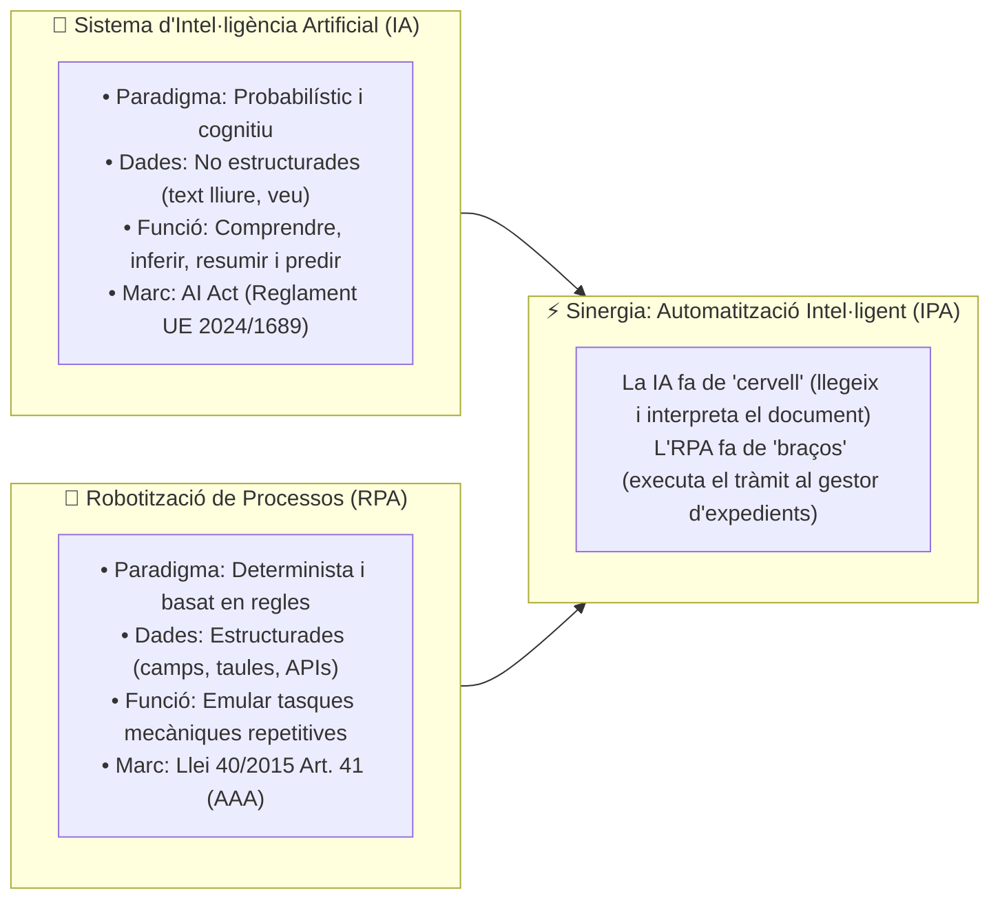
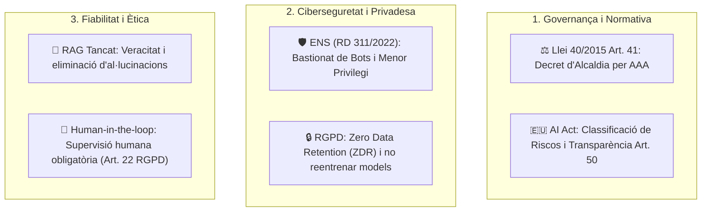

# CAS PRÀCTIC 05: Guia Estratègica d'IA Segura (AI Act / ENS) i Robotització de Processos (RPA / AAA) a l'Administració Local

---

## 1. Enunciat i Context Municipal

L'Ajuntament de Valldetenes (25.000 habitants) vol aprovar una **Estratègia Municipal d'Automatització Intel·ligent**. La Direcció demana al Cap del Servei TIC i CISO:
1. Clarificar la diferència conceptual entre **Intel·ligència Artificial (IA)** i **Robotització de Processos (RPA)**.
2. Presentar un **compendi d'oportunitats** (què es pot fer a les diferents àrees municipals).
3. Fixar el **decàleg de requisits crítics** (què cal tenir en compte en l'àmbit jurídic, ètic i de ciberseguretat: AI Act, ENS, RGPD i Llei 40/2015).
4. **Desenvolupar tècnicament 2 casos d'ús prioritaris**: un d'IA generativa a la Seu Electrònica i un d'RPA en tramitació interna.

---

## 2. Fonaments: Què és un Sistema d'IA vs. Què és un RPA?

| Criteri de Disseny | Intel·ligència Artificial (IA) | Robotització de Processos (RPA) |
| :--- | :--- | :--- |
| **Model de Decisió** | **Probabilístic:** Infereix la millor resposta per patrons estadístics. | **Determinista:** Segueix una lògica matemàtica rígida (*If/Then*). |
| **Dades d'Entrada** | No estructurades (llenguatge natural, instàncies, àudio). | Estructurades (bases de dades, XML de la PICA, fitxers CSV). |
| **Tolerància a l'Error** | Pot produir **al·lucinacions**; exigeix arquitectures RAG i *guardrails*. | **Zero tolerància**; davant d'una anomalia, el bot s'atura i deriva a humà. |
| **Encaix Jurídic** | **AI Act (UE 2024/1689):** Transparència Art. 50 i gestió del risc. | **Llei 40/2015 Art. 41:** Actuació Administrativa Automatitzada (AAA). |

---

## 3. Compendi d'Oportunitats: Què es pot fer a l'Administració Local?

A continuació es detalla el catàleg de serveis automatitzables per àrees de gestió municipal:

| Àrea Municipal | Aplicació amb Intel·ligència Artificial (IA) | Aplicació amb Robotització (RPA) |
| :--- | :--- | :--- |
| **Atenció Ciutadana (OAC / Seu)** | • Xatbot conversacional RAG per guiar en tràmits en llenguatge clar. • Resum i simplificació d'ordenances i notificacions complexes. | • Generació i enviament automàtic de volants d'empadronament. • Resolució automàtica de cites prèvies i cancel·lacions. |
| **Contractació Pública** | • Comparació semàntica i revisió de criteris de judici de valor a ofertes. • Detecció d'anomalies en plecs PPT respecte a estàndards ENS. | • Comprovació automàtica del ROLECE / RELI i certificat de deutes. • Publicació sincronitzada a la Plataforma de Serveis de Contractació (PSCP). |
| **Hisenda i Gestió Tributària** | • Modelatge predictiu d'ingressos fiscals i detecció de patrons de frau. • Classificació automàtica de consultes tributàries ciutadanes. | • Conciliació bancària massiva diària entre extractes i l'ERP. • Descàrrega d'informació de l'Agència Tributària de Catalunya (ATC/AEAT). |
| **Recursos Humans (RRHH)** | • Anàlisi de competències i assistent en redacció de perfils de lloc (RPT). • Triatge de currículums en borses de treball d'acord amb criteris objectius. | • Tramitació automàtica de baixes/altes a la Seguretat Social (RED/SILTRA). • Càlcul i emissió automàtica de certificats de serveis prestats. |
| **Territori i Urbanisme** | • Visió per computador sobre ortofotos per detectar obres no declarades. • Anàlisi de compliment normatiu de memòries de llicències d'obres. | • Obertura d'expedients d'obres menors i sol·licitud d'informes sectorials. • Reclamació automàtica de documentació caducada als promotors. |
| **Serveis Socials** | • Transcripció automàtica anonimizada d'entrevistes d'atenció primària. • Detecció precoç de situacions de vulnerabilitat per patrons socials. | • Comprovació creuada de convivència i ingressos amb altres administracions. • Liquidació mensual d'ajuts d'urgència social aprovats. |

---

## 4. Què s'ha de tenir en compte? (Decàleg de Seguretat, Ètica i Marc Legal)

Abans d'adquirir o desenvolupar cap eina, cal garantir aquests **6 principis irrenunciables**:

1. **Classificació del Risc (AI Act - Reglament UE 2024/1689):**
   * *Risc Limitat (ex. Xatbot ciutadà):* Obligació de **transparència activa** (Art. 50): advertir de forma visible que s'interactua amb una IA.
   * *Alt Risc (Annex III AI Act):* Si s'utilitza IA per avaluar sol·licituds d'ajudes socials o selecció de personal de RRHH, cal auditoria algorítmica, anàlisi de biaixos i registre oficial europeu.
2. **Principi de Veracitat i No-Vinculació (RD 203/2021 i Llei 40/2015):** Les respostes d'una IA no poden ser font de dret ni generar confiança legítima perjudicial; cal incorporar un *disclaimer* legal de caràcter purament informatiu.
3. **Privadesa i Sobirania de Dades (*Zero Data Retention - ZDR* / RGPD):** Està terminantment prohibit enviar dades personals de ciutadans a eines comercials públiques obertes (com ChatGPT gratuït). Els acords de nivell de servei (SLA) han de garantir que **les dades de l'Ajuntament no s'utilitzaran mai per entrenar models públics**.
4. **Formalització d'Actuació Administrativa Automatitzada (AAA - Art. 41 Llei 40/2015):** Tot procés RPA que prengui decisions o generi documents oficials ha d'estar aprovat per **Decret d'Alcaldia**, amb òrgan responsable, algorisme documentat i mecanisme de signatura per segell d'òrgan (Art. 42).
5. **Bastionat del Bot segons l'ENS (`[op.acc.1]`, `[mp.info.1]`):** El robot s'executa amb un compte de servei aïllat amb mínims privilegis. Les credencials i certificats s'emmagatzemen en un **Secrets Vault (HSM)**, mai en text clar dins de codi.
6. **Supervisió Humana (*Human-in-the-loop* - Art. 22 RGPD):** Cap ciutadà pot patir una denegació de drets o sanció fruit exclusivament d'una decisió automatitzada; qualsevol discrepància deriva a revisió humana preceptiva.

---

## 5. Desenvolupament Pràctic de 2 Casos d'Ús Reals

### Cas d'Ús A (IA Generativa): Assistent Conversacional Veraç a la Seu Electrònica
* **Arquitectura RAG Tancada (*Retrieval-Augmented Generation*):** El model d'IA no respon amb el seu coneixement obert. Primer busca als documents oficials de l'Ajuntament (Ordenances Fiscals, BOP, DOGC) indexats a una base de dades vectorial corporativa; després injecta aquests fragments oficials al *prompt* del model privat perquè redacti la resposta al ciutadà.
* **Defensa anti-al·lucinacions (*Strict Grounding*):** Si la resposta no està textualment als documents municipals, la IA té prohibit inventar; respon: *"Aquesta informació no consta a les ordenances oficials; si us plau consulteu amb l'OAC"*.
* **Seguretat al WAF:** Filtre contra atacs de *Prompt Injection* (intents de ciutadans de manipular les instruccions del model).

### Cas d'Ús B (RPA): Robotització de la Comprovació de Subvencions (PICA / PID)
* **Procediment:** El robot llegeix la llista de sol·licituds admeses de l'expedient de subvencions, genera una petició telemàtica signada amb **Segell Electrònic d'Òrgan** a la plataforma PICA/PID cap a l'AEAT, l'Agència Tributària de Catalunya (ATC) i la Seguretat Social (TGSS).
* **Integració Documental (ENI):** Descarrega els certificats en PDF, en valida el Codi Segur de Verificació (CSV), els folia i els incorpora a l'expedient del gestor documental.
* **Control Humà:** Si el certificat és positiu, el robot emet proposta d'admissió; si és deutor o sorgeix un error d'interoperabilitat, **deriva a revisió manual** per l'instructor tècnic.

---

## 6. Procediment Administratiu d'Aprovació i Entrada en Explotació

1. **Aprovació Municipal:** Decret d'Alcaldia d'aprovació de l'Actuació Administrativa Automatitzada (AAA) d'acord amb l'art. 41 de la Llei 40/2015.
2. **Protecció de Dades:** Avaluació d'Impacte en Protecció de Dades (AIPD) validada pel Delegat de Protecció de Dades (DPD) i actualització del Registre d'Activitats de Tractament (RAT).
3. **Publicitat i Transparència:** Publicació a la Seu Electrònica de la descripció del procediment automatitzat i indicació visible del canal de reclamació humana.
